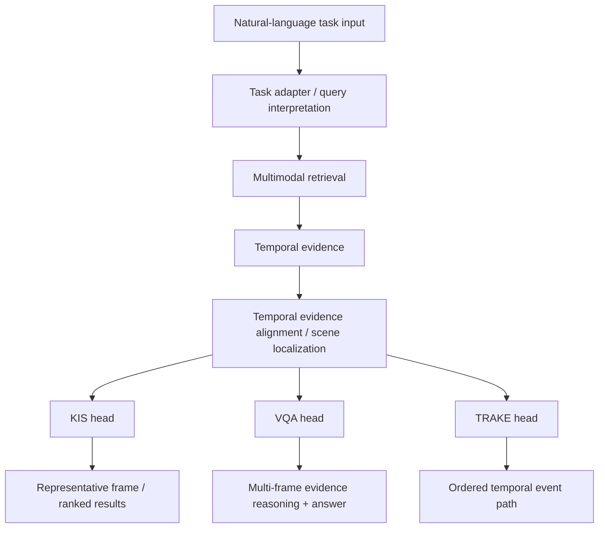
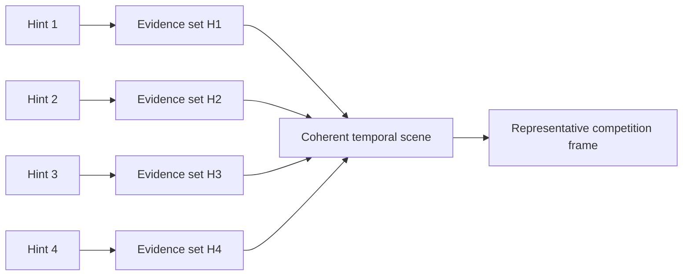
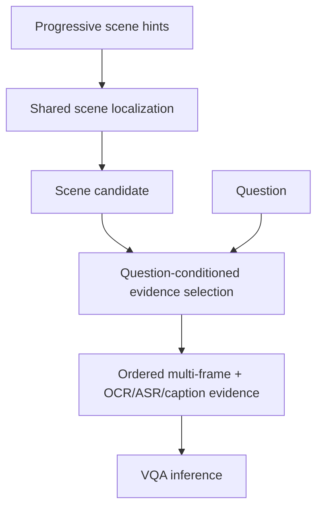
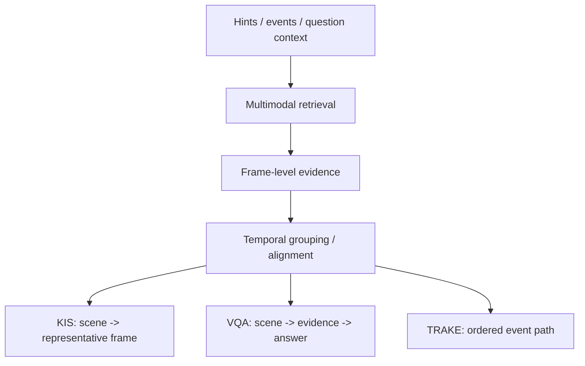
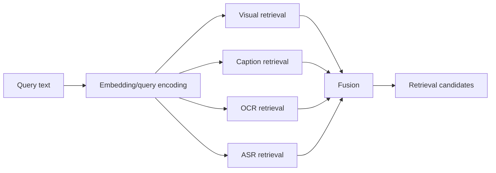
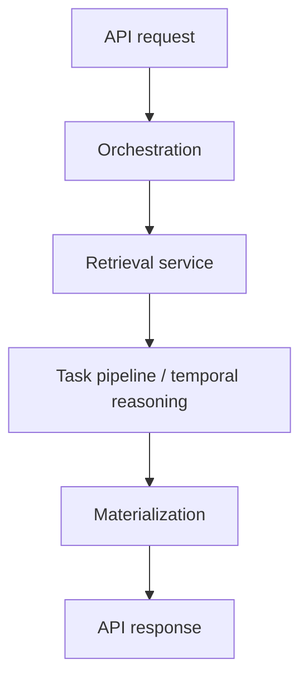
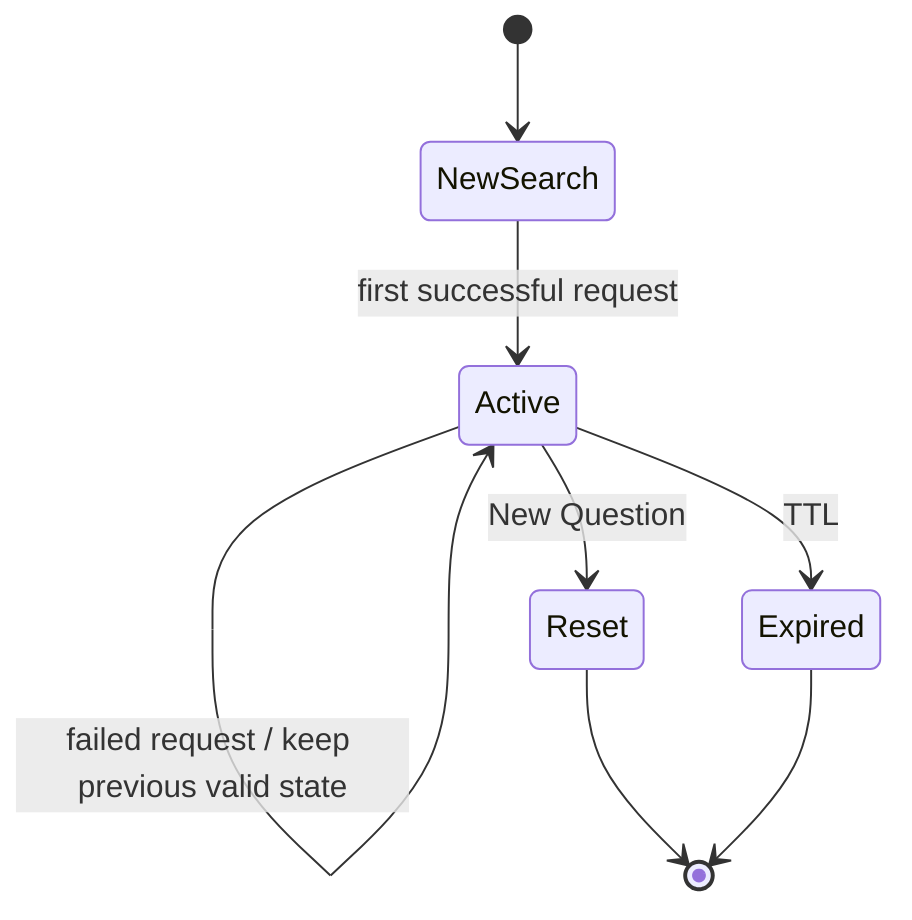
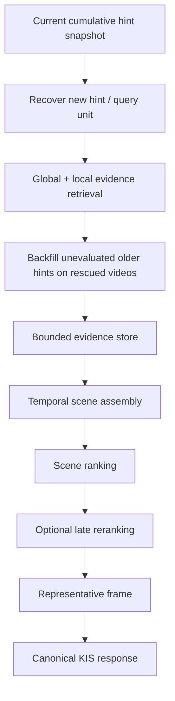
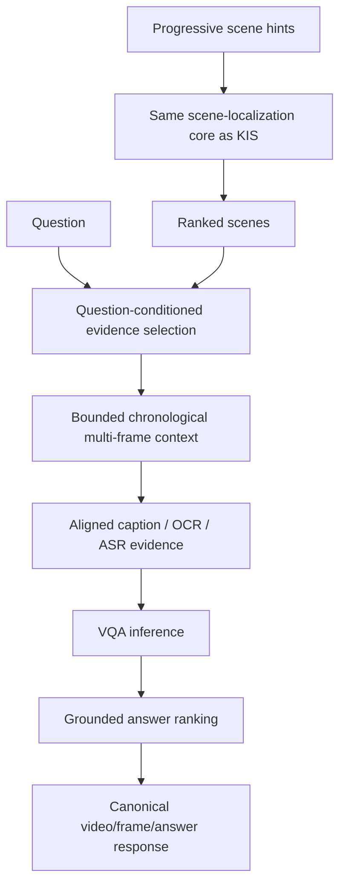
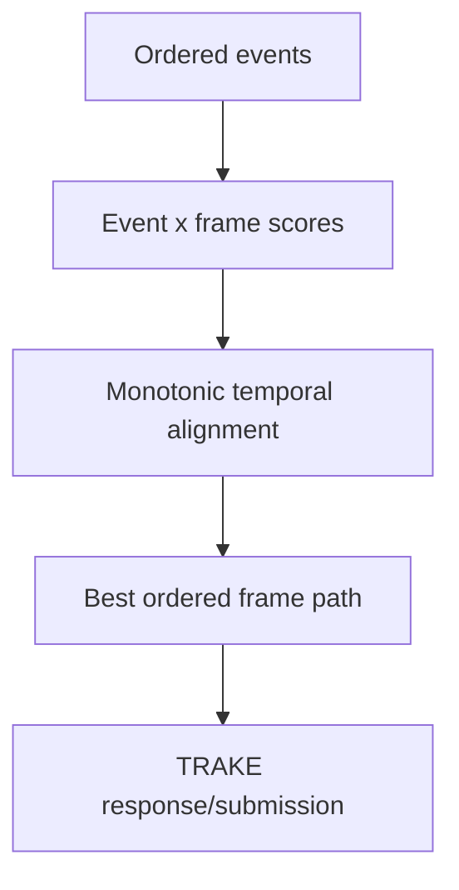

# HCMAI Agentic Coding Guide

This file is the **repository-level orientation and guardrail** for coding agents working on the **HCMAI / AIC HCMC 2026 Multimodal Video Retrieval** project.

It is intentionally **not a sprint plan, task queue, or roadmap checkpoint**. It should remain useful even when the implementation changes.

Coding agents must use this file to understand:

- what the project is trying to solve;
- how the competition tasks behave;
- the project architecture and package responsibilities;
- the invariants that must not be broken;
- what should be reused instead of recreated;
- what must be inspected before changing code;
- how correctness, latency, evidence, and canonical identity are evaluated.

When this file conflicts with the user's latest explicit instruction or an official competition rule, the newer authoritative instruction wins.

---

## 1. Project mission

HCMAI is a multimodal video retrieval and reasoning system for the Ho Chi Minh City AI Challenge.

The system receives natural-language descriptions and must search a large corpus of long videos using multiple evidence sources such as:

- visual frame embeddings;
- generated captions;
- OCR;
- ASR/transcripts;
- temporal relationships between events;
- VLM/LLM inference when necessary.

The important unit of reasoning is **not always one isolated frame**.

For KIS and VQA in particular, multiple clues may describe different moments inside the **same temporal scene**. The system therefore needs to:

1. retrieve relevant evidence;
2. preserve evidence identity and provenance;
3. associate evidence with the correct video and time;
4. construct or localize a coherent scene;
5. perform task-specific reasoning only after localization;
6. return the exact competition-compatible output.

The long-term architectural direction is:



This common-core architecture may be partially migrated at any point in time. **Never assume the desired architecture has already been implemented. Inspect the active code path first.**

---

## 2. Competition task semantics

The repository contains three major competition task families:

- KIS;
- VQA / Q&A;
- TRAKE.

They share retrieval and temporal evidence concepts but have different output semantics.

---

## 2.1 KIS — Known Item Search

### Purpose

Find the video scene described by progressively revealed clues and ultimately return the competition-required video/frame result.

### Progressive clue format

The competition may reveal more information over time.

Conceptually:

```text
Q1 = H1
Q2 = H1 + H2
Q3 = H1 + H2 + H3
Q4 = H1 + H2 + H3 + H4
...
```

Example:

```text
H1:
Đoạn video đang trình bày một món ăn từ chiếc nồi này sang một chiếc nồi khác.

H2:
Chiếc nồi đầu màu xanh rêu, chiếc nồi sau là nồi đất men gốm nâu bóng,
viền màu be.

H3:
Nguyên liệu chính của món này là bắp bò.

H4:
Nguyên liệu cuối cùng được bỏ vào là gừng cắt sợi chiên vàng.
```

The important semantic fact is:

> H1, H2, H3, and H4 may be supported by different frames, as long as those frames belong to the same coherent target scene.

Do **not** reduce the problem to:

```text
full cumulative query
    -> nearest single frame
```

The desired reasoning pattern is closer to:



### Progressive snapshot rule

The UI may send cumulative snapshots.

Do not treat:

```text
Q1
Q2
Q3
```

as three independent hints when `Q2` already contains `Q1`.

A progressive implementation should conceptually recover:

```text
H1
ΔH2
ΔH3
...
```

The exact implementation contract must follow the active shared schema/state implementation.

---

## 2.2 VQA / Competition Q&A

### Purpose

Locate the scene described by progressive clues, then answer a question using evidence from that scene.

### Format

VQA has:

1. a **question**;
2. progressively revealed **scene clues**.

Example:

```text
Question:
Nguyên liệu đó được lấy từ loại quả nào?

Hint 1:
Đoạn video đang xào một nguyên liệu đặc biệt.

Hint 2:
Đoạn video đang xào một nguyên liệu đặc biệt cùng với tôm và hành lá.

Hint 3:
Đoạn video đang xào một nguyên liệu đặc biệt cùng với tôm và hành lá
trên một cái chảo đen.

Hint 4:
Nguyên liệu này màu trắng, dùng để nấu một món đặc sản của Việt Nam.
```

### Core semantic rule

The question and the scene clues have different responsibilities:

```text
Hints    -> WHERE should the system look?
Question -> WHAT should the system answer?
```

The question must not automatically be treated as another localization hint.

Desired flow:



### Multi-frame requirement

VQA answers may depend on information distributed over time.

For example, in a 10-second scene:

```text
10s -> apple
12s -> orange
15s -> banana
18s -> grape
```

A question asking how many fruit types appeared cannot be reliably answered from only one selected frame.

Therefore:

- localize first;
- select bounded evidence across the scene;
- preserve chronological order;
- preserve OCR/ASR/caption provenance;
- use multi-frame inference when the question requires cross-frame reasoning.

The codebase already contains multi-frame VQA contracts/providers in some versions. Inspect the current workflow before creating another API or DTO.

---

## 2.3 TRAKE

### Purpose

Recover an ordered temporal sequence of events.

Conceptually:

```text
E1 -> E2 -> E3 -> ... -> En
```

The task searches for frames satisfying each event while respecting temporal ordering.

The current repository includes an implemented TRAKE pipeline with dense event/frame scoring and temporal alignment logic.

### TRAKE ownership rule

TRAKE is considered a **stable task-specific implementation** unless the user explicitly requests changes.

Agents may:

- inspect TRAKE to understand temporal alignment;
- preserve compatibility with shared contracts;
- reuse general concepts through clean adapters.

Agents must not casually:

- rewrite TRAKE dynamic programming;
- change gap penalties;
- change ordered-event semantics;
- modify TRAKE output contracts;
- refactor TRAKE merely to make another subsystem look more generic.

A shared-core refactor must not destabilize a working TRAKE path.

---

## 3. Shared mental model: temporal evidence, not only frames

The three tasks can be viewed through a common abstraction:



### Important distinction

A retrieval hit means:

> this frame is relevant to this query unit.

A scene candidate means:

> multiple pieces of evidence form a coherent temporal hypothesis in one video.

Do not confuse these two levels.

---

## 4. Evidence rules

Evidence must remain structured.

A useful frame-level evidence object should preserve at least:

```text
canonical FrameRecord
query-unit relevance
retrieval score
source scores/ranks
modality provenance
```

Do not flatten all evidence into an anonymous text blob before reasoning.

For VQA, captions, OCR, and ASR should retain their relation to:

- frame ID;
- timestamp;
- transcript interval where applicable;
- source modality.

### Missing evidence is not negative evidence

When progressive search discovers a new video at a later hint, earlier hints may not have been evaluated for that video.

Distinguish:

```text
UNKNOWN               = not evaluated
EVALUATED_NO_MATCH    = evaluated and no useful evidence found
MATCHED               = evaluated and evidence found
```

Never silently convert:

```text
UNKNOWN -> score 0
```

because this incorrectly turns absence of evaluation into negative evidence.

The concrete representation may use an explicit enum or evaluated-key semantics depending on the active implementation. Do not create another status class if the repository already represents these states cleanly.

---

## 5. Canonical identity and coordinate systems

Frame identity is a correctness-critical invariant.

The authoritative frame mapping lives in shared frame/data contracts and must be preserved through:

```text
preprocessing
-> enrichment
-> embeddings/indexes
-> retrieval
-> fusion
-> reranking
-> temporal localization
-> VQA reasoning
-> API response
-> submission
```

At minimum, preserve:

```text
video_id
frame_id
frame_idx
timestamp_ms
```

### Three coordinate concepts

The project may need to distinguish:

1. **decode coordinate** — position while decoding;
2. **media-time coordinate** — PTS/time-base/timestamp;
3. **competition coordinate** — the frame index expected by the organizer.

Do not mix these concepts.

If the official competition specification requires a conversion such as:

```text
competition_frame_idx = organizer_fps * timestamp
```

perform that conversion only in the authoritative competition-coordinate/mapping layer.

Do not use that formula as a general replacement for canonical internal metadata.

### Deduplication

Deduplicate using canonical identity.

Do not deduplicate by guessing from:

- filenames;
- paths;
- visual similarity alone;
- array positions;
- keyframe ordering.

---

## 6. Repository architecture

The following map reflects the current repository organization. Always verify the active branch before assuming a file still exists.

```text
src/hcmai/
├── api/
├── common/
│   └── observability/
├── data/
├── llm/
├── orchestration/
├── pipelines/
│   ├── kis/
│   ├── vqa/
│   └── trake/
├── retrieval/
│   ├── embedding/
│   ├── reranking/
│   └── retriever/
└── reranking/

frontend/
├── src/
│   ├── api/
│   └── features/
└── ...

tests/
configs/ or repository configuration files
runs/ where repository policy allows experiment records
```

The exact tree can evolve. The responsibilities below are more important than the names.

---

## 6.1 `src/hcmai/api/`

**Responsibility:** HTTP transport.

Routers should:

- validate/parse requests;
- call application/orchestration services;
- convert domain results to API responses;
- expose health/readiness.

Routers should not:

- perform FAISS searches;
- contain ranking logic;
- implement temporal alignment;
- call model adapters directly when an application service exists;
- maintain request-specific mutable state.

Keep routers thin.

---

## 6.2 `src/hcmai/common/`

**Responsibility:** shared configuration, schemas, and truly cross-cutting utilities.

### `common/schemas/`

Authoritative shared contracts belong here.

Before adding a new schema:

1. search for an existing type with overlapping semantics;
2. prefer extending, promoting, or replacing an actively used type;
3. create a new type only when an existing contract cannot represent the meaning without violating its responsibility;
4. the new type must have an immediate consumer;
5. remove superseded internal types during the same migration phase when practical.

Avoid parallel classes such as:

```text
Candidate
CandidateV2
TemporalCandidate
NewCandidate
```

unless compatibility explicitly requires them.

### `common/utils/`

Only truly cross-cutting helpers belong here.

Do not turn `common/utils` into a dumping ground for business logic.

---

## 6.3 `src/hcmai/data/`

**Responsibility:** canonical media metadata, preprocessing, enrichment artifacts, stores, and data access.

Typical areas include:

- video/frame preprocessing;
- canonical frame records;
- caption generation;
- OCR generation;
- ASR/transcript preparation;
- evidence stores;
- artifact validation.

### Data pipeline constraints

Raw videos are stored remotely and preprocessing may run locally or on compute VMs. Final reusable artifacts should be persisted in the project artifact store rather than depending on one developer's local machine.

Online serving must not silently rebuild large offline artifacts.

---

## 6.4 `src/hcmai/retrieval/`

**Responsibility:** embeddings, indexes, multimodal retrieval, filtering, fusion, and retrieval evaluation.

Typical online flow:



Rules:

- preserve modality provenance;
- preserve source scores/ranks;
- respect `SearchFilters`;
- use batched encoding where compatible;
- use bounded concurrency where safe;
- support partial modality failure;
- do not move KIS/VQA task semantics into low-level retrievers.

### Offline artifacts

Embedding generation and index creation are offline operations.

Serving should treat deployed retrieval artifacts as immutable/read-only.

Missing or inconsistent artifacts should make the affected capability unavailable rather than trigger hidden reconstruction during a request.

---

## 6.5 `src/hcmai/reranking/` and `src/hcmai/retrieval/reranking/`

**Responsibility:** expensive candidate reordering/scoring.

Reranking is optional enhancement, not canonical identity generation.

Rules:

- never change `frame_id`, `video_id`, or canonical frame metadata;
- preserve retrieval evidence/provenance;
- support deterministic fallback when reranking fails;
- do not send unnecessarily large candidate pools to a VLM reranker;
- measure reranker latency independently.

Where the architecture uses scene assembly, prefer expensive reranking **after cheap evidence retrieval and scene pruning**, unless an experiment explicitly proves another ordering is better.

---

## 6.6 `src/hcmai/orchestration/`

**Responsibility:** application workflows and composition.

This layer should coordinate:

- task dispatch;
- shared retrieval services;
- progressive state when enabled;
- temporal evidence services;
- task-specific pipeline calls;
- materialization;
- tracing.

It should not duplicate low-level adapter implementation.

A typical workflow is:



---

## 6.7 `src/hcmai/pipelines/kis/`

**Responsibility:** KIS-specific behavior after shared evidence retrieval.

Expected responsibilities may include:

- KIS scene ranking;
- representative-frame selection;
- KIS-specific calibration;
- final result shaping.

Do not duplicate generic retrieval/index logic here.

---

## 6.8 `src/hcmai/pipelines/vqa/`

**Responsibility:** VQA-specific localization/answering behavior.

Current or transitional modules may include:

- parsing;
- candidate aggregation;
- temporal windows/scenes;
- evidence construction;
- localization;
- answer normalization;
- VQA inference;
- final ranking/submission.

During migration to a shared temporal core, some older VQA-only abstractions may disappear.

Before creating a new model, inspect existing objects such as:

- frame/branch candidates;
- temporal windows;
- evidence bundles;
- localized candidates;
- grounded answer candidates.

Prefer migrating existing runtime models over creating parallel wrappers.

---

## 6.9 `src/hcmai/pipelines/trake/`

**Responsibility:** TRAKE-specific temporal alignment and submission behavior.

Treat this package as stable unless explicitly asked to modify it.

Its algorithms can be used as a conceptual reference for temporal alignment, but KIS/VQA migrations should not rewrite TRAKE.

---

## 6.10 `src/hcmai/llm/`

**Responsibility:** inference contracts, gateways, local/remote adapters, resilience, and VQA model serving.

Rules:

- use public service/gateway interfaces;
- do not bypass provider capability checks;
- use multi-frame APIs when the task requires multi-frame evidence and the backend supports them;
- preserve deterministic fallback;
- do not let providers invent canonical frame identity;
- keep network timeouts/retries bounded.

---

## 6.11 `src/hcmai/common/observability/`

**Responsibility:** tracing, metrics, stage timing, and redaction.

Every important online stage should be observable.

Do not create one-off timing print statements when an existing tracing abstraction can be extended.

---

## 6.12 `frontend/`

**Responsibility:** user interaction and presentation.

Frontend should:

- send task inputs;
- display ranked results;
- display VQA answers/evidence;
- hold only lightweight client state.

For progressive search, the backend should remain authoritative for evidence/candidate state.

Do not send internal evidence pools, scores, or retrieval provenance back from the browser as trusted state unless an explicit protocol requires it.

---

## 7. Progressive search rules

Progressive KIS/VQA may use a `search_id` or equivalent backend state identifier.

Desired lifecycle:



Rules:

- backend state is authoritative;
- mutate state only after successful processing;
- failed requests must not corrupt the previous valid state;
- concurrent requests for the same search must not overwrite newer state;
- state limits and TTL belong in configuration;
- do not hardcode candidate pools in UI state;
- do not keep large image/tensor objects in progressive state.

---

## 8. Scene-localization principles

KIS/VQA progressive evidence should eventually be reasoned over at scene level.

A useful scene candidate concept includes:

```text
video_id
start_ms
end_ms
evidence grouped by query unit
per-unit scores
semantic/coverage/temporal/relation scores
final score
```

### Top-M evidence instead of global best-1

When a hint appears several times in a video, the globally highest-scoring occurrence may belong to the wrong scene.

Prefer retaining a small bounded evidence set per query unit/video before temporal grouping.

Example:

```text
H1 -> 53s (.91), 260s (.94)
H2 -> 42s (.92)
H3 -> 47s (.89)
H4 -> 62s (.95)
```

The coherent scene is likely around:

```text
42s -> 62s
```

even though the global best H1 occurrence is at 260s.

Do not implement combinatorial unbounded search. Use bounded temporal clustering, sliding windows, dynamic programming, beam search, or another measured method appropriate to the task.

---

## 9. Temporal relation rules

Hint reveal order is **not automatically video event order**.

Do not infer:

```text
H1 BEFORE H2
```

merely because H2 appeared one minute later in the competition UI.

Only add ordering constraints when the text actually expresses them, for example:

```text
sau đó
rồi
sau khi
trước đó
trước khi
cuối cùng
đồng thời
after
before
then
finally
```

Relations may be:

- hard constraints for ordered tasks such as TRAKE;
- soft/partial constraints for KIS/VQA.

When relation parsing is uncertain, prefer no invented constraint over a confident hallucination.

---

## 10. KIS workflow

Conceptual target flow:



Not every branch must exist in every version. Inspect the current implementation before editing.

### KIS invariants

- progressive state must not lose earlier evidence;
- rescued videos must not be punished merely because older hints were never evaluated;
- task reasoning should not rely only on one best frame per hint when multiple occurrences matter;
- final representative frame must belong to the selected video/scene;
- output must preserve canonical competition identity;
- reranking failures must have a deterministic fallback.

---

## 11. VQA workflow

Conceptual target flow:



### VQA invariants

- scene hints localize;
- the question asks what to answer;
- retrieve/localize before expensive VLM calls;
- do not run VLM reasoning over the full corpus;
- answers must remain grounded in scene evidence;
- selected images must be chronological when temporal order matters;
- a provider may only select or refer to frame IDs supplied to it;
- preserve raw and normalized answer forms where the evaluation pipeline needs both;
- never rank by answer confidence alone;
- maintain deterministic fallback behavior.

---

## 12. TRAKE workflow

Conceptually:



Unless explicitly requested:

- preserve current scoring/alignment implementation;
- preserve tests;
- preserve public contracts;
- avoid unnecessary common-core migration.

---

## 13. Query and text handling

The system supports Vietnamese and English queries.

Rules:

- preserve original user text;
- keep query transformations auditable;
- deterministic/rule-based parsing is preferred as the first baseline;
- do not route every query through an LLM;
- do not let an LLM invent arbitrary retrieval/fusion weights;
- generated subqueries must be bounded;
- log planner/parser version when relevant;
- query expansion must not overwhelm the original query.

When cumulative hints are used, avoid counting repeated text multiple times simply because the snapshot contains previous hints again.

---

## 14. Retrieval and fusion rules

Multimodal retrieval may include:

```text
visual
caption
OCR
ASR
```

Rules:

- encode identical query text once per compatible encoder;
- reuse text embeddings across compatible caption/OCR/ASR searches;
- run independent modalities concurrently where safe;
- use bounded deadlines/concurrency;
- preserve successful sources when an optional source fails;
- preserve modality provenance;
- avoid assuming raw score spaces from different modalities are calibrated;
- use rank-based fusion or explicitly calibrated raw-score fusion;
- keep fusion constants in configuration, not hidden in task code.

Do not use unbounded full-index scans merely to filter by a known set of videos/time intervals when a local/subset search path exists.

---

## 15. Reranking rules

Reranking is an expensive verifier, not the main retrieval mechanism.

Before increasing model size or rerank depth, measure:

```text
retrieval latency
candidate count
image load/decode latency
reranker preprocessing
model inference
network latency if remote
```

Preferred design direction:

```text
cheap retrieval
-> evidence/scene pruning
-> small candidate set
-> expensive reranking
```

Do not:

- rerank global and local branches independently unless intentionally benchmarked;
- let an image-only reranker erase strong OCR/ASR evidence;
- mutate canonical identity;
- claim a latency/accuracy gain without recorded measurements.

---

## 16. Model strategy

Typical model families in the project may include:

- Florence-style captioning;
- SigLIP-style visual embeddings;
- BGE-style text embeddings;
- Qwen-VL reranking;
- Qwen-VL or another VLM for VQA.

**Configuration is authoritative for exact checkpoints.**

Do not replace models as the first response to poor quality.

First isolate the failure:

```text
retrieval recall
-> correct-video ranking
-> scene localization
-> evidence selection
-> VLM reasoning
-> final ranking/submission
```

A larger model does not fix a wrong problem formulation.

---

## 17. Offline data and artifacts

The system has large raw video data and derived artifacts such as:

```text
keyframes
captions
OCR
ASR/transcripts
embeddings
indexes
metadata/mappings
```

Rules:

- preprocessing may run locally or on compute VMs;
- final reusable artifacts must be stored in the shared artifact storage strategy;
- online services consume validated, versioned artifacts;
- online startup/request paths must not regenerate embeddings/indexes;
- artifact versions must remain traceable to config/model/corpus versions;
- missing/inconsistent artifact bundles should fail clearly.

Do not commit:

- raw videos;
- large frame datasets;
- model weights;
- embeddings/indexes;
- credentials/tokens;
- large generated run output unless repository policy explicitly permits it.

---

## 18. Source-of-truth order

When deciding behavior, use this precedence:

1. user's latest explicit instruction;
2. latest official competition specification/scorer/organizer notice;
3. current repository code, tests, configuration, and deployed artifact format;
4. repository-level architecture documentation such as this file;
5. current project plans/proposals;
6. peer-reviewed papers and official implementations;
7. engineering hypotheses.

If a plan and the active repository disagree:

- inspect whether migration has already happened;
- do not blindly restore the plan version;
- do not silently delete teammate work.

---

## 19. SOURCE / PAPER / PROPOSED discipline

For non-trivial technical claims, distinguish:

### SOURCE

Verified from:

- active code;
- tests;
- config;
- artifacts;
- measured experiment;
- official competition rule.

### PAPER

Supported by peer-reviewed research or an official implementation.

A paper can motivate an experiment but does not prove that the adaptation improves HCMAI.

### PROPOSED

An engineering hypothesis that must be evaluated on HCMAI.

Never write:

```text
This improves accuracy.
```

when the actual status is:

```text
This is expected to improve accuracy and requires benchmark validation.
```

---

## 20. Reuse-before-create rule

This project explicitly avoids dead abstractions.

Before introducing any:

```text
schema
DTO
model
protocol
service
adapter
result wrapper
base class
factory
```

search the repository for overlapping semantics.

Prefer:

```text
reuse
-> extend
-> promote/generalize
-> replace
-> only then create new
```

A new type is justified only when:

1. no active contract represents the required semantics without violating its responsibility;
2. the new type has an immediate runtime/test consumer;
3. there is a clear owner/package;
4. any superseded type is removed or has an explicit compatibility reason to remain.

Do not create speculative placeholders for a future phase.

Examples of bad patterns:

```text
Candidate
CandidateV2
NewCandidate
TemporalCandidateV2
FinalCandidate
```

or:

```text
BaseTemporalEngine
```

with only one implementation and no real abstraction need.

---

## 21. Configuration rules

All tunable behavior belongs in configuration where practical.

Examples:

```text
candidate pool sizes
global/local quotas
Top-M evidence count
backfill limits
scene budgets
rerank depth
VQA image budget
temporal window/gap policies
score weights
timeouts
retries
TTL/state limits
```

Do not hide scientific/engineering choices as magic constants inside business logic.

A default value is not a scientific truth.

Record configuration with experiments.

---

## 22. Observability requirements

Important stages should be independently traceable.

Depending on the active architecture, stages may include:

```text
validation
normalization
snapshot differ
query parsing
encoding
visual retrieval
caption retrieval
OCR retrieval
ASR retrieval
global retrieval
local retrieval
backfill
fusion
evidence merge
scene assembly
scene scoring
reranking
question-conditioned evidence selection
VQA inference
materialization
submission export
```

Each stage should be able to expose:

- duration;
- input/output count;
- provider/backend;
- cache status;
- fallback;
- warnings;
- failure category.

Do not log:

- credentials;
- access tokens;
- secrets;
- unnecessary sensitive prompt contents.

---

## 23. Remote inference reliability

For remote inference, use bounded reliability mechanisms:

- connect/read/write/pool timeout;
- total deadline;
- bounded retry for transient idempotent failures;
- exponential backoff with jitter;
- bounded concurrency;
- circuit breaking where appropriate;
- capability discovery;
- deterministic fallback.

Do not:

- retry deterministic client errors indefinitely;
- start a retry when insufficient request deadline remains;
- hide remote failures;
- let a remote provider rewrite canonical identity.

Unit tests should mock network behavior.

---

## 24. Evaluation discipline

No optimization is complete without a reproducible experiment.

### Retrieval

Measure as appropriate:

```text
Recall / Hit @ K
MRR
correct-video recall
official competition ranking metrics
```

### Scene/localization

Measure:

```text
correct-scene/window recall
evidence recall
temporal coverage
```

### VQA reasoning

Use oracle-scene/evidence evaluation where possible to separate:

```text
retrieval/localization failure
```

from:

```text
VLM reasoning failure
```

### End-to-end

Record:

```text
official task metric
Top-K performance
P50/P95 latency
retrieval latency
reranker calls/latency
VLM calls/images
failure/fallback counts
```

Experiment records should include:

```text
task
dataset/query-set version
config
model checkpoints
artifact/index version
git commit
hardware/provider
predictions
metrics
per-stage latency
timestamp
```

No recorded metrics means no verified improvement.

---

## 25. Testing rules

Every change must be tested at the layer it affects.

### Contract/schema changes

Test:

- validation;
- serialization;
- backward compatibility;
- round-trip behavior.

### Retrieval changes

Test:

- deterministic ranking;
- filters;
- modality failure fallback;
- canonical identity preservation.

### Progressive state changes

Test:

- first request;
- successful continuation;
- failed continuation does not corrupt state;
- expired state;
- New Question/reset;
- concurrent request behavior.

### Scene alignment changes

Use hand-calculable fixtures.

Example:

```text
H1 -> 53s (.91), 260s (.94)
H2 -> 42s (.92)
H3 -> 47s (.89), 310s (.90)
H4 -> 62s (.95)
```

Expected coherent scene should prefer approximately:

```text
42s -> 62s
```

over unrelated globally best occurrences.

### VQA

Test:

- multi-frame evidence is actually passed;
- chronological order;
- OCR/ASR/caption evidence preservation;
- provider cannot invent frame IDs;
- single-frame fallback where supported.

### TRAKE

Shared changes must keep existing TRAKE tests green.

---

## 26. Code quality

Prefer:

- small focused modules;
- explicit interfaces;
- deterministic behavior;
- immutable/value-style domain objects where practical;
- configuration over constants;
- simple algorithms before speculative frameworks;
- hand-checkable fixtures;
- public service facades for cross-package usage.

Avoid:

- generic agent frameworks;
- unnecessary dependency injection frameworks;
- factories without multiple concrete needs;
- base classes with no real alternate implementation;
- hidden global mutable request state;
- circular imports;
- task logic in routers;
- network calls inside low-level pure scoring functions;
- duplicate model definitions.

---

## 27. Do

- inspect the active code path before editing;
- search for existing contracts before creating new ones;
- read nearby tests before changing behavior;
- preserve canonical identity;
- preserve evidence/provenance through ranking;
- use existing `SearchFilters` and retrieval services where they already fit;
- keep KIS and VQA scene localization conceptually aligned;
- keep VQA question reasoning separate from scene hints;
- keep TRAKE stable unless explicitly tasked;
- use bounded compute;
- expose latency and fallback behavior;
- make experiments reproducible;
- document compatibility impact of shared-schema changes;
- remove obsolete code when migration is complete.

---

## 28. Don't

- do not infer the project mission from a stale plan or paper;
- do not create dead classes for hypothetical future work;
- do not create KIS/VQA duplicate contracts for the same concept;
- do not treat cumulative query snapshots as independent hints;
- do not convert unevaluated evidence to score zero;
- do not treat hint reveal order as temporal event order;
- do not reduce scene retrieval to a single best frame when the task requires multi-frame evidence;
- do not send the full corpus to a VLM;
- do not let rerankers mutate canonical identity;
- do not rebuild offline artifacts during serving;
- do not hardcode experiment weights/budgets in business logic;
- do not claim improvements without measurements;
- do not rewrite TRAKE to satisfy a KIS/VQA refactor;
- do not revert unrelated teammate work;
- do not silently change public API/submission semantics.

---

## 29. What an agent must inspect before coding

Before implementing a non-trivial change:

1. identify the active public entry point;
2. trace the real runtime call path;
3. inspect relevant schemas/contracts;
4. inspect current configuration values;
5. inspect nearby tests;
6. search for existing types/functions with overlapping responsibility;
7. identify cross-task impact;
8. identify canonical identity implications;
9. identify whether the change affects offline artifacts;
10. identify how the change will be measured.

Do not assume a README diagram exactly matches the running code.

---

## 30. What an agent should report after coding

For substantial changes, report:

- files inspected;
- files changed;
- behavior before;
- behavior after;
- schema/API compatibility impact;
- tests run and results;
- metrics/benchmark results if applicable;
- known limitations;
- assumptions still requiring validation;
- whether TRAKE/shared interfaces were affected.

---

## 31. Final engineering principles

For every HCMAI change:

1. **Understand the competition semantics before optimizing code.**
2. **Retrieve evidence before doing expensive reasoning.**
3. **Reason over scenes when the evidence is temporal.**
4. **Keep task-specific heads thin when logic can be shared cleanly.**
5. **Preserve canonical identity from data preparation to submission.**
6. **Do not confuse missing evidence with negative evidence.**
7. **Reuse before creating new abstractions.**
8. **Keep configuration and experiments explicit.**
9. **Measure the stage that is actually failing.**
10. **Keep working implementations stable while migrating incrementally.**

The goal is not to produce the most abstract architecture.

The goal is to build the **smallest, testable, observable, competition-correct system** that reliably retrieves the right temporal evidence and produces the right task output.
