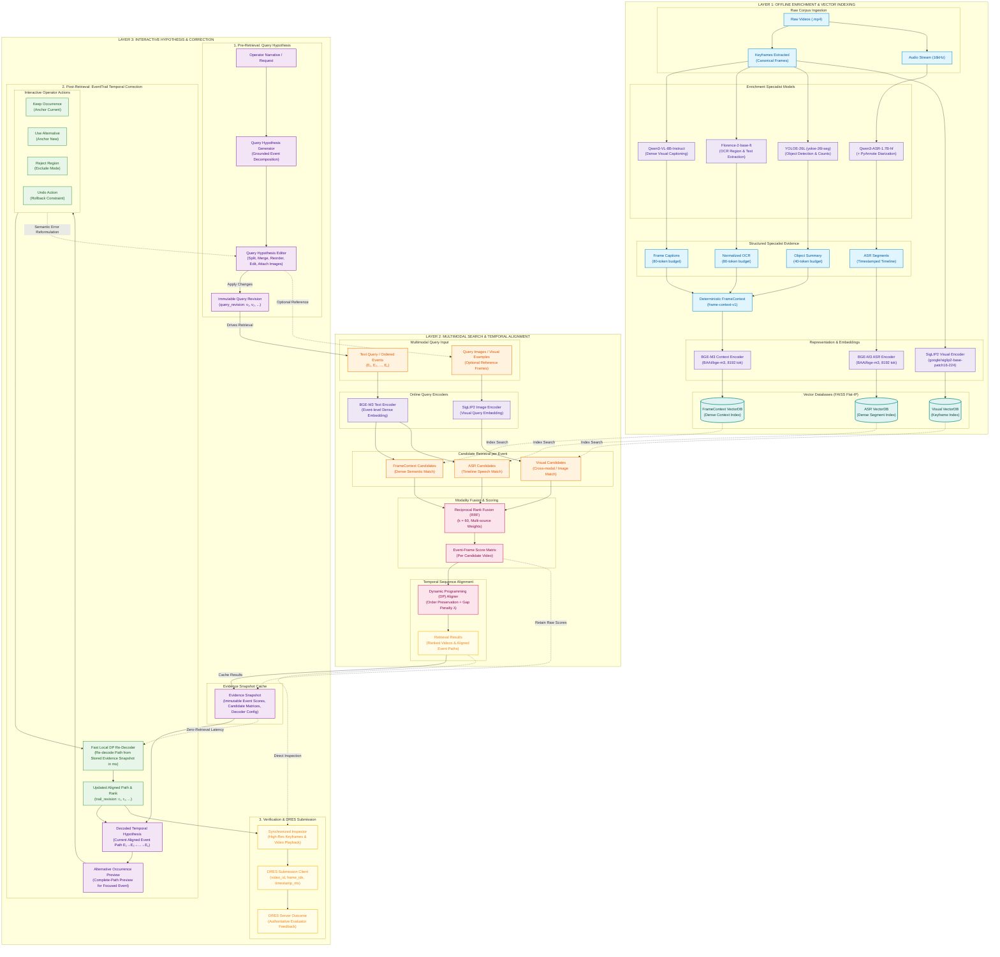
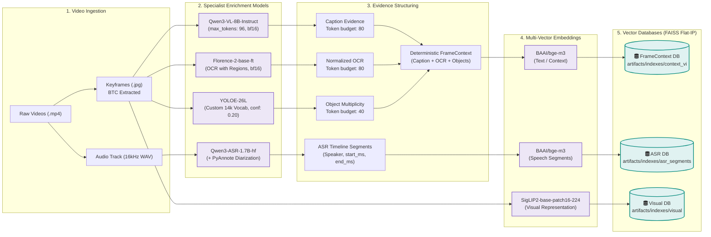
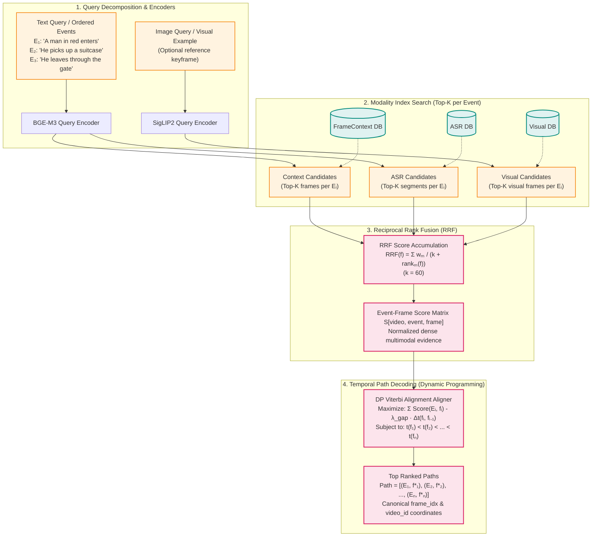
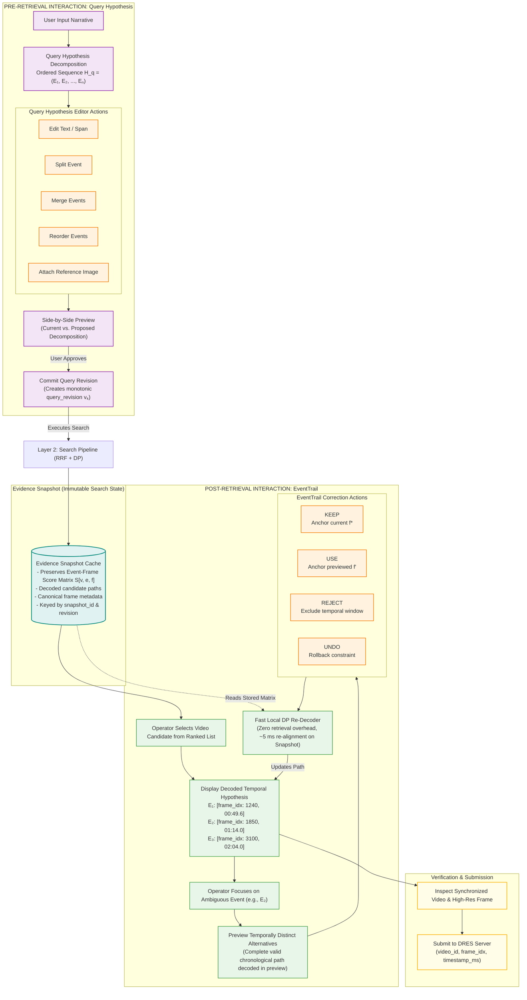
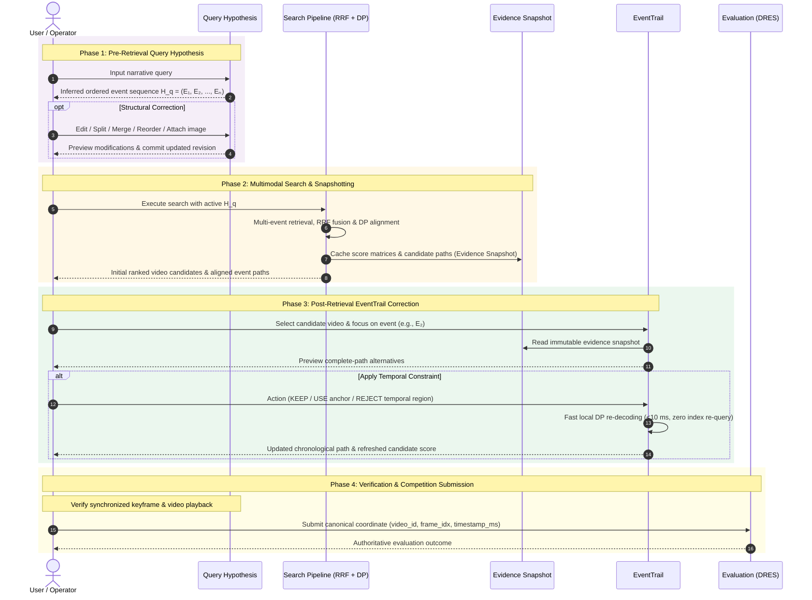

# HCMAI System Architecture & Interactive Hypothesis Diagrams

This document specifies the complete system architecture and interactive workflow for the **HCMAI / Ho Chi Minh City AI Challenge (Multimodal Video Retrieval)** system (SHI / EventTrail).

Canonical frame identity is strictly preserved across every offline and online stage as:
$$\text{Canonical Identity} = (\mathtt{video\_id}, \mathtt{frame\_id}, \mathtt{frame\_idx}, \mathtt{timestamp\_ms})$$

---

## 1. End-to-End System Architecture (3-Tier Overview)

The architecture is organized into three distinct, cooperating layers:
1. **Offline Layer**: Multimodal enrichment, deterministic context fusion, and vector indexing.
2. **Search Layer**: Multi-event multimodal retrieval, candidate generation, RRF fusion, and DP temporal sequence alignment.
3. **Interactive Hypothesis Layer**: Dual interaction loops featuring pre-retrieval **Query Hypothesis** reformulation and post-retrieval **EventTrail** fast DP temporal re-decoding.

---

## 2. Layer Deep-Dives

### 2.1 Layer 1: Offline Enrichment & Indexing Pipeline

This offline layer processes raw competition video collections into structured, canonical evidence and builds high-speed vector indexes.

#### Key Engineering Invariants in Offline Pipeline
- **Canonical Coordinate Preservation**: Every generated record preserves `video_id`, `frame_id`, `frame_idx`, and `timestamp_ms`.
- **Specialist Evidence Preservation**: Source captions, OCR bounding boxes, object label multiplicities, and raw transcripts remain accessible in standalone parquet stores (`artifacts/corpus/`); they are **never** destructively overwritten by unified context.
- **ASR Timeline Integrity**: Speech is indexed as timestamped interval evidence and mapped onto frames within a maximum window of 2,000 ms to 5,000 ms.

---

### 2.2 Layer 2: Online Search, RRF Fusion & Temporal DP Alignment

Online search executes multi-event retrieval across text and visual streams, fuses modality ranks via Reciprocal Rank Fusion (RRF), and decodes optimal temporal paths using Dynamic Programming.

#### Dynamic Programming (DP) Path Scoring
Given $N$ query events $(E_1, \dots, E_N)$ and candidate frame occurrences $f \in \mathcal{F}_v$ for video $v$:
$$\text{Score}(P) = \sum_{i=1}^{N} S(E_i, f_i) - \lambda_{\text{gap}} \sum_{i=2}^{N} \max(0, t(f_i) - t(f_{i-1}) - \Delta t_{\min})$$
Subject to strict chronological order:
$$t(f_1) < t(f_2) < \dots < t(f_N)$$
Where $\lambda_{\text{gap}} = 10^{-5}$ prevents degenerate distant alignments while allowing natural video event progression.

---

### 2.3 Layer 3: Interactive Hypothesis Loops (Query Hypothesis & EventTrail)

Interactive Hypothesis exposes two intermediate decision points as mutable interaction objects without triggering costly index recalculation:
1. **Pre-Retrieval (Query Hypothesis)**: Inspect and edit the semantic decomposition.
2. **Post-Retrieval (EventTrail)**: Inspect and fix temporal alignment errors in milliseconds via stored evidence snapshots.

---

## 3. Interactive Execution Sequence (Paper-Ready Protocol)

The sequence diagram below summarizes the end-to-end interactive retrieval lifecycle in SHI, highlighting the dual hypothesis-correction loops (Pre-retrieval Query Hypothesis and Post-retrieval EventTrail over Evidence Snapshots):

---

## 4. Key Architectural Invariants

1. **Strict Canonical Identity Guarantee**:
   - `frame_id`: Internal unique canonical hash across all indexes and stores.
   - `frame_idx`: Competition-facing frame coordinate for official evaluation submissions.
   - `video_id`: Source video identifier.
   - `timestamp_ms`: Canonical millisecond offset in source video.
   - Under no circumstances does keyframe array index or model rank replace `frame_idx`.

2. **Immutable Revisions & Snapshot Isolation**:
   - Every mutation in Query Hypothesis produces an incremental `query_revision`. Older search results are explicitly marked stale.
   - EventTrail actions create incremental `trail_revision` instances isolated within the captured `snapshot_id`.
   - Re-decoding in EventTrail operates strictly on preserved evidence snapshots, ensuring sub-10ms response times without issuing new vector database queries.

3. **Additive Multimodal Evidence**:
   - `FrameContext` provides high-density synthesized text for general semantics.
   - Specialist models (`Qwen3-VL`, `Florence-2`, `YOLOE-26L`, `Qwen3-ASR`) preserve their isolated evidence stores for independent ablation and high-precision filtering.
   - `ASR` evidence represents temporal timeline intervals rather than frame-native pixels.

4. **Deterministic Dynamic Programming**:
   - Path search maximizes multimodal evidence while enforcing forward chronological monotonicity and applying soft distance penalties $\lambda_{\text{gap}}$.
   - Multi-path decoding extracts alternative event paths with guaranteed minimum temporal separation.
