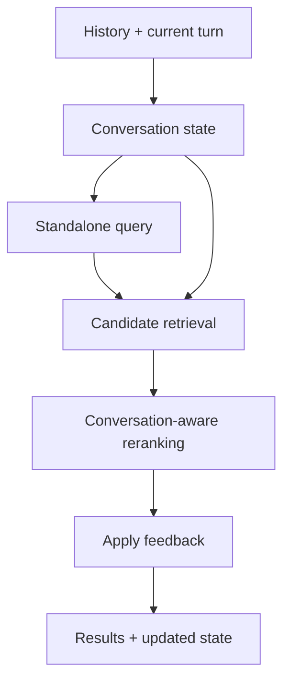

# HCMAI 2026 Frame Retrieval

HCMAI is a research-oriented video-frame retrieval project for the Ho Chi
Minh City AI Challenge 2026. The target interaction is a Vietnamese or
English natural-language query that returns the exact matching frame's
official `video_id` and `frame_idx`.

The project is a small, measurable hackathon baseline. The current code
includes canonical frame preparation, shared contracts, visual retrieval,
search orchestration, and an API boundary.

## Current status

Implemented foundations:

- Pydantic 2 schemas for frames, enrichment, retrieval, search, evaluation,
  enums, and conversational feedback.
- A deterministic `official mapping + keyframes → frames.parquet` builder and
  an in-memory `FrameStore`.
- `SearchEngine` orchestration with configurable `accurate` and `fast`
  profiles, optional reranking, response materialization, and latency fields.
- Visual embedding, FAISS index, and dense-retrieval foundations.
- A FastAPI application and the existing Node.js frontend.
- Utility helpers for YAML/JSON/Parquet I/O, image loading, timing, and
  logging.
- Lightweight schema tests and smoke-testable modules.

Still to implement:

- Captioning, OCR, ASR, score fusion, and multimodal reranking.
- Reproducible offline evaluation runners and measured retrieval experiments.

## Target retrieval flow



The design keeps expensive offline work separate from online search. Model
checkpoints, candidate counts, and search profile values belong in
configuration, while frame identifiers and API shapes belong in the shared
schemas.

## Repository structure

```text
frontend/                         Existing Node.js UI
src/hcmai/
├── app.py                        FastAPI boundary
├── search.py                     Search orchestration
├── kisc.py                       Conversational state
├── data/                         Canonical builder and FrameStore
├── embedding/                    Visual embedding pipeline
├── retriever/                    Dense retrieval and FAISS index
└── common/
    ├── config.py                 Shared settings scaffolding
    ├── schemas/                  Pydantic contracts
    │   └── README.md              Schema documentation
    └── utils/                    Generic helpers
        └── README.md              Utility documentation
configs/                          Experiment and search configuration
data/                             Local corpus and metadata
artifacts/                        Generated embeddings and indexes
runs/                             Evaluation outputs
tests/                            Contract tests and smoke tests
```

## Shared schemas

Use the contracts in [`src/hcmai/common/schemas`](src/hcmai/common/schemas)
instead of local dictionaries or duplicate dataclasses. The package documents
all models and enums in its [schema README](src/hcmai/common/schemas/README.md).

Key identifiers are:

- `frame_id`: globally unique and stable across pipeline reruns.
- `video_id`: source video identifier.
- `frame_idx`: authoritative frame index for submission.
- `timestamp_ms`: presentation timestamp for previews and temporal search.

`frame_idx` must not be inferred from `timestamp_ms * fps`; variable-frame-rate
videos and decoder behavior can make that mapping incorrect.

Example:

```python
from hcmai.common.schemas.search import SearchRequest

request = SearchRequest(query="một người đang đi bộ", top_k=20)
```

## Utilities

The [utility README](src/hcmai/common/utils/README.md) contains complete usage
examples. The available helpers are:

- `io.py`: `read_*` and `write_*` helpers for YAML, JSON, and Parquet.
- `image.py`: `load_image` for fully loaded, detached Pillow images.
- `timing.py`: `Timer` and `elapsed_ms` using a monotonic clock.
- `logging.py`: `configure_logging` and `get_logger`.

Install the project and its declared dependencies:

```bash
pip install -e .
```

Update `pyproject.toml` whenever a new runtime dependency becomes part of the
supported baseline.

## Data preparation

Build the single canonical metadata artifact from the official mapping and
provided keyframe images:

```bash
PYTHONPATH=src python scripts/prepare_data.py \
  --dataset-root /path/to/btc \
  --output data/metadata/frames.parquet
```

The MVP command produces only `frames.parquet`. Paths stored in it are
relative to `dataset-root`, and official `frame_idx` values come directly
from the mapping. See the [data pipeline guide](src/hcmai/data/README.md) for
the input layout, schema, and `FrameStore` examples.

## Offline artifact contracts

Use `frame_id` as the join key across all artifacts:

| Path                                              | Format  | Purpose                             |
| ------------------------------------------------- | ------- | ----------------------------------- |
| `data/metadata/frames.parquet`                  | Parquet | Canonical searchable-frame metadata |
| `artifacts/enrichment/frame_enrichment.parquet` | Parquet | Caption/OCR/ASR evidence            |
| `artifacts/embeddings/visual_embeddings.npy`    | NumPy   | Visual embedding matrix             |
| `artifacts/embeddings/frame_mapping.parquet`    | Parquet | Vector-to-frame mapping             |
| `artifacts/indexes/visual.index`                | FAISS   | Searchable vector index             |

Datasets, embeddings, model weights, indexes, and experiment outputs are local
artifacts and must not be committed to Git.

## FastAPI Server API

Launch the FastAPI application to serve the HTTP API for the Node.js frontend:

```bash
uv run uvicorn hcmai.app:app --host 127.0.0.1 --port 8000 --reload
```

Available API Endpoints:

- `GET /health`: Health status and dataset readiness.
- `POST /api/v1/search`: Frame search (supports standard search and conversational KISC turns).
- `POST /api/v1/session`: Create a new KISC session.
- `POST /api/v1/feedback`: Update accepted/rejected frame feedback lists.
- `GET /api/v1/frames/{frame_id}`: Fetch canonical frame metadata.
- `GET /api/v1/frames/{frame_id}/neighbors`: Fetch temporal +/- N neighbor frames.
- `POST /api/v1/submit`: Generate official BTC competition submission code (`video_id,frame_idx`).

For KISC, create a session first, then pass its `session_id` to search and
feedback requests. Unknown sessions return `404`; accepted results are promoted,
rejected results are removed, and each response identifies both the user turn
and its AI reply.
