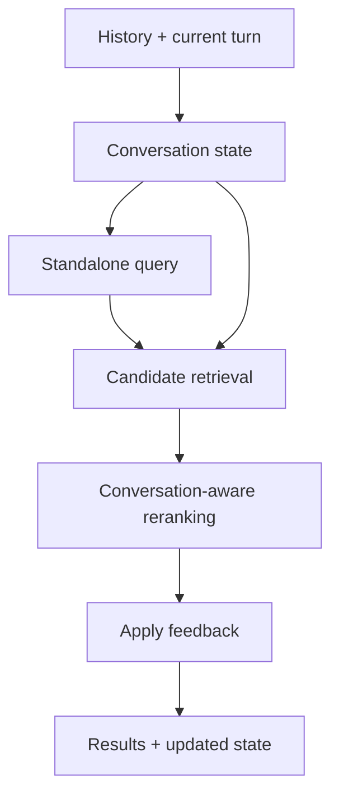

# HCMAI 2026 Frame Retrieval

HCMAI is a research-oriented video-frame retrieval project for the Ho Chi
Minh City AI Challenge 2026. The target interaction is a Vietnamese or
English natural-language query that returns the exact matching frame's
official `video_id` and `frame_idx`.

The project is a small, measurable hackathon baseline. The current code
includes canonical frame preparation, shared contracts, visual retrieval,
search orchestration, and an API boundary.

## Current status

Implemented foundations:

- Pydantic 2 schemas for frames, enrichment, retrieval, search, evaluation,
  enums, and conversational feedback.
- A deterministic `official mapping + keyframes → frames.parquet` builder and
  an in-memory `FrameStore`.
- `SearchEngine` orchestration with configurable `accurate` and `fast`
  profiles, optional reranking, response materialization, and latency fields.
- Visual embedding, FAISS index, and dense-retrieval foundations.
- A FastAPI application and the existing Node.js frontend.
- Utility helpers for YAML/JSON/Parquet I/O, image loading, timing, and
  logging.
- Lightweight schema tests and smoke-testable modules.

Still to implement:

- Captioning, OCR, ASR, score fusion, and multimodal reranking.
- Reproducible offline evaluation runners and measured retrieval experiments.

## Target retrieval flow



The design keeps expensive offline work separate from online search. Model
checkpoints, candidate counts, and search profile values belong in
configuration, while frame identifiers and API shapes belong in the shared
schemas.

## Repository structure

```text
frontend/                         Existing Node.js UI
scripts/                          Root-level data and experiment CLIs
src/hcmai/
├── app.py                        FastAPI boundary
├── search.py                     Search orchestration
├── kisc.py                       Conversational state
├── data/                         Canonical builder and FrameStore
├── embedding/                    Visual embedding pipeline
├── retriever/                    Dense retrieval and FAISS index
└── common/
    ├── config.py                 Shared settings scaffolding
    ├── schemas/                  Pydantic contracts
    │   └── README.md              Schema documentation
    └── utils/                    Generic helpers
        └── README.md              Utility documentation
configs/                          Experiment and search configuration
data/                             Local corpus and metadata
artifacts/                        Generated embeddings and indexes
runs/                             Evaluation outputs
tests/                            Contract tests and smoke tests
```

## Shared schemas

Use the contracts in [`src/hcmai/common/schemas`](src/hcmai/common/schemas)
instead of local dictionaries or duplicate dataclasses. The package documents
all models and enums in its [schema README](src/hcmai/common/schemas/README.md).

Key identifiers are:

- `frame_id`: globally unique and stable across pipeline reruns.
- `video_id`: source video identifier.
- `frame_idx`: authoritative frame index for submission.
- `timestamp_ms`: presentation timestamp for previews and temporal search.

`frame_idx` must not be inferred from `timestamp_ms * fps`; variable-frame-rate
videos and decoder behavior can make that mapping incorrect.

Example:

```python
from hcmai.common.schemas.search import SearchRequest

request = SearchRequest(query="một người đang đi bộ", top_k=20)
```

## Utilities

The [utility README](src/hcmai/common/utils/README.md) contains complete usage
examples. The available helpers are:

- `io.py`: `read_*` and `write_*` helpers for YAML, JSON, and Parquet.
- `image.py`: `load_image` for fully loaded, detached Pillow images.
- `timing.py`: `Timer` and `elapsed_ms` using a monotonic clock.
- `logging.py`: `configure_logging` and `get_logger`.

Install the project and its declared dependencies:

```bash
aic/bin/python -m pip install -e ".[embedding,reranking,dev]"
```

Update `pyproject.toml` whenever a new runtime dependency becomes part of the
supported baseline.

## Host the AI models on a temporary GPU VM

The frontend, FastAPI search backend, dataset, FAISS index, and keyframes stay
on the local machine. A temporary Thunder Compute VM hosts only the embedding,
reranking, and conversation models:

```text
React UI (localhost:3000)
        |
        v
Local FastAPI + artifacts (localhost:8000)
        |
        v
Cloudflare Access + Tunnel (api.iamphuckhang.dev)
        |
        v
Temporary GPU model API (localhost:8100 on the VM)
```

This keeps the roughly 100 GB retrieval artifacts off the VM. Deleting the VM
therefore loses only the installed environment and downloaded model cache, not
the local search data.

### 1. One-time local and Cloudflare setup

Install and authenticate the
[Thunder Compute CLI](https://www.thundercompute.com/docs/cli/quickstart):

```bash
curl -fsSL https://raw.githubusercontent.com/Thunder-Compute/thunder-cli/main/scripts/install.sh | bash
tnr login
```

In Cloudflare, create one remotely managed Tunnel and configure:

- Published hostname: `api.iamphuckhang.dev`
- Service URL: `http://localhost:8100`
- Cloudflare Access policy: Service Auth

The Tunnel, DNS record, and Access policy are persistent; do not recreate them
for every VM. Keep the Tunnel token and Cloudflare Access credentials private.
The file `llm/deploy_cloudflared_private.sh` is intentionally ignored by Git.
Configure its repository, branch, Tunnel token, and any model overrides once
on the local machine. Never commit or paste this private script into an issue
or log.

Before creating a VM, commit and push the code and configuration that the
bootstrap must clone. An uncommitted local change is not available to the VM.

### 2. Create a throwaway VM

Run the interactive creator:

```bash
tnr create
```

For the current BF16 model configuration, select:

- Prototyping mode for short development sessions
- One L40 or A6000 GPU with 48 GB VRAM
- The base Ubuntu/PyTorch template
- At least 80 GB of primary disk; 100 GB gives safer room for packages and
  Hugging Face model caches

Wait until the instance is `RUNNING`, then copy its numeric ID from:

```bash
tnr status --no-wait
```

Use that ID in place of `<instance-id>` below. It is often `0`, but must not be
assumed.

### 3. Upload and run the all-in-one bootstrap

From the repository root on the local machine:

```bash
tnr scp llm/deploy_cloudflared_private.sh <instance-id>:/home/ubuntu/
tnr connect <instance-id>
```

Then run this single command inside the VM:

```bash
sudo bash /home/ubuntu/deploy_cloudflared_private.sh
```

The script clones the configured repository into `/opt/hcmai/repo`, installs
the Python environment and a Python 3.12-compatible Supervisor, downloads the
configured checkpoints, starts the model API, starts `cloudflared`, and checks
both processes. Git runs only as the `hcmai` service user, so no Git login,
global ownership exception, or author configuration is required for the public
repository. Each bootstrap run fetches the configured branch and resets this
deployment checkout to its newest commit. It does not download the HCMAI
keyframes, embeddings, mappings, or FAISS index.

The first launch can take several minutes because it downloads the model
checkpoints. The default conversation checkpoint comes from `llm/config.yaml`;
leave `HCMAI_CONVERSATION_MODEL` empty in the private script unless an explicit
override is required.

### 4. Verify the model service

Inside the VM:

```bash
nvidia-smi
sudo supervisorctl status
curl -sS http://127.0.0.1:8100/ready | jq
```

Both `hcmai-llm` and `hcmai-cloudflared` should report `RUNNING`, and `/ready`
should report that the configured models are ready. If startup fails, inspect:

```bash
tail -f /opt/hcmai/logs/llm.log /opt/hcmai/logs/cloudflared.log
```

On the local data machine, copy `.env.example` to `.env`, fill in
`HCMAI_CF_ACCESS_CLIENT_ID` and `HCMAI_CF_ACCESS_CLIENT_SECRET`, export those
values, and follow [Initialize the local FastAPI backend](#initialize-the-local-fastapi-backend).
The React UI still calls `http://127.0.0.1:8000`; only the local backend calls
`https://api.iamphuckhang.dev`.

### 5. Finish the session and stop GPU billing

Thunder Compute has no native stopped-instance state. If the VM is disposable,
exit its shell and delete it after finishing:

```bash
exit
tnr delete <instance-id>
```

Deletion is permanent and stops GPU billing. A later VM can be created and
bootstrapped with the same private script. To avoid downloading the model cache
again, optionally create a snapshot first and wait until it is `READY`:

```bash
tnr snapshot create --instance-id <instance-id> --name hcmai-model-host
tnr snapshot list
```

Snapshots retain storage costs and are restored by selecting the snapshot as
the template during the next `tnr create`. See [`llm/README.md`](llm/README.md)
for process restart commands and model-service details.

## Data preparation

If the dataset arrived as zip archives under `data/`, extract them first:

```bash
aic/bin/python scripts/extract_zips.py --data-dir data
```

Build the single canonical metadata artifact from the official mapping and
provided keyframe images:

```bash
PYTHONPATH=src aic/bin/python scripts/prepare_data.py \
  --dataset-root data \
  --output data/metadata/frames.parquet
```

The MVP command produces only `frames.parquet`. Paths stored in it are
relative to `dataset-root`, and official `frame_idx` values come directly
from the mapping. See the [data pipeline guide](src/hcmai/data/README.md) for
the input layout, schema, and `FrameStore` examples.

## Offline artifact contracts

Use `frame_id` as the join key across all artifacts:

| Path                                              | Format    | Purpose                              |
| ------------------------------------------------- | --------- | ------------------------------------ |
| `data/metadata/frames.parquet`                  | Parquet   | Canonical searchable-frame metadata  |
| `artifacts/enrichment/frame_enrichment.parquet` | Parquet   | Caption/OCR/ASR evidence             |
| `artifacts/embeddings/visual_embeddings.npy`    | NumPy     | Visual embedding matrix              |
| `artifacts/embeddings/frame_mapping.parquet`    | Parquet   | Vector-to-frame mapping              |
| `artifacts/indexes/visual/`                     | Directory | FAISS index, mapping, and provenance |

The visual index directory contains `visual.index`,
`frame_mapping.parquet`, and `metadata.json`. Set `HCMAI_INDEX_PATH` to this
directory, not to the `visual.index` file inside it.

Datasets, embeddings, model weights, indexes, and experiment outputs are local
artifacts and must not be committed to Git.

## Initialize the local FastAPI backend

The FastAPI backend runs on the local data machine, not on the temporary GPU
VM. It loads `frames.parquet` and the FAISS index from local storage, serves
frame images to the React UI, manages KISC sessions, and sends only model
inference requests to `api.iamphuckhang.dev`.

### 1. Create the Python environment

Run these commands from the repository root. Python 3.11 or newer is required:

```bash
python3 --version
python3 -m venv aic
aic/bin/python -m pip install --upgrade pip
aic/bin/python -m pip install -e ".[embedding,reranking,dev]"
```

The virtual environment is created only once. Rerun the final install command
after pulling a commit that changes `pyproject.toml`.

### 2. Configure the backend environment

Create a private local environment file:

```bash
cp .env.example .env
nano .env
```

Its model-service configuration should look like:

```dotenv
HCMAI_INFERENCE_BASE_URL=https://api.iamphuckhang.dev
HCMAI_CF_ACCESS_CLIENT_ID=<cloudflare-access-client-id>
HCMAI_CF_ACCESS_CLIENT_SECRET=<cloudflare-access-client-secret>
HCMAI_CORS_ORIGINS=http://localhost:3000,http://127.0.0.1:3000
```

The Access credentials belong only in the local backend environment. Never put
them in `frontend/.env`, commit them, or expose them to browser code.

The application reads process environment variables; it does not automatically
load the root `.env` file. Export it in every new backend terminal:

```bash
set -a
source .env
set +a
```

The default artifact paths come from `configs/baseline.yaml`:

```text
data/metadata/frames.parquet
artifacts/indexes/visual/
├── visual.index
├── frame_mapping.parquet
└── metadata.json
```

Confirm that these files exist before starting:

```bash
ls -lh data/metadata/frames.parquet
ls -lh artifacts/indexes/visual/visual.index
ls -lh artifacts/indexes/visual/frame_mapping.parquet
ls -lh artifacts/indexes/visual/metadata.json
```

For a non-default layout, export one or more overrides after loading `.env`:

```bash
export HCMAI_CONFIG_PATH=configs/baseline.yaml
export HCMAI_DATASET_ROOT=data
export HCMAI_METADATA_PATH=data/metadata/frames.parquet
export HCMAI_INDEX_PATH=artifacts/indexes/visual
```

`HCMAI_INDEX_PATH` must point to the index directory, not directly to
`visual.index`.

### 3. Start FastAPI

Keep the GPU VM and Cloudflare Tunnel running, then launch the local backend:

```bash
PYTHONPATH=src aic/bin/python -m uvicorn hcmai.app:app \
  --host 127.0.0.1 --port 8000 --reload
```

Use one worker because the frame store and FAISS index are initialized once per
process. `--reload` is intended for local development.

Interactive API documentation is available at:

```text
http://127.0.0.1:8000/docs
```

### 4. Verify backend readiness

From another local terminal:

```bash
curl -sS http://127.0.0.1:8000/health | jq
```

A search-ready backend reports:

```json
{
  "status": "ok",
  "ready": true,
  "frame_store_loaded": true,
  "retriever_loaded": true
}
```

The real response also includes frame count, capabilities, and
`startup_messages`. If `ready` is `false`, inspect `startup_messages` first;
the usual causes are a missing `frames.parquet`, an incorrect index directory,
or an incomplete index artifact.

The API can start without local metadata or index artifacts. In that state,
`GET /health` returns `status: "ok"` and `ready: false`; search returns `503`
until a retriever is available. Runtime paths can be overridden with
`HCMAI_CONFIG_PATH`, `HCMAI_METADATA_PATH`, and `HCMAI_INDEX_PATH`.

### Available API endpoints

- `GET /health`: Health status and dataset readiness.
- `POST /api/v1/search`: Frame search for standard and conversational KISC
  turns.
- `POST /api/v1/kisc/search`: Stateless resolve-then-search KISC turn.
- `POST /api/v1/vqa`: Frame-grounded VQA provider boundary.
- `POST /api/v1/session`: Create a new KISC session.
- `GET /api/v1/sessions`: List all current KISC session IDs.
- `POST /api/v1/feedback`: Update accepted/rejected frame feedback lists.
- `GET /api/v1/frames/{frame_id}`: Fetch canonical frame metadata.
- `GET /api/v1/frames/{frame_id}/thumbnail`: Safely serve a thumbnail.
- `GET /api/v1/frames/{frame_id}/image`: Safely serve a full frame.
- `GET /api/v1/frames/{frame_id}/neighbors?window_ms=5000`: Fetch temporal neighbors.
- `POST /api/v1/submit`: Generate official BTC competition submission code (`video_id,frame_idx`).

For KISC, create a session first, then pass its `session_id` to search and
feedback requests. Unknown sessions return `404`; accepted results are promoted,
rejected results are removed, and each response identifies both the user turn
and its AI reply. Sessions currently live in process memory, so the list resets
when the backend restarts.

## Frontend integration

The React app creates a server-side KISC session on launch; it no longer
contains mock frames or client-generated conversation IDs. Configure a
different backend in `frontend/.env` when needed:

```bash
cp frontend/.env.example frontend/.env
cd frontend
npm start
```

The default backend is `http://127.0.0.1:8000`. The UI uses the published
conversation routes: `POST /api/v1/session`, `GET /api/v1/sessions`,
`GET /api/v1/session/{session_id}`, and `POST /api/v1/feedback`. Search sends
`query`, `top_k`, `search_mode`, and the active `session_id`; when the visible
feedback draft changed, it also sends the contract's
`accepted_frame_ids`/`rejected_frame_ids` snapshot. The History menu lists the
server's in-memory session IDs, so it resets when the backend restarts.
