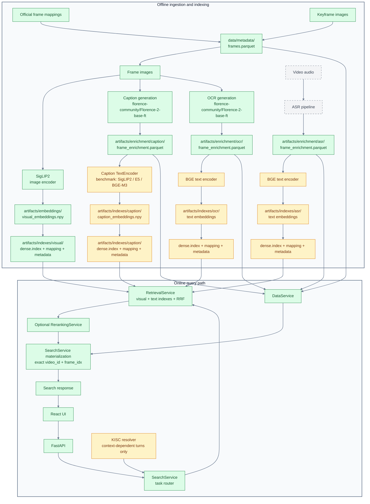

# HCMAI 2026 Frame Retrieval

HCMAI is a research-oriented video-frame retrieval project for the Ho Chi
Minh City AI Challenge 2026. The target interaction is a Vietnamese or
English natural-language query that returns the exact matching frame's
official `video_id` and `frame_idx`.

The project is a small, measurable hackathon baseline. The current code
includes canonical frame preparation, shared contracts, visual retrieval,
search orchestration, and an API boundary.

## Current status

Implemented foundations:

- Pydantic 2 schemas for frames, enrichment, retrieval, search, evaluation,
  enums, and conversational feedback.
- A deterministic `official mapping + keyframes → frames.parquet` builder and
  an in-memory `FrameStore`.
- `SearchService` orchestration with one selected competition configuration,
  optional reranking, response materialization, and latency fields.
- Visual embedding, FAISS index, and dense-retrieval foundations.
- Caption and OCR enrichment pipelines, Caption/OCR/ASR evidence stores, plus
  generic text indexing and four-source visual/caption/OCR/ASR RRF retrieval.
- Resumable multilingual transcription with speaker-labelled, per-video
  Parquet artifacts.
- A FastAPI application and the existing Node.js frontend.
- Utility helpers for YAML/JSON/Parquet I/O, image loading, timing, and
  logging.
- Lightweight schema tests and smoke-testable modules.

Still to implement:

- Build and validate full-corpus OCR/ASR indexes, then benchmark multimodal
  fusion weights.
- Benchmark and select the highest-scoring caption text encoder that satisfies
  the competition latency budget.
- Reproducible offline evaluation runners and measured retrieval experiments.
- Real VQA answer grounding and TRAKE same-video temporal alignment pipelines.

## Data and retrieval flow

The diagram separates offline artifacts from the service-level online path.
Every artifact is joined through the canonical `frame_id`; final submission
identifiers always come from `frames.parquet`.



Green nodes are implemented and become ready when their compatible artifacts
are available. Amber nodes have artifact contracts or reusable code but still
require a benchmark or integration decision. Dashed gray nodes are planned. The caption
encoder is deliberately marked as a benchmark choice: `SigLIP2`,
`multilingual-e5-small`, and `BGE-M3` must be measured before selecting the
competition checkpoint. Every enabled index must match its configured query
encoder and dataset provenance.

The design keeps expensive offline work separate from online search. Model
checkpoints and candidate counts belong in
configuration, while frame identifiers and API shapes belong in the shared
schemas.

## Repository structure

```text
frontend/                         Existing Node.js UI
scripts/                          Root-level data and experiment CLIs
src/hcmai/
├── app.py                        FastAPI lifecycle and router assembly
├── api/routers/                  Thin HTTP adapters
├── orchestration/
│   ├── pipeline.py               SearchService task router
│   └── setup.py                  Application composition root
├── data/                         DataService and canonical stores
├── embedding/                    EmbeddingService and model adapters
├── enrichment/                   EnrichmentService for caption/OCR jobs
├── retriever/                    RetrievalService, indexes, fusion, baseline evaluation
├── reranking/                    RerankingService and scoring adapters
├── transcripts/                  TranscriptService and ASR adapters
├── llm/                          LLMService and local/HTTP adapters
├── query_suggestions/            SuggestionService and provider adapters
├── agents/kisc/                  Bounded conversational KIS research code
└── common/
    ├── config.py                 Shared settings scaffolding
    ├── schemas/                  Pydantic contracts
    │   └── README.md              Schema documentation
    └── utils/                    Generic helpers
        └── README.md              Utility documentation
configs/                          Experiment and search configuration
data/                             Local corpus and metadata
artifacts/                        Generated embeddings and indexes
runs/                             Evaluation outputs
tests/                            Contract tests and smoke tests
```

The service-owning packages listed below expose one public `pipeline.py` and a
`*Service` facade. Code outside a service component calls that facade or a
shared schema; concrete SigLIP, BGE, Qwen, HTTP, ASR, caption, and OCR
implementations live in the component's `adapters/`. The `models/` directories
contain only contracts, entities, metadata, statistics, and other data objects.

Online API traffic enters through `SearchService`, which routes the task and
coordinates `RetrievalService`, optional `RerankingService`, and canonical
materialization. Offline jobs call their owning service directly. VQA and
TRAKE are declared task types but are not yet executable end-to-end pipelines;
the service returns `501` instead of constructing placeholder components.

### Service boundaries

| Component     | Public boundary                                        | Responsibility                                               |
| ------------- | ------------------------------------------------------ | ------------------------------------------------------------ |
| Data          | `hcmai.data.pipeline.DataService`                    | Canonical frame preparation, lookup, and evidence access     |
| Embedding     | `hcmai.embedding.pipeline.EmbeddingService`          | Visual/text encoding and visual embedding artifacts          |
| Enrichment    | `hcmai.enrichment.pipeline.EnrichmentService`        | Offline caption and OCR jobs                                 |
| Transcripts   | `hcmai.transcripts.pipeline.TranscriptService`       | ASR/diarization jobs and transcript access                   |
| Retrieval     | `hcmai.retriever.pipeline.RetrievalService`          | Index construction/loading, multimodal retrieval, and fusion |
| Reranking     | `hcmai.reranking.pipeline.RerankingService`          | Bounded candidate rescoring without identity changes         |
| LLM           | `hcmai.llm.pipeline.LLMService`                      | Local or remote model-inference lifecycle                    |
| Suggestions   | `hcmai.query_suggestions.pipeline.SuggestionService` | Explicit operator query suggestions                          |
| Orchestration | `hcmai.orchestration.pipeline.SearchService`         | Online task routing and canonical response materialization   |

`common/` remains the shared contract/helper layer, `api/routers/` remains a
thin transport layer, and `agents/` is intentionally exempt from the
one-`pipeline.py` rule.

Install the project and its declared dependencies:

```bash
aic/bin/python -m pip install -e ".[embedding,reranking,dev]"
```

## Host the AI models on a temporary GPU VM

The frontend, FastAPI search backend, dataset, FAISS index, and keyframes stay
on the local machine. A temporary Thunder Compute VM hosts only bounded model
inference: embedding, captioning, reranking, conversation/VQA, and optional GPU
query suggestions.

```text
React UI (localhost:3000)
        |
        v
Local FastAPI + artifacts (localhost:8000)
        |
        v
Cloudflare Access + Tunnel (api.iamphuckhang.dev)
        |
        v
Temporary GPU model API (localhost:8100 on the VM)
```

`configs/baseline.yaml` owns dataset, artifact, search, fusion, API, and
inference-connection settings. `llm/config.yaml` is the single authority for
visual embedding, caption embedding, reranking, and conversation checkpoints.

This keeps the roughly 100 GB retrieval artifacts off the VM. Deleting the VM
therefore loses only the installed environment and downloaded model cache, not
the local search data.

### 1. One-time local and Cloudflare setup

Install and authenticate the
[Thunder Compute CLI](https://www.thundercompute.com/docs/cli/quickstart):

```bash
curl -fsSL https://raw.githubusercontent.com/Thunder-Compute/thunder-cli/main/scripts/install.sh | bash
tnr login
```

In Cloudflare, create one remotely managed Tunnel and configure:

- Published hostname: `api.iamphuckhang.dev`
- Service URL: `http://localhost:8100`
- Cloudflare Access policy: Service Auth

The Tunnel, DNS record, and Access policy are persistent; do not recreate them
for every VM. Keep the Tunnel token and Cloudflare Access credentials private.
The file `llm/deploy_cloudflared_private.sh` is intentionally ignored by Git.
Configure its repository, branch, Tunnel token, and any model overrides once
on the local machine. Never commit or paste this private script into an issue
or log.

Before creating a VM, commit and push the code and configuration that the
bootstrap must clone. An uncommitted local change is not available to the VM.

### 2. Create a throwaway VM

Run the interactive creator:

```bash
tnr create
```

For the current BF16 model configuration, select:

- Prototyping mode for short development sessions
- One L40 or A6000 GPU with 48 GB VRAM
- The base Ubuntu/PyTorch template
- At least 80 GB of primary disk; 100 GB gives safer room for packages and
  Hugging Face model caches

Wait until the instance is `RUNNING`, then copy its numeric ID from:

```bash
tnr status --no-wait
```

Use that ID in place of `<instance-id>` below. It is often `0`, but must not be
assumed.

### 3. Upload and run the all-in-one bootstrap

From the repository root on the local machine:

```bash
tnr scp llm/deploy_cloudflared_private.sh <instance-id>:/home/ubuntu/
tnr connect <instance-id>
```

Then run the model set needed for the current session. For caption generation
and CaptionStore indexing:

```bash
sudo bash /home/ubuntu/deploy_cloudflared_private.sh \
  --caption true \
  --caption-embedding true
```

The private bootstrap also accepts `--visual-embedding true`,
`--reranker true`, and `--conversation true`. All five model flags default to
`false`, and disabled models are not loaded into VRAM. Visual embedding uses
SigLIP2; caption embedding uses BGE-M3.

Query suggestions are a separate runtime capability controlled by
`HCMAI_ENABLE_QUERY_SUGGESTIONS`; the current private bootstrap does not expose
a dedicated CLI flag. If enabled with the same checkpoint as conversation, the
runtime can reuse that model; otherwise account for a separate model instance.

The script clones the configured repository into `/opt/hcmai/repo`, installs
the Python environment and a Python 3.12-compatible Supervisor, downloads the
configured checkpoints, starts the model API, starts `cloudflared`, and checks
both processes. Git runs only as the `hcmai` service user, so no Git login,
global ownership exception, or author configuration is required for the public
repository. Each bootstrap run fetches the configured branch and resets this
deployment checkout to its newest commit. It does not download the HCMAI
keyframes, embeddings, mappings, or FAISS index.

The first launch can take several minutes because it downloads the model
checkpoints. The default conversation checkpoint comes from `llm/config.yaml`;
leave `HCMAI_CONVERSATION_MODEL` empty in the private script unless an explicit
override is required.

### 5. Finish the session and stop GPU billing

Thunder Compute has no native stopped-instance state. If the VM is disposable,
exit its shell and delete it after finishing:

```bash
exit
tnr delete <instance-id>
```

Deletion is permanent and stops GPU billing. A later VM can be created and
bootstrapped with the same private script. To avoid downloading the model cache
again, optionally create a snapshot first and wait until it is `READY`:

```bash
tnr snapshot create --instance-id <instance-id> --name hcmai-model-host
tnr snapshot list
```

## Data preparation

If the dataset arrived as zip archives under `data/`, extract them first:

```bash
aic/bin/python scripts/extract_zips.py --data-dir data
```

Build the single canonical metadata artifact from the official mapping and
provided keyframe images:

```bash
PYTHONPATH=src aic/bin/python scripts/prepare_data.py \
  --dataset-root data \
  --output data/metadata/frames.parquet
```

## Transcript preparation

Install the optional ASR dependencies, then smoke-test two videos:

```bash
pip install -e '.[transcripts]'
export HF_TOKEN="hf_..."
PYTHONPATH=src python scripts/prepare_transcripts.py \
  --videos-root /path/to/videos \
  --output artifacts/transcripts \
  --limit 2
```

The command writes one speaker-labelled transcript Parquet per video. Pass
`--no-resume` to reprocess existing outputs. See the
[transcript pipeline guide](src/hcmai/transcripts/README.md) for artifact
schemas, diarization behavior, and configuration.

## Initialize the local FastAPI backend

The FastAPI backend runs on the local data machine, not on the temporary GPU
VM. It loads `frames.parquet` and the FAISS indexes from local storage, serves
frame images to the React UI, and sends only model inference requests to
`api.iamphuckhang.dev`. The current application does not mount the research
KISC router; conversation state remains frontend-owned until that integration
is explicitly enabled.

### 1. Create the Python environment

Run these commands from the repository root. Python 3.11 or newer is required:

```bash
python3 --version
python3 -m venv aic
aic/bin/python -m pip install --upgrade pip
aic/bin/python -m pip install -e ".[embedding,reranking,dev]"
```

The virtual environment is created only once. Rerun the final install command
after pulling a commit that changes `pyproject.toml`.

### 2. Configure the backend environment

Create a private local environment file:

```bash
cp .env.example .env
nano .env
```

The application reads process environment variables; it does not automatically
load the root `.env` file. Export it in every new backend terminal:

```bash
set -a
source .env
set +a
```

The default artifact paths come from `configs/baseline.yaml`:

```text
data/metadata/frames.parquet
artifacts/indexes/visual/
├── dense.index
├── frame_mapping.parquet
└── metadata.json
```

### 3. Start FastAPI

Keep the GPU VM and Cloudflare Tunnel running, then launch the local backend:

```bash
PYTHONPATH=src aic/bin/python -m uvicorn hcmai.app:app \
  --host 127.0.0.1 --port 8000 --reload
```

### 4. Verify backend readiness

From another local terminal:

```bash
curl -sS http://127.0.0.1:8000/health | jq
```

A search-ready backend reports:

```json
{
  "status": "ok",
  "ready": true,
  "frame_store_loaded": true,
  "retriever_loaded": true
}
```

The React app currently owns its conversation/session state. Configure a
different backend in `frontend/.env` when needed:

```bash
cp frontend/.env.example frontend/.env
cd frontend
npm start
```
