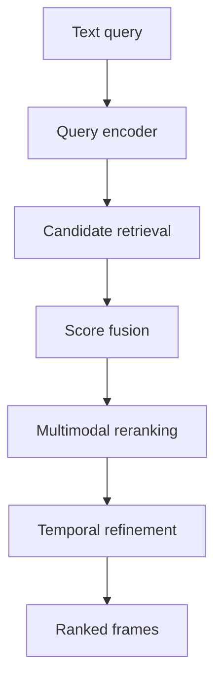

# HCMAI 2026 Frame Retrieval

HCMAI is a research-oriented video frame retrieval system for the Ho Chi
Minh City AI Challenge 2026. Given a natural-language query, the system
retrieves the most relevant frame from a large video corpus and returns the
official `video_id` and `frame_idx`.

The repository is optimized for a hackathon workflow: fast experiments,
reproducible evaluation, simple integration, and low online search latency.
It is intentionally not designed as an enterprise application.

## Competition goals

The system targets the following tasks:

- Textual Known-Item Search (KIS).
- Video KIS and temporal search.
- Ad-hoc video search.
- Video Question Answering (VQA).

The two competition profiles have different priorities:

| Profile | Main priority | Typical behavior |
|---|---|---|
| `accurate` | Retrieval accuracy | More candidates and deeper reranking |
| `fast` | Online latency | Fewer candidates and lightweight reranking |

## Retrieval approach



The current baseline is expected to use:

- A multilingual image-text encoder such as SigLIP 2.
- FAISS for fast vector similarity search.
- Offline frame captions to enrich semantic retrieval.
- OCR and ASR as optional evidence channels.
- A multimodal reranker such as Qwen3-VL-Reranker or BLIP-ITM.

Models are configuration choices. Retrieval code should not hard-code a
specific checkpoint.

## Project principles

- Keep the code simple enough to modify during the competition.
- Prefer measurable experiments over speculative complexity.
- Preserve exact `frame_id`, `video_id`, and `frame_idx` mappings.
- Separate expensive offline processing from online search.
- Store every experiment's configuration, metrics, and failures.
- Follow PEP 8 for all Python code.
- Avoid microservices, distributed databases, and unnecessary abstraction.

## Target repository structure

```text
hcmai/
├── frontend/                   # Existing Node.js user interface
├── backend/
│   └── main.py                 # FastAPI entry point
├── src/
│   └── aic/
│       ├── schemas.py          # Shared Pydantic contracts
│       ├── search.py           # End-to-end search orchestration
│       ├── data/               # Extraction and metadata loading
│       ├── retriever/          # Embeddings, FAISS, and fusion
│       ├── enrichment/         # Captioning, OCR, and ASR
│       ├── reranking/          # Multimodal rerankers
│       ├── evaluation/         # Metrics and evaluation runner
│       └── utils/              # Small, generic helpers
├── scripts/                    # Offline and command-line entry points
├── configs/                    # Experiment and search profiles
├── data/                       # Local datasets; not committed
├── artifacts/                  # Generated models/indexes; not committed
├── runs/                       # Experiment metrics and failure reports
├── tests/
├── AGENTS.md
└── README.md
```

The structure is a target, not a requirement to create empty directories.
Add a directory or file only when its first implementation is needed.

## Component ownership

| Component | Primary owner | Main responsibility |
|---|---|---|
| Architecture and contracts | AI Tech Lead | Schemas, orchestration, evaluation |
| Data pipeline | Data Engineer | Video discovery, frame extraction, metadata |
| Dense retrieval | AI Engineer 1 | Encoders, embeddings, FAISS indexing |
| Enrichment and reranking | AI Engineer 2 | Captions, OCR, ASR, reranking |
| API and UI | Software Engineer | FastAPI and existing Node.js frontend |

Ownership prevents merge conflicts; it does not prevent collaboration.
Changes to `src/aic/schemas.py` require Tech Lead review because all
components depend on those contracts.

## Shared schemas

Canonical Pydantic models live in [`src/aic/schemas.py`](src/aic/schemas.py).
The current contracts cover:

- `FrameRecord` and `FrameEnrichment`.
- `SearchRequest`, `SearchFilters`, and `SearchResponse`.
- `RetrievalCandidate` and per-source scores.
- `EvaluationQuery` and competition task metadata.

Components must exchange these models or documented artifact tables. Do not
create local variants of shared field names.

## Offline artifact contracts

Offline artifacts are generated before a user searches. They allow the data
and AI pipelines to run independently without requiring a database.

| Artifact | Format | Purpose |
|---|---|---|
| `data/metadata/frames.parquet` | Parquet | Canonical searchable-frame metadata |
| `artifacts/enrichment/frame_enrichment.parquet` | Parquet | Caption and OCR metadata |
| `artifacts/embeddings/visual_embeddings.npy` | NumPy | Frame embedding matrix |
| `artifacts/embeddings/frame_mapping.parquet` | Parquet | Vector position to frame mapping |
| `artifacts/indexes/visual.index` | FAISS | Searchable vector index |

`frame_id` is the join key across frame metadata, enrichment, embeddings,
retrieval candidates, and API results.

Large data and generated artifacts must not be committed to Git.

The backend should expose `/openapi.json` so the Node.js frontend can keep its
TypeScript API types synchronized with the Pydantic contracts.

## Evaluation

Every retrieval experiment should report at least:

- Candidate `Recall@1`, `Recall@5`, `Recall@10`, and `Recall@100`.
- Final `Recall@1`, `Recall@5`, and `Recall@10` after reranking.
- Mean Reciprocal Rank (MRR).
- P50 and P95 query latency.
- Invalid frame mappings.

Store each experiment under:

```text
runs/<experiment_name>/
├── config.yaml
├── metrics.json
├── per_query.csv
└── failures.csv
```

Keeping candidate and final metrics separate makes it possible to determine
whether a failure came from retrieval or reranking.

Python code must follow PEP 8, use type hints for public functions, and avoid
performing expensive work at import time. Unit tests should use lightweight
fixtures or fake components rather than loading full AI models.
