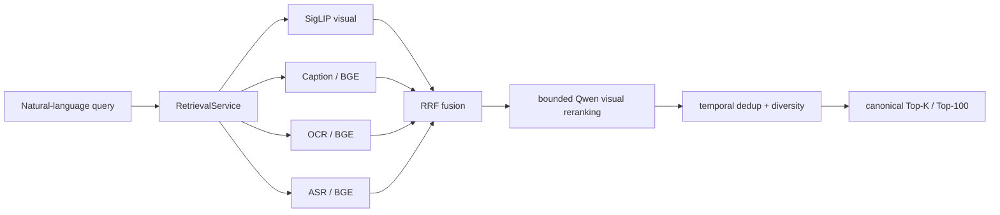
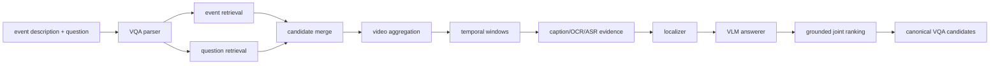
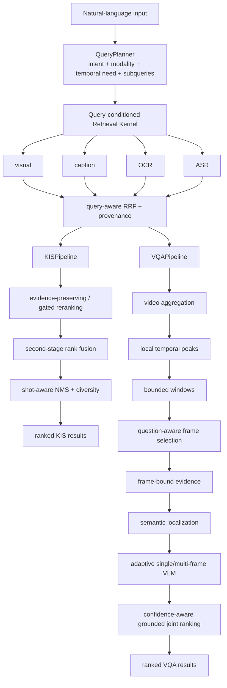

# HCMAI 2026 Multimodal Video Retrieval

HCMAI is a competition-oriented multimodal video retrieval system for the Ho Chi Minh City AI Challenge 2026. The system accepts Vietnamese or English natural-language input and returns canonical video/frame identities for Textual Known Item Search (KIS) and grounded video question answering (Q&A/VQA).

The current engineering priority is **not to replace the model stack**. It is to make the existing KIS and VQA pipelines more correct, query-aware, evidence-preserving, temporally grounded, measurable, and fast.

> The approved implementation roadmap is [`KIS_VQA_V2_PLAN.md`](KIS_VQA_V2_PLAN.md). Coding agents must treat that plan, the current repository/tests/configuration, and the latest user instruction as the active source of truth.

## Scope

This workstream owns:

- shared multimodal retrieval used by KIS and VQA;
- Textual KIS;
- Competition Q&A / VQA;
- reranking, evidence localization, temporal windows, grounded answering;
- resilience, caching, observability, evaluation, and submission integration needed by KIS/VQA.

### Explicit non-goals

- **TRAKE is owned by another teammate.** Do not implement, refactor, benchmark, optimize, or review TRAKE internals from this workstream.
- Do not remove or break existing TRAKE contracts, registrations, routers, or shared integration seams.
- KISC / conversational KIS / VKIS are outside the active optimization scope unless explicitly restored.

## Competition outputs

### KIS

```text
<video_name>,<frame_idx>
```

### VQA

```text
<video_name>,<frame_idx>,<answer>
```

`frame_idx` must always come from the canonical frame mapping. It must never be inferred from timestamp, FPS, filename, array position, or neighboring keyframes.

## Current baseline

The repository already contains an executable shared retrieval stack and task-specific KIS/VQA logic.

Implemented foundations include:

- canonical `frame_id -> video_id -> frame_idx` mapping and `FrameStore`;
- visual/caption/OCR/ASR evidence stores and dense indexes;
- SigLIP2 visual retrieval;
- BGE-M3 text retrieval for caption/OCR/ASR;
- concurrent multimodal search and Reciprocal Rank Fusion (RRF);
- KIS candidate reranking and result shaping;
- VQA parsing, multi-branch retrieval, video aggregation, temporal-window construction, evidence collection, localization, answering, and joint ranking;
- Qwen-based image reranking and VQA inference, including a multi-image VQA API capability;
- request-scoped tracing, FastAPI integration, and the React UI;
- remote GPU inference deployment support.

The current baseline works end-to-end, but code audit identified structural quality and latency issues that should be fixed before changing backbone models.

## Current model stack

The active model configuration is expected to come from project configuration rather than hard-coded module constants. The current stack is centered on:

| Capability | Model family / role |
| --- | --- |
| Frame captioning | Florence-2 |
| Visual text-image retrieval | SigLIP2 |
| Caption/OCR/ASR text embeddings | BGE-M3 |
| KIS visual reranking | Qwen3-VL reranker |
| VQA | Qwen2.5-VL |

Model replacement is a **P2 research experiment**, not a P0 correctness fix.

## Baseline online flows

### KIS baseline



Known baseline risks:

- task-wide/static modality weighting does not express whether a query is visual, OCR-heavy, speech-heavy, or mixed;
- the image-only reranker can overwrite evidence that originally came from OCR/ASR;
- a fixed rerank depth spends GPU time even when retrieval is already confident;
- fixed time-only deduplication can suppress visually distinct neighboring shots.

### VQA baseline



Important code-audit findings:

- the required OCR/ASR modality boost is computed but does not currently become a first-class candidate-ranking feature;
- video aggregation mixes heuristic coverage terms with retrieval scores on incompatible scales;
- overlapping windows can merge transitively into oversized windows;
- merged windows may keep the earliest frames rather than the most relevant/diverse evidence;
- lexical localization is fragile for cross-lingual Vietnamese-query / English-caption cases;
- frame/evidence temporal identity is partially flattened before answering;
- a multi-frame VQA capability exists, while the current orchestration can still reduce a multi-frame window to one image;
- event context, answerability, and confidence need stronger contracts for grounded VQA.

## Target KIS/VQA V2 architecture

The V2 design is **query-conditioned, evidence-preserving, coarse-to-fine, and measured**.



### V2 design rules

1. **Query-conditioned retrieval:** do not give every modality equal importance for every query.
2. **Evidence preservation:** reranking must not erase why a frame was retrieved.
3. **Coarse-to-fine inference:** prune the corpus with cheap retrieval before expensive VLM calls.
4. **Bounded temporal context:** a configured 15-second window must not silently become an unbounded merged segment.
5. **Question-guided frame selection:** selected images should maximize relevance and temporal coverage, not simply be the earliest frames.
6. **Explicit temporal identity:** frame IDs/timestamps remain attached to evidence shown to the VLM.
7. **Adaptive compute:** simple color/OCR questions should not pay the same multi-frame VLM cost as temporal/causal questions.
8. **Measure before replacing models:** architecture and orchestration bugs are P0/P1; new encoders/VLMs are P2.

## Active implementation program

The roadmap is executed in this order:

1. **Measurement foundation** — frozen KIS/VQA dev sets, stage metrics, reproducible run records.
2. **Shared query planning** — intent/modality plan and runtime retrieval policy.
3. **KIS P0 correctness** — query-aware retrieval and evidence-preserving reranking.
4. **VQA P0 correctness** — modality scoring, video aggregation, bounded windows, semantic localization, frame-bound evidence, multi-frame answering.
5. **P1 quality/latency** — shot-aware NMS, adaptive rerank depth, contextual clue retrieval, confidence-driven fallback, caches.
6. **P2 research** — shot/window captions, learned frame selectors, ANN/GPU FAISS, alternative temporal/video encoders, model replacement.

See [`KIS_VQA_V2_PLAN.md`](KIS_VQA_V2_PLAN.md) for task IDs, dependencies, acceptance criteria, ablations, and paper-to-architecture mapping.

## Evaluation gates

A change is not an improvement until it is measured on a frozen query set.

### KIS

Record at least:

- official Mean Top-k R-Score where the official scorer is available;
- Hit/Recall at `{1, 5, 20, 50, 100}`;
- MRR;
- accepted-frame accuracy;
- per-query-category metrics: visual, OCR, speech, mixed, temporal, hard-negative;
- warm P50/P95 latency;
- reranker calls / images per query.

### VQA

Evaluate the pipeline by stage:

```text
correct-video recall
    -> correct-window recall
    -> selected-frame/evidence recall
    -> answer accuracy conditioned on correct evidence
    -> end-to-end joint video-frame-answer accuracy
```

Also record:

- raw and normalized answer match;
- answerability / grounded accuracy;
- VLM calls and images per call;
- warm P50/P95 and per-stage latency.

If video recall is high but window recall is low, fix localization rather than replacing SigLIP/BGE. If oracle-window VQA accuracy is low, focus on evidence construction, prompt/input design, and the VLM.

## Repository structure

```text
frontend/                         React UI
scripts/                          data/index/evaluation CLIs
src/hcmai/
├── app.py                        FastAPI lifecycle and router assembly
├── api/routers/                  thin HTTP adapters
├── orchestration/                SearchService, registry, task pipelines
├── data/                         canonical frames and evidence stores
├── embedding/                    embedding service and adapters
├── enrichment/                   caption/OCR enrichment
├── retriever/                    multimodal retrieval, indexes, fusion, benchmarks
├── reranking/                    bounded reranking service/adapters
├── transcripts/                  ASR/diarization artifacts and access
├── llm/                          local/remote inference service/adapters
├── vqa/                          VQA candidates/windows/evidence/localization/answering
├── query_suggestions/            optional controlled query suggestions
├── agents/kisc/                  out-of-scope conversational KIS research code
└── common/
    ├── config.py
    ├── schemas/                  authoritative cross-component contracts
    └── utils/                    cross-cutting helpers only
configs/                          search/experiment configuration
data/                             local corpus + canonical metadata
artifacts/                        generated enrichment/embeddings/indexes
runs/                             reproducible experiment records
tests/                            unit/integration/regression tests
AGENTS.md                         coding-agent guardrails
KIS_VQA_V2_PLAN.md               approved optimization roadmap
```

## Service boundaries

| Component | Public boundary | Responsibility |
| --- | --- | --- |
| Data | `hcmai.data.pipeline.DataService` | canonical frame/evidence access |
| Embedding | `hcmai.embedding.pipeline.EmbeddingService` | text/visual encoding and embedding artifacts |
| Enrichment | `hcmai.enrichment.pipeline.EnrichmentService` | offline caption/OCR jobs |
| Transcripts | `hcmai.transcripts.pipeline.TranscriptService` | ASR/diarization jobs and transcript access |
| Retrieval | `hcmai.retriever.pipeline.RetrievalService` | index loading/search, multimodal retrieval, fusion |
| Reranking | `hcmai.reranking.pipeline.RerankingService` | bounded rescoring without identity mutation |
| LLM | `hcmai.llm.pipeline.LLMService` | local/remote model-inference lifecycle |
| Orchestration | `hcmai.orchestration.pipeline.SearchService` | task dispatch and canonical response materialization |

Production code outside a service component should call its public service facade or authoritative schemas under `common`. FastAPI routers stay thin.

## Install

```bash
aic/bin/python -m pip install -e ".[embedding,reranking,dev]"
```

## Host the AI models on a temporary GPU VM

The frontend, FastAPI search backend, dataset, FAISS index, and keyframes stay
on the local machine. A temporary Thunder Compute VM hosts only bounded model
inference: embedding, captioning, reranking, conversation/VQA, and optional GPU
query suggestions.

```text
React UI (localhost:3000)
        |
        v
Local FastAPI + artifacts (localhost:8000)
        |
        v
Cloudflare Access + Tunnel (api.iamphuckhang.dev)
        |
        v
Temporary GPU model API (localhost:8100 on the VM)
```

`configs/baseline.yaml` owns dataset, artifact, search, fusion, API, and
inference-connection settings. `llm/config.yaml` is the single authority for
visual embedding, caption embedding, reranking, and conversation checkpoints.

This keeps the roughly 100 GB retrieval artifacts off the VM. Deleting the VM
therefore loses only the installed environment and downloaded model cache, not
the local search data.

### 1. One-time local and Cloudflare setup

Install and authenticate the
[Thunder Compute CLI](https://www.thundercompute.com/docs/cli/quickstart):

```bash
curl -fsSL https://raw.githubusercontent.com/Thunder-Compute/thunder-cli/main/scripts/install.sh | bash
tnr login
```

In Cloudflare, create one remotely managed Tunnel and configure:

- Published hostname: `api.iamphuckhang.dev`
- Service URL: `http://localhost:8100`
- Cloudflare Access policy: Service Auth

The Tunnel, DNS record, and Access policy are persistent; do not recreate them
for every VM. Keep the Tunnel token and Cloudflare Access credentials private.
The file `llm/deploy_cloudflared_private.sh` is intentionally ignored by Git.
Configure its repository, branch, Tunnel token, and any model overrides once
on the local machine. Never commit or paste this private script into an issue
or log.

Before creating a VM, commit and push the code and configuration that the
bootstrap must clone. An uncommitted local change is not available to the VM.

### 2. Create a throwaway VM

Run the interactive creator:

```bash
tnr create
```

For the current BF16 model configuration, select:

- Prototyping mode for short development sessions
- One L40 or A6000 GPU with 48 GB VRAM
- The base Ubuntu/PyTorch template
- At least 80 GB of primary disk; 100 GB gives safer room for packages and
  Hugging Face model caches

Wait until the instance is `RUNNING`, then copy its numeric ID from:

```bash
tnr status --no-wait
```

Use that ID in place of `<instance-id>` below. It is often `0`, but must not be
assumed.

### 3. Upload and run the all-in-one bootstrap

From the repository root on the local machine:

```bash
tnr scp llm/deploy_cloudflared_private.sh <instance-id>:/home/ubuntu/
tnr connect <instance-id>
```

Then run the model set needed for the current session. For caption generation
and CaptionStore indexing:

```bash
sudo bash /home/ubuntu/deploy_cloudflared_private.sh \
  --caption true \
  --caption-embedding true
```

The private bootstrap also accepts `--visual-embedding true`,
`--reranker true`, and `--conversation true`. All five model flags default to
`false`, and disabled models are not loaded into VRAM. Visual embedding uses
SigLIP2; caption embedding uses BGE-M3.

Query suggestions are a separate runtime capability controlled by
`HCMAI_ENABLE_QUERY_SUGGESTIONS`; the current private bootstrap does not expose
a dedicated CLI flag. If enabled with the same checkpoint as conversation, the
runtime can reuse that model; otherwise account for a separate model instance.

The script clones the configured repository into `/opt/hcmai/repo`, installs
the Python environment and a Python 3.12-compatible Supervisor, downloads the
configured checkpoints, starts the model API, starts `cloudflared`, and checks
both processes. Git runs only as the `hcmai` service user, so no Git login,
global ownership exception, or author configuration is required for the public
repository. Each bootstrap run fetches the configured branch and resets this
deployment checkout to its newest commit. It does not download the HCMAI
keyframes, embeddings, mappings, or FAISS index.

The first launch can take several minutes because it downloads the model
checkpoints. The default conversation checkpoint comes from `llm/config.yaml`;
leave `HCMAI_CONVERSATION_MODEL` empty in the private script unless an explicit
override is required.

### 5. Finish the session and stop GPU billing

Thunder Compute has no native stopped-instance state. If the VM is disposable,
exit its shell and delete it after finishing:

```bash
exit
tnr delete <instance-id>
```

Deletion is permanent and stops GPU billing. A later VM can be created and
bootstrapped with the same private script. To avoid downloading the model cache
again, optionally create a snapshot first and wait until it is `READY`:

```bash
tnr snapshot create --instance-id <instance-id> --name hcmai-model-host
tnr snapshot list
```

## Data preparation

If the dataset arrived as zip archives under `data/`, extract them first:

```bash
aic/bin/python scripts/extract_zips.py --data-dir data
```

Build the single canonical metadata artifact from the official mapping and
provided keyframe images:

```bash
PYTHONPATH=src aic/bin/python scripts/prepare_data.py \
  --dataset-root data \
  --output data/metadata/frames.parquet
```

## Transcript preparation

Install the optional ASR dependencies, then smoke-test two videos:

```bash
pip install -e '.[transcripts]'
export HF_TOKEN="hf_..."
PYTHONPATH=src python scripts/prepare_transcripts.py \
  --videos-root /path/to/videos \
  --output artifacts/transcripts \
  --limit 2
```

The command writes one speaker-labelled transcript Parquet per video. Pass
`--no-resume` to reprocess existing outputs. See the
[transcript pipeline guide](src/hcmai/transcripts/README.md) for artifact
schemas, diarization behavior, and configuration.

## Initialize the local FastAPI backend

The FastAPI backend runs on the local data machine, not on the temporary GPU
VM. It loads `frames.parquet` and the FAISS indexes from local storage, serves
frame images to the React UI, and sends only model inference requests to
`api.iamphuckhang.dev`. The current application does not mount the research
KISC router; conversation state remains frontend-owned until that integration
is explicitly enabled.

### 1. Create the Python environment

Run these commands from the repository root. Python 3.11 or newer is required:

```bash
python3 --version
python3 -m venv aic
aic/bin/python -m pip install --upgrade pip
aic/bin/python -m pip install -e ".[embedding,reranking,dev]"
```

The virtual environment is created only once. Rerun the final install command
after pulling a commit that changes `pyproject.toml`.

### 2. Configure the backend environment

Create a private local environment file:

```bash
cp .env.example .env
nano .env
```

The application reads process environment variables; it does not automatically
load the root `.env` file. Export it in every new backend terminal:

```bash
set -a
source .env
set +a
```

The default artifact paths come from `configs/baseline.yaml`:

```text
data/metadata/frames.parquet
artifacts/indexes/visual/
├── dense.index
├── frame_mapping.parquet
└── metadata.json
```

### 3. Start FastAPI

Keep the GPU VM and Cloudflare Tunnel running, then launch the local backend:

```bash
PYTHONPATH=src aic/bin/python -m uvicorn hcmai.app:app \
  --host 127.0.0.1 --port 8000 --reload
```

### 4. Verify backend readiness

From another local terminal:

```bash
curl -sS http://127.0.0.1:8000/health | jq
```

A search-ready backend reports:

```json
{
  "status": "ok",
  "ready": true,
  "frame_store_loaded": true,
  "retriever_loaded": true
}
```

The React app currently owns its conversation/session state. Configure a
different backend in `frontend/.env` when needed:

```bash
cp frontend/.env.example frontend/.env
cd frontend
npm start
```
