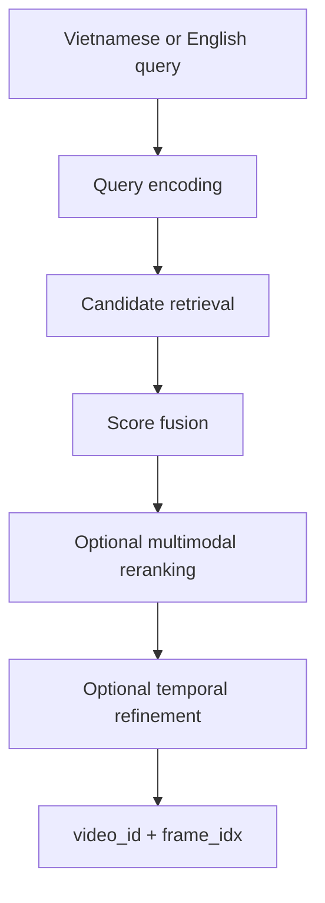

# HCMAI 2026 Frame Retrieval

HCMAI is a research-oriented video-frame retrieval project for the Ho Chi
Minh City AI Challenge 2026. The target interaction is a Vietnamese or
English natural-language query that returns the exact matching frame's
official `video_id` and `frame_idx`.

The project is being built as a small, measurable hackathon baseline. The
current code focuses on shared contracts, search orchestration, and reusable
utilities. Retrieval models and offline corpus processing will be added behind
those contracts.

## Current status

Implemented foundations:

- Pydantic 2 schemas for frames, enrichment, retrieval, search, evaluation,
  enums, and conversational feedback.
- `SearchEngine` orchestration with configurable `accurate` and `fast`
  profiles, optional reranking, response materialization, and latency fields.
- Utility helpers for YAML/JSON/Parquet I/O, image loading, timing, and
  logging.
- A Node.js frontend that remains the intended user interface.
- Lightweight schema tests and smoke-testable modules.

Still to implement:

- Video discovery, frame extraction, and canonical metadata generation.
- Multilingual image-text embeddings and FAISS candidate retrieval.
- Captioning, OCR, ASR, score fusion, and multimodal reranking.
- Offline evaluation runners and a production API boundary.

## Target retrieval flow



The design keeps expensive offline work separate from online search. Model
checkpoints, candidate counts, and search profile values belong in
configuration, while frame identifiers and API shapes belong in the shared
schemas.

## Repository structure

```text
frontend/                         Existing Node.js UI
src/hcmai/
├── search.py                     Search orchestration
└── common/
    ├── config.py                 Shared settings scaffolding
    ├── schemas/                  Pydantic contracts
    │   └── README.md              Schema documentation
    └── utils/                    Generic helpers
        └── README.md              Utility documentation
configs/                          Experiment and search configuration
data/                             Local corpus and metadata
artifacts/                        Generated embeddings and indexes
runs/                             Evaluation outputs
tests/                            Contract tests and smoke tests
```

The repository intentionally does not yet contain separate retriever,
enrichment, reranking, evaluation, or backend packages. Add them when a real
implementation is ready; do not create placeholder directories.

## Shared schemas

Use the contracts in [`src/hcmai/common/schemas`](src/hcmai/common/schemas)
instead of local dictionaries or duplicate dataclasses. The package documents
all models and enums in its [schema README](src/hcmai/common/schemas/README.md).

Key identifiers are:

- `frame_id`: globally unique and stable across pipeline reruns.
- `video_id`: source video identifier.
- `frame_idx`: authoritative frame index for submission.
- `timestamp_ms`: presentation timestamp for previews and temporal search.

`frame_idx` must not be inferred from `timestamp_ms * fps`; variable-frame-rate
videos and decoder behavior can make that mapping incorrect.

Example:

```python
from hcmai.common.schemas.search import SearchRequest

request = SearchRequest(query="một người đang đi bộ", top_k=20)
```

## Utilities

The [utility README](src/hcmai/common/utils/README.md) contains complete usage
examples. The available helpers are:

- `io.py`: `read_*` and `write_*` helpers for YAML, JSON, and Parquet.
- `image.py`: `load_image` for fully loaded, detached Pillow images.
- `timing.py`: `Timer` and `elapsed_ms` using a monotonic clock.
- `logging.py`: `configure_logging` and `get_logger`.

Install the libraries used by these helpers when needed:

```bash
pip install pyyaml pandas pyarrow pillow
```

The core project dependency is Pydantic 2. Update `pyproject.toml` whenever a
new runtime dependency becomes part of the supported baseline.

## Offline artifact contracts

Use `frame_id` as the join key across all artifacts:

| Path | Format | Purpose |
|---|---|---|
| `data/metadata/frames.parquet` | Parquet | Canonical searchable-frame metadata |
| `artifacts/enrichment/frame_enrichment.parquet` | Parquet | Caption/OCR/ASR evidence |
| `artifacts/embeddings/visual_embeddings.npy` | NumPy | Visual embedding matrix |
| `artifacts/embeddings/frame_mapping.parquet` | Parquet | Vector-to-frame mapping |
| `artifacts/indexes/visual.index` | FAISS | Searchable vector index |

Datasets, embeddings, model weights, indexes, and experiment outputs are local
artifacts and must not be committed to Git.

## Development principles

- Preserve exact frame mappings above all other optimizations.
- Prefer measurable experiments and per-query failure analysis.
- Keep one orchestration path for `accurate` and `fast` profiles.
- Keep model loading and index loading at application startup, not per request.
- Keep reusable logic in `src/hcmai`, not only in notebooks or scripts.
- Preserve and integrate the existing frontend; do not replace it with
  Streamlit or Gradio.
- Avoid enterprise infrastructure and abstractions outside the MVP scope.

## Verification

Run lightweight checks before submitting changes:

```bash
python -m compileall src
PYTHONPATH=src pytest
```

Unit tests should use small fixtures and fake retrieval components. They must
not require downloading large models or loading the full video corpus.
