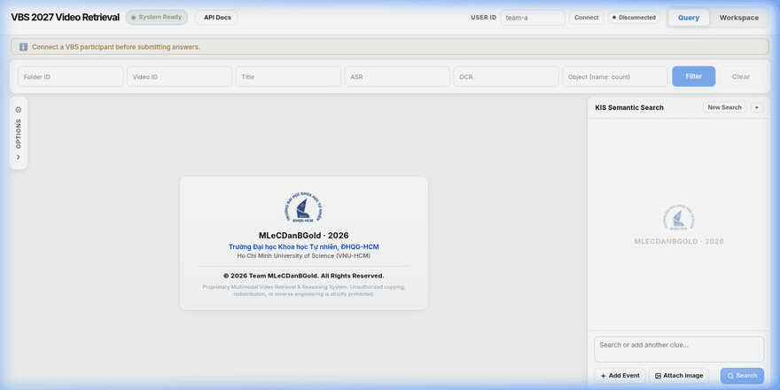

# MLeCDanBGold — Multimodal Video Retrieval for VBS & HCMAI

MLeCDanBGold is an interactive multimodal video retrieval and reasoning system developed by team MLeCDanBGold from Ho Chi Minh University of Science (HCMUS) for the **Video Browser Showdown (VBS)** and **HCMAI 2026**. It allows search operators to query large-scale video archives using natural language, image similarity, and metadata filters, inspect synchronized keyframe evidence, and submit validated answers directly to competition evaluation servers.

<p align="center">
  
</p>

---

## 1. What This Is

At video retrieval competitions, operators search across hundreds of thousands of video keyframes under strict time limits. MLeCDanBGold solves this through a multi-stage retrieval engine paired with an operator-first search interface:

- **Multimodal Retrieval**: Searches visual keyframes and multimodal evidence using dense visual embeddings (SigLIP2), multilingual text embeddings (BGE-M3), lexical BM25 search, and Reciprocal Rank Fusion (RRF) across specialist modalities (captions, OCR, detected objects, and timestamped ASR transcripts).
- **Competition Task Families**:
  - **KIS (Known-Item Search)**: Locate a target scene and submit its canonical `video_id` and millisecond `timestamp_ms`.
  - **AVS (Ad-hoc Video Search)**: Retrieve all video segments matching a visual activity description.
  - **VQA (Video Question Answering)**: Answer free-form or multi-choice natural-language questions grounded in video evidence.
  - **TRAKE**: Localize and align ordered sequences of temporal events across long video timelines.
- **DRES v2 Integration**: Connects directly to the Distributed Retrieval Evaluation Server (DRES), tracks active competition tasks, manages operator sessions, and submits point or range answers.

---

## 2. Running It

### Prerequisites

- **Python 3.11+** (tested with Python 3.12)
- **Node.js 18+** and **npm**
- **FFmpeg** (for video streaming and asset processing)

### Setup & Launch

#### 1. Environment & Dependencies

Clone the repository and set up the Python virtual environment (named `aic` per repository convention):

```bash
git clone https://github.com/khang1108/MLeCDanBGold.git
cd MLeCDanBGold

# Create and activate virtual environment
python3 -m venv aic
source aic/bin/activate

# Install backend dependencies
pip install --upgrade pip
pip install -e ".[embedding,reranking,dev]"

# Configure environment variables
cp .env.example .env
```

Ensure `.env` contains the correct paths to your frame metadata (`artifacts/frame_store/frames.parquet`), FAISS indexes (`artifacts/indexes/`), and any remote inference endpoints.

#### 2. Start Backend Services

Run the services in two separate terminals:

```bash
# Terminal 1: Retrieval Server (hosts SigLIP2 models, FAISS indexes, BM25, and rankers)
aic/bin/python -m hcmai.retrieval.serving.server --host 127.0.0.1 --port 8002
```

```bash
# Terminal 2: Public API Gateway (FastAPI server with route handling and session management)
aic/bin/python -m uvicorn hcmai.app:app --host 127.0.0.1 --port 8000 --reload
```

Verify backend health:

```bash
curl -s http://127.0.0.1:8000/health
# Expect: {"status":"ok","ready":true,"frame_store_loaded":true,"retriever_loaded":true,...}
```

#### 3. Start Frontend UI

In a third terminal:

```bash
cd frontend
npm ci
npm start
```

Open `http://localhost:3000` in your browser.

### VBS Participant Setup & Workspace Migration

Set `HCMAI_DRES_USERS_JSON` on the backend to map each VBS participant ID to that participant’s DRES credentials. In each browser, connect its own participant ID; the backend keeps independent private sessions and never sends a DRES session ID to the browser. Set `HCMAI_DRES_MEDIA_ID_PREFIX_TO_STRIP` only when DRES media names require an exact leading-prefix removal; the backend maps canonical `video_id` to `mediaItemName`.

Before a live round, test DRES submissions against the mock server. KIS and AVS submit one temporal answer per action using the selected `timestamp_ms`; VQA submits one text answer. Confirm the active task scope before sending, and freeze the deployed task configuration after the rehearsal.

Before upgrading an existing deployment, create a backup of `runtime/workspace.sqlite3` if its retired answer data may still be needed. Schema v3 removes the old answer workspace, candidate, submission-attempt, and submission-file storage while preserving `query_history` and its viewed-frame values. Submission-file storage is retired; the database remains for query history.

---

## 3. Running the Tests

### Backend Tests

Run unit and integration tests using `pytest` within the `aic` environment:

```bash
aic/bin/pytest -v
```

Healthy output example:

```text
tests/kis/test_initial_resolution_contract.py::test_initial_resolution_schema_contains_only_events PASSED
tests/kis/test_initial_resolution_contract.py::test_initial_event_rejects_text_over_240_characters PASSED
tests/kis/test_initial_resolution_contract.py::test_initial_resolution_rejects_too_many_events PASSED
tests/kis/test_initial_resolution_contract.py::test_legacy_initial_semantic_models_are_not_exported PASSED
============================== 4 passed in 0.39s ===============================
```

### Frontend Tests

Run the Jest test suite:

```bash
npm --prefix frontend test -- --watchAll=false
```

Healthy output example:

```text
Test Suites: 36 passed, 36 total
Tests:       240 passed, 240 total
Snapshots:   0 total
Time:        8.150 s
Ran all test suites.
```

---

## 4. How It's Built

The codebase is organized into backend services, retrieval pipelines, and a React frontend:

```text
HCMAI_2026/
├── src/hcmai/
│   ├── api/                 # FastAPI routers (/api/v1/kis, /api/v1/search, /health, DRES proxy)
│   ├── common/              # Shared data contracts, Pydantic schemas, and configuration
│   ├── data/                # FrameStore parquet reader and specialist evidence stores (OCR, ASR, Captions)
│   ├── retrieval/           # SigLIP2 visual embeddings, FAISS vector search, BM25, and RRF fusion
│   │   └── serving/         # Dedicated retrieval daemon running on port 8002
│   ├── temporal/            # Temporal alignment and sequence search (TRAKE)
│   ├── vbs/                 # DRES API client, participant authentication, and submission queue
│   └── app.py               # Application factory
├── frontend/                # React single-page application
│   ├── src/features/search/ # Search workspace, FilterBar, and keyframe grid
│   ├── src/features/kis/    # KIS assistant panel with query decomposition and event composer
│   ├── src/features/frames/ # FrameBox gallery, detail inspect modal, and submission controls
│   └── src/api/             # Typed HTTP client communicating with FastAPI backend
├── configs/                 # Baseline YAML configurations and modality weights
├── docs/assets/             # Visual demo recordings and architectural figures
├── tests/                   # Hand-checkable unit, contract, and integration tests
└── README.md
```

- **`src/hcmai/api/`**: Keeps routers thin. Dispatches incoming search queries to pipeline workflows and handles DRES answer forwarding.
- **`src/hcmai/retrieval/`**: Owns vector indexing, cross-modal embedding projection, and hybrid rank fusion. Preserves modality provenance for debugging.
- **`src/hcmai/temporal/`**: Localizes ordered events in time, materializing temporal candidates without rewriting frame IDs.
- **`frontend/`**: Interactive operator workspace with real-time query refinement, latency counters, and keyframe inspection.

---

## 5. Decisions & Invariants

1. **Decoupled Retrieval Serving**: Heavy model weights (SigLIP2, FAISS indexes, BM25 corpus) are isolated in `hcmai.retrieval.serving.server` (:8002). The public FastAPI backend (:8000) connects over HTTP, enabling fast frontend and router iteration with `--reload` without reloading multi-gigabyte models on code edits.
2. **Canonical Identity Invariants**: Frame identity (`video_id`, `frame_id`, `frame_idx`, `timestamp_ms`) is immutable across all ranking, reranking, and fusion stages. Deduplication never collapses distinct timestamps, and models cannot fabricate arbitrary IDs.
3. **Deterministic FrameContext**: Specialist evidence (OCR text, generated captions, detected object labels) is indexed separately and joined into a deterministic `FrameContext` view rather than lossily flattened into an anonymous text blob.
4. **Stateless Revisioned KIS Search**: Each search request explicitly provides an `expected_revision` and a semantic operation (`initial_resolve`, `patch_events`, `global_rewrite`, or `search_only`), guaranteeing reproducible state without server-side conversation leaks.
5. **Client-Private DRES Sessions**: DRES credentials remain secured in the backend (`HCMAI_DRES_USERS_JSON`). Operators connect via their participant ID, and the backend routes answers through that participant's private DRES session while logging retrieval interactions (`X-DRES-Log-Status`).

### Known Limitations

- **ASR Alignment**: Speech transcripts are indexed as timestamped temporal segments rather than frame-native tokens; speech proximate to a keyframe may describe background sound rather than on-screen objects.
- **Remote Inference Gateway**: When `HCMAI_LLM_BASE_URL` is unreachable or unconfigured, the system falls back to rule-based intent parsing without stopping core vector search.

---

## 6. VBS Competition Runbook

### Migration Archive Notice

Before migration, stop the backend and create a backup of `runtime/workspace.sqlite3` in a timestamped archive in the operator’s protected backup location. The legacy submission-file workflow and its stored data are retired by this migration; keep the archive in case an older deployment needs to be restored. Do not copy the database into the frontend or publish it with a public build.

### Prepare and Rehearse

1. On the backend only, set `HCMAI_DRES_BASE_URL` to the organizer’s test DRES endpoint and configure `HCMAI_DRES_USERS_JSON` as the mapping from each VBS `user_id` to its DRES username/password. Keep this JSON in a protected backend environment file or secret store. A browser submits only its VBS user ID; never put credentials or a DRES session in frontend configuration.
2. Verify every HCMAI `video_id` against the organizer’s exact DRES `mediaItemName`. Confirm `HCMAI_DRES_MEDIA_ID_PREFIX_TO_STRIP` against known media before setting it; do not infer the mapping from display labels or `frame_idx`. Save and review the verified mapping before rehearsal.
3. Start the backend against test DRES. In each browser, enter the assigned VBS user ID and wait for the connected state before opening the shared answer workspace. Confirm separate browsers converge on the same candidates. The official current-task response has no task ID: HCMAI derives a deterministic `task_scope_key` from its evaluation and task-template fields for internal workspace isolation only. DRES submissions send the freshly resolved `taskName`; the internal key is never sent upstream. Existing workspace DB v1 rows migrate as `legacy-unverified` and require an explicit clear-and-switch before use with a current official task.
4. Against test DRES, submit one KIS FRAME captured from live playback and one added from a FrameCard. Confirm the reviewed `timestamp_ms` is exact and DRES receives a point answer with `start == end`. Submit one VQA TEXT answer and confirm the answer contains text only. Add several AVS frames and confirm one ordered batch reaches DRES in a single request. DRES HTTP 200/202 success must include a verdict (`CORRECT`, `WRONG`, `INDETERMINATE`, or `UNDECIDABLE`); `accepted` means DRES processed the submission, not that the answer was correct.
5. With each assigned user connected to test DRES, run text search, image search, and Filter. Confirm the header and indicator report `Log sent`; make one controlled logging-failure check and confirm retrieval still displays results with `Last log failed`.
6. After the rehearsal passes, freeze the verified media mapping, evaluation settings, indexes, backend/frontend revisions, and non-secret environment configuration. Keep credentials in the backend secret store; each successful search is logged with the connected participant's DRES session.

---

## Authors & Intellectual Property

Developed by team **MLeCDanBGold** — **Ho Chi Minh University of Science, VNU-HCM (HCMUS)** for HCMAI and VBS.

Copyright © 2026 Team MLeCDanBGold. All Rights Reserved.
