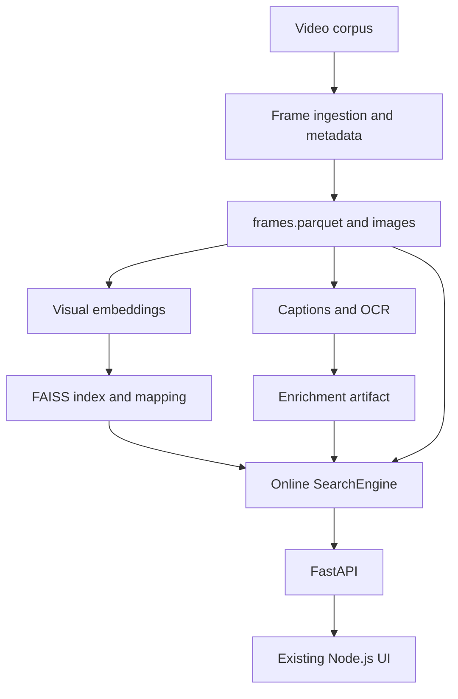
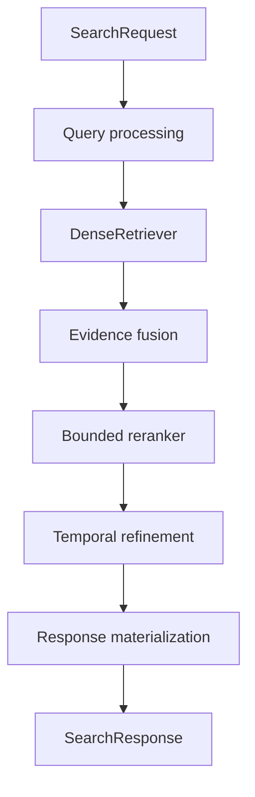

# HCMAI 2026 Project Architecture and Execution Specification

**Document owner:** Pkhanggg, AI Tech Lead  
**Project:** Ho Chi Minh City AI Challenge 2026 Frame Retrieval System  
**Document date:** 21 July 2026  
**Status:** Current architecture baseline and execution specification  

## 1. Purpose and interpretation of this document

This document reconstructs the HCMAI project as one coherent engineering and research program. It explains what the team is trying to win, what the system must do, how information moves from the original video corpus to the final competition identifier, which parts of the architecture are already real in the current workspace, which parts are approved designs waiting for implementation, how the five team members divide responsibility, and what evidence is required before a task can be considered complete.

The distinction between an implemented component and a planned component is essential. The current workspace contains the project documentation, the shared Pydantic contracts in `src/aic/schemas.py`, and the package initializer. The contracts compile and import successfully. The workspace does not currently contain `src/aic/search.py`, the data pipeline, retriever, enrichment pipeline, reranker, evaluation harness, FastAPI backend, Node.js frontend, configuration files, or tests. Nhố has reportedly submitted Data Engineer code, but that submission is not present in this workspace and is therefore treated here as **submitted but not yet integrated or verified**, not as part of the verified repository baseline.

The assignment spreadsheet contains 18 implementation tasks. At the time of this document, every Task Board row is marked “In Progress” and formulaically shown as 50%, while the Daily Plan says only Nhố’s Day-1 inventory and fixture work is done and most other daily items are not started. The Overview also reports zero tasks and zero hours per owner despite the Task Board containing assignments. Those are tracker inconsistencies, not engineering facts. This specification therefore treats status as evidence-based: a component is done only when its output exists, its prescribed test or benchmark has passed, and a reproducible handoff has been supplied.

## 2. Development goal and winning objective

The project must answer a Vietnamese or English natural-language description by finding the exact matching image frame in an approximately 80–100 GB video corpus. The system must return the official `video_id` and authoritative `frame_idx`, because those are the identifiers used for competition submission. Returning a visually similar frame without preserving the official mapping is a failure even when the displayed image appears correct.

The preliminary-round objective is maximum retrieval accuracy. The final-round objective adds strict warm-query latency because a human operator must search, inspect results, refine the query, and submit an answer under time pressure. These requirements lead to one system with two configuration profiles. The `accurate` profile retrieves a larger candidate pool, uses more evidence, and performs deeper multimodal reranking. The `fast` profile uses a smaller candidate pool, cached artifacts, and a lighter reranking path. The profiles must not become two independently maintained applications; they are two configurations of the same orchestrator.

The project is deliberately a hackathon research system rather than a production platform. It needs repeatable experiments, dependable frame mappings, replaceable models, and a usable search interface. It does not need authentication, distributed services, Kubernetes, a generalized plugin system, or an enterprise database layer. Complexity is justified only when it increases candidate recall, final ranking quality, reproducibility, or final-round speed.

The technical priority order is consequently fixed. Mapping correctness comes first. Reproducible evaluation comes second. Candidate recall and reranking accuracy come third. Warm-query latency comes fourth. Code elegance matters when it accelerates these goals, but it must not delay the working baseline.

## 3. Definition of the MVP

The MVP is an end-to-end text-to-frame retrieval loop. Before the event, the team inventories videos, extracts or ingests searchable frames, preserves official identifiers, generates thumbnails, computes multilingual visual embeddings, generates short captions and optional OCR evidence, builds a FAISS index, and records versioned artifact manifests. During a search, the backend receives a natural-language query, encodes it, retrieves candidate frames, optionally fuses caption or OCR evidence, reranks a bounded candidate set with a multimodal model, resolves metadata, and returns ranked frames to the existing Node.js interface.

The MVP also contains a controlled conversational Known-Item Search path, referred to as KISC. KISC is not an autonomous agent with an unbounded reasoning loop. It is a bounded state transformation. Each turn converts conversation history, the current correction or refinement, and selected or rejected frames into one explicit standalone query plus structured positive, negative, and uncertain constraints. The ordinary search pipeline then executes that resolved intent. This design makes KISC measurable and prevents conversational behavior from becoming an opaque replacement for retrieval.

Caption enrichment and OCR are offline evidence sources. ASR remains a stretch source until captioning, dense retrieval, reranking, and KISC resolution work. Temporal refinement is part of the intended pipeline, but it must use stored timestamps and authoritative frame mappings rather than calculating `frame_idx` from timestamp and FPS.

## 4. Current repository truth

The verified repository baseline is small. `README.md` describes the system mission, target architecture, artifact roles, API example, evaluation requirements, and the fact that the repository is in its initial architecture and contract-design stage. `AGENTS.md` defines the same mission as enforceable engineering rules, including ownership boundaries, artifact contracts, development discipline, and the definition of done. `src/aic/schemas.py` implements the canonical Pydantic 2 contracts, and `src/aic/__init__.py` establishes the package. A compile-and-import smoke check succeeds.

The implemented schemas cover search profiles, processing status, evidence sources, query language, task type, query difficulty, canonical frame metadata, enrichment metadata, search filters, public search requests, retrieval candidates, public score objects, stage-level latency, ranked search results, search responses, and evaluation queries. Extra unknown fields are rejected. Strings are stripped and validated. Identifier and numeric fields enforce non-empty and non-negative constraints. Search responses enforce that `total_results` equals the result count and does not exceed `top_k`.

The current schemas do not yet contain the KISC contracts named in the plan, such as `ConversationTurn`, `ConversationState`, `FrameFeedback`, `KISCSearchRequest`, and `KISCSearchResponse`. They also do not implement services that use the contracts. Because shared schemas affect every owner, Pkhanggg must define and approve the KISC additions before Khầy and Cr7 can complete their resolver and endpoint work.

The target directories shown in the documentation are intentional placeholders in the architecture, not evidence that modules exist. Directories should be created only with their first working implementation. This keeps the repository honest and prevents empty structure from being mistaken for progress.

## 5. System architecture

The system has an offline preparation plane and an online retrieval plane. The offline plane transforms large, expensive source data into compact, versioned artifacts that can be loaded once. The online plane performs only query-dependent work and reads those prepared artifacts. This separation is the main latency and reliability decision in the architecture.

### 5.1 Offline data plane

The data plane begins with corpus inventory. Every video or organizer-provided frame source must be discovered deterministically. The inventory records file counts, sizes, formats, durations, resolution, FPS or variable-frame-rate characteristics, audio availability, corrupt inputs, naming conventions, and the origin of the official identifiers. This inventory is not administrative documentation; it determines whether frame extraction can preserve submission mappings.

The ingestion pipeline then creates canonical searchable frames and thumbnails. When the organizer supplies extracted frames with authoritative indexes, those values are ingested directly. When frames must be decoded from video, `frame_idx` comes from the approved decoder sequence or official mapping. The pipeline stores presentation timestamp as `timestamp_ms`, but it never estimates frame index as `timestamp × FPS`. Variable-frame-rate video and decoder behavior make that estimate unsafe.

Each searchable frame becomes a `FrameRecord`. Its `frame_id` is a stable global key used across metadata, embeddings, enrichment, candidates, and API results. Its `video_id` identifies the source. Its `frame_idx` is the submission-critical index. Its `timestamp_ms` supports preview and temporal filtering. Its image and thumbnail paths point to binary image files. Width, height, optional shot identity, and anchor status support validation and later temporal refinement.

The data artifact is `data/metadata/frames.parquet`. Images remain JPEG or WebP files rather than being embedded in a database or Parquet. This design is economical for 60 GB or more of images, supports sequential offline jobs, avoids database cost, and lets online code load only metadata and requested files. A `FrameStore` loads the Parquet metadata once and exposes frame lookup, ordered batch lookup, neighbor retrieval within a video, and filter resolution. A database should be introduced only if profiling demonstrates a real metadata bottleneck that the in-memory store cannot handle.

### 5.2 Dense retrieval plane

The dense retrieval pipeline uses one multilingual image-text encoder, initially SigLIP2 Base or an approved equivalent. Offline, the encoder converts every searchable frame into a normalized vector. Online, the same checkpoint and preprocessing convert the query into a compatible vector. Compatibility is not merely dimensional: dataset version, checkpoint, preprocessing, normalization, data type, and vector count must be recorded together.

Vectors are stored in `visual_embeddings.npy`. Their semantic mapping is stored separately in `frame_mapping.parquet`, containing at least `vector_position`, `frame_id`, `video_id`, `frame_idx`, and `timestamp_ms`. `vector_position` must be continuous from zero through `N-1`. The embedding row count must equal the mapping row count. This prevents a high-speed index from silently returning the wrong official frame.

The first FAISS baseline is exact inner-product search using `IndexFlatIP` over normalized vectors. Exact search provides a correctness reference and allows the team to measure actual latency before considering IVF or product quantization. The FAISS artifact, its mapping, and a manifest are stored together under a versioned index directory. Loading code must refuse incompatible combinations rather than making a best-effort guess.

At query time, `DenseRetriever` encodes the query, searches the FAISS index, maps vector positions back to stable frame IDs, applies supported video and time filters, removes duplicates, and returns shared `RetrievalCandidate` objects. It records query encoding and index search latency separately. Raw FAISS arrays never escape into the orchestrator because doing so would leak storage details and make replacement difficult.

### 5.3 Enrichment plane

Caption enrichment addresses semantic descriptions that may be difficult for the base visual embedding. The initial captioner generates one concise global English or multilingual description per frame, with configurable prompts and decoding settings. The output joins to frames by `frame_id` and records model checkpoint, enrichment version, status, and error details. The team must test Vietnamese queries against the selected embedding and English captions before adding an automatic translation stage.

OCR is an independent channel, not text appended indiscriminately to captions. It targets signs, shop names, subtitles, jersey numbers, license plates, and other visible text. OCR must be optional, must preserve frame identifiers, and must report coverage and representative errors. Empty OCR output follows the frozen enrichment contract. ASR can later add nearby speech evidence, but it is intentionally behind the working caption, reranker, and KISC milestones.

The primary enrichment artifact is `artifacts/enrichment/<version>/frame_enrichment.parquet`, accompanied by a manifest and failures file. Its join cardinality is explicit. For the initial baseline, a frame and enrichment version should appear at most once.

### 5.4 Score fusion and multimodal reranking

Candidate retrieval answers whether the target is present in a broad candidate pool. Reranking answers whether the target becomes the top result. Those are evaluated separately because a reranker cannot recover a frame that the retriever never found.

Fusion combines visual, caption, OCR, and later ASR evidence without losing per-source scores or ranks. Model names, candidate counts, weights, and normalization choices belong in configuration. The baseline can begin with visual-only ordering and then add one evidence channel at a time. This creates clean ablations for both engineering decisions and the paper.

The multimodal reranker receives a query and a bounded list of existing candidates. It resolves images through `FrameStore`, scores query-image pairs in batches, adds reranker and final scores, and returns the same candidate identities in deterministic order. It does not scan the corpus. Missing images, corrupt images, GPU out-of-memory, timeout, or model failure must fall back to fusion or visual order so the API can still respond.

The initially proposed reranker is Qwen3-VL-Reranker-2B, with BLIP-ITM or another measured lightweight model as fallback. Checkpoint, precision, batch size, resolution, timeout, and maximum rerank depth are configuration values. The decisive evidence is improvement in final Recall@1 or MRR on an identical candidate set, accompanied by top-10, top-20, top-50, and top-100 latency.

### 5.5 Search orchestration

`src/aic/search.py` is owned by Pkhanggg and is the boundary that turns independent components into one system. `SearchEngine` accepts the canonical `SearchRequest`, processes the query, obtains candidates from a retriever, applies configured fusion, invokes a reranker when enabled, performs approved temporal refinement, resolves metadata, and constructs a canonical `SearchResponse`. It does not know the internal checkpoint code of any component.

The orchestrator records stage-level latency in the `SearchLatency` contract: query processing, query encoding, candidate retrieval, fusion, reranking, temporal refinement, materialization, and total time. Models and indexes are loaded outside request execution and reused. Fake components implement the same boundaries so API and UI work can progress before real artifacts exist.

### 5.6 Conversational KISC architecture

The browser owns temporary conversation history. Each KISC request sends ordered turns, the current message, prior interpreted state when used, and selected or rejected frames. The backend remains stateless and does not require a session database.

The `ConversationResolver` performs one bounded structured model call. It resolves pronouns, accumulating details, corrections, negation, contradictions, and feedback into a `ConversationState`. The state contains a standalone query, positive constraints, negative constraints, uncertain constraints, and selected or rejected frame IDs. If structured parsing fails, a deterministic fallback preserves the previous state, appends the latest message in a controlled way, and merges feedback. The resolver never calls retrieval itself.

`KISCAgent`, owned by Pkhanggg, composes resolver and search orchestration. It resolves the new state, searches using the explicit intent, excludes or penalizes rejected frames according to configuration, optionally combines cross-turn candidate evidence, and returns both ranked results and interpreted state for debugging. The research sequence compares latest-message-only, raw concatenation, structured rewriting, cross-turn score fusion, and rejection feedback. This provides a credible KISC contribution for the paper rather than an unverifiable claim that an “agent” performs better.

### 5.7 FastAPI and frontend

FastAPI is the stable HTTP boundary. Application startup loads `SearchEngine`, `FrameStore`, indexes, and online models once. `/api/v1/health` reports process liveness, while `/api/v1/readiness` reports whether required real components are loaded. `AIC_USE_FAKE_COMPONENTS=true` allows frontend and contract work without a GPU or corpus artifacts.

The standard API consists of `POST /api/v1/search`, frame metadata lookup, thumbnail serving, and full-image serving. Requests and responses use the shared Pydantic contracts. Frame endpoints resolve only IDs known to `FrameStore` and approved data roots, preventing path traversal. Expected errors are mapped to 404, 422, 503, or 504. Unexpected failures return a request ID without exposing a traceback.

The KISC endpoint is `POST /api/v1/kisc/search`. It validates turn ordering and passes state work to `KISCAgent`; the route itself does not mutate conversation state. Both standard and KISC providers obey the same fake/real contract boundary.

The existing Node.js frontend is preserved. It gains a typed API client, query controls, search mode and top-K selection, a ranked thumbnail grid, exact `video_id` and `frame_idx` display, timestamps, scores, stage latency, copy actions, lazy full-image loading, and visible-thumbnail prefetching. KISC mode adds history, refinement, promising/rejected frame actions, a new-conversation reset, and a development debug panel for the resolved query and constraints. The browser must preserve backend ranking and display `frame_idx` exactly as returned.

## 6. Canonical contracts and storage design

`src/aic/schemas.py` is the source of truth for Python and public API shapes. A component may have private implementation objects, but it must not create a competing `FrameRecord`, rename common fields, or return loosely shaped dictionaries at integration boundaries. Unknown fields are rejected deliberately so that accidental schema drift fails early.

| Artifact | Producer | Consumers | Integrity condition |
|---|---|---|---|
| `data/metadata/frames.parquet` | Data pipeline | Retrieval, enrichment, API | Stable unique `frame_id`; authoritative `(video_id, frame_idx)`; valid paths |
| `artifacts/enrichment/<version>/frame_enrichment.parquet` | Enrichment | Fusion and result materialization | Joinable by `frame_id`; version and failures recorded |
| `artifacts/embeddings/<version>/visual_embeddings.npy` | Dense encoder | Index builder | Row count, dimension, dtype, normalization, and checkpoint recorded |
| `artifacts/embeddings/<version>/frame_mapping.parquet` | Dense encoder | Index builder and retriever | `vector_position` is continuous and maps each vector to one frame |
| `artifacts/indexes/<version>/visual.index` | Index builder | Online retriever | Index size equals mapping rows and manifest versions agree |
| `runs/<experiment>/` | Evaluation runner | Tech Lead and paper | Exact config, metrics, predictions, latency, and failure cases retained |

This file-based design is intentional. Large images stay as image files, numerical vectors stay as NumPy arrays, and FAISS indexes stay as FAISS artifacts. Parquet stores structured metadata efficiently. A relational or vector database is unnecessary for the initial corpus because online retrieval already happens through FAISS and metadata can be cached in memory. The team should measure a bottleneck before adding database complexity.

The most important invariant is that every transformation preserves the path from a retrieved score to the official submission identifiers. A valid path is `FAISS position → frame_mapping row → frame_id → FrameRecord → video_id and frame_idx`. Each arrow must be testable. If an embedding array is rebuilt, its mapping and index must be rebuilt or version-checked with it.

## 7. Configuration, reproducibility, and profiles

Model checkpoints, artifact paths, image size, precision, batch size, candidate count, fusion weights, rerank depth, timeouts, and profile selection belong in configuration. Nothing that changes experimental behavior should be hidden as an unexplained constant in reusable code. Each experiment copies or serializes the effective configuration into its run directory.

The `accurate` profile should initially use exact dense retrieval with a larger candidate count, all validated evidence channels, and the strongest reranker that fits the latency budget. The `fast` profile should use the same artifact contracts with fewer candidates, cached query-independent information, and a measured lightweight reranker or rerank bypass. A profile is accepted only after both accuracy and P50/P95 warm latency are recorded on the same evaluation set and hardware description.

Expensive offline jobs must be resumable. A restart must not duplicate frame records, vectors, captions, or failures. Each artifact manifest records schema version, dataset version, checkpoint, preprocessing, creation time, count, and important numeric properties. Failures are explicit data, not missing rows that silently disappear.

## 8. Evaluation and paper-development system

Evaluation is not a final reporting activity. It is the control system for development. The evaluator must accept labelled `EvaluationQuery` records and ranked predictions, compute candidate and final metrics separately, record latency, and retain per-query failures. Candidate Recall@100 tells the team whether retrieval contains the answer. Final Recall@1 tells the team whether ranking selects it. Recall@5 and Recall@10 describe operator usefulness, MRR describes average target position, and P50/P95 latency describes interactive behavior and tail risk.

The development set should contain 50–100 representative labelled queries before large model comparisons begin. It should cover objects and scenes, actions and interactions, visible text, speech-dependent clues when available, temporal clues, visually similar hard negatives, Vietnamese and English variants, and 10–20 multi-turn KISC conversations. Each record preserves the authoritative target frame IDs and may additionally record temporal tolerance for diagnosis. Temporal tolerance helps distinguish “correct event, nearby sampled frame” from a completely wrong retrieval, but it does not replace the official exact-frame requirement.

The experiment sequence should establish visual-only dense retrieval first, then add captions, then OCR, then optional ASR, then multimodal reranking, then hybrid accurate and fast profiles, and finally KISC rewriting and cross-turn feedback. Each change is an ablation with one clear hypothesis. A model is not selected because sample outputs look impressive; it is selected because it improves the shared evaluation set at an acceptable cost.

Every run directory should contain an effective configuration, metrics, per-query predictions, failure categories, and a concise summary. The paper can then be written continuously from recorded decisions. The intended paper structure covers the task setting, data and frame processing, retrieval architecture, enrichment, reranking, conversational KIS, experiments, ablations, latency, failure analysis, limitations, and future work. Figures and tables should be generated from run artifacts rather than reconstructed from chat history.

The failure taxonomy should at minimum separate mapping failure, target absent from candidates, correct candidate ranked too low, OCR-dependent miss, temporal ambiguity, multilingual query failure, visually confusing hard negative, corrupt or missing artifact, and latency or resource failure. The next engineering task is chosen from the largest meaningful failure category rather than personal model preference.

## 9. Team ownership and integration policy

Pkhanggg is the AI Tech Lead and owns shared contracts, search orchestration, KISC agent composition, evaluation, experiment control, integration approval, and paper evidence. Nhố is the Data Engineer and owns corpus discovery, frame ingestion, metadata validation, thumbnails, and `FrameStore`. Fuvo is AI Engineer 1 and owns the dense encoder, batch embeddings, FAISS index, `DenseRetriever`, and dense baseline comparison. Khầy is AI Engineer 2 and owns captions, OCR, multimodal reranking, and the bounded KISC resolver. Cr7 is the Software Engineer and owns FastAPI lifecycle and routes plus integration with the existing Node.js interface.

Ownership reduces merge conflicts and makes handoffs explicit. It does not prohibit collaboration. Shared schema changes require Pkhanggg’s approval because they affect every component. A member may review another owner’s code, but changes to an actively owned area should be coordinated. Generated videos, images, Parquet datasets, embeddings, weights, and FAISS indexes do not enter Git.

## 10. Detailed assignments from the spreadsheet

The following sections explain the purpose, scope, expected output, and acceptance meaning of every task in the live assignment spreadsheet. The Task Board contains 18 implementer tasks. Pkhanggg’s parallel Tech Lead work is specified separately because the spreadsheet explicitly scopes its dashboard to implementers and contains only a handoff row for the Tech Lead.

### 10.1 Nhố — Data Engineer

#### DE-01: Inspect and report the complete corpus

DE-01 establishes what the system is actually processing. Nhố must discover every source video or organizer-provided frame directory and produce a reproducible inventory rather than a manually estimated count. The report records counts, total storage, formats, duration, resolution, FPS and variable-frame-rate behavior, audio availability, corrupt files, folder and filename conventions, and the official source of `video_id` and `frame_idx`. If official identifiers are ambiguous, the task stops and escalates to Pkhanggg; extraction is not allowed to invent a convention.

The inputs are dataset access, organizer guidance, and the shared `FrameRecord` contract. The outputs are `data/reports/corpus_inventory.json` for machine use and `data/reports/corpus_inventory.md` for review. Acceptance requires that every source file is represented, corrupt files are explicit, the command can recreate the report, and the official mapping rules are documented. This task is P0, estimated at six hours, and scheduled for Day 1. It is the gate for extraction policy and all model fixtures.

#### DE-02: Build resumable frame ingestion and thumbnail pipeline

DE-02 turns the corpus into searchable frame records. The pipeline must support either organizer-provided frames or approved video decoding. It preserves authoritative `frame_idx`, presentation timestamp, and video identity; generates deterministic `frame_id`; creates thumbnails; checkpoints per video; and records failures without losing progress on the rest of the corpus. It must be idempotent so the same input and configuration do not create new IDs or duplicate metadata.

The required inputs are the corpus inventory, Pkhanggg’s approved extraction policy, and `FrameRecord`. The expected outputs are frame images, thumbnails, `data/metadata/frames.parquet`, and `data/reports/extraction_report.json`. Acceptance requires unique `frame_id`, unique `(video_id, frame_idx)`, valid paths, a 50-frame manual source audit, and a successful interrupted-run resume. Deriving frame index from timestamp and FPS is a blocking failure. The task is P0, estimated at fourteen hours, spanning Days 1–3, with a small fixture required before the full corpus job.

#### DE-03: Implement FrameStore

DE-03 makes canonical frame metadata usable by the rest of the system. `FrameStore` must load validated metadata once and expose `get`, `get_many`, `get_neighbors`, and `filter_frame_ids`. `get_many` preserves caller order because embedding or candidate order must not be silently changed. Neighbor retrieval is sorted temporally and never crosses from one video into another. Filters use canonical metadata instead of recomputing frame relationships.

The input is the validated fixture `frames.parquet` plus the shared `FrameRecord` and `SearchFilters`. The deliverables are `src/aic/data/loader.py` and `tests/test_data_loader.py`. Acceptance uses a fixture with at least two videos, checks informative missing-ID errors, verifies within-video neighbors, and proves metadata is not reloaded per call. This is P0, estimated at eight hours, scheduled for Days 2–3. A database is not part of this task unless Pkhanggg approves it from measured evidence.

#### DE-04: Validate and freeze data artifacts

DE-04 is the quality gate before models consume the full corpus. Nhố must validate required columns and types, unique IDs, file existence, image decoding, dimensions, timestamp ordering, missing ranges, duplicates, corrupt images, and reconciliation between inventory, extraction report, files, and Parquet rows. A `--validate-only` mode must run without repeating extraction.

The outputs are `data/reports/validation_report.json` and a reproducible validation command implemented through `src/aic/data/validate.py` and the thin data script. Acceptance requires zero unexplained identifier collisions, an explicit list of invalid paths and corrupt files, reconciled counts, and repeatable validation. This P1 task is estimated at five hours and scheduled for Days 3–5. Its final report is required before the data artifact can be frozen for Fuvo, Khầy, and Cr7.

### 10.2 Fuvo — AI Engineer 1

#### AI1-01: Implement image-text encoder baseline

AI1-01 creates the common visual embedding boundary. Fuvo loads a configured SigLIP2 checkpoint once, supports batched image and text encoding, normalizes vectors, and exposes device, precision, image resolution, and batch size through configuration. The implementation must report throughput, query latency, memory usage, and embedding dimension and must record corrupt-image failures with frame context.

The first input is Nhố’s 100-frame fixture, not the full corpus. Deliverables are the encoder implementation in `src/aic/retriever/dense.py`, unit tests, and `runs/encoder_benchmark/metrics.json`. Acceptance requires finite deterministic vectors of correct shape, normalized norms near one, completion of the fixture without GPU-memory growth, and no CUDA or checkpoint loading at module import. This P0 task is estimated at eight hours and scheduled for Days 1–2.

#### AI1-02: Generate versioned, resumable frame embeddings

AI1-02 applies the validated encoder to canonical frames in deterministic order. The job batches images, checkpoints progress, records failures, and writes both the matrix and exact row mapping. Its manifest records dataset version, model checkpoint, preprocessing, dtype, dimension, vector count, normalization, and creation time. Restarting the job must not duplicate vectors or shift completed mappings.

The outputs are `visual_embeddings.npy`, `frame_mapping.parquet`, `manifest.json`, and `failures.json` under a versioned embedding directory. Acceptance requires equal embedding and mapping counts, continuous `vector_position`, no duplicate `frame_id`, and correct resume behavior. This P0 task is estimated at ten hours and scheduled for Days 2–3. It depends on AI1-01 and Nhố’s frame manifest.

#### AI1-03: Build and validate exact FAISS baseline

AI1-03 builds the retrieval index from normalized embeddings. The required first implementation is `IndexFlatIP`, serialized with the compatible mapping and manifest. Load-time validation checks dataset, checkpoint, dimension, normalization, and vector count. The benchmark records build time, artifact size, and CPU or GPU search latency when available. IVF or PQ is postponed until the exact baseline is measured.

The outputs are `visual.index`, the matching mapping, and a manifest under a versioned index directory, plus implementation and tests in `src/aic/retriever/index.py` and `tests/test_faiss_index.py`. Acceptance requires index count equality, valid returned positions, self-retrieval of fixture images at or near rank one, and a clear error on incompatible artifacts. This P0 task is estimated at eight hours and scheduled for Days 2–3.

#### AI1-04: Implement DenseRetriever contract

AI1-04 converts the encoder and index into the component consumed by `SearchEngine`. It accepts query text, `top_k`, and optional `SearchFilters`; encodes the query; searches FAISS; maps results to stable IDs; removes duplicates; applies video and permitted time filters; and returns shared `RetrievalCandidate` objects sorted by visual similarity. It records query encoding and index latency separately and never exposes raw FAISS tuples.

The outputs are the retriever implementation, unit tests, and a dense baseline run. Acceptance requires contract-compatible replacement of a fake retriever, valid IDs, working fixture filters, reported Candidate Recall@100, and warm-query latency without model reload. This P0 task is estimated at eight hours and scheduled for Days 3–4. It depends on the encoder, index, and Nhố’s `FrameStore`.

#### AI1-05: Freeze dense-retrieval baseline and comparison

AI1-05 produces the evidence for model selection. Fuvo evaluates the SigLIP2 exact-FAISS baseline and only then an optional challenger on the identical development set and configuration. The comparison records Recall@1, @5, @10, and @100, encoding throughput, index build time, P50 and P95 latency, GPU memory, artifact size, and per-query failure cases.

The deliverable is a reproducible run directory containing configuration, metrics, predictions, and failures. Acceptance means results are directly comparable and the selected baseline is justified by measured accuracy and latency. This P1 task is estimated at five hours and scheduled for Days 4–5. Pkhanggg must provide or freeze the evaluation set before the comparison is meaningful.

### 10.3 Khầy — AI Engineer 2

#### AI2-01: Implement resumable frame-caption baseline

AI2-01 creates semantic descriptions for frames. Khầy loads Florence-2 or the approved caption checkpoint once, generates concise captions in batches, exposes prompt and decoding settings through configuration, and outputs frame ID, caption, checkpoint, enrichment version, status, and error. The job skips already valid completed rows and records failures rather than omitting them.

The first input is the 100-frame fixture, followed by validated `frames.parquet`. Outputs are versioned `frame_enrichment.parquet`, `manifest.json`, and `failures.json`, with reusable code in `src/aic/enrichment/caption.py` and a thin generation script. Acceptance requires non-empty captions, no duplicate `(frame_id, enrichment_version)`, resume behavior, explicit failures, and recorded settings. This P0 task is estimated at eight hours and scheduled for Days 1–3. Detailed captions are not added until a concise-caption ablation demonstrates need.

#### AI2-02: Implement optional OCR evidence channel

AI2-02 adds visible-text evidence without contaminating the caption field. Khầy selects one OCR implementation, makes it configurable and disableable, normalizes text, keeps confidence or raw text when useful, and tests Vietnamese diacritics, numbers, signage, and subtitles. The report describes text coverage, average tokens, failures, and representative correct and incorrect examples.

The OCR fields join into the enrichment artifact, and `ocr_report.json` records the analysis. Acceptance requires that captions still work with OCR disabled, empty output follows the frozen contract, frame IDs never change, and at least twenty samples receive manual review. This P1 task is estimated at five hours and scheduled for Days 2–4. ASR must not displace reranking or KISC resolver work.

#### AI2-03: Implement batched multimodal reranker

AI2-03 improves final ordering of already retrieved candidates. Khầy scores query-image pairs using the configured Qwen3-VL reranker or approved fallback, resolves candidate images through `FrameStore`, preserves IDs and candidate count, adds reranker and final scores, and sorts deterministically. The implementation handles missing images, corrupt files, out-of-memory, and timeouts by returning a defined fallback order.

The deliverables are `src/aic/reranking/multimodal.py`, `tests/test_reranker.py`, and a reproducible baseline run. Acceptance requires identity preservation, deterministic output, measured Recall@1 or MRR impact on identical candidates, latency at rerank depths 10, 20, 50, and 100, and one-time model loading. This P0 task is estimated at ten hours and scheduled for Days 2–4. It depends on Fuvo’s candidates and Nhố’s `FrameStore`; it must never perform corpus-wide retrieval.

#### AI2-04: Implement bounded KISC conversation resolver

AI2-04 interprets conversation but does not orchestrate search. Khầy accepts history, current message, feedback, and optional prior state and returns a standalone query plus positive, negative, and uncertain constraints and selected or rejected frame IDs. It resolves pronouns, additions, corrections, negation, and contradictions using one structured model call. A deterministic fallback handles malformed output without exposing hidden reasoning.

The outputs are `src/aic/agents/kisc/resolver.py`, `tests/test_conversation_resolver.py`, and a baseline run. Acceptance requires at least twenty fixtures covering accumulation, pronouns, constraints, correction, contradiction, selected/rejected frames, malformed output, and empty history. Corrected constraints must replace stale ones. This P0 task is estimated at eight hours and scheduled for Days 3–5. It is blocked until Pkhanggg freezes the KISC schemas and resolver protocol.

### 10.4 Cr7 — Software Engineer

#### SWE-01: Create FastAPI lifecycle, health, readiness, and fake mode

SWE-01 establishes the server boundary and allows parallel frontend work. Cr7 creates the FastAPI application, loads `SearchEngine`, indexes, and online models during startup, reuses them across requests, configures development CORS, and adds health and readiness endpoints. Fake mode starts with `AIC_USE_FAKE_COMPONENTS=true` and requires no GPU or AI artifacts.

The outputs are `backend/main.py`, `backend/dependencies.py`, and `backend/fake_components.py`. Acceptance requires server startup in fake mode, correct readiness behavior, working `/docs` and `/openapi.json`, and proof that components are not reconstructed per request. This P0 task is estimated at six hours and scheduled for Days 1–2. Route functions delegate retrieval to `src/aic`.

#### SWE-02: Implement search and secure frame-serving endpoints

SWE-02 implements `POST /api/v1/search` plus frame metadata, thumbnail, and image endpoints. It validates canonical Pydantic requests and responses, delegates to `SearchEngine`, resolves frames through `FrameStore`, uses correct content types, adds request IDs, maps expected failures, and prevents arbitrary filesystem access.

Acceptance requires a response that validates against `SearchResponse`, a 404 for missing frames, rejection of path traversal, no browser-visible stack traces, and integration tests for both fake and real providers. The owned test is `tests/test_search_api.py`. This P0 task is estimated at eight hours and scheduled for Days 1–3. It depends on lifecycle work, the `FrameStore` contract, and Pkhanggg’s orchestrator.

#### SWE-03: Implement stateless KISC search endpoint

SWE-03 adds `POST /api/v1/kisc/search`. The request supplies ordered history, current message, and feedback; the route passes them to `KISCAgent` and returns interpreted state, results, and resolution latency. The backend does not retain session state. Turn ordering and IDs are validated, and fake mode supports the same response shape.

Acceptance requires an empty-history first turn, a later turn containing prior history, correct transport of rejected frame IDs, visible interpreted state, clear failure for inconsistent turns, and integration tests in `tests/test_kisc_api.py`. This P0 task is estimated at six hours and scheduled for Days 3–4. It depends on Pkhanggg’s KISC API contracts and agent plus Khầy’s resolver. The route must not edit state directly.

#### SWE-04: Connect existing Node.js UI to typed search API

SWE-04 preserves the existing frontend and adds a typed client rather than replacing the application. The UI provides query, top-K, and mode controls; loading and failure states; a ranked thumbnail grid; exact official identifiers; timestamp and score display; latency; copy actions; lazy full-frame loading; and prefetching for visible thumbnails. After contract freeze, generated OpenAPI types are preferred when practical.

Acceptance requires search without page reload, exact preservation of backend order and `frame_idx`, visible errors and loading states, lazy full-image fetches, and no regression of existing UI features. This P0 task is estimated at ten hours and scheduled for Days 1–4. Development begins against fake API behavior and later switches providers without UI contract changes.

#### SWE-05: Implement three-turn KISC conversation experience

SWE-05 adds conversational retrieval to the same interface. The browser tracks conversation ID, ordered history, current turn ID, prior interpreted state, and promising or rejected frame IDs. Users can refine, reject, mark promising, and start a new conversation. A development panel shows the standalone query and constraints. Duplicate submissions are prevented while a turn is processing, and new-conversation reset removes all previous state.

Acceptance is a manual end-to-end flow: Turn 1 returns results; Turn 2 refines them; a frame rejection reaches Turn 3; and starting a new conversation clears the prior history and feedback. This P0 task is estimated at eight hours and scheduled for Days 3–5. The frontend owns temporary history; a session database is explicitly out of scope.

### 10.5 Pkhanggg — AI Tech Lead parallel work

The live Task Board does not assign implementation rows to Pkhanggg, but the architecture depends on Tech Lead deliverables and the Handoffs sheet explicitly requires `SearchEngine` and `KISCAgent` providers by Day 4. These responsibilities must be tracked to prevent the team from completing isolated components that cannot be evaluated or integrated.

Pkhanggg’s first task is to freeze and govern contracts. This includes reviewing any requested change to `src/aic/schemas.py`, adding the missing KISC contracts, documenting artifact versions, and publishing canonical fake examples. Completion means every owner can implement without inventing fields and all schema tests pass.

The second task is the evaluation harness and development set. Pkhanggg must implement metrics and the evaluation runner, create or curate representative labelled queries, define failure categories, and ensure each experiment writes comparable configuration, predictions, metrics, latency, and failures. Completion means fake predictions can be evaluated before real retrieval is available and each teammate can run the same scoreboard.

The third task is `SearchEngine`. Pkhanggg must compose fake and real retriever/reranker components behind the shared contracts, instrument all stages, provide accurate and fast configurations, and ensure response materialization preserves official identifiers. Completion means Cr7 can replace fake providers with real providers without route changes.

The fourth task is `KISCAgent`. Pkhanggg must compose Khầy’s resolver with `SearchEngine`, define rejection and cross-turn evidence behavior, and implement deterministic fallbacks. Completion means a three-turn fixture produces valid structured state and ranked results without an unbounded loop or backend session storage.

The fifth task is experiment and paper control. Pkhanggg freezes the comparison matrix, reviews run evidence, chooses the baseline, maintains the architecture and paper outline, and converts measured ablations and failure analysis into paper sections. Completion means architectural claims cite a run artifact and every selected model has a reproducible justification.

The sixth task is integration leadership. Twice daily, Pkhanggg checks the next concrete artifact, contract changes, blockers, and validation evidence. At handoff, Pkhanggg verifies commands, paths, metrics, and known failures. The Tech Lead should not spend the sprint building an unrelated model while these shared gates remain open.

## 11. Five-day execution plan and dependency gates

Day 1 establishes a shared fixture and fake end-to-end shell. Nhố inventories the corpus and produces a reviewed 100-frame fixture. Fuvo proves image and text encoding on it. Khầy benchmarks caption and reranker feasibility on the same frames. Cr7 connects the existing UI to fake FastAPI. Pkhanggg freezes contracts and makes evaluation work on fake predictions. The Day-1 exit condition is that every component has stable inputs and outputs and the browser can demonstrate a contract-valid fake search.

Day 2 produces joinable offline artifacts and a complete fake API. Nhố implements sample extraction, thumbnails, and fixture `FrameStore`. Fuvo generates versioned sample embeddings and begins exact FAISS. Khầy creates joinable caption artifacts and begins the reranker. Cr7 completes standard search and frame endpoints with UI states. Pkhanggg implements the initial orchestrator and validates that all fixture artifacts preserve frame IDs.

Day 3 produces the first real end-to-end standard search. Nhố runs or starts the resumable corpus job and completes `FrameStore`. Fuvo finishes FAISS and `DenseRetriever`, reporting Candidate Recall@100 and latency. Khầy finishes the reranker baseline and begins KISC resolution. Cr7 replaces the fake standard provider with the real `SearchEngine`. Pkhanggg runs the first integrated evaluation and classifies failures.

Day 4 freezes the principal baseline and demonstrates KISC. Nhố validates and repairs artifacts. Fuvo tunes retrieval and produces a comparable baseline run. Khầy completes resolver fixtures and reranker tuning. Cr7 implements the KISC endpoint and conversation UI. Pkhanggg integrates `KISCAgent`, runs KISC ablations, and assigns fixes based on the largest measured failure categories.

Day 5 freezes reproducible artifacts and a demo-ready system. Nhố verifies rebuilding and supplies checksums and reports. Fuvo freezes the index and dense comparison. Khầy freezes model configs, fallbacks, and ablations. Cr7 packages the application and runs standard and KISC smoke tests. Pkhanggg selects accurate and fast profiles, verifies end-to-end mappings, collects final tables and figures, and records limitations and next experiments.

The critical handoff order is fixed. Nhố’s 100-frame fixture unblocks both AI engineers. Nhố’s validated frame manifest unblocks full embeddings, while `FrameStore` and images unblock reranking. Fuvo’s candidates and benchmark unblock real `SearchEngine` integration. Khầy’s reranker unblocks final ranking, and the resolver unblocks `KISCAgent`. Pkhanggg then hands `SearchEngine` and `KISCAgent` providers to Cr7. Cr7’s integrated demo enables system-level QA. Frozen artifacts, configurations, metrics, and known issues return to Pkhanggg for baseline selection and paper evidence.

## 12. Evidence-based task status and reporting

A spreadsheet status is not evidence by itself. “Not Started” means no implementation evidence exists. “In Progress” means there is a named file or artifact plus a reproducible command and partial result. “Blocked” names the missing dependency, its owner, and the decision or artifact required. “Done” means output and acceptance criteria have been verified.

Every end-of-day report must name exact task IDs, code or artifact paths, commands, test results, metrics, blockers, and the next intended output. “Working on retrieval” is not sufficient. “AI1-03 built an IndexFlatIP with 42,000 vectors; self-retrieval passed 98/100 fixtures; P95 CPU latency is 24 ms; manifest path is …” is sufficient evidence.

The current spreadsheet should be corrected before it is used as a management dashboard. Owner task-count and estimated-hour formulas in Overview currently evaluate to zero even though the Task Board contains assignments. Task Board rows all show 50% and “In Progress” despite the Daily Plan showing mostly “Not Started.” These values should be reconciled from real handoff evidence. The spreadsheet timezone is currently America/Los_Angeles rather than Asia/Ho_Chi_Minh; this has little impact while the plan uses Day 1–Day 5 labels, but it should be changed before date or timestamp formulas are introduced.

## 13. Verification gates

The data gate requires a reproducible small run, schema-valid `FrameRecord` rows, stable unique IDs, authoritative frame indexes, valid decodable files, manual source audits, idempotent reruns, resumability, and explicit errors. An incorrect `frame_idx` or unstable `frame_id` is always blocking.

The dense retrieval gate requires finite normalized embeddings, equal matrix and mapping counts, a compatible exact index, valid mapped candidates, Candidate Recall@100, warm latency, and no per-query model reload. The enrichment gate requires joinable versioned captions or OCR with explicit failures and resume behavior. The reranking gate requires candidate identity preservation, deterministic output, measured final-ranking uplift, bounded latency, and fallback behavior.

The orchestration gate requires valid canonical requests and responses, stage latency, accurate and fast configuration through one pipeline, and fake/real component parity. The API gate requires startup lifecycle, readiness, canonical validation, safe image serving, predictable errors, and integration tests. The frontend gate requires exact identifier display, preserved ranking, lazy full images, visible states, and a complete three-turn KISC demonstration.

The experiment gate requires a frozen evaluation set, identical comparisons, configuration and hardware capture, per-query predictions, failure categories, and candidate versus final metrics. The paper gate requires every reported improvement to link to the corresponding run and every major negative result to be recorded rather than discarded.

## 14. Immediate Tech Lead actions

The first immediate action is to integrate or obtain Nhố’s submitted branch or patch and review it against DE-01 through DE-04, beginning with the 100-frame fixture. Until that code is in the shared repository and its output passes the mapping audit, Fuvo and Khầy should not run expensive full-corpus jobs.

The second immediate action is to correct the task tracker. Pkhanggg should replace placeholder 50% states with evidence-backed statuses, repair Overview formulas, confirm the Day-1 fixture handoff, and record links or paths for Nhố’s submission. This resolves the information problem that prompted this document.

The third immediate action is to add Tech Lead work to the tracker. Contract freeze, KISC schemas, evaluation harness, development queries, `SearchEngine`, `KISCAgent`, integration validation, experiment matrix, and paper outline must be visible tasks with acceptance evidence. Otherwise the team can appear fully assigned while the central integration path has no tracked owner work.

The fourth immediate action is to produce the first system checkpoint: a canonical fixture, fake retriever and reranker, a working `SearchEngine`, an evaluation run on fake predictions, and a fake API/UI query. This checkpoint allows every member to integrate against stable behavior while real artifacts arrive.

## 15. Sprint success definition

The sprint succeeds when the team can take a Vietnamese or English query, return ranked real frames through the Node.js interface, and trace every displayed result to a correct official `video_id` and `frame_idx`. `frames.parquet` must pass validation without unexplained collisions. Dense retrieval must search a compatible real FAISS index and report Candidate Recall@100. Enrichment must join through `frame_id`. Reranking must have measured final-ranking impact. KISC must produce valid structured state. Standard and conversational endpoints must pass integration tests. The interface must complete a three-turn conversation. Online components must load once. Every artifact must record its dataset and model version. Every claimed result must be reproducible from a command and run directory.

Winning is not defined by having the most models. It is defined by maintaining high candidate recall, converting that recall into top-ranked exact frames, preserving submission mappings, learning quickly from per-query failures, and operating fast enough for the live round. This architecture and task plan are designed to make those properties measurable every day.

## Appendix A. Authoritative team mapping

| Member | Role | Primary ownership |
|---|---|---|
| Pkhanggg | AI Tech Lead | Contracts, orchestration, evaluation, KISC agent, experiment and paper control |
| Nhố | Data Engineer | Corpus, extraction, metadata, thumbnails, validation, FrameStore |
| Fuvo | AI Engineer 1 | Encoder, embeddings, FAISS, DenseRetriever, dense benchmarking |
| Khầy | AI Engineer 2 | Captions, OCR, reranking, KISC resolver |
| Cr7 | Software Engineer | FastAPI, secure frame serving, typed Node.js UI, KISC UX |

## Appendix B. Source-of-truth hierarchy

When two sources disagree, official competition identifier guidance and organizer data mappings take precedence. The canonical Pydantic schemas and approved artifact manifests define system contracts. Verified repository code and test output define implementation status. Run directories define experimental results. The assignment spreadsheet defines ownership and intended schedule, but status is trusted only when it references the required evidence. Chat summaries and informal messages are context, not a substitute for these artifacts.
