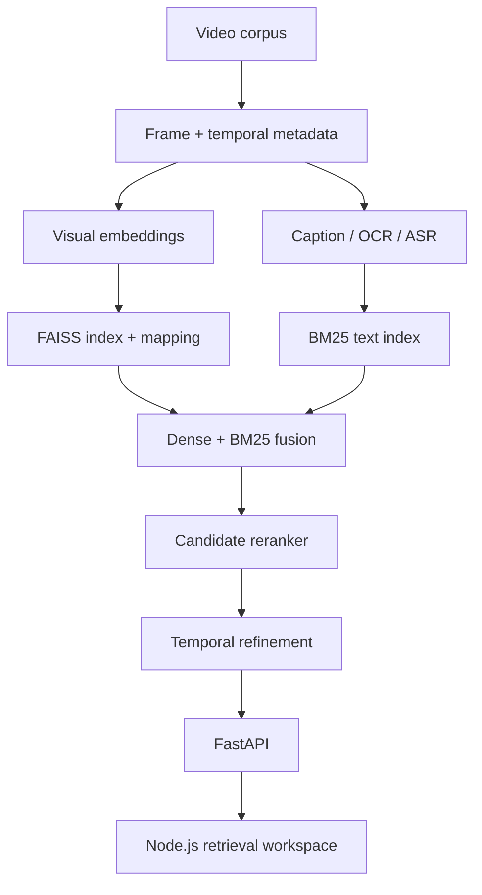
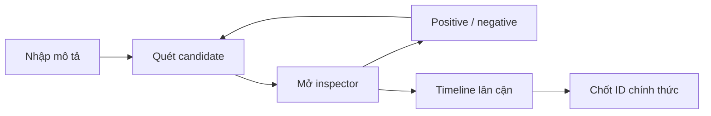
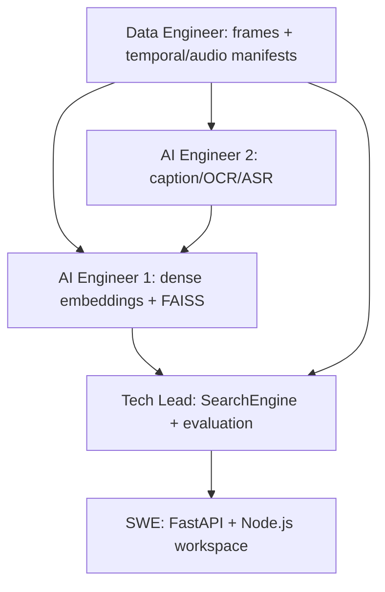

# HCMAI 2026 — Tổng hợp thiết kế, kế hoạch, kiến trúc và phân công

**Dự án:** Hệ thống truy xuất frame cho Ho Chi Minh City AI Challenge 2026  
**Chủ sở hữu tài liệu:** Pkhanggg — AI Tech Lead  
**Ngày tổng hợp:** 22/07/2026  
**Trạng thái:** Tài liệu bàn giao tổng hợp; các quyết định mới nhất được ưu tiên  
**Ngôn ngữ làm việc:** Tiếng Việt; giữ thuật ngữ kỹ thuật tiếng Anh khi cần

---

## 1. Mục đích tài liệu

Tài liệu này gom lại thành một nguồn duy nhất các thông tin đã được thảo luận và thống nhất trong cuộc hội thoại về HCMAI 2026:

- Mục tiêu cuộc thi và định nghĩa MVP.
- Nguyên tắc thiết kế hệ thống.
- Kiến trúc offline và online.
- Schema và artifact contract.
- Chiến lược lưu trữ cho corpus ảnh/video lớn.
- Dense retrieval, BM25, score fusion, enrichment và reranking.
- Search orchestration, evaluation và experiment tracking.
- FastAPI, Node.js UI và trải nghiệm KISC.
- Vai trò của agent-chat trong sản phẩm.
- Phân công đội ngũ, handoff và tiêu chí nghiệm thu.
- Trạng thái đã xác nhận, giả định và các quyết định còn mở.

Đây không phải transcript nguyên văn. Đây là bản trích xuất có cấu trúc để team có thể đưa xuống local, dùng làm architecture baseline, implementation plan và tài liệu handoff.

### Quy tắc khi có mâu thuẫn

Thứ tự ưu tiên:

1. Quy định chính thức của cuộc thi và mapping do ban tổ chức cung cấp.
2. Quyết định mới nhất của AI Tech Lead/người dùng trong hội thoại.
3. Canonical contract trong `src/aic/schemas.py`.
4. Artifact manifest đã được freeze và kiểm chứng.
5. Code và test đã chạy thành công.
6. Tài liệu kế hoạch cũ, spreadsheet và ghi chú hội thoại.

Các quyết định mới nhất đã override kế hoạch cũ:

- **AI Engineer 1 hiện sở hữu BM25 retriever và reranker.**
- **AI Engineer 2 tập trung vào caption, OCR và ASR evidence.**
- **Data Engineer đã hoàn thành inventory, extraction, QA và handoff ban đầu theo xác nhận của người dùng; nhiệm vụ tiếp theo là temporal data layer, versioning và coverage diagnostics.**
- **Sản phẩm không dùng chat-only. Thiết kế hiện hành là hybrid agent + retrieval workspace.**

---

## 2. Bài toán và mục tiêu chiến thắng

Đầu vào là một truy vấn ngôn ngữ tự nhiên bằng tiếng Việt hoặc tiếng Anh. Hệ thống phải tìm đúng frame tương ứng trong corpus video khoảng 80–100 GB và trả về:

- `video_id` chính thức.
- `frame_idx` chính thức.
- Ảnh/frame để người thi kiểm tra trực quan.

Một ảnh nhìn có vẻ đúng nhưng mapping sai vẫn là kết quả sai. Vì vậy, tính đúng của identifier quan trọng hơn mọi tối ưu latency nhỏ.

### Thứ tự ưu tiên kỹ thuật

1. Giữ đúng `frame_id`, `video_id` và `frame_idx` qua mọi pipeline stage.
2. Experiment phải đo được và tái lập được.
3. Tăng Candidate Recall@K.
4. Tăng chất lượng final ranking sau reranking.
5. Giảm warm-query latency cho vòng thi trực tiếp.
6. Cải thiện code elegance khi nó giúp các mục tiêu trên nhanh hơn.

### Hai search profile

| Profile | Mục tiêu | Hành vi |
|---|---|---|
| `accurate` | Accuracy cao nhất | Candidate pool lớn, nhiều evidence, rerank sâu |
| `fast` | Latency thấp | Candidate pool nhỏ, rerank nhẹ hoặc bỏ qua |

Hai profile phải dùng chung một orchestration pipeline và chỉ khác configuration. Không duy trì hai code path riêng.

---

## 3. Phạm vi MVP

MVP là một hệ thống text-to-frame retrieval hoàn chỉnh:

1. Chuẩn bị frame và metadata offline.
2. Tạo multilingual visual embeddings.
3. Xây FAISS index và mapping chính xác.
4. Tạo caption, OCR và ASR evidence offline.
5. Xây BM25 index trên evidence dạng text.
6. Truy xuất candidate từ dense và BM25.
7. Fuse các candidate và score.
8. Rerank một tập candidate giới hạn.
9. Mở rộng theo thời gian quanh frame tiềm năng.
10. Trả kết quả qua FastAPI cho Node.js UI.
11. Cho người thi duyệt, feedback và chốt `video_id/frame_idx`.

### Ngoài phạm vi MVP

- Authentication và user management.
- Microservices.
- Kubernetes.
- Distributed database hoặc message queue.
- Enterprise permission system.
- Generalized plugin framework.
- Thay frontend hiện có bằng Streamlit hoặc Gradio.
- Agent tự trị với vòng lặp không giới hạn.

---

## 4. Trạng thái repository đã kiểm tra

Tại thời điểm tổng hợp, workspace hiện có:

- `AGENTS.md` chứa quy tắc kiến trúc và phát triển.
- `README.md` mô tả mission, target architecture và API baseline.
- `src/aic/schemas.py` chứa canonical Pydantic 2 contracts.
- `src/aic/__init__.py`.
- Bản đặc tả kiến trúc tiếng Anh trước đó.
- Workbook phân công và các ảnh visualization của task board.

Các module implementation chính như `search.py`, data pipeline, retriever, enrichment, reranker, evaluation, FastAPI backend và frontend không xuất hiện trong snapshot workspace này.

Người dùng đã xác nhận Data Engineer hoàn thành inventory, extraction, QA và handoff. Vì code/artifact đó không có trong snapshot hiện tại, trạng thái đúng cần ghi là:

> Đã hoàn thành theo xác nhận quản lý, nhưng chưa thể xác minh từ workspace hiện tại. Khi tích hợp local cần gắn branch/commit/artifact path và validation report tương ứng.

Không dùng trạng thái spreadsheet kiểu “50%” làm bằng chứng hoàn thành. Một task chỉ Done khi có output, command tái lập và acceptance evidence.

---

## 5. Kiến trúc tổng thể

Hệ thống được tách thành hai plane:

- **Offline preparation plane:** xử lý corpus nặng một lần, sinh artifact có version.
- **Online retrieval plane:** chỉ làm công việc phụ thuộc query và load artifact một lần khi startup.



### Online request path


Mọi model và index online phải load một lần ở application startup, không load lại trên mỗi request.

---

## 6. Thiết kế dữ liệu và lưu trữ

### 6.1 Vì sao không lưu 60 GB ảnh trong database

Thiết kế baseline không lưu binary image vào database:

- Ảnh giữ dưới dạng JPEG/WebP trên filesystem/object storage local của máy thi.
- Metadata dùng Parquet.
- Vector dùng NumPy array.
- Index dùng native FAISS artifact.
- Online retrieval dùng FAISS và cache metadata trong memory.

Cách này giảm chi phí, đơn giản hóa pipeline và phù hợp hackathon. Chỉ thêm relational/vector database nếu profiling chứng minh metadata lookup hiện tại là bottleneck thực tế.

### 6.2 Canonical artifact contracts

| Artifact | Producer | Consumer | Điều kiện toàn vẹn |
|---|---|---|---|
| `data/metadata/frames.parquet` | Data pipeline | Retrieval, enrichment, API | `frame_id` duy nhất; mapping chính thức |
| `artifacts/enrichment/frame_enrichment.parquet` | AI Engineer 2 | BM25, fusion, UI | Join bằng `frame_id`; model/version rõ |
| `artifacts/embeddings/visual_embeddings.npy` | Dense encoder | Index builder | Row count và dimension đúng |
| `artifacts/embeddings/frame_mapping.parquet` | Dense encoder | FAISS retriever | `vector_position` liên tục và đúng frame |
| `artifacts/indexes/visual.index` | Index builder | Online search | `ntotal` khớp mapping |
| BM25 index + manifest | AI Engineer 1 | Hybrid retrieval | Dataset/enrichment version tương thích |
| Dataset snapshot manifest | Data Engineer | Mọi pipeline | Hash và version thống nhất |
| `runs/<experiment>/` | Evaluation | Tech Lead/paper | Config, metrics, predictions, failures |

### 6.3 Join key và mapping invariant

`frame_id` là join key toàn cục. Đường đi phải kiểm thử được:

```text
FAISS vector position
  -> frame_mapping.parquet
  -> frame_id
  -> frames.parquet
  -> video_id + authoritative frame_idx
```

Không bao giờ tính:

```text
frame_idx = timestamp * fps
```

Video variable-frame-rate và hành vi decoder có thể khiến công thức này sai.

---

## 7. Canonical schemas hiện có

`src/aic/schemas.py` là nguồn sự thật cho contract Python và API. Các model hiện có:

| Model | Vai trò |
|---|---|
| `ContractModel` | Cấm field lạ, strip string |
| `SearchMode` | `fast`, `accurate` |
| `ProcessingStatus` | Trạng thái offline job |
| `RetrievalSource` | `visual`, `caption`, `ocr`, `asr` |
| `QueryLanguage` | `vi`, `en`, `mixed`, `other` |
| `TaskType` | Textual KIS, Video KIS, ad-hoc, VQA |
| `QueryDifficulty` | Easy, medium, hard |
| `FrameRecord` | Metadata canonical của frame |
| `FrameEnrichment` | Caption/OCR/ASR/object evidence |
| `SearchFilters` | Filter video/time/min score |
| `SearchRequest` | Request search công khai |
| `RetrievalCandidate` | Candidate giữa pipeline stages |
| `SearchScores` | Score theo từng nguồn và final |
| `SearchLatency` | Latency theo stage |
| `SearchResult` | Một kết quả frame có identifier |
| `SearchResponse` | Response search đầy đủ |
| `EvaluationQuery` | Query có nhãn phục vụ benchmark |

### 7.1 Trường quan trọng của `FrameRecord`

```text
schema_version
dataset_version
frame_id
video_id
frame_idx
timestamp_ms
image_path
thumbnail_path
width
height
shot_id
is_anchor
```

### 7.2 Trường quan trọng của `RetrievalCandidate`

```text
frame_id
source_scores
source_ranks
fusion_score
reranker_score
final_score
metadata
```

Không tạo dictionary hoặc dataclass cạnh tranh với các contract này ở integration boundary.

### 7.3 Contract cần đề xuất thêm cho KISC workspace

Các schema sau mới là proposal và cần AI Tech Lead duyệt trước khi sửa `schemas.py`:

```python
class SearchSessionCreate(ContractModel):
    initial_query: NonEmptyString | None = None
    search_mode: SearchMode = SearchMode.ACCURATE
    top_k: int = Field(default=40, ge=1, le=100)


class SearchFeedback(ContractModel):
    positive_frame_ids: list[NonEmptyString] = Field(
        default_factory=list
    )
    negative_frame_ids: list[NonEmptyString] = Field(
        default_factory=list
    )
    excluded_video_ids: list[NonEmptyString] = Field(
        default_factory=list
    )


class SearchTurnRequest(ContractModel):
    query: NonEmptyString | None = None
    feedback: SearchFeedback = Field(default_factory=SearchFeedback)
    search_mode: SearchMode = SearchMode.ACCURATE
    top_k: int = Field(default=40, ge=1, le=100)


class FrameNeighborResponse(ContractModel):
    anchor_frame_id: NonEmptyString
    video_id: NonEmptyString
    frames: list[FrameRecord]
```

Thiết kế cũ từng đề xuất browser giữ toàn bộ KISC state và gọi một stateless `/api/v1/kisc/search`. Thiết kế UI mới đề xuất search session + turns. Với MVP trên một VM, session có thể giữ trong memory, không cần Redis. Tech Lead cần freeze một phương án contract duy nhất trước khi SWE triển khai.

---

## 8. Data pipeline và temporal data layer

### 8.1 Các phần Data Engineer đã được xác nhận hoàn thành

- Corpus inventory.
- Kiểm tra format và video lỗi.
- Frame extraction hoặc ingestion.
- Mapping `video_id/frame_idx`.
- Metadata và image artifact.
- QA dataset.
- Fixture/handoff cho AI engineers.
- Cơ chế resumable ở mức cơ bản.

Các mục này cần được gắn bằng chứng khi đưa vào repository chung.

### 8.2 Milestone tiếp theo của Data Engineer

> Xây dựng retrieval-oriented temporal data layer để từ một frame tiềm năng có thể tìm đúng các frame lân cận, mở đúng đoạn video, liên kết ASR và kiểm tra compatibility của mọi artifact.

#### A. Video/shot metadata

Artifact cần có:

- `video_id`.
- Shot boundary.
- Khoảng `frame_idx` chính xác.
- Anchor frame đại diện.
- Quan hệ frame trước/sau.
- `timestamp_ms`.
- Source video path.

#### B. Temporal neighbor lookup

```python
def get_neighbors(
    frame_id: str,
    before_ms: int,
    after_ms: int,
    limit: int,
) -> list[FrameRecord]:
    ...
```

Yêu cầu:

- Không đi sang video khác.
- Sắp theo metadata thời gian chính thức.
- Không suy ra frame index từ FPS.
- Phục vụ timeline, local expansion và reranker context.

#### C. Audio/ASR preparation

Data Engineer chuẩn bị:

- Script extract audio.
- Mapping audio với `video_id`.
- Timestamp-preserving audio chunks.
- Resumable manifest.
- Báo cáo video không audio hoặc extract thất bại.

ASR segment ánh xạ bằng:

```text
video_id + start_timestamp_ms + end_timestamp_ms
```

AI Engineer 2 chịu trách nhiệm chạy ASR model và tạo text evidence.

#### D. Dataset snapshot manifest

```json
{
  "dataset_version": "frames-v1",
  "schema_version": "1.0",
  "extraction_config_hash": "...",
  "source_inventory_hash": "...",
  "frame_count": 123456,
  "video_count": 1000,
  "failed_video_count": 2,
  "created_at": "..."
}
```

Manifest phải ngăn kết hợp nhầm frame dataset A với embedding/index/enrichment của dataset B.

#### E. Coverage diagnostics

Phân biệt rõ:

1. Khoảnh khắc đúng chưa được extract.
2. Frame đúng đã extract nhưng chưa embed.
3. Frame đúng thiếu caption/OCR/ASR.
4. Retriever không đưa frame đúng vào candidate pool.
5. Candidate đúng bị reranker xếp thấp.
6. Tìm đúng vùng thời gian nhưng chưa chọn exact frame.

Data Engineer sở hữu nguyên nhân 1–2 và báo cáo coverage theo video.

#### F. Extraction-policy ablation

So sánh:

- Uniform sampling hiện tại.
- Sampling dày hơn.
- Shot-boundary anchors.
- Anchors + temporal expansion.
- Uniform + shot-aware sampling.

Không thay dataset chính thức khi chưa có evidence cải thiện retrieval đủ lớn so với chi phí storage và compute.

---

## 9. Dense retrieval và FAISS

Baseline đề xuất dùng multilingual image-text encoder như SigLIP2 Base hoặc model được duyệt.

### 9.1 Offline image embedding

- Load model một lần.
- Batch image inference.
- Dùng cùng checkpoint, preprocessing, precision và normalization với online query encoder.
- Không download model hoặc cấp phát GPU lúc import module.
- Ghi manifest: dataset version, checkpoint, dtype, dimension, normalization, preprocessing, row count.

Với cosine similarity, normalize cả image và text embeddings:

```python
embeddings = torch.nn.functional.normalize(
    embeddings.float(),
    p=2,
    dim=-1,
)
```

Sau đó dùng inner-product index.

### 9.2 FAISS baseline

Baseline đầu tiên là `IndexFlatIP` để có correctness reference. Chỉ thử IVF/PQ sau khi đo exact baseline.

Acceptance:

- `index.ntotal` bằng số row trong mapping.
- Dimension khớp embedding.
- `vector_position` liên tục từ 0 đến N-1.
- Self-retrieval fixture ở rank đầu hoặc gần đầu.
- Load-time validation từ chối artifact không tương thích.
- Warm-query latency được đo riêng.

### 9.3 Error handling model loader

Không bọc toàn bộ model loading trong một `except ImportError`. Cần phân biệt:

- Thiếu package.
- Checkpoint không tồn tại hoặc không tương thích.
- Download lỗi.
- CUDA out-of-memory.
- Architecture không được hỗ trợ.

---

## 10. BM25 retriever — AI Engineer 1

BM25 index caption, OCR và ASR text để bổ sung cho dense retrieval.

### 10.1 Interface đề xuất

```python
class BM25Retriever:
    def search(
        self,
        query: str,
        top_k: int,
    ) -> list[RetrievalCandidate]:
        ...
```

### 10.2 Yêu cầu

- Index caption, OCR và ASR riêng hoặc có configurable weights.
- Hỗ trợ tokenization tiếng Việt và tiếng Anh rõ ràng.
- Giữ nguyên `frame_id`, `video_id`, `frame_idx` chính thức.
- Build offline; không build trong API request.
- Load index một lần khi startup.
- Trả raw BM25 score trước fusion.
- Không drop frame khi thiếu một evidence field.
- Ghi metadata/version của index.
- Phát hiện enrichment/frame dataset không tương thích.

### 10.3 Ablation đầu tiên

1. Caption-only BM25.
2. Caption + OCR.
3. Caption + OCR + ASR.
4. Dense-only.
5. Dense + BM25 fusion.

---

## 11. Fusion và reranking — AI Engineer 1

### 11.1 Nguyên tắc

- Retrieval tạo candidate pool.
- Fusion hợp nhất nguồn evidence và loại duplicate frame.
- Reranker chỉ sắp lại candidate có sẵn; không scan corpus.
- Candidate identity không được thay đổi.
- Raw source score/rank phải được giữ để debug và evaluation.

### 11.2 Reranker interface

```python
class Reranker:
    def rerank(
        self,
        query: str,
        candidates: list[RetrievalCandidate],
        top_k: int,
    ) -> list[RetrievalCandidate]:
        ...
```

### 11.3 Baseline và hướng mở rộng

Baseline nên bắt đầu đơn giản bằng text cross-encoder trên query và frame enrichment text. Cách này dễ tích hợp và benchmark hơn VLM lớn. Sau đó mới thử multimodal reranker như Qwen3-VL-Reranker-2B hoặc BLIP-ITM khi candidate recall đã ổn.

### 11.4 Yêu cầu reranker

- Batched inference.
- Configurable checkpoint, batch size, device, precision và rerank depth.
- Load model một lần.
- Có `reranker_score` riêng.
- Tie-breaking deterministic.
- Có fake reranker cho test.
- Có thể disable theo profile.
- Fallback về fusion order khi missing image, timeout, OOM hoặc model failure.

### 11.5 Experiment matrix bắt buộc

| ID | Candidate source | Reranker |
|---|---|---|
| R00 | Dense | None |
| R01 | BM25 | None |
| R02 | Dense + BM25 | None |
| R03 | Dense | Reranker |
| R04 | BM25 | Reranker |
| R05 | Dense + BM25 | Reranker |

Mỗi experiment báo cáo Candidate Recall@10/50/100, Final Recall@1/5/10, MRR, latency từng stage, P50/P95 tổng, predictions per query, failure category và exact artifact versions.

---

## 12. Enrichment — AI Engineer 2

AI Engineer 2 tạo evidence offline để retrieval và reranking sử dụng.

### 12.1 Caption

- Caption ngắn, mô tả global content của frame.
- Configurable model, prompt và decoding settings.
- Batch và resume.
- Record `frame_id`, model, version, status, error.
- Không bỏ row thất bại một cách im lặng.

### 12.2 OCR

- Kênh độc lập với caption.
- Nhắm tới bảng hiệu, subtitle, jersey number, biển số và text trong cảnh.
- Test tiếng Việt có dấu, số và signage.
- OCR có thể disable.
- Empty OCR không được làm mất frame.

### 12.3 ASR

- Xử lý audio chunks do Data Engineer chuẩn bị.
- Giữ `video_id`, start/end timestamp.
- Join evidence vào frame theo overlap timestamp và metadata chính thức.
- Không suy `frame_idx` từ FPS.

### 12.4 Handoff

```text
Data Engineer frames/audio manifests
  -> AI Engineer 2 caption/OCR/ASR
  -> frame_enrichment.parquet
  -> AI Engineer 1 BM25 + fusion + reranking
  -> SearchOrchestrator
```

---

## 13. Search orchestration — AI Tech Lead

`src/aic/search.py` là boundary ghép các component.

`SearchEngine` nhận `SearchRequest` và thực hiện:

1. Query processing.
2. Dense retrieval.
3. BM25 retrieval khi bật.
4. Candidate deduplication và score fusion.
5. Reranking khi bật.
6. Temporal refinement khi cấu hình yêu cầu.
7. Metadata materialization.
8. Tạo `SearchResponse` canonical.

Orchestrator không được chứa model-specific code. Mỗi stage trao đổi bằng `RetrievalCandidate` hoặc approved schema.

### Latency instrumentation

Phải đo:

- `query_processing`.
- `query_encoding`.
- `candidate_retrieval`.
- `fusion`.
- `reranking`.
- `temporal_refinement`.
- `materialization`.
- `total`.

Fake retriever/reranker phải dùng cùng interface để SWE làm API/UI trước khi artifact thật sẵn sàng.

---

## 14. API design

### 14.1 Search độc lập

```http
POST /api/v1/search
```

```json
{
  "query": "một người đàn ông đang cầm ô màu đỏ",
  "top_k": 20,
  "search_mode": "accurate",
  "filters": {
    "video_ids": [],
    "start_time_ms": null,
    "end_time_ms": null,
    "min_score": null
  }
}
```

Response dùng `SearchResponse`, luôn trả identifier chính thức, per-source score và stage latency.

### 14.2 Search session

```http
POST /api/v1/search-sessions
POST /api/v1/search-sessions/{session_id}/turns
GET /api/v1/search-sessions/{session_id}
DELETE /api/v1/search-sessions/{session_id}
```

Session MVP có thể in-memory trên một VM. `turns` nhận query, positive/negative frame, excluded videos, mode và top-k. Backend chuyển feedback thành query-vector update, boost/penalty, exclusion hoặc query rewrite. Frontend không tự tính score.

### 14.3 Temporal navigation

```http
GET /api/v1/frames/{frame_id}/neighbors
    ?before_ms=15000
    &after_ms=15000
    &limit=60
```

Response sắp theo metadata chính thức.

### 14.4 Media

```http
GET /api/v1/frames/{frame_id}/thumbnail
GET /api/v1/frames/{frame_id}/image
GET /api/v1/videos/{video_id}/preview?start_ms=450000&end_ms=490000
```

Video preview là P2 nếu clip generation gây latency. MVP ưu tiên timeline thumbnail.

### 14.5 Health và readiness

```http
GET /health/live
GET /health/ready
```

`ready` chỉ thành công khi model, FAISS, mapping, BM25 và enrichment đã load đúng version.

### 14.6 API safety và lifecycle

- Load dependency một lần ở startup.
- Route chỉ delegate vào `aic`, không chứa retrieval logic.
- Chỉ serve path được resolve qua `FrameStore` và approved roots.
- Ngăn path traversal.
- Mapping lỗi dự kiến về 404/422/503/504.
- Error bất ngờ trả request ID, không trả traceback.
- `/openapi.json` dùng sinh TypeScript types.

---

## 15. UI/UX cho KISC

Thiết kế sản phẩm là **interactive retrieval workspace**, không phải trang search đơn giản và cũng không phải chat-only.

### 15.1 Vòng lặp người thi



### 15.2 Bố cục

- Thanh query thống nhất ở trên.
- Fast/Accurate toggle.
- Feedback/filter chips.
- Candidate grid lớn ở trung tâm.
- Frame inspector bên phải hoặc overlay.
- Temporal timeline dưới grid/inspector.
- Khu vực selected result cố định để copy/chốt ID.

### 15.3 Candidate card

- Thumbnail.
- Rank.
- `video_id`.
- `frame_idx`.
- Caption một dòng.
- `Tương tự`, `Loại`, `Mở timeline`.

Score chi tiết chỉ hiển thị trong Debug mode.

### 15.4 Frame inspector

- Ảnh lớn.
- `frame_id`, `video_id`, `frame_idx`, `timestamp_ms`.
- Caption/OCR/ASR.
- Frame trước/sau.
- Tìm giống frame này.
- Loại frame hoặc video này.
- Đặt làm kết quả.
- Copy `video_id` và `frame_idx`.

### 15.5 Temporal timeline

- Zoom `±5s`, `±15s`, `±30s`.
- Tăng mật độ frame khi zoom.
- Click timeline cập nhật selected result ngay.
- Không tính frame index từ timestamp/FPS.

### 15.6 Structured refinement

Hiển thị state bằng chip để người dùng luôn biết hệ thống đã áp dụng gì:

```text
Query: người đàn ông cầm ô đỏ
+ Similar: L01_V003/14251
- Exclude video: L02_V008
OCR contains: SAIGON
Time order: xuống xe -> vào nhà
```

Mỗi chip có thể xóa; hỗ trợ undo.

### 15.7 Keyboard shortcuts

| Phím | Hành động |
|---|---|
| `/` | Focus query |
| `Enter` | Search |
| `1–9` | Mở candidate tương ứng |
| `←` / `→` | Frame trước/sau |
| `P` | Positive |
| `X` | Negative |
| `C` | Copy kết quả |
| `Esc` | Đóng inspector |
| `Ctrl+Z` | Undo feedback |

Frontend phải cancel hoặc bỏ qua response cũ khi search liên tục. Dùng `request_id`/turn ID để response chậm không ghi đè kết quả mới.

---

## 16. Traditional UI hay agent-chat?

### Quyết định

> Không bỏ retrieval workspace để dùng chat-only. Agent là lớp điều khiển thông minh phía trên workspace, không phải giao diện duy nhất.

Nếu agent chỉ nhận query và trả grid ảnh, nó không tạo giá trị so với search truyền thống và còn thêm latency.

### Agent có giá trị khi

- Rewrite query Việt/Anh cho retriever.
- Tách query nhiều sự kiện thành sub-query.
- Hiểu feedback tự nhiên: “giống ảnh 4 nhưng tối hơn”.
- Chuyển lời nói thành filter có cấu trúc.
- Điều phối dense, BM25, OCR, ASR và temporal search.
- Duy trì state nhiều lượt.
- Đề xuất chiến lược khi kết quả kém.
- Giải thích ngắn gọn điều kiện đã áp dụng.

### Query routing

| Tình huống | Xử lý |
|---|---|
| Query mô tả đơn giản | Retrieval trực tiếp, không gọi LLM |
| Có OCR/lời thoại | Route thêm BM25/OCR/ASR |
| “Giống ảnh này” | Relevance/image feedback |
| “Không phải video này” | Exclude video |
| Nhiều sự kiện theo thứ tự | Agent tách query + temporal reasoning |
| Kết quả kém | Agent gợi ý rewrite/strategy |
| Duyệt và chốt frame | Retrieval workspace |

Không cần khung chat đầy đủ trong MVP. Có thể dùng agent activity panel nhỏ, đóng mặc định.

### Thứ tự triển khai agent

1. Hoàn thiện retrieval workspace.
2. Chuẩn hóa feedback/filter thành structured state.
3. Cho agent thao tác trên state đó.
4. Benchmark Recall và time-to-correct-frame.
5. Chỉ bật agent mặc định khi số liệu chứng minh có lợi.

---

## 17. Phân công hiện hành

| Thành viên | Vai trò | Sở hữu hiện hành |
|---|---|---|
| Pkhanggg | AI Tech Lead | Contracts, orchestration, evaluation, agent strategy, integration, experiment/paper |
| Nhố | Data Engineer | Temporal mapping, shot/video metadata, audio manifests, dataset versioning, coverage |
| Fuvo | AI Engineer 1 | Dense encoder, embeddings, FAISS, DenseRetriever, BM25, fusion, reranker |
| Khầy | AI Engineer 2 | Caption, OCR, ASR evidence và enrichment artifacts |
| Cr7 | Software Engineer | FastAPI, media serving, typed Node.js workspace, session/feedback UX |

Quyết định này thay thế ownership cũ trong đó Khầy sở hữu reranker.

### Ownership boundaries

- Không sửa component của owner khác khi chưa phối hợp.
- Mọi thay đổi `src/aic/schemas.py` cần Tech Lead duyệt.
- Scripts chỉ parse argument và gọi reusable logic trong `aic`.
- `backend` có thể import `aic`; `aic` không import `backend`/`frontend`.
- Không commit video, frame, Parquet lớn, embeddings, model weights hoặc FAISS index.

---

## 18. Handoff giữa các vai trò



### Handoff Data -> AI Engineers

- Frozen `frames.parquet`.
- Frame images/thumbnails.
- Dataset manifest.
- Fixture nhỏ.
- Temporal/shot metadata.
- Audio chunk manifest.
- Validation and coverage report.

### Handoff AI Engineer 2 -> AI Engineer 1

- `frame_enrichment.parquet`.
- Caption/OCR/ASR coverage report.
- Model/version manifest.
- Failure records.

### Handoff AI Engineer 1 -> Tech Lead

- Dense and BM25 retrievers theo contract.
- FAISS/BM25 manifests.
- Fusion and reranker.
- Experiment runs R00–R05.
- Latency và failure analysis.

### Handoff Tech Lead -> SWE

- Frozen API contracts.
- Fake and real `SearchEngine` provider.
- Session/turn behavior.
- Error semantics.
- OpenAPI examples.

---

## 19. Kế hoạch triển khai theo dependency

### Giai đoạn 0 — Freeze contract và evidence

- Gắn branch/artifact của Data Engineer vào repository chung.
- Verify official frame mapping.
- Freeze dataset snapshot.
- Freeze KISC state/session contract.
- Tạo fake retriever/reranker và OpenAPI examples.

### Giai đoạn 1 — Retrieval baseline

- Dense encoder trên fixture.
- Versioned embeddings.
- Exact FAISS.
- DenseRetriever.
- Evaluation baseline.

### Giai đoạn 2 — Text evidence

- Caption.
- OCR.
- ASR manifest + ASR evidence nếu kịp.
- BM25 index.
- Dense + BM25 fusion.

### Giai đoạn 3 — Final ranking

- Text cross-encoder baseline.
- R00–R05 experiments.
- Multimodal reranker nếu có evidence và latency budget.
- Accurate/fast profiles.

### Giai đoạn 4 — Product integration

- FastAPI lifecycle và readiness.
- Search/media/neighbor endpoints.
- Candidate grid + inspector + timeline.
- Copy/chốt official identifiers.
- Feedback/session turns.

### Giai đoạn 5 — Agent layer

- Structured intent schema.
- Simple routing: direct vs agent-assisted.
- Multi-event/temporal query planning.
- Agent activity panel.
- A/B benchmark agent on/off.

---

## 20. Evaluation system

### 20.1 Metrics bắt buộc

- Candidate Recall@10/50/100 trước reranking.
- Final Recall@1/5/10 sau reranking.
- MRR.
- P50/P95 total latency.
- Latency từng stage.
- Per-query predictions.
- Failure category.
- Exact config/model/index/dataset versions.

### 20.2 Query subsets

- Visual/object/scene.
- Action/interaction.
- OCR-dependent.
- ASR-dependent.
- Temporal/multi-event.
- Vietnamese.
- English.
- Mixed language.
- Visually confusing hard negatives.

### 20.3 Failure taxonomy

| Category | Owner chính |
|---|---|
| Mapping sai | Data Engineer + Tech Lead |
| Target chưa extract | Data Engineer |
| Target chưa embed/index | Data Engineer + AI Engineer 1 |
| Thiếu caption/OCR/ASR | AI Engineer 2 |
| Candidate generation miss | AI Engineer 1 |
| Candidate đúng rank thấp | AI Engineer 1 |
| Temporal ambiguity | Data Engineer + Tech Lead |
| API/UI identifier lỗi | SWE |
| Multilingual rewrite lỗi | Tech Lead/agent |
| Latency/resource failure | Owner stage tương ứng |

### 20.4 Run directory

```text
runs/<experiment_name>/
├── config.yaml
├── metrics.json
├── predictions.jsonl
├── failures.jsonl
├── latency.json
└── summary.md
```

Không chỉ báo một aggregate accuracy number. Mọi claim trong paper phải truy ngược về run artifact.

---

## 21. Testing và verification

Trước khi coi Python change là hoàn thành:

```bash
python -m compileall src
PYTHONPATH=src python -c "import aic"
```

Sau đó chạy unit/contract/smoke tests liên quan.

### Fixture requirements

- Không download model lớn trong unit test.
- Dùng fake retriever/reranker.
- Có ít nhất hai video để test neighbor boundary.
- Test duplicate and missing IDs.
- Test restart không tạo duplicate.
- Test candidate reorder không đổi identity.
- Test dense/BM25 fusion không duplicate frame.
- Test FastAPI response validate đúng canonical schema.
- Test path traversal bị từ chối.

### Data gate

- Unique `frame_id`.
- Unique `(video_id, frame_idx)`.
- Image tồn tại và decode được.
- Metadata dimension khớp ảnh.
- Timestamp/frame index monotonic theo video.
- Không orphan file/row.
- Stable identifier qua rerun.
- Coverage đủ cho video hợp lệ.

### Retrieval gate

- Embedding finite và normalized.
- Matrix/mapping/index count khớp.
- Manifest compatibility pass.
- Candidate ID đúng.
- Candidate Recall@K được báo cáo.
- Không load model per query.

### Reranker gate

- Candidate count/identity preserved.
- Deterministic tie-breaking.
- Fallback hoạt động.
- Có uplift đo được hoặc documented negative result.

### UI gate

- Backend order được giữ nguyên.
- `frame_idx` hiển thị nguyên giá trị trả về.
- Loading/empty/error state đầy đủ.
- Timeline không vượt video boundary.
- Copy output chính xác.
- Response cũ không overwrite query mới.

---

## 22. Cấu hình và reproducibility

Các giá trị sau phải nằm trong configuration:

- Model checkpoint.
- Artifact path/version.
- Dataset version.
- Candidate counts.
- Fusion weights.
- Rerank depth.
- Batch size.
- Device và precision.
- Image resolution.
- Timeout.
- Search profile.
- Tokenization/field weights cho BM25.

Offline processing dài phải resumable. Mỗi error phải có context như:

```text
video_id=L02_V014
frame_id=...
source_path=...
operation=decode/embed/caption/index
frame_idx=...
error=...
```

---

## 23. Ưu tiên tính năng SWE

### P0 — Bắt buộc

- Search box.
- Fast/accurate mode.
- Candidate grid.
- Frame inspector.
- Neighbor timeline.
- Copy `video_id`/`frame_idx`.
- Loading, empty, error states.
- Typed client từ OpenAPI.

### P1 — KISC interaction

- Search session/turn.
- Positive/negative feedback.
- Exclude video.
- Undo và short history.
- Keyboard shortcuts.
- Structured chips.

### P2 — Sau khi pipeline ổn định

- OCR/ASR filters nâng cao.
- Video preview.
- Debug score panel.
- Side-by-side candidate comparison.
- Saved sessions/presets.
- Agent activity panel và multi-event planning.

Không làm authentication, admin dashboard hoặc plugin system trước các mục này.

---

## 24. Các quyết định còn mở

Tech Lead cần freeze bằng ADR hoặc contract PR:

1. Nguồn chính thức của `frame_idx` trong dataset cuộc thi.
2. Search session backend in-memory hay browser-owned stateless state.
3. Exact KISC request/response schemas.
4. Dense encoder checkpoint chính thức.
5. BM25 tokenizer cho tiếng Việt.
6. Fusion method: weighted normalized score hay reciprocal rank fusion.
7. Text cross-encoder baseline checkpoint.
8. Điều kiện chuyển sang multimodal reranker.
9. Temporal expansion policy và giới hạn số neighbor.
10. ASR có nằm trong baseline chính hay stretch goal.
11. Latency budget cho `fast` và `accurate` trên hardware thi thật.
12. Format submission chính thức và thao tác copy/export cuối.

Không hard-code các quyết định chưa freeze.

---

## 25. Immediate next actions

### AI Tech Lead

1. Gắn evidence cho phần Data Engineer đã hoàn thành.
2. Freeze dataset manifest và official mapping rule.
3. Cập nhật ownership: AI1 sở hữu BM25 + reranker; AI2 sở hữu enrichment.
4. Freeze session/KISC schema.
5. Tạo evaluation set và R00–R05 scoreboard.
6. Implement hoặc giao rõ `SearchEngine` boundary.

### Data Engineer

1. Video/shot metadata.
2. `get_neighbors`.
3. Audio chunk manifest.
4. Dataset compatibility manifest.
5. Coverage diagnostics.
6. Extraction-policy ablation cùng AI1.

### AI Engineer 1

1. Freeze dense baseline.
2. Build BM25 fixture/index.
3. Implement fusion không duplicate.
4. Implement text reranker baseline.
5. Chạy R00–R05.
6. Chỉ thử VLM reranker khi có baseline và latency evidence.

### AI Engineer 2

1. Caption artifact có version.
2. OCR channel.
3. ASR trên manifest do Data Engineer cung cấp.
4. Báo cáo coverage/failures.
5. Handoff enrichment đúng `frame_id`.

### Software Engineer

1. Fake API lifecycle.
2. Search/media/neighbor endpoints.
3. Typed Node.js client.
4. Candidate grid + inspector + timeline.
5. Feedback/session UX.
6. Agent integration sau khi structured state freeze.

---

## 26. Definition of Done cấp hệ thống

Hệ thống được coi là đạt milestone khi:

- Query Việt hoặc Anh trả ranked real frames qua Node.js UI.
- Mọi kết quả truy ngược được tới `video_id` và `frame_idx` chính thức.
- `frames.parquet` pass validation.
- Dense và BM25 search artifact tương thích dataset.
- Candidate Recall@100 và Final Recall@1 được đo riêng.
- Caption/OCR/ASR join bằng `frame_id`.
- Reranker có measured impact hoặc documented negative result.
- Timeline trả đúng neighbor theo metadata.
- API load online dependencies một lần.
- Fast/accurate dùng cùng orchestration.
- UI hoàn thành vòng lặp query -> inspect -> refine -> timeline -> copy.
- Agent có thể tắt và không nằm trên critical path của query đơn giản.
- Mọi experiment tái lập được từ config và run directory.

Thành công không nằm ở số lượng model. Thành công là tìm được đúng target, đưa nó lên top nhanh, giữ identifier tuyệt đối chính xác và cho người thi chốt kết quả trong thời gian ngắn nhất.

---

## Phụ lục A — Cấu trúc repository mục tiêu

```text
frontend/                   Existing Node.js UI
backend/                    FastAPI entry point
src/aic/schemas.py          Shared Pydantic contracts
src/aic/search.py           Search orchestration
src/aic/data/               Extraction, metadata, temporal lookup
src/aic/retriever/          Dense, BM25, FAISS, fusion
src/aic/enrichment/         Caption, OCR, ASR
src/aic/reranking/          Candidate rerankers
src/aic/evaluation/         Metrics and evaluation runner
src/aic/utils/              Generic helpers only
scripts/                    Thin CLI entry points
configs/                    Search and experiment configuration
data/                       Local corpus and metadata
artifacts/                  Embeddings and indexes
runs/                       Reproducible experiments
tests/                      Contract, unit and smoke tests
```

Không tạo directory hoặc abstraction rỗng. Chỉ thêm khi có implementation thật.

## Phụ lục B — Decision log

| Quyết định | Trạng thái |
|---|---|
| File ảnh thay vì database blob | Hiện hành |
| Parquet cho metadata | Hiện hành |
| FAISS cho vector search | Hiện hành |
| `frame_id` là join key | Bắt buộc |
| Không suy `frame_idx` từ FPS | Bắt buộc |
| Accurate/Fast chung pipeline | Bắt buộc |
| Agent không phải UI duy nhất | Hiện hành |
| Hybrid agent + retrieval workspace | Hiện hành |
| AI1 sở hữu BM25 + reranker | Quyết định mới nhất |
| AI2 sở hữu caption/OCR/ASR | Quyết định mới nhất |
| Data Engineer chuyển sang temporal/version/coverage | Quyết định mới nhất |
| Session in-memory hay stateless browser state | Chưa freeze |
| Text reranker trước VLM lớn | Baseline đề xuất |

## Phụ lục C — Các cảnh báo quan trọng

- Không chạy full 80–100 GB corpus trước khi fixture nhỏ pass.
- Không mix embeddings và FAISS mapping từ khác dataset/model version.
- Không load model/index trong request handler.
- Không để frontend tự tính ranking score.
- Không để agent tự thêm filter mà không hiển thị structured state.
- Không báo Done chỉ dựa trên task tracker.
- Không tối ưu latency bằng cách làm mất identifier correctness.
- Không thay Node.js UI hiện có bằng framework demo khác.

