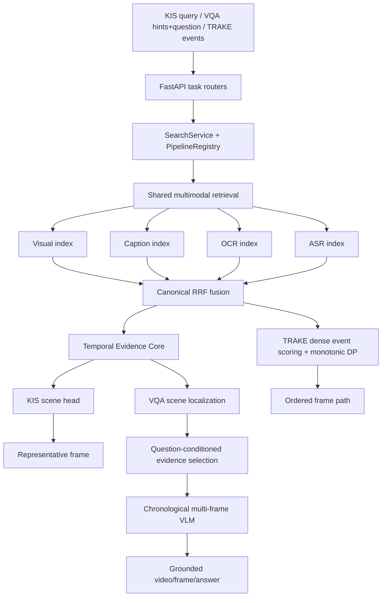
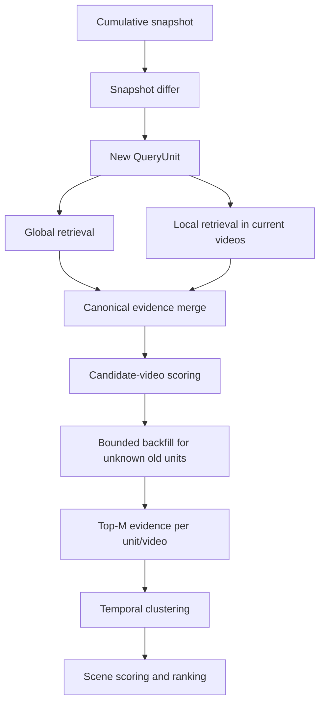

# HCMAI 2026 — System Architecture, Status, and Roadmap

> **Status:** Authoritative repository document
> **Last verified:** 2026-08-13
> **Scope:** KIS, competition VQA/QA, TRAKE, shared retrieval, temporal evidence,
> offline data preparation, inference, evaluation, and serving
> **Source of truth:** active code, tests, configuration, and locally available
> artifacts in the current working tree

This document replaces the previous architecture plans, temporal migration
plans, frozen-contract notes, data audit, TRAKE branch review, VQA sprint plan,
and research survey. Historical plans must not override the current runtime
described here.

The document uses three evidence labels:

- **SOURCE** — verified in active code, tests, configuration, or artifacts.
- **PAPER** — supported by cited research or an official implementation.
- **PROPOSED** — an engineering hypothesis that still requires implementation
  or an HCMAI experiment.

No unmeasured quality or latency improvement is claimed.

---

## 1. Executive status

HCMAI has moved from a frame-only retrieval design toward a shared temporal
evidence architecture. The most important new capability is a working common
temporal core used by KIS and VQA. TRAKE remains a stable task-specific ordered
alignment pipeline.

The architecture is directionally correct, but the assembled repository is not
currently release-ready or reproducibly runnable end to end. The main blockers
are incomplete visual-index artifacts, missing frame images, test-suite tracking
problems, API/frontend contract mismatches, a VQA answerability defect, and the
absence of current competition evaluation.

| Capability | Implemented | Focused tests | Competition-validated |
|---|---:|---:|---:|
| Canonical frame/evidence contracts | Yes | Partial | No |
| Multimodal retrieval and RRF fusion | Yes | Partial | No |
| Shared temporal evidence core | Yes | 38 passing | No |
| Progressive KIS localization | Yes | Included above | No |
| Multi-frame grounded VQA | Yes | Included above | No |
| TRAKE monotonic alignment | Yes | 7 passing | No |
| Frontend build | Yes | 21 passing | No |
| End-to-end serving from default artifacts | Blocked | No | No |
| Reproducible task evaluation | Incomplete | No | No |

The immediate program priority is **release stabilization and measurement**,
not another model replacement or a new parallel architecture.

---

## 2. Mission and task semantics

HCMAI receives natural-language input and searches a corpus of long videos using
visual embeddings, captions, OCR, ASR, temporal relationships, and bounded
VLM/LLM reasoning. The system must preserve canonical video/frame identity and
return competition-compatible output.

The important abstraction is:

```text
query unit -> frame-level evidence -> temporally coherent scene/path -> task head
```

A retrieval hit says that one frame is relevant to one query unit. A scene says
that several pieces of evidence form one coherent temporal hypothesis in a
video. These must remain separate concepts.

### 2.1 KIS

KIS clues may be revealed progressively as cumulative snapshots:

```text
Q1 = H1
Q2 = H1 + H2
Q3 = H1 + H2 + H3
```

The system must recover the new semantic unit rather than count repeated text
again. Different hints may match different frames in the same scene. KIS should
therefore localize a scene first and then select a representative canonical
frame.

### 2.2 Competition VQA / QA

VQA separates localization from answering:

```text
event description / hints -> WHERE to look
question                  -> WHAT to answer
```

The question must not automatically become another localization hint. After
localization, the system selects bounded chronological image and text evidence
from the scene and performs grounded multi-frame inference.

### 2.3 TRAKE

TRAKE receives an ordered sequence of at least two events and retrieves one
monotonic frame path in a video:

```text
E1 -> E2 -> ... -> En
```

TRAKE owns exact monotonic alignment, path ranking, and submission shaping. Its
working algorithm is a stable task-specific component and must not be rewritten
as collateral work for KIS or VQA.

---

## 3. Active system architecture



### 3.1 Runtime composition

`src/hcmai/app.py` creates FastAPI and loads `SearchService`. The composition
root in `src/hcmai/orchestration/setup.py` loads:

1. validated YAML configuration;
2. canonical frame metadata and available enrichment;
3. the required visual index;
4. optional caption/OCR/ASR indexes;
5. local or remote query encoders;
6. optional reranking and VQA providers;
7. task pipelines in `PipelineRegistry`.

When `search.progressive.architecture: temporal`, one `TemporalEvidenceCore` is
shared by KIS and VQA. TRAKE is registered separately.

### 3.2 Package ownership

| Package | Responsibility |
|---|---|
| `src/hcmai/api` | HTTP validation, task dispatch, response conversion, health |
| `src/hcmai/common/schemas` | Authoritative shared contracts |
| `src/hcmai/common/observability` | Stage timing, structured logs, metrics, redaction |
| `src/hcmai/data` | Canonical metadata, preprocessing, enrichment, artifact access |
| `src/hcmai/retrieval` | Encoders, indexes, filtering, fusion, retrieval |
| `src/hcmai/temporal` | Progressive evidence, state, scene assembly and scoring |
| `src/hcmai/orchestration` | Workflow composition and task dispatch |
| `src/hcmai/pipelines/vqa` | VQA parsing, evidence selection, answering, ranking |
| `src/hcmai/pipelines/trake` | Monotonic alignment and TRAKE submission |
| `src/hcmai/llm` | Inference contracts, adapters, resilience, model server |
| `frontend` | User input and result presentation only |

Routers must remain thin. Low-level retrievers must not absorb KIS/VQA task
semantics. Providers must not invent canonical identity.

---

## 4. Canonical identity and evidence contracts

### 4.1 Frame identity

`FrameRecord` is the canonical internal frame source and must preserve:

```text
video_id
frame_id
frame_idx
timestamp_ms
```

Where preprocessing has the information, it also preserves decode provenance:

```text
decode_index
pts
time_base
selection signals/reasons
```

Coordinate systems must not be mixed:

1. decode coordinate — decoder order;
2. media-time coordinate — PTS and time base;
3. competition coordinate — organizer-required frame number.

Deduplication uses canonical `frame_id`, never filename guesses, array position,
or visual similarity alone. Organizer frame conversion belongs in one explicit
mapping layer.

### 4.2 Evidence state

Progressive evidence has three logical states:

```text
UNKNOWN             not evaluated
EVALUATED_NO_MATCH  evaluated without useful evidence
MATCHED              evaluated with evidence
```

Missing pooled retrieval results do not prove a negative match. Only a dedicated
evaluation can transition an `(query_unit, video)` key from unknown to evaluated.

### 4.3 Query units and temporal relations

The snapshot differ supports first request, exact append, no semantic change,
and replacement/conflict detection. Formatting-only changes do not create new
query units.

Hint reveal order is not video event order. A relation is created only from
explicit language such as `then`, `after`, `before`, `finally`, `sau đó`, or
`cuối cùng`. KIS/VQA relations are soft unless the text clearly requires a hard
constraint. TRAKE order is hard.

---

## 5. Shared retrieval

### 5.1 Online retrieval flow

```text
normalized query units
  -> compatible batched text encoding
  -> concurrent visual/caption/OCR/ASR searches
  -> canonical frame-id fusion
  -> bounded evidence candidates
```

The current implementation provides:

- visual and text query embedding caches;
- independent modality execution through a bounded worker pool;
- partial failure for optional modalities;
- typed failure for required modalities;
- reciprocal-rank fusion preserving source scores and ranks;
- task-specific configurable source weights;
- filtered/subset searches backed by persisted vectors and video postings;
- immutable index-bundle validation.

Current limitations:

- configured fusion weights are equal rather than empirically calibrated;
- there is no query-adaptive modality routing;
- retrieval executors are not explicitly closed by the top-level service;
- concurrent stage durations are summed in some traces and may exceed wall time;
- current artifact availability prevents complete runtime validation.

### 5.2 Reranking

The Qwen-VL reranker supports local/remote execution, bounded batches,
canonical identity preservation, and deterministic fallback. It is an optional
verifier, not the primary retrieval mechanism.

The default temporal KIS branch currently bypasses reranking. A future change
should rerank only a small set of already-assembled scenes and must be evaluated
against the no-rerank baseline.

---

## 6. Shared temporal evidence core

The active core is implemented under `src/hcmai/temporal`.

### 6.1 Progressive workflow



### 6.2 State lifecycle

The state store is bounded by TTL, maximum entries, maximum hints, and retrieval
budgets. It uses per-search locks, cloned proposals, and versioned commits.

```text
new request -> process proposal -> commit only on success
continuation -> load version -> process -> compare-and-swap commit
failure -> preserve previous committed state
expired/unknown ID -> explicit stale-state response
replacement snapshot -> explicit conflict
```

The current store is in-memory and process-local. Multi-worker deployment needs
sticky routing or an external transactional store before it can provide reliable
progressive sessions.

### 6.3 Scene scoring

Scene candidates preserve:

```text
video_id, start_ms, end_ms
evidence grouped by query unit
semantic_score
coverage_score
temporal_score
relation_score
final_score
```

All weights and evidence/scene budgets are validated configuration. Ranking is
deterministic. The current clustering is bounded by maximum gap, maximum span,
per-video scene count, and global scene count.

---

## 7. Task workflows and current gaps

### 7.1 KIS

Active flow:

```text
cumulative hints
  -> shared temporal core
  -> ranked scenes
  -> representative canonical frame per scene
  -> KIS response
```

Implemented:

- progressive snapshots and search IDs;
- global/local retrieval and bounded backfill;
- scene-level evidence coverage;
- deterministic representative-frame selection;
- canonical response materialization.

Remaining:

- integrate and measure late scene-aware reranking;
- create a frozen progressive KIS benchmark;
- measure correct-video and correct-scene Recall@K;
- validate official submission coordinates and Top-100 diversity.

### 7.2 VQA

Active flow:

```text
progressive event hints
  -> shared KIS/VQA localization core
  -> ranked scenes
  -> chronological image sampling
  -> caption/OCR/ASR evidence attachment
  -> question-conditioned evidence ordering
  -> multi-frame VLM with single-frame fallback
  -> grounded joint ranking
  -> canonical video/frame/answer response
```

Implemented:

- localization question separation;
- timestamped internal evidence bundles;
- multi-frame provider capability;
- chronological image order;
- bounded evidence and inference calls;
- provider frame-ID validation;
- raw and normalized answer handling;
- deterministic provider failure fallback.

Correctness defects and limitations:

1. The answer stage reads `answerability`, while current providers return
   `answerable`. An explicitly unanswerable response can be accepted.
2. Timestamped text evidence is flattened into caption/OCR/ASR strings before
   inference, losing frame/time provenance at the provider boundary.
3. The answer prompt currently sends the question but not the localized event
   description/hint context.
4. Image sampling is chronological but not strongly question-conditioned.
5. Temporal low-confidence retry uses a legacy neighbor-window expansion and
   may widen beyond the shared scene.
6. Up to eight scene-level inference calls are allowed without adaptive early
   stopping.

### 7.3 TRAKE

Active flow:

```text
explicit ordered events
  -> batch visual encoding
  -> per-event global retrieval
  -> candidate-video coverage/RRF shortlist
  -> candidate-local dense frame scoring
  -> exact monotonic DP per video
  -> video-diversified path ranking
  -> ordered canonical frame submission
```

Implemented:

- typed request/response contracts;
- batched event encoding;
- postings-based local rescoring rather than a full-corpus rescan;
- exact Top-1 monotonic DP on focused fixtures;
- configurable gap penalty, event power, cluster separation, and budgets;
- canonical ordered submission output.

Remaining:

- frontend support for the explicit `events` contract;
- optional natural-language event parsing if competition input requires it;
- official task metrics and a real-corpus benchmark;
- original-frame/local refinement experiment;
- true global k-best paths if the public behavior needs that claim;
- request-scoped stage trace and degraded-component warnings.

The current alternative-path implementation takes top DP endpoints sharing one
predecessor table; it must not be described as a proven global k-best algorithm.

---

## 8. Offline data and artifact architecture

### 8.1 Target publication model

```text
S3 raw video
  -> one disposable local/VM worker per video
  -> local NVMe staging
  -> decode and canonical timing
  -> keyframe/event/motion selection
  -> caption + OCR + ASR enrichment
  -> validation
  -> immutable per-video artifact + manifest
  -> S3 publication and _SUCCESS marker
  -> corpus compaction/index build
```

S3 is the long-term source of truth; local storage is staging/cache. Workers
should download each video once, batch GPU inference, validate locally, then
publish atomically. Online serving must never rebuild offline artifacts.

### 8.2 Current preprocessing strengths

The adaptive path already includes:

- PTS/time-base-aware decoding;
- TransNetV2 shot-boundary cues;
- EfficientGEBD generic event cues;
- camera-compensated motion signals;
- dynamic anchors and burst extraction;
- DINOv2 semantic deduplication;
- max-gap coverage restoration;
- per-video checkpoints and input/config/model fingerprints;
- atomic local directory/file publication.

These components should be retained unless an ablation on HCMAI demonstrates a
better alternative.

### 8.3 Current data defects

| Priority | Defect | Required outcome |
|---|---|---|
| P0 | `frame_idx` derives from millisecond-rounded time and average FPS | Preserve exact timing and centralize organizer mapping |
| P0 | Frame mapping lacks complete coordinate provenance | Record decode, media, and competition mapping inputs |
| P0 | Audio decode loses PTS/start offset | Preserve and apply the source timeline |
| P0 | ASR segment output is not connected to frame-aligned online evidence | Add deterministic segment-to-frame materialization |
| P0 | Transcript resume lacks complete input/model/config manifest | Fingerprinted resume and invalidation |
| P0 | No strong validation/publication gate | Reject incomplete or inconsistent artifacts |
| P1 | Every motion peak is protected from DINO deduplication | Add temporal NMS and bounded protection |
| P1 | Burst expansion scans all frames per trigger | Use indexed/range lookup |
| P1 | Caption checkpoint rewrites global Parquet | Per-video shards then one compaction |
| P1 | OCR downsizes full frames and is not fully YAML/revision driven | Benchmark region-aware OCR and pin configuration |
| P1 | Diarization is mandatory although speaker identity is unused | Make it optional |
| P1 | Publication remains predominantly local | Add storage abstraction and S3 manifests |

### 8.4 Required artifact contracts

Every artifact bundle must identify:

```text
corpus/dataset version
source fingerprint
model checkpoint and revision
configuration fingerprint
schema version
record count
canonical identity range/checksum
creation timestamp
completion status
```

Required validation includes uniqueness, monotonic timestamps, nonnegative
coordinates, valid media paths, row/vector/index count equality, finite vectors,
dimension consistency, enrichment foreign keys, and checksum/publication state.

### 8.5 Locally observed artifact state

On 2026-08-13 the available frame store contained:

- 177,321 frame records across 873 videos;
- no duplicate `frame_id` values;
- 614 duplicate `(video_id, frame_idx)` pairs requiring competition-coordinate
  review;
- no resolvable images in a 100-record sample from the configured dataset root.

The caption index is present, but the configured visual index is missing the
persisted vector, posting, and timestamp files required by the current loader.
OCR and ASR online artifacts/indexes are not available. Consequently the
default application cannot construct complete retrieval or serve VQA images.

Artifact contents are environment state, not a permanent architectural fact;
health/readiness and validation tools must report them directly.

---

## 9. Inference, reliability, and observability

### 9.1 Inference

The inference layer exposes model-agnostic contracts for:

- caption generation;
- visual/text embeddings;
- reranking;
- single-frame VQA;
- multi-frame VQA.

Remote execution has connect/read/write/pool timeouts, total deadlines, bounded
retry with jitter, circuit breaking, bounded concurrency, capability discovery,
and deterministic fallback. Deterministic client/contract failures must not be
retried indefinitely.

Several embedding/reranker/VQA revisions remain unpinned and must be frozen in
experiment and artifact manifests.

### 9.2 Observability

The repository has structured stage timers, JSON logging, in-process metrics,
histograms, and redaction helpers. Important stages include normalization,
encoding, modality retrieval, fusion, backfill, scene assembly, reranking,
evidence selection, VQA inference, alignment, and materialization.

Remaining work:

- emit the temporal core's internal stages through the standard metrics path;
- report concurrent wall-clock and per-source durations separately;
- export metrics to a persistent external sink;
- add task/provider/cache/fallback attributes without logging secrets;
- propagate request deadlines through every remote and expensive stage.

---

## 10. API and frontend status

Backend routers are generally thin and map stale progressive IDs to HTTP 410 and
state conflicts to HTTP 409.

Current frontend problems:

1. `/trake` input is sent to generic `/api/v1/search` instead of the dedicated
   TRAKE request with explicit ordered events.
2. One session-storage search ID is shared across VQA and retrieval task types,
   causing cross-task state conflicts.
3. The Suggest action calls `/api/v1/suggest`, but no backend router exists.
4. A dead KISC/MiniChallenge API client remains after backend removal.
5. Backend-unreachable errors can return plausible mock results. Production and
   competition builds must fail visibly instead.
6. Some frontend tests currently assert the incorrect TRAKE routing contract.

The frontend should remain stateless with respect to evidence pools and source
scores. The backend is authoritative for progressive state.

---

## 11. Validation snapshot

Validation performed against the active working tree on 2026-08-13:

| Check | Result |
|---|---|
| Shared temporal/progressive tests | 38 passed |
| TRAKE alignment/submission tests | 7 passed |
| Selected broader backend suite | 43 passed, 4 failed |
| Full backend collection | Failed with 3 stale/missing-contract imports |
| Frontend tests | 21 passed |
| Frontend production build | Passed |
| `git diff --check` | Failed on trailing whitespace |
| Default visual index load | Failed: incomplete immutable bundle |
| Configured frame assets, 100-row sample | 0 available, 100 missing |

Three broader-suite failures reflect stale expectations. One exposes a current
caption configuration defect: the computed project root resolves to `src/`, so
the default enrichment YAML path points below `src/configs` instead of the
repository `configs` directory.

The full test suite is also at risk because the current `.gitignore` ignores the
entire `tests/` directory while many previously tracked tests are staged as
deleted. This must be repaired before merging the migration.

---

## 12. Release blockers and roadmap

### 12.1 P0 — stabilize the repository and runtime

1. Restore test tracking; reconcile deleted, moved, and replacement tests.
2. Fix stale imports and make the full backend suite collect and complete.
3. Rebuild/synchronize the complete visual index bundle.
4. publish or correctly configure canonical frame images.
5. Fix VQA `answerable` parsing and add negative contract tests.
6. Fix frontend TRAKE routing, payload, result rendering, and tests.
7. Use task/fingerprint-scoped progressive IDs in the frontend.
8. Remove production mock fallback and dead KISC/Suggest clients or implement
   explicitly supported backend contracts.
9. Validate organizer frame mapping and duplicate competition coordinates.
10. Fix caption configuration root resolution.

### 12.2 P1 — finish data and evidence correctness

1. Preserve exact video/audio timing and provenance.
2. Materialize ASR segments into frame-aligned evidence and build its index.
3. add per-video manifests, validation gates, atomic S3 publication, and resume.
4. Preserve text evidence frame/time provenance through the VQA provider API.
5. Include localized event context in the answer prompt.
6. Replace legacy temporal neighbor expansion with a scene-bounded policy.
7. Add adaptive VQA call/image budgets and early stopping.
8. Pin all production model revisions.
9. Add persistent, wall-clock-correct observability.

### 12.3 P2 — measured quality improvements

Only after P0/P1 gates:

1. calibrate modality/fusion weights per task;
2. benchmark late scene-level KIS reranking;
3. benchmark question-aware VQA frame selection;
4. expand temporal relation parsing;
5. add motion-aware event evidence;
6. benchmark regional/two-stage OCR;
7. evaluate TRAKE original-frame refinement and true k-best alternatives;
8. evaluate distributed progressive state if multi-worker serving is required.

---

## 13. Evaluation and experiment contract

No optimization is complete without a reproducible experiment record.

### 13.1 Required datasets

Create frozen, versioned development sets containing:

- progressive KIS snapshots and target video/scene/frame;
- VQA hints, question, target scene, evidence, and answer;
- ordered TRAKE events and accepted paths;
- hard negatives for semantics, temporal order, missing events, entity
  consistency, motion, and modality dependence.

### 13.2 Metrics

| Layer | Required metrics |
|---|---|
| Retrieval | Recall/Hit@K, MRR, correct-video recall |
| Scene localization | scene/window recall, temporal IoU/coverage, evidence recall |
| KIS | official score, Top-K frame/video accuracy |
| VQA | oracle-scene answer accuracy, end-to-end accuracy, grounded accuracy |
| TRAKE | official score, event/frame accuracy, path validity |
| Efficiency | P50/P95 wall latency, calls, images, GPU/API time, fallback rate |

VQA must be evaluated both with oracle scenes and end to end so localization
failure is not confused with reasoning failure.

### 13.3 Run record

Every experiment must record:

```text
task and query-set version
git commit / dirty-tree marker
complete configuration
model names and revisions
artifact/index versions
hardware or remote provider
predictions and failures
metrics and per-stage latency
timestamp
```

---

## 14. Research direction

Research literature already covers query decomposition, multi-frame reasoning,
temporal-window retrieval, coarse-to-fine localization, and monotonic sequence
alignment. HCMAI should not claim these generic ideas as novel.

The strongest **PROPOSED** research direction is:

> Entity-consistent, heterogeneous multi-event video corpus retrieval with
> task-conditioned evidence selection.

The key open questions are:

1. **Entity consistency:** do evidence items across events refer to the same
   people, objects, and scene?
2. **Heterogeneous evidence:** which events require appearance, text, speech,
   motion, or relation evidence?
3. **Rich relations:** how should before/after/overlap/near/at-end constraints be
   represented and calibrated?
4. **Motion semantics:** how can pan, zoom, enter/exit, and action change be
   indexed without densely extracting the whole corpus?
5. **Evidence-conditioned VQA:** which localized evidence is sufficient for the
   question, and when should the system abstain?
6. **Corpus efficiency:** how should coarse global retrieval and local temporal
   refinement be balanced under competition latency?

Candidate research progression:

```text
reproduce measured baseline
  -> build hard-negative benchmark
  -> heterogeneous event routing
  -> entity-consistency scoring
  -> motion expert
  -> richer temporal graph
  -> grounded VQA ablations
```

All research additions must preserve canonical identity and must be ablated
against the simpler temporal-core baseline.

---

## 15. Definition of release readiness

The first complete release requires all of the following:

- one reproducible, complete artifact bundle loads from clean startup;
- frame image, caption, OCR, and ASR availability is reported accurately;
- KIS, VQA, and TRAKE public contracts work from backend and frontend;
- progressive requests survive failure without corrupting prior state;
- full backend and frontend suites pass from tracked test sources;
- canonical identity and official submission coordinates are validated;
- optional modality/provider failures degrade deterministically;
- no mock result can be mistaken for a real competition result;
- task benchmarks and official metrics are recorded;
- P50/P95 latency and provider budgets are measured;
- configuration, model revisions, corpus, and artifacts are versioned.

Until these conditions are satisfied, the system should be described as an
implemented research baseline under integration, not competition-ready.

---

## 16. Stable decisions and non-goals

- Preserve `FrameRecord` as canonical identity.
- Preserve the shared KIS/VQA temporal localization core.
- Preserve TRAKE's stable task-specific monotonic alignment.
- Preserve PTS/time-base provenance, TransNetV2, EfficientGEBD, motion cues,
  and DINOv2 until ablations justify changes.
- Do not rebuild large offline artifacts during online startup or requests.
- Do not solve TRAKE by densely extracting every source frame in the corpus.
- Do not treat missing evidence as negative evidence.
- Do not infer temporal order from hint reveal order.
- Do not let VLM/LLM providers generate or rewrite canonical frame identity.
- Do not create parallel `V2` contracts when an active schema can be extended.
- Do not claim improvement without a recorded experiment.

---

## 17. Selected research references

1. Lei et al., **Moment-DETR: End-to-End Video Moment Retrieval with Natural
   Language**, ICCV 2021.
2. Moon et al., **Query-Dependent Video Representation for Moment Retrieval and
   Highlight Detection**, CVPR 2023.
3. Lin et al., **UniVTG: Towards Unified Video-Language Temporal Grounding**,
   ICCV 2023.
4. Hou et al., **Event-aware Video Corpus Moment Retrieval**, 2024.
5. Ren et al., **TimeChat: A Time-sensitive Multimodal Large Language Model for
   Long Video Understanding**, CVPR 2024.
6. Wang et al., **VideoTree: Adaptive Tree-based Video Representation for LLM
   Reasoning on Long Videos**, CVPR 2025.
7. Xiao et al., **Can I Trust Your Answer? Visually Grounded Video Question
   Answering**, CVPR 2024.
8. Di and Xie, **Grounded Question-Answering in Long Egocentric Videos**, CVPR
   2024.
9. Gia et al., **VRAG: Retrieval-Augmented Video Question Answering for
   Long-Form Videos**, CVPRW 2025.
10. Soucek and Lokoc, **TransNet V2: An Effective Deep Network Architecture for
    Fast Shot Transition Detection**, 2020.
11. Oquab et al., **DINOv2: Learning Robust Visual Features without
    Supervision**, 2023.

---

## 18. Maintenance rule

This is the only Markdown architecture/status document under `docs/`.

When behavior changes:

1. verify active code, tests, configuration, and artifacts;
2. update the status table and relevant workflow;
3. move completed roadmap items into implemented status;
4. retain limitations until a test or experiment proves resolution;
5. avoid adding new competing master plans or dated branch reviews.
