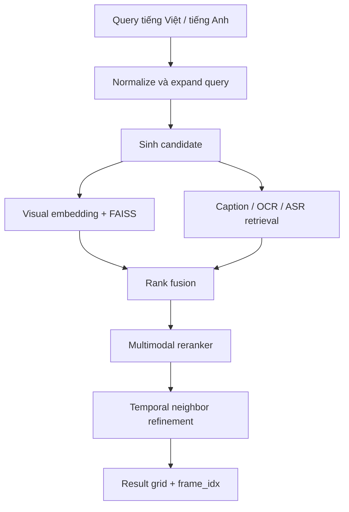
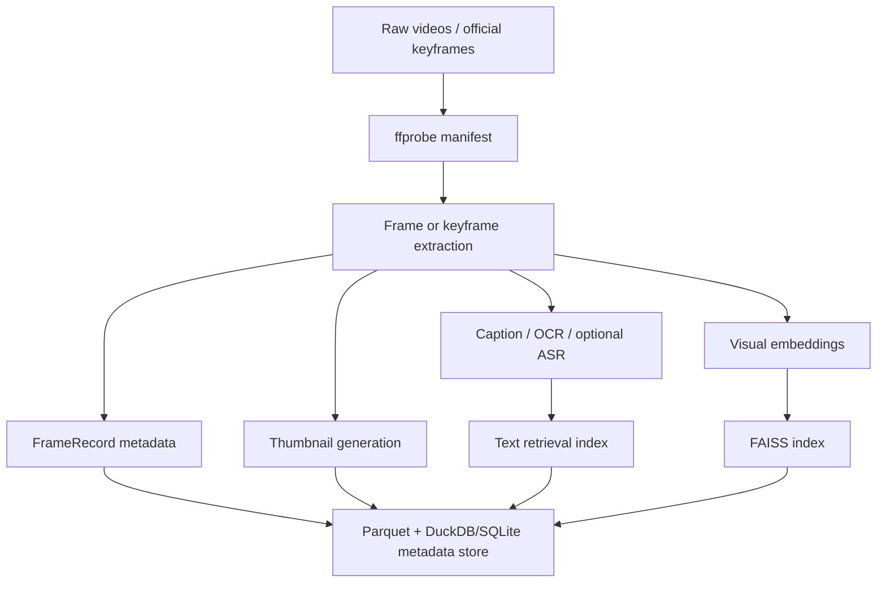

# Đặc tả MVP

**Thời gian**: 11/07/2026 đến 17/07/2026
**Tác giả**: Khang Phuc Nguyen

Tài liệu này thống nhất phạm vi MVP, kiến trúc kỹ thuật, API contract, metadata contract, kế hoạch sprint và tiêu chí nghiệm thu cho hệ thống tìm frame chính xác trong một corpus video lớn bằng textual query.

MVP tập trung tạo một baseline đo được, tái lập được và có thể dùng để giao việc giữa các thành viên. Hướng triển khai chính là **caption-grounding + OCR/ASR + dense visual retrieval + multimodal reranking**.

## 1. Mục tiêu

Xây dựng hệ thống cho phép người dùng nhập query bằng tiếng Việt hoặc tiếng Anh và nhận về danh sách frame phù hợp nhất trong corpus video lớn.

Kết quả trả về phải dùng được cho workflow competition/retrieval, đặc biệt cần có:

- `video_id`
- `frame_idx` chính thức
- timestamp
- thumbnail
- relevance score
- đường dẫn preview frame

MVP không nhằm tối ưu độ chính xác cuối cùng ngay trong sprint này. Mục tiêu là tạo baseline ổn định để đo Recall@K, MRR, latency, phân tích lỗi và chuẩn bị dữ liệu cho fine-tuning ở sprint sau.

## 2. Định hướng kỹ thuật đề xuất

Xây dựng MVP dưới dạng hệ thống retrieval hai giai đoạn:

1. Sinh candidate nhanh trên toàn bộ corpus.
2. Rerank đa phương thức chính xác hơn trên nhóm candidate tốt nhất.

Không training model từ đầu trong sprint này. Mục tiêu năm ngày là tạo một baseline đo được, tái lập được và dùng các checkpoint mở đủ mạnh. Fine-tuning chỉ nên bắt đầu sau khi đã thu thập được positive pairs và hard negatives đáng tin cậy.



Cấu hình mặc định thực tế:

> SigLIP2 candidate retrieval -> caption/OCR fusion -> Qwen3-VL-Reranker-2B.

BLIP-ITM phải được giữ lại sau một configuration flag để fallback nếu Qwen reranker quá chậm hoặc không ổn định trên GPU hiện có.

## 3. Phạm vi MVP

MVP năm ngày cần bàn giao:

- Query dạng text bằng tiếng Việt hoặc tiếng Anh.
- Top-K frame phù hợp nhất, gồm `video_id`, `frame_idx` chính thức, timestamp, similarity/relevance score và thumbnail.
- Visual dense retrieval.
- Caption-grounded retrieval.
- OCR-grounded retrieval nếu có dữ liệu OCR.
- ASR-grounded retrieval dạng optional nếu transcript có sớm.
- Multimodal reranking.
- Filter theo video và score.
- Hai profile retrieval: Accuracy và Live.
- Script đánh giá có thể tái lập.
- Full-corpus index hoặc quy trình indexing có thể resume và được document rõ nếu không kịp xử lý toàn bộ corpus trong thời gian GPU hiện có.

### Ngoài critical path năm ngày

- Training foundation model mới.
- LoRA fine-tuning quy mô lớn khi chưa có ít nhất vài trăm query-frame pairs đáng tin cậy.
- Enterprise database hoặc distributed vector database hoàn chỉnh.
- Workflow object tracking đầy đủ.
- Video VQA reasoning toàn diện trên video dài.

MVP cung cấp retrieval substrate chung cho KIS và Ad-hoc Search. Video VQA ban đầu có thể chạy VLM trên các frame đã retrieve và temporal neighbors. Tracking và fine-tuning theo task nên chuyển sang Sprint 2 sau khi baseline tạo được hard negatives và failure categories đo được.

## 4. Model stack

| Thành phần | Lựa chọn MVP | Lý do |
| --- | --- | --- |
| Dense visual retrieval | `SigLIP2-base-patch16-224` | Đủ nhanh để index toàn corpus, hỗ trợ multilingual và mạnh hơn CLIP chuẩn cho image-text retrieval. SigLIP 2 báo cáo cải thiện retrieval và multilingual understanding trên nhiều model size. [SigLIP 2 paper](https://arxiv.org/abs/2502.14786) |
| Challenger chất lượng cao hơn | `SigLIP2-so400m` hoặc `Qwen3-VL-Embedding-2B` | Chỉ benchmark trên subset; chỉ promote nếu accuracy gain xứng đáng với chi phí indexing và latency. Model của Qwen hỗ trợ image, text và video retrieval. [Qwen3-VL retrieval repository](https://github.com/QwenLM/Qwen3-VL-Embedding) |
| Frame captioning | `Florence-2-large-ft` | Hỗ trợ detailed captioning, OCR, detection và grounding trong một model tương đối gọn. [Florence-2, CVPR 2024](https://openaccess.thecvf.com/content/CVPR2024/html/Xiao_Florence-2_Advancing_a_Unified_Representation_for_a_Variety_of_Vision_Tasks_CVPR_2024_paper.html) |
| Reranker chính | `Qwen3-VL-Reranker-2B` | Cross-encoder được thiết kế cho fine-grained multimodal relevance scoring; hỗ trợ text, image và video input. [Technical report](https://arxiv.org/abs/2601.04720) |
| Reranker fallback an toàn | BLIP image-text matching head | Cũ và nhẹ hơn, nhưng ổn định và đã được chứng minh. BLIP training trực tiếp image-text matching objective phù hợp cho reranking. [BLIP, ICML 2022](https://proceedings.mlr.press/v162/li22n.html) |
| Vector search | FAISS `FlatIP` ban đầu | Exact cosine search là lựa chọn tốt khi embeddings vẫn fit memory. Chỉ chuyển sang IVF khi measurement chứng minh là cần thiết. [FAISS paper](https://arxiv.org/abs/2401.08281) |
| Metadata | Parquet + DuckDB/SQLite | Đơn giản, dễ inspect và đủ cho research prototype. |
| API/UI | FastAPI + React/Vite | FastAPI giúp tách retrieval services rõ ràng; React hỗ trợ result grid responsive cho competition workflow. |

## 5. Quyết định về frame index

Sampling 1 FPS đơn thuần không đảm bảo lấy được `frame_idx` chính xác.

Sử dụng một trong hai chiến lược:

- Nếu ban tổ chức cung cấp searchable/key frames: index toàn bộ frame được cung cấp và giữ nguyên official IDs.
- Nếu chỉ có video gốc: index scene anchors hoặc periodic frames, retrieve temporal regions có khả năng đúng, rescore các full-FPS frame xung quanh như +/-2 giây, sau đó trả về decoded frame index từ source mapping.

Luôn lưu cả `frame_idx` và `pts_time_ms`. Không reconstruct frame index bằng công thức `timestamp * fps`, đặc biệt với video variable-frame-rate.

`frame_idx` là giá trị chính thức dùng cho submission. `timestamp_ms` chủ yếu dùng cho preview, seek và temporal refinement.

## 6. Retrieval profiles

| Profile | Candidate pool | Rerank count | Temporal refinement |
| --- | ---: | ---: | ---: |
| Preliminary / Accuracy | 300-500 | 50-100 | +/-2-3 giây |
| Final / Live | 100-150 | 15-25 | +/-0.5-1 giây hoặc on demand |

Các giá trị này phải là configuration parameters, không hard-code trong source code.

### Latency budget tạm thời sau warm-up

| Stage | Live-mode budget |
| --- | ---: |
| Query encoding | <=100 ms |
| FAISS + metadata fusion | <=100 ms |
| Reranking top 20 | <=900 ms |
| Temporal lookup/materialization | <=200 ms |
| API/UI overhead | <=200 ms |
| End-to-end target | P95 <=1.5-2.0 s |

Đây là engineering budget, không phải cam kết cố định. Measurement ngày 4 trên GPU thực tế sẽ quyết định target cuối cùng.

## 7. Offline data và indexing pipeline

Offline pipeline phải có khả năng resume. Job extraction, captioning hoặc embedding bị lỗi phải tiếp tục từ checkpoint thay vì chạy lại từ đầu.



Các output offline bắt buộc:

- `frames.parquet`: metadata frame canonical.
- `frame_metadata.parquet`: caption, OCR text, ASR text và processing status.
- `embeddings.npy` hoặc dạng shard tương đương: normalized visual embeddings.
- `faiss.index`: FAISS index đã serialize.
- `embedding_mapping.parquet`: mapping từ vector position sang `frame_id`.
- `thumbnails/`: thumbnail sẵn sàng cho result grid.
- `manifest.jsonl` hoặc `manifest.parquet`: inventory video nguồn và metadata từ ffprobe.
- `corpus_report.md`: số lượng, missing data, corrupt videos, duplicate IDs và processing coverage.

## 8. Metadata contract

### `FrameRecord`

```python
class FrameRecord:
    frame_id: str          # Globally unique, e.g. "L01_V003_00014251"
    video_id: str
    frame_idx: int         # Authoritative decoded/organizer frame index
    pts_time_ms: int       # Presentation timestamp
    source_path: str
    thumbnail_path: str | None
    width: int
    height: int
    shot_id: str | None
```

`FrameRecord` lưu canonical frame mapping. `frame_id` phải ổn định trong suốt vòng đời corpus.

### `FrameMetadata`

```python
class FrameMetadata:
    frame_id: str
    caption: str | None
    ocr_text: str | None
    asr_text: str | None
    caption_model: str | None
    processing_status: str  # pending, completed, failed
```

### `EmbeddingRecord`

```python
class EmbeddingRecord:
    vector_position: int
    frame_id: str
    video_id: str
    model_name: str
    embedding_dim: int
```

### `VideoManifestRecord`

```python
class VideoManifestRecord:
    video_id: str
    source_path: str
    duration_ms: int | None
    fps: float | None
    width: int | None
    height: int | None
    num_frames: int | None
    decode_status: str      # pending, completed, failed
    error_message: str | None
```

## 9. Online search pipeline

Online search nên được triển khai như một pipeline có orchestration rõ ràng và đo được latency từng stage:

1. Validate request.
2. Normalize query và optional translate/expand giữa tiếng Việt và tiếng Anh.
3. Encode query cho dense visual retrieval.
4. Retrieve visual candidates từ FAISS.
5. Retrieve caption/OCR/ASR candidates từ text indexes.
6. Fuse candidate rankings.
7. Deduplicate theo `frame_id` và optional suppress near-duplicates trong cùng video window.
8. Rerank top candidates bằng Qwen3-VL-Reranker-2B.
9. Fallback sang BLIP-ITM hoặc fusion-only ranking nếu primary reranker timeout hoặc OOM.
10. Chạy temporal neighbor refinement quanh top candidates.
11. Materialize metadata và image URLs.
12. Trả kết quả đã sort kèm latency breakdown.

Ưu tiên dùng rank fusion trước khi cộng raw score có trọng số, vì score từ visual embeddings, text retrieval và OCR không được calibrate tự nhiên:

```text
RRF(d) = sum_m w_m / (k + rank_m(d))
```

Final reranking có thể kết hợp normalized RRF và cross-encoder scores, với weights fit trên development set.

## 10. API contract

Endpoint chính cho search:

```http
POST /api/v1/search
Content-Type: application/json
```

### Search request

```json
{
  "query": "một người đàn ông đang cầm ô màu đỏ",
  "top_k": 20,
  "search_mode": "accurate",
  "filters": {
    "video_ids": ["L01_V003", "L01_V004"],
    "min_score": 0.3,
    "start_time_ms": null,
    "end_time_ms": null
  }
}
```

#### Các field cấp cao nhất của request

| Field | Kiểu dữ liệu | Bắt buộc | Mặc định | Ràng buộc | Mô tả | Ví dụ |
| --- | --- | ---: | --- | --- | --- | --- |
| `query` | `string` | Có | - | Không được rỗng; đề xuất tối đa 1.000 ký tự | Câu truy vấn bằng ngôn ngữ tự nhiên. Có thể là tiếng Việt, tiếng Anh hoặc kết hợp cả hai. | `"người phụ nữ mặc áo vàng đang đi xe đạp"` |
| `top_k` | `integer` | Không | `20` | `1 <= top_k <= 100` | Số lượng kết quả cuối cùng API trả về. Không phải số lượng candidate được lấy trước reranking. | `20` |
| `search_mode` | `string enum` | Không | `"accurate"` | Một trong: `"fast"`, `"accurate"` | Profile cấu hình retrieval. `fast` ưu tiên latency; `accurate` ưu tiên độ chính xác. | `"fast"` |
| `filters` | `object` hoặc `null` | Không | `null` | Theo cấu trúc `SearchFilters` | Giới hạn phạm vi tìm kiếm theo video, thời gian hoặc score. | `{ "video_ids": ["L01_V003"] }` |

### Search filters

| Field | Kiểu dữ liệu | Bắt buộc | Mặc định | Ràng buộc | Mô tả | Ví dụ |
| --- | --- | ---: | --- | --- | --- | --- |
| `video_ids` | `array<string>` hoặc `null` | Không | `null` | Mỗi phần tử phải là `video_id` hợp lệ | Chỉ tìm kiếm trong các video được chỉ định. `null` hoặc mảng rỗng nghĩa là tìm toàn bộ corpus. | `["L01_V003", "L01_V004"]` |
| `min_score` | `number` hoặc `null` | Không | `null` | Đề xuất từ `0.0` đến `1.0` | Loại bỏ kết quả có final relevance score nhỏ hơn giá trị này. | `0.3` |
| `start_time_ms` | `integer` hoặc `null` | Không | `null` | Phải `>= 0` | Chỉ lấy các frame có timestamp từ thời điểm này trở đi. Thường dùng khi đã lọc theo video. | `30000` |
| `end_time_ms` | `integer` hoặc `null` | Không | `null` | Phải lớn hơn `start_time_ms` | Chỉ lấy các frame trước hoặc bằng thời điểm này. | `120000` |

Không expose các tham số nội bộ như `visual_candidates`, `rerank_count` và `fusion_weights` trong public request. Các tham số này thuộc backend configuration.

### Search response

```json
{
  "query_id": "q_01JXYZ",
  "query": "một người đàn ông đang cầm ô màu đỏ",
  "search_mode": "accurate",
  "top_k": 20,
  "total_results": 20,
  "latency_ms": {
    "query_processing": 18,
    "query_encoding": 34,
    "candidate_retrieval": 42,
    "fusion": 4,
    "reranking": 521,
    "temporal_refinement": 53,
    "materialization": 21,
    "total": 693
  },
  "results": [
    {
      "rank": 1,
      "frame_id": "L01_V003_00014251",
      "video_id": "L01_V003",
      "frame_idx": 14251,
      "timestamp_ms": 475033,
      "thumbnail_url": "/api/v1/frames/L01_V003_00014251/thumbnail",
      "frame_url": "/api/v1/frames/L01_V003_00014251/image",
      "caption": "A man holding a red umbrella near a road.",
      "ocr_text": null,
      "scores": {
        "visual": 0.81,
        "caption": 0.73,
        "ocr": null,
        "fusion": 0.88,
        "reranker": 0.92,
        "final": 0.91
      }
    }
  ],
  "warnings": []
}
```

#### Các field cấp cao nhất của response

| Field | Kiểu dữ liệu | Luôn có | Mô tả | Ví dụ |
| --- | --- | ---: | --- | --- |
| `query_id` | `string` | Có | ID duy nhất của request, dùng để logging, debug và đánh giá. | `"q_01JXYZ"` |
| `query` | `string` | Có | Query sau khi được trim và chuẩn hóa cơ bản. | `"một người đàn ông cầm ô đỏ"` |
| `search_mode` | `string enum` | Có | Profile thực tế backend đã sử dụng. | `"accurate"` |
| `top_k` | `integer` | Có | Số lượng kết quả tối đa được yêu cầu. | `20` |
| `total_results` | `integer` | Có | Số kết quả thực tế được trả về. Có thể nhỏ hơn `top_k` sau khi filter. | `18` |
| `latency_ms` | `object` | Có | Thời gian xử lý của từng giai đoạn, tính bằng millisecond. | `{ "total": 693 }` |
| `results` | `array<SearchResult>` | Có | Danh sách frame đã được sắp xếp giảm dần theo relevance. | `[...]` |
| `warnings` | `array<string>` | Có | Các cảnh báo không làm request thất bại, chẳng hạn reranker bị timeout và hệ thống dùng fallback. | `["Primary reranker timed out; BLIP fallback was used."]` |

### Latency fields

| Field | Kiểu dữ liệu | Đơn vị | Mô tả |
| --- | --- | ---: | --- |
| `query_processing` | `integer` | ms | Thời gian trim, normalize, detect language hoặc query expansion. |
| `query_encoding` | `integer` | ms | Thời gian tạo query embedding. |
| `candidate_retrieval` | `integer` | ms | Thời gian tìm candidate từ FAISS và các text index. |
| `fusion` | `integer` | ms | Thời gian hợp nhất và sắp hạng candidate từ nhiều retrieval channel. |
| `reranking` | `integer` | ms | Thời gian multimodal reranker chấm điểm candidate. |
| `temporal_refinement` | `integer` | ms | Thời gian tìm kiếm lại các frame lân cận theo thời gian. |
| `materialization` | `integer` | ms | Thời gian lấy metadata và tạo URL cho kết quả. |
| `total` | `integer` | ms | Tổng thời gian backend xử lý request. Không bao gồm thời gian render phía browser. |

Stage bị tắt có thể trả về `0` để frontend và benchmark giữ schema ổn định.

### Search result fields

| Field | Kiểu dữ liệu | Luôn có | Mô tả | Ví dụ |
| --- | --- | ---: | --- | --- |
| `rank` | `integer` | Có | Thứ hạng cuối cùng, bắt đầu từ `1`. | `1` |
| `frame_id` | `string` | Có | ID duy nhất và ổn định của frame trong toàn bộ corpus. | `"L01_V003_00014251"` |
| `video_id` | `string` | Có | ID video chứa frame. | `"L01_V003"` |
| `frame_idx` | `integer` | Có | Frame index chính thức hoặc index lấy trực tiếp từ quá trình decode. Đây là giá trị dùng để submit. | `14251` |
| `timestamp_ms` | `integer` | Có | Presentation timestamp của frame trong video, tính bằng millisecond. | `475033` |
| `thumbnail_url` | `string` | Có | URL của ảnh thumbnail dùng cho result grid. | `"/api/v1/frames/.../thumbnail"` |
| `frame_url` | `string` hoặc `null` | Không | URL ảnh có độ phân giải đầy đủ. Có thể chỉ được tải khi người dùng mở chi tiết. | `"/api/v1/frames/.../image"` |
| `caption` | `string` hoặc `null` | Không | Caption được sinh offline cho frame hoặc scene anchor tương ứng. | `"A man holding a red umbrella."` |
| `ocr_text` | `string` hoặc `null` | Không | Văn bản được nhận dạng trong frame. | `"SAIGON CENTRAL"` |
| `scores` | `object` | Có | Điểm số từ từng retrieval stage và điểm cuối cùng. | `{ "final": 0.91 }` |

### Score fields

| Field | Kiểu dữ liệu | Có thể `null` | Mô tả |
| --- | --- | ---: | --- |
| `visual` | `number` | Có | Điểm tương đồng giữa query embedding và visual embedding. |
| `caption` | `number` | Có | Điểm retrieval từ caption channel. |
| `ocr` | `number` | Có | Điểm retrieval dựa trên văn bản xuất hiện trong frame. |
| `asr` | `number` | Có | Điểm retrieval dựa trên transcript âm thanh gần timestamp của frame. |
| `fusion` | `number` | Có | Điểm sau khi hợp nhất nhiều retrieval channel. |
| `reranker` | `number` | Có | Điểm relevance do multimodal reranker sinh ra. |
| `final` | `number` | Không | Điểm cuối cùng được dùng để sắp xếp kết quả. |

Score trung gian có thể là `null` khi channel tương ứng bị tắt hoặc metadata bị thiếu. Không giả định mọi raw score đều nằm trong khoảng `0-1`; backend phải normalize score trước khi trả về nếu `min_score` được định nghĩa trên thang `0-1`.

### Error response

```json
{
  "error": {
    "code": "INVALID_SEARCH_REQUEST",
    "message": "query must not be empty",
    "details": {
      "field": "query"
    },
    "request_id": "req_01JXYZ"
  }
}
```

| Field | Kiểu dữ liệu | Luôn có | Mô tả |
| --- | --- | ---: | --- |
| `error.code` | `string` | Có | Mã lỗi ổn định để frontend xử lý. |
| `error.message` | `string` | Có | Thông báo lỗi dễ hiểu cho developer hoặc người dùng. |
| `error.details` | `object` hoặc `null` | Không | Thông tin bổ sung như field không hợp lệ. |
| `error.request_id` | `string` | Có | ID dùng để tra log backend. |

#### HTTP status

| HTTP status | Trường hợp |
| ---: | --- |
| `200` | Tìm kiếm thành công, kể cả khi `results` rỗng. |
| `400` | JSON hoặc tham số không hợp lệ. |
| `404` | `frame_id` hoặc `video_id` không tồn tại. |
| `422` | Request đúng JSON nhưng vi phạm validation schema. |
| `500` | Lỗi backend không dự kiến. |
| `503` | Model hoặc search index chưa sẵn sàng. |
| `504` | Reranker/search pipeline timeout và không có fallback thành công. |

Contract cuối cùng sử dụng `search_mode: "fast" | "accurate"` thay cho `mode: "live"`, vì tên này mô tả trực tiếp trade-off mà API cung cấp.

## 11. Giao thức đánh giá

Evaluation phải chạy tái lập được từ một command.

Các metric bắt buộc:

- `Recall@1`
- `Recall@5`
- `Recall@10`
- `Recall@100`
- `MRR`
- P50 latency
- P95 latency
- candidate Recall@100 trước reranking
- reranked Recall@K sau reranking

Development query set:

- 50-100 query đại diện trong ngày 1.
- Bao gồm query tiếng Việt, tiếng Anh và mixed-language.
- Bao gồm query về object, action, scene, OCR-heavy và temporal.
- Ground truth lưu bằng `frame_id` ổn định hoặc accepted frame windows.

Failure categories:

- visual miss
- caption/OCR miss
- language/query normalization miss
- temporal neighbor miss
- reranker regression
- frame-index mapping error
- missing/corrupt metadata

## 12. Kế hoạch sprint năm ngày

### Ngày 1 - Chốt scope và chứng minh golden path

**Outcome:** Một query trả được frame từ một subset nhỏ đại diện, và toàn bộ interface giữa các thành viên được thống nhất.

| Owner | Work |
| --- | --- |
| AI Tech Lead | Chốt MVP scope; định nghĩa API và metadata contract; tạo evaluation harness; chọn 50-100 development queries; implement retrieval orchestrator skeleton. Khoảng 25% PM và 75% coding. |
| AI Engineer 1 | Implement SigLIP2 image/text encoding; benchmark Base so với So400m trên 5-10K frames; đo throughput, GPU memory và Recall@K sơ bộ. |
| AI Engineer 2 | Test chất lượng Florence-2 caption/OCR; benchmark Qwen3-VL-Reranker-2B và BLIP-ITM trên candidate set nhỏ; xác định safe batch sizes. |
| Data Engineer | Inventory videos; tạo `ffprobe` manifest; định nghĩa canonical frame schema; implement resumable extraction trên 2-5% corpus. |
| SWE | Tạo skeleton FastAPI và React/Vite; implement query/result types và mocked result grid; thống nhất API contract với lead. |

**End-of-day gate**

- Một subset có thể search end-to-end.
- Frame IDs map đúng về source videos.
- Có latency và GPU-memory number sơ bộ cho từng candidate model.
- Model selection không còn dựa trên cảm tính.

### Ngày 2 - Dense baseline và production data pipeline

**Outcome:** Dense retrieval chạy được trên corpus đang tăng hoặc full corpus, trong khi caption generation chạy như một offline job có thể resume.

| Owner | Work |
| --- | --- |
| AI Tech Lead | Tích hợp encoders, metadata và FAISS; implement configuration-driven experiments; review embedding consistency và evaluation output. |
| AI Engineer 1 | Xây dựng batched SigLIP2 embedding pipeline; tạo normalized `float16` embeddings; build FAISS `FlatIP`; implement top-K retrieval và benchmark exact search. |
| AI Engineer 2 | Implement batched Florence-2 detailed captions và OCR; lưu structured outputs; bắt đầu caption lexical retrieval và optional text embeddings. |
| Data Engineer | Chạy full extraction hoặc official-frame ingestion; giữ nguyên `video_id`, `frame_idx`, PTS và source path; thêm resume checkpoints, corrupt-video reporting và thumbnail creation. |
| SWE | Kết nối UI với endpoint `/search` thật; thêm result cards, score, frame ID, video ID, elapsed time và pagination. |

**End-of-day gate**

- Dense baseline dùng được từ UI.
- Full ingestion chạy unattended overnight.
- Extraction hoặc caption job bị lỗi có thể resume thay vì restart.
- `Recall@1/5/10/100` và latency có thể sinh từ một command.

### Ngày 3 - Hybrid retrieval và reranking

**Outcome:** Bản beta đầu tiên trên nhiều evidence channel và reranker thật.

| Owner | Work |
| --- | --- |
| AI Tech Lead | Định nghĩa ablation matrix; tích hợp fusion và reranker; điều tra failed queries và gán lỗi vào visual, text, temporal hoặc mapping categories. |
| AI Engineer 1 | Implement visual + caption + OCR/ASR candidate fusion bằng Reciprocal Rank Fusion; implement neighbor expansion và duplicate suppression. |
| AI Engineer 2 | Productionize Qwen3-VL reranking với batching và mixed precision; so sánh top-20/top-50/top-100; tích hợp BLIP-ITM fallback. |
| Data Engineer | Hoàn tất phần frame extraction còn lại; chạy caption/OCR jobs; tạo searchable caption metadata; audit missing và duplicate frames. |
| SWE | Thêm Accuracy/Live modes, filters, query history, top-K selector, loading/error states và video preview quanh selected frame. |

**End-of-day gate**

- Full-corpus hoặc near-full-corpus beta có thể search.
- Reranking cải thiện Recall@1/MRR mà không làm hỏng candidate Recall@100.
- UI hiển thị cả latency và ranked results.
- Ít nhất 20 failure cases được phân loại.

### Ngày 4 - Tối ưu accuracy/latency và competition UX

**Outcome:** Release candidate có trade-off được đo rõ.

| Owner | Work |
| --- | --- |
| AI Tech Lead | Profile toàn bộ request path; chốt final configurations; dẫn error analysis và relevance judging; freeze P0 features trước giữa ngày. |
| AI Engineer 1 | Tune FAISS search, candidate counts, fusion weights và neighbor window; benchmark Qwen3-VL-Embedding trên subset như challenger. |
| AI Engineer 2 | Tune reranker resolution, batch size, precision và candidate count; so sánh Qwen với BLIP; tạo hard-negative reports cho fine-tuning sau này. |
| Data Engineer | Sửa missing metadata; verify frame mapping bằng thống kê và thủ công; tối ưu thumbnail layout và local NVMe access; tạo checksums. |
| SWE | Thêm keyboard-first interaction, instant result expansion, copy-frame-ID action, video seek, client-side thumbnail prefetching và latency instrumentation. |

**End-of-day gate**

- Release candidate pass smoke tests.
- Candidate Recall@100 tốt nhất nên đạt >=90-95% trên development set.
- Reranker tạo uplift đo được cho Recall@1 hoặc MRR.
- P50 và P95 latency được ghi lại cho cả hai profile.
- Không còn frame-index mapping error đã biết.

### Ngày 5 - Stabilization, freeze và handoff

**Outcome:** MVP tái lập được, sẵn sàng demo và tiếp tục research.

| Owner | Work |
| --- | --- |
| AI Tech Lead | Chạy acceptance test; freeze model/config versions; viết architecture và experiment summary; chuẩn bị next-sprint backlog và recovery plan. |
| AI Engineer 1 | Verify index rebuild từ manifest; hoàn thiện retrieval tests, FAISS serialization và CPU/GPU fallback configuration. |
| AI Engineer 2 | Freeze caption/reranker prompts và parameters; thêm timeout/OOM fallbacks; package hard negatives và ablation results. |
| Data Engineer | Tạo final corpus report, checksums và rebuild commands; archive manifests; verify random samples từ mọi video. |
| SWE | Package application; thêm health endpoint và startup checks; chạy full UI/API smoke tests; hoàn thiện operator instructions. |

**End-of-day gate**

- Fresh query trả valid ranked frames từ UI.
- Mọi result resolve được tới image tồn tại và authoritative frame ID.
- Accuracy và Live modes hoạt động khác nhau theo config.
- Search vẫn chạy khi primary reranker bị disable.
- Indexes và metadata reload được mà không recompute.
- Evaluation sinh Recall@K, MRR, P50 và P95 latency.
- Ít nhất một full cold-start và một warm-start deployment test pass.

## 13. Phân bổ workload

| Member | Primary allocation |
| --- | --- |
| AI Tech Lead | 20-25% coordination/review; 35% evaluation và retrieval orchestration; 25% integration/performance; 15-20% contingency |
| AI Engineer 1 | 70% dense retrieval/indexing; 20% fusion và temporal logic; 10% integration |
| AI Engineer 2 | 45% caption/OCR; 40% multimodal reranking; 15% experiments và failure analysis |
| Data Engineer | 65% extraction/processing; 20% data QA; 15% metadata/index support |
| SWE | 45% UI; 35% API/integration; 20% packaging, profiling và UX |

Giữ project management nhẹ:

- 15 phút morning unblock meeting.
- Một integration checkpoint vào cuối buổi chiều.
- End-of-day working demo, không báo cáo bằng slide.
- Lead sở hữu quyết định cuối cùng về model/config để tránh experimentation lan man.

## 14. Cấu trúc repository tối thiểu

```text
hcmai/
├── apps/
│   ├── api/                 # FastAPI routes and schemas
│   └── web/                 # React/Vite UI
├── src/
│   ├── data/                # extraction, manifests, captions
│   ├── models/              # SigLIP2, Florence, rerank adapters
│   ├── indexing/            # FAISS construction and loading
│   ├── retrieval/           # candidate search, fusion, rerank
│   └── evaluation/          # metrics, latency, error analysis
├── scripts/                 # ingest, caption, embed, build-index
├── configs/                 # accuracy/live experiment configs
├── tests/                   # mapping and retrieval smoke tests
└── artifacts/               # ignored: indexes, embeddings, manifests
```

Tránh microservices ngoài API và optional model workers. Python modules với interface sạch là đủ cho sprint này.

## 15. Tiêu chí nghiệm thu cuối cùng

MVP chỉ được xem là đạt khi toàn bộ điều kiện sau đúng:

- Fresh query trả valid ranked frames từ UI.
- Mọi result resolve được tới image tồn tại và authoritative `frame_idx`.
- `fast` và `accurate` modes hoạt động khác nhau thông qua configuration.
- Search vẫn hoạt động khi primary reranker bị disable.
- Indexes và metadata reload được mà không recomputation.
- Evaluation sinh Recall@K, MRR, P50 và P95 latency.
- Ít nhất một full cold-start và một warm-start deployment test pass.
- Team có thể rebuild hoặc resume indexing từ documented commands.
