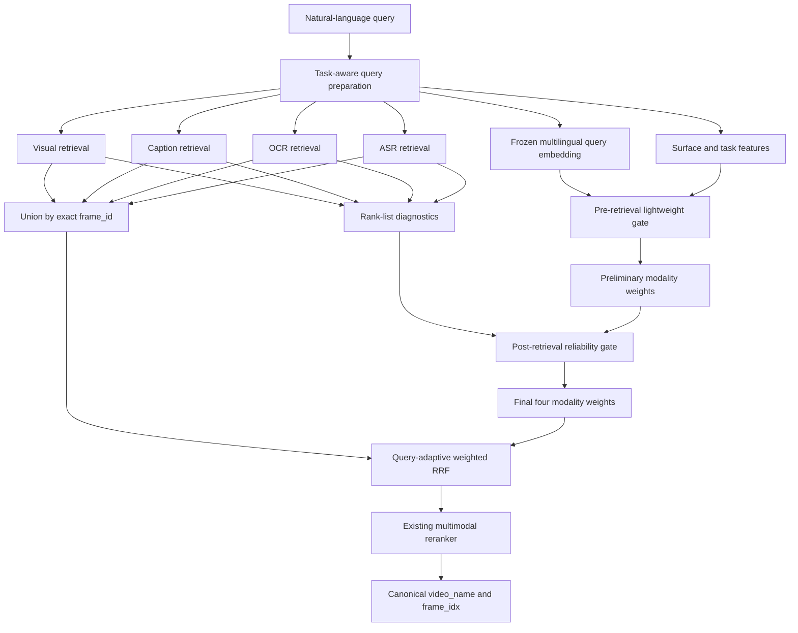

# Adaptive Modality Fusion: Detailed Research and Implementation Plan

Date: 2026-07-31

Status: proposed research and implementation plan. This document does not
claim that query-adaptive fusion improves the HCMAI score until a reproducible
experiment records that result.

Companion document:
[Mathematical Foundations](ADAPTIVE_MODALITY_FUSION_MATHEMATICAL_FOUNDATIONS.md).

Related context:
[Query-Adaptive Multimodal Fusion Research](QUERY_ADAPTIVE_MULTIMODAL_FUSION_RESEARCH.md)
and [Weighted RRF Fusion](WEIGHTED_RRF_FUSION.md).

## 1. Objective

Build and evaluate a lightweight model that predicts query-specific fusion
weights for four existing retrieval sources:

- visual frame retrieval;
- generated-caption retrieval;
- OCR retrieval;
- frame-aligned ASR retrieval.

The model must improve ranked canonical frame retrieval without changing the
underlying indexes or rewriting `frame_id`, `video_id`, or `frame_idx`.

The selected competition path remains:

```text
query
  -> four independent retrieval lists
  -> canonical candidate union
  -> query-adaptive weighted RRF
  -> bounded multimodal reranking
  -> canonical video/frame materialization
```

The first research target is continuous fusion weighting. Hard modality
selection is an optional later efficiency experiment, not the initial system.

## 2. Evidence and rule boundaries

The implementation must keep three evidence levels separate:

1. Confirmed 2025 competition behavior.
2. New official 2026 rules, if and when they are published.
3. Working 2026 product requirements supplied by the user.

The confirmed 2025 ranking utility averages the task-specific best row score
at cutoffs `{1, 5, 20, 50, 100}`. That contract may be used for provisional
research, but it must not be labeled an official 2026 scorer without a new
official source.

Before encoding new 2026 annotations or submission behavior, obtain answers to:

- Are the five ranking cutoffs unchanged?
- What are the official 2026 query types?
- Are KISC and VKIS submission/scoring types or only interactive product
  requirements?
- What exact ground-truth structure is supplied for KIS, VQA, and TRAKE?
- May competition queries and judgments be reused in a paper?

## 3. Success criteria

The proposed method is successful only if it demonstrates all of the
following on held-out queries:

- improvement in exact competition-style Mean Top-k R-Score over equal and
  tuned task-static weighted RRF;
- no regression in canonical frame identity or submission materialization;
- measured warm P50/P95 latency and operator throughput;
- reproducible runs with frozen data split, checkpoints, configuration,
  predictions, and failures;
- a statistically supported gain across multiple seeds or resampled query
  sets;
- ablation evidence showing which query or retrieval signals cause the gain.

An attractive distribution of modality weights is not sufficient evidence.

## 4. Target architecture



### 4.1 Pre-retrieval gate

The first gate consumes:

- a frozen BGE-M3 query embedding;
- task identity;
- query language;
- small deterministic linguistic features.

Models to compare:

1. linear head;
2. one-hidden-layer MLP;
3. rule-based intent router;
4. optional LLM router baseline.

The linear model is mandatory. The MLP is selected only if held-out results
justify its additional capacity.

### 4.2 Post-retrieval reliability gate

The second gate observes the actual result lists and corrects the preliminary
weights using:

- per-source score separation;
- normalized score entropy;
- sorted score-curve shape;
- source coverage;
- video concentration;
- cross-source ranked-list agreement.

Raw SigLIP and BGE-M3 similarities must be calibrated within their own source.
They must not be directly added or assumed comparable.

### 4.3 Fusion layer

The fusion layer remains rank based. It uses the final predicted weights in
the existing weighted-RRF equation. The gate may change ordering but may not
create a candidate or change its canonical identity.

### 4.4 Reranking

The existing multimodal reranker receives the top fused candidate pool.
Router research and reranker research must be ablated separately:

- fusion without reranking;
- static fusion with reranking;
- adaptive fusion with the same reranker.

## 5. Work breakdown

### Phase 0 — Lock the research contract

- [ ] Record the official source and review date for every competition rule.
- [ ] Mark unresolved 2026 behavior explicitly in configs and reports.
- [ ] Select the first task for the notebook experiment.
- [ ] Confirm whether the first experiment may use the 2025 scorer as a
      provisional contract.
- [ ] Confirm whether accepted frame intervals can be materialized through the
      canonical mapping.
- [ ] Freeze the intended visual, caption, OCR, and ASR checkpoints.
- [ ] Freeze the candidate count, rerank count, and RRF constant for the first
      experiment.

Deliverable:

```text
runs/<experiment>/config.yaml
```

Acceptance gate: no unresolved rule is silently encoded as official 2026
behavior.

### Phase 1 — Correct the evaluation foundation

The current baseline evaluator measures ordinary frame recall at
`{1, 5, 10, 100}`. It must be extended before adaptive weights are selected.

- [ ] Implement exact task-specific row R-Scores.
- [ ] Implement Mean Top-k R-Score at `{1, 5, 20, 50, 100}`.
- [ ] Add first-correct rank and MRR.
- [ ] Add task and language breakdowns.
- [ ] Add query-to-first-useful-result latency.
- [ ] Add warm P50/P95 and throughput.
- [ ] Add VQA exact match and configured normalized-answer metric when VQA
      labels are available.
- [ ] Add TRAKE video accuracy, per-event interval accuracy, and full-sequence
      accuracy when TRAKE labels are available.
- [ ] Add focused tests for every scorer using tiny synthetic rankings.

Candidate paths:

```text
src/hcmai/retriever/evaluation/
tests/test_retrieval_metrics.py
```

Acceptance gate: hand-calculated fixtures match the evaluator exactly.

### Phase 2 — Build a frozen query dataset

- [ ] Assign a stable `query_id`.
- [ ] Preserve the original Vietnamese or English query string.
- [ ] Record task type and language.
- [ ] Record canonical accepted frames or accepted video/frame intervals.
- [ ] Record VQA answers without rewriting the submitted string.
- [ ] Record ordered TRAKE event intervals when available.
- [ ] Record KISC conversation state separately from the resolved retrieval
      query.
- [ ] Split by video, not merely by query.
- [ ] Audit near-duplicate and translated queries across splits.
- [ ] Version the query set and mapping artifacts.

Minimum offline record:

```text
query_id
query
task_type
language
frame_id
video_id
frame_idx
source
source_rank
source_score
is_accepted
```

Acceptance gate: no frame index is inferred from timestamp, FPS, filename, or
array position.

### Phase 3 — Cache the four retrieval lists

- [ ] Run each retriever independently with the same query split and filters.
- [ ] Store top candidates, raw source scores, and one-based source ranks.
- [ ] Record source-specific query-encoding and index-search latency.
- [ ] Validate exact joins on `frame_id`.
- [ ] Compute candidate-union coverage.
- [ ] Record queries for which no source retrieves an accepted frame.
- [ ] Freeze these lists for fusion experiments so models compare identical
      candidates.

Required run artifacts:

```text
runs/<run_name>/
├── config.yaml
├── metrics.json
├── per_query.csv
├── predictions.parquet
└── failures.csv
```

Acceptance gate: every cached candidate can materialize to the official video
name and integer `frame_idx`.

### Phase 4 — Run the oracle and complementarity study

Create the proof notebook before extracting a reusable research module:

```text
notebooks/01_adaptive_modality_fusion_oracle.ipynb
```

- [ ] Measure each modality independently.
- [ ] Measure equal-weight RRF.
- [ ] Tune one global static weight vector.
- [ ] Tune one static vector per task.
- [ ] Evaluate every source pair and leave-one-source-out combination.
- [ ] Sample the four-dimensional weight simplex per query.
- [ ] Compute the best attainable query score from the sampled weights.
- [ ] Measure the gap between per-query oracle and task-static fusion.
- [ ] Measure modality complementarity and failure overlap.
- [ ] Analyze Vietnamese, English, mixed, and task-specific subsets.

Acceptance gate: continue to neural routing only if the held-out oracle study
shows meaningful headroom beyond static weights.

### Phase 5 — Establish routing baselines

- [ ] Implement deterministic keyword/rule weights.
- [ ] Implement task-static tuned weights.
- [ ] Evaluate hard one-modality selection as an analytical baseline.
- [ ] Evaluate an optional LLM router offline with frozen outputs.
- [ ] Record router latency and invalid-output rate.
- [ ] Compare source-intent accuracy with actual retrieval utility.

The LLM router is a baseline or offline teacher. It is not enabled on the
default competition path without measured latency, a timeout, and a
deterministic fallback.

Acceptance gate: all routing baselines use the same cached retrieval lists and
exact scorer.

### Phase 6 — Train the query-only lightweight gate

- [ ] Precompute frozen BGE-M3 query embeddings.
- [ ] Implement deterministic surface features.
- [ ] Train a linear four-output gate.
- [ ] Train a one-hidden-layer MLP.
- [ ] Normalize outputs to the weight simplex.
- [ ] Apply and tune a minimum positive modality floor.
- [ ] Use multi-positive listwise ranking loss.
- [ ] Select checkpoints using exact held-out Mean Top-k R-Score.
- [ ] Run multiple seeds.
- [ ] Log per-query weights and failures.
- [ ] Compare query-only weights with static and oracle results.

Acceptance gate: the query-only model must beat the tuned task-static
baseline on held-out data, not only the equal-weight baseline.

### Phase 7 — Add post-retrieval reliability features

Implement feature groups separately:

- [ ] top-score and top-five margin;
- [ ] score standard deviation;
- [ ] normalized score entropy;
- [ ] score-curve area and tail slope;
- [ ] result-list coverage;
- [ ] video-ID concentration;
- [ ] pairwise rank-weighted overlap;
- [ ] same-frame and neighboring-frame agreement;
- [ ] OCR/ASR evidence availability.

Then train:

1. evidence-only gate;
2. query-only gate;
3. query plus evidence residual gate.

Required ablations:

- [ ] remove each diagnostic group;
- [ ] rank-only versus calibrated-score diagnostics;
- [ ] pre-gate only versus post-gate only;
- [ ] soft weights versus hard exclusion;
- [ ] clean versus corrupted OCR/ASR.

Acceptance gate: the hybrid improvement survives video-grouped validation and
is not caused by calibration leakage.

### Phase 8 — Task-specific adaptation

#### Textual KIS

- [ ] Train against accepted canonical frame intervals.
- [ ] Analyze object, action, place, OCR, and speech-oriented queries.
- [ ] Measure first-correct-frame rank at every official cutoff.

#### VQA

- [ ] Route using the question text.
- [ ] Train retrieval weighting against correct video/frame evidence.
- [ ] Evaluate answer production separately.
- [ ] Preserve both exact submitted answer and configured normalized metric.

#### Conversational KIS

- [ ] Route standalone first turns directly.
- [ ] Resolve only genuinely context-dependent follow-ups.
- [ ] Bypass generation for feedback-only turns.
- [ ] Keep accepted/rejected frames in deterministic state.
- [ ] Run the gate on the resolved standalone retrieval query.
- [ ] Test that conversation processing never rewrites candidate identity.

#### TRAKE

- [ ] Represent the query as an ordered list of event queries.
- [ ] Predict one modality-weight vector per event.
- [ ] Retrieve temporal windows rather than isolated images.
- [ ] Jointly align all events on one predicted video.
- [ ] Enforce chronological order.
- [ ] Produce exactly one mapped frame index per event.
- [ ] Evaluate video, event, and full-sequence accuracy.

Acceptance gate: task-specific routing respects each task's output and scoring
semantics.

### Phase 9 — Extract the proven component

Only after the notebook demonstrates a second use, extract a bounded module:

```text
src/hcmai/retriever/fusion/adaptive.py
tests/test_adaptive_fusion.py
```

Planned interface:

```python
class ModalityWeightProvider(Protocol):
    def predict(
        self,
        query: str,
        query_type: TaskType,
        ranked_lists: Mapping[
            RetrievalSource,
            Sequence[RetrievalCandidate],
        ],
    ) -> Mapping[RetrievalSource, float]:
        ...
```

Implementation tasks:

- [ ] Load the gate once at application startup.
- [ ] Validate four finite positive outputs.
- [ ] Normalize predicted weights.
- [ ] Fall back to tuned task-static weights on any failure.
- [ ] Preserve the existing `RetrievalCandidate` contract.
- [ ] Keep unknown public API fields rejected.
- [ ] Record gate latency separately from retrieval and fusion latency.
- [ ] Store the selected checkpoint and revision in `llm/config.yaml`.
- [ ] Keep candidate counts in `configs/baseline.yaml`.

Acceptance gate: fake-model smoke tests cover prediction, fallback, identity
preservation, deterministic ties, and empty inputs.

### Phase 10 — Remove avoidable online overhead

The caption, OCR, and ASR retrievers currently share a BGE-M3 encoder but can
encode the same query separately.

- [ ] Measure repeated query-encoding cost before refactoring.
- [ ] If material, create one request-scoped BGE query representation.
- [ ] Reuse it for caption, OCR, ASR, and the gate.
- [ ] Preserve index/model compatibility checks.
- [ ] Compare P50/P95 before and after reuse.

Acceptance gate: any refactor has an evidence-backed latency benefit and no
retrieval regression.

### Phase 11 — Robustness and generalization

- [ ] Evaluate verified Vietnamese/English query pairs.
- [ ] Test code-switching and diacritics.
- [ ] Corrupt OCR with deletion, substitution, and repeated text.
- [ ] Corrupt ASR with missing segments and transcription noise.
- [ ] Test empty OCR and ASR evidence.
- [ ] Test misleading but high-scoring source lists.
- [ ] Evaluate calibration shift across content categories.
- [ ] Measure per-modality and per-query regret against the oracle.
- [ ] Bootstrap confidence intervals over queries.

Acceptance gate: the paper reports where adaptive fusion fails, not only its
aggregate score.

### Phase 12 — Optional cost-aware hard routing

This phase begins only if four-index search is a measured bottleneck.

- [ ] Measure the real marginal cost of each modality.
- [ ] Threshold or top-p select modalities from pre-retrieval weights.
- [ ] Search selected indexes only.
- [ ] Plot official score against modalities queried and P95 latency.
- [ ] Compare with exhaustive continuous fusion.
- [ ] Add a deterministic exhaustive fallback for uncertainty.

Acceptance gate: hard routing is promoted only if it lies on the selected
accuracy-latency Pareto frontier.

### Phase 13 — Competition and paper packaging

- [ ] Freeze the benchmark-selected pipeline once.
- [ ] Record checkpoint revisions and configuration.
- [ ] Record predictions, metrics, failures, and latency under `runs/`.
- [ ] Export official video names and canonical integer `frame_idx`.
- [ ] Validate CSV/ZIP submission structure with fixtures.
- [ ] Produce the complete ablation table.
- [ ] Produce modality-weight and failure visualizations.
- [ ] Document known 2026 assumptions.
- [ ] State no more than two evidence-backed research gaps.
- [ ] Separate proxy-dataset metrics from HCMAI metrics.

Acceptance gate: no experiment is cited without `metrics.json` and frozen
provenance.

## 6. Baseline matrix

| ID | Method | Purpose |
| --- | --- | --- |
| B0 | Visual only | Visual retrieval floor |
| B1 | Caption only | Generated-text retrieval floor |
| B2 | OCR only | Visible-text retrieval floor |
| B3 | ASR only | Speech retrieval floor |
| B4 | Equal RRF | Current neutral baseline |
| B5 | Global tuned RRF | Static fusion baseline |
| B6 | Task-static tuned RRF | Strong static baseline |
| B7 | Keyword router | Interpretable intent baseline |
| B8 | LLM hard router | Large-router comparison |
| M1 | Linear query gate | Minimal learned router |
| M2 | Query MLP | Nonlinear query routing |
| M3 | Evidence-only gate | Query-performance prediction |
| M4 | Query plus evidence gate | Proposed primary method |
| O1 | Per-query sampled oracle | Fusion headroom |

## 7. Required metrics

For HCMAI-style evaluation:

- Mean Top-k R-Score at `{1, 5, 20, 50, 100}`;
- row-level task R-Scores;
- Recall@1/5/20/50/100;
- MRR and first-correct rank;
- candidate-union recall;
- P50/P95 query encoding, retrieval, gating, fusion, reranking, and total
  latency;
- throughput and query-to-first-useful-result.

Additional task metrics:

- VQA exact match and configured normalized semantic metric;
- TRAKE video accuracy, per-event interval accuracy, and full-sequence
  accuracy;
- KISC resolution rate, bypass rate, and resolution latency.

Router diagnostics:

- average weights by task and language;
- weight entropy;
- regret against per-query oracle;
- invalid prediction and fallback rate;
- average modalities searched for hard-routing experiments.

## 8. Data-splitting and leakage controls

- Split by source video.
- Keep paraphrases and translations of the same query in one split unless
  running an explicitly paired-language experiment.
- Fit score calibration only on the training fold.
- Tune static weights only on the training/tuning fold.
- Select checkpoints on validation, then report once on held-out test data.
- Never create utility labels using test judgments.
- Do not use reranker outputs as gate inputs unless that circular design is an
  explicit separate experiment.

## 9. Risks and mitigations

| Risk | Mitigation |
| --- | --- |
| The candidate pool contains no positive | Record upstream failure; do not train the gate on an all-negative false target |
| Query labels describe intent but not retrieval utility | Train against accepted frames and ranked utility |
| Raw similarities are incomparable | Use ranks or source-specific calibration |
| Caption duplicates visual/OCR content | Include cross-source agreement and redundancy ablations |
| OCR and ASR overlap through subtitles | Keep continuous weights and evaluate ambiguity explicitly |
| Small labeled query set | Start with linear model, task prior, video-grouped validation, and learning curves |
| Gate weights look interpretable but are not calibrated probabilities | Treat them as ranking coefficients and evaluate retrieval utility |
| LLM router adds latency or nondeterminism | Keep it offline or use bounded timeout and static fallback |
| Hard routing removes the only useful source | Keep exhaustive continuous fusion as default |
| 2026 rules differ from 2025 | Version scorers and label assumptions explicitly |

## 10. Recommended order of execution

1. Confirm the evaluation contract.
2. Fix and test the exact scorer.
3. Freeze and audit the query dataset.
4. Cache four independent retrieval lists.
5. Run the oracle/complementarity notebook.
6. Tune strong static baselines.
7. Train the linear query gate.
8. Train the query MLP.
9. Add evidence diagnostics.
10. Extract the proven component.
11. Integrate task-specific KIS, VQA, KISC, and TRAKE behavior.
12. Run robustness, language, and latency experiments.
13. Consider hard routing only after continuous fusion succeeds.
14. Freeze the competition and paper artifacts.

## 11. Primary references

- [Query-Adaptive Fusion for Multimodal Search](https://research.google/pubs/query-adaptive-fusion-for-multimodal-search/)
- [Learning a Text-Video Embedding from Incomplete and Heterogeneous Data](https://arxiv.org/abs/1804.02516)
- [Use What You Have: Video Retrieval Using Representations From Collaborative Experts](https://arxiv.org/abs/1907.13487)
- [Multi-modal Transformer for Video Retrieval](https://www.ecva.net/papers/eccv_2020/papers/123490205.pdf)
- [Query-Adaptive Late Fusion for Image Search and Person Re-Identification](https://openaccess.thecvf.com/content_cvpr_2015/html/Zheng_Query-Adaptive_Late_Fusion_2015_CVPR_paper.html)
- [MMMORRF](https://arxiv.org/abs/2503.20698)
- [Smart Routing for Multimodal Video Retrieval](https://openaccess.thecvf.com/content/ICCV2025W/MRR%202025/html/Dela_Rosa_Smart_Routing_for_Multimodal_Video_Retrieval_When_to_Search_What_ICCVW_2025_paper.html)
- [Mixture of Retrievers](https://aclanthology.org/2025.emnlp-main.601/)
