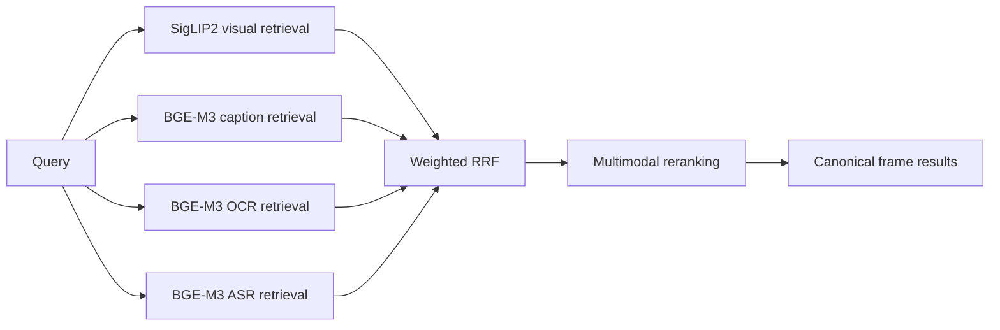
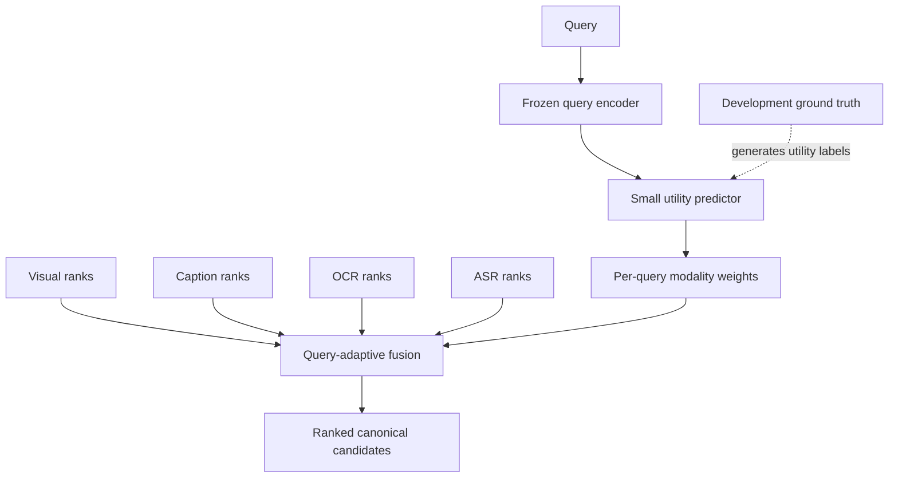
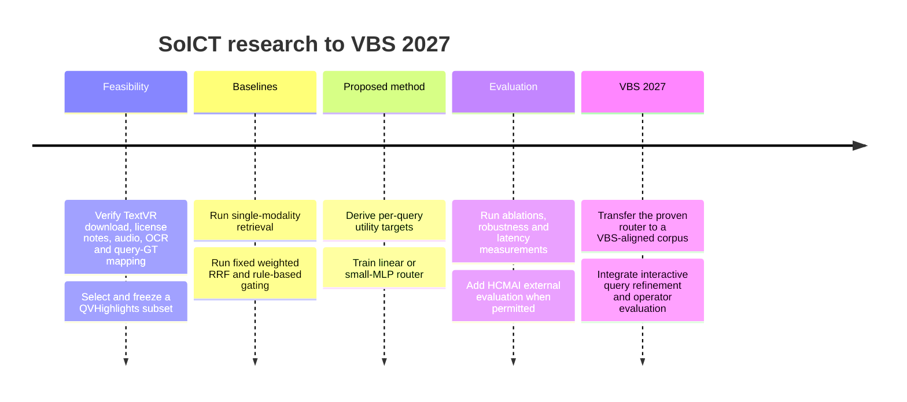

# Query-Adaptive Multimodal Fusion: SoICT to VBS 2027

Date: 2026-07-30

Status: research directions and dataset strategy. This document does not
approve a competition architecture or claim an optimal fusion method.

## Objective

Study how a lightweight model can decide when visual, caption, OCR, and ASR
evidence is useful for a natural-language video query, then use that decision
to improve retrieval over the current fixed weighted-RRF baseline.

The short-term target is the upcoming SoICT submission route associated with
HCMAI participation. The exact extended deadline is user-reported but not yet
recorded. The longer-term target is an interactive system and defensible
research contribution for VBS 2027.

## Evidence boundary

No surveyed public benchmark simultaneously provides all of the following
without a data agreement:

- VBS-style known-item search;
- raw video and canonical keyframes;
- exact-frame or accepted-frame-interval ground truth;
- natural-language queries;
- caption, OCR, and ASR evidence.

V3C/TRECVID is the closest corpus family to VBS, but its access process requires
permission or an organizational form. It is therefore excluded from the
short-term critical path.

The remaining datasets are proxies for different parts of the research
question. Their task semantics and metrics must be reported separately.

## Current retrieval foundation

For task \(t\), source \(m\), candidate \(d\), source rank \(r_m(d)\), and RRF
constant \(k\), the current baseline is:

\[
\operatorname{WRRF}_t(d)
=
\sum_{m \in M(d)}
\frac{w_{t,m}}{k+r_m(d)}
\]

Task-specific fixed weights are a competition baseline, not a research
conclusion.

## Primary research direction

### Retrieval-utility-supervised modality routing

Instead of manually labeling a query as "visual", "OCR", or "ASR", run every
individual retriever against labeled development queries and derive the
supervision from its retrieval utility:

\[
u_m(q)
=
\operatorname{Metric}\left(R_m(q), GT_q\right)
\]

The lightweight router predicts query-conditioned modality weights:

\[
f_\theta(q)
\rightarrow
\left[
w_{\mathrm{visual}},
w_{\mathrm{caption}},
w_{\mathrm{OCR}},
w_{\mathrm{ASR}}
\right]
\]

The weights can be normalized with:

\[
w_m(q)
=
\frac{\exp(z_m(q)/\tau)}
{\sum_j \exp(z_j(q)/\tau)}
\]

The first model should keep the text encoder frozen and train only a linear
head or small MLP. The research claim is not that a small classifier is novel.
The candidate contribution is that supervision comes from measured retrieval
utility under multilingual, noisy, and sometimes missing video evidence.

### Secondary direction: confidence-aware evidence gating

OCR and ASR should not be assumed useful merely because their indexes return
results. Their influence should depend on both query utility and evidence
quality, for example:

\[
\tilde{w}_m(q,d)
=
w_m(q)
\cdot
c_m(d)
\cdot
a_m(d)
\]

where \(c_m(d)\) is evidence confidence and \(a_m(d)\) indicates whether usable
evidence exists for the candidate.

This direction evaluates:

- empty or missing OCR/ASR;
- short, generic, or repeated text;
- OCR recognition noise;
- ASR transcription and temporal-alignment noise;
- hard exclusion versus soft down-weighting.

It should remain an extension of the primary router, not a second independent
paper contribution unless experiments demonstrate a clear and reproducible
gain.

## Dataset strategy without organizational agreements

| Dataset | Research role | Public evidence | Main limitation |
|---|---|---|---|
| TextVR | Primary OCR-aware video retrieval benchmark | 42.2K queries, 10.5K videos, OCR outputs, 5.4 GB resized release and 85 GB original-video release | Video-level GT; dataset-specific video license is not clearly stated in the README |
| QVHighlights | Temporal retrieval and ASR/caption proxy | More than 10K videos, natural-language queries, relevant windows and saliency; annotations are CC BY-NC-SA 4.0 | Not KIS; OCR is not a core modality |
| MSR-VTT | Low-friction text-video retrieval sanity benchmark | 10K short clips and 200K captions | Short and generic clips; weak VBS similarity |
| ActivityNet Captions | Optional temporal generalization benchmark | Long videos with timestamped dense descriptions | Web-video availability and no OCR emphasis |
| YouCook2 | Optional small temporal prototype | Long instructional videos with procedure annotations | Narrow cooking domain |
| MultiVENT 2.0 | Optional high-value event retrieval benchmark | Multilingual event queries over visual, audio, embedded text, and metadata | Gated access and substantially larger scope |
| V3C/TRECVID | Future VBS-aligned benchmark | VBS corpus, shots, and keyframes | Requires permission/data form; excluded now |

### Recommended short-term pair

1. Use TextVR to measure visual, caption, and OCR fusion.
2. Use a fixed QVHighlights subset to measure temporal retrieval and ASR
   contribution.
3. Use HCMAI 2026 queries and competition results as external evaluation if
   the organizers permit their use in the paper.

TextVR and QVHighlights must not be merged into one score. TextVR is primarily
video retrieval; QVHighlights is moment retrieval. Each retains its official
task semantics.

Before committing to TextVR for four-modal experiments, inspect a sample from
the resized release with `ffprobe`. If its audio stream was removed, either use
the original-video release for an explicitly selected subset or report TextVR
as a three-modal experiment.

## Experimental protocol

### Baselines

1. Visual only.
2. Caption only.
3. Visual plus caption with fixed weighted RRF.
4. Four-modal fixed weighted RRF.
5. Rule-based hard/soft OCR and ASR gating.
6. Proposed query-conditioned utility fusion.
7. Proposed fusion plus evidence-confidence gating.

### Ablations

- remove one modality at a time;
- fixed weights versus predicted weights;
- binary routing versus continuous weights;
- hard filtering versus soft down-weighting;
- clean, missing, and synthetically corrupted OCR/ASR;
- English queries versus verified Vietnamese translations;
- linear head versus small MLP;
- fusion before versus after temporal candidate aggregation.

### Metrics

For HCMAI evaluation, record the official Mean Top-k R-Score at
\(\{1,5,20,50,100\}\), Recall@1/5, MRR, and warm P50/P95 latency.

For proxy datasets, retain their native metrics:

- TextVR and MSR-VTT: Recall@K, median rank, and mean rank;
- QVHighlights: moment-retrieval Recall@K at the official temporal-IoU
  thresholds, mAP, and saliency metrics;
- router: modality-utility regret relative to the best per-query oracle.

An oracle upper bound is:

\[
m^*(q)
=
\arg\max_m u_m(q)
\]

and router regret can be measured by:

\[
\operatorname{Regret}(q)
=
u_{m^*(q)}(q)
-
u_{\hat{m}(q)}(q)
\]

All experiment configs, checkpoints, predictions, failures, metrics, and
latency measurements belong under `runs/`. No result should be cited in the
paper without a reproducible run artifact.

## Paper positioning

The defensible SoICT question is:

> Can a lightweight query-conditioned utility predictor improve four-source
> video retrieval over fixed rank fusion when OCR and ASR evidence are noisy or
> missing, without fine-tuning the underlying multimodal encoders?

The paper should not claim:

- a new foundation embedding model;
- a general solution to VBS known-item search;
- exact-frame performance from video-level TextVR labels;
- optimal modality weights without held-out judgments;
- a four-modal result when the evaluated videos do not contain usable audio.

At most two candidate research gaps should be pursued:

1. retrieval-utility-supervised, query-adaptive fusion over visual, caption,
   OCR, and ASR rankings;
2. calibrated soft gating under missing or noisy textual evidence.

## Milestones

## Unresolved decisions

- Record the exact extended SoICT deadline for HCMAI participants.
- Confirm whether HCMAI 2026 queries, judgments, and competition results may be
  reused in a paper.
- Confirm the storage budget: TextVR resized release only, original 85 GB
  release, or a fixed original-video subset.
- Decide whether gated access to MultiVENT 2.0 is acceptable as an optional
  generalization experiment.
- Approve whether video-level TextVR plus temporal QVHighlights is an acceptable
  paper protocol until exact-frame HCMAI judgments are available.

## Primary references

- [TextVR paper](https://arxiv.org/abs/2305.03347)
- [TextVR official repository](https://github.com/callsys/TextVR)
- [QVHighlights paper](https://arxiv.org/abs/2107.09609)
- [QVHighlights official repository](https://github.com/jayleicn/moment_detr)
- [MSR-VTT official paper page](https://www.microsoft.com/en-us/research/publication/msr-vtt-a-large-video-description-dataset-for-bridging-video-and-language/)
- [ActivityNet Captions](https://cs.stanford.edu/people/ranjaykrishna/densevid/)
- [YouCook2](https://youcook2.eecs.umich.edu/)
- [MultiVENT 2.0 paper](https://arxiv.org/abs/2410.11619)
- [MultiVENT 2.0 dataset card](https://huggingface.co/datasets/hltcoe/MultiVENT2.0)
- [V3C research collection](https://www.nist.gov/publications/v3c-research-video-collection)
- [TRECVID data access](https://www-nlpir.nist.gov/projects/tv2025/data.html)
