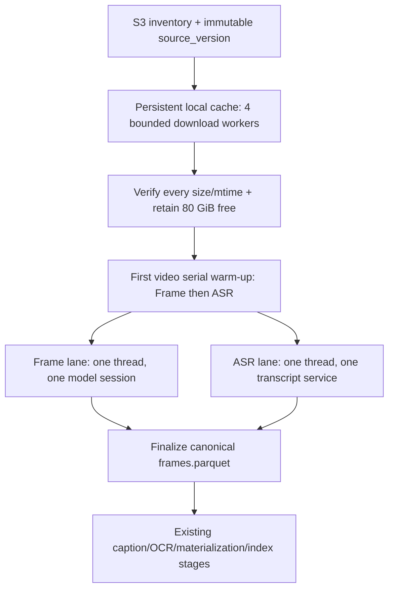

# Thunder Local Cache and Parallel Preparation Implementation Plan

> **For agentic workers:** REQUIRED SUB-SKILL: Use superpowers:subagent-driven-development (recommended) or superpowers:executing-plans to implement this plan task-by-task. Steps use checkbox (`- [ ]`) syntax for tracking.

**Goal:** Process the 77.3 GB / 873-video corpus on ThunderCompute without per-video S3 waits, overlap the independent Frame and ASR lanes safely, remove duplicated end-to-end stages, and preserve canonical artifacts and resumability.

**Architecture:** S3 remains the immutable source of truth and continues to supply object identity (`key`, `size`, `etag`, `last_modified_ns`). Before model work starts, a bounded downloader fills a persistent, version-addressed local source cache; the preparation service then runs one serial Frame lane and one serial ASR lane concurrently over cached files, so no model instance is called concurrently with itself. The existing per-video checkpoints and final frame/ASR materialization remain authoritative.

**Tech Stack:** Python 3.12, Pydantic 2, boto3, `concurrent.futures`, PyAV, OpenCV, TensorFlow/TransNetV2, PyTorch/EfficientGEBD/DINOv2/Qwen ASR/pyannote, pytest, Bash.

---

## Current source findings

- `src/hcmai/data/corpus_build/pipeline.py:508-519` currently performs `download -> frame -> transcript` for one video and only then starts the next video.
- `src/hcmai/data/s3.py:151-178` stores each source in a temporary directory and deletes it when the context exits; a restart therefore downloads the video again.
- `src/hcmai/data/preprocessing/prepare.py:330-355` decodes each video a second time to materialize selected JPEGs. This pass is required by the current selection algorithm and is not changed in the urgent path.
- `src/hcmai/data/enrichment/transcripts/adapters/asr.py:194-200` decodes audio for ASR, then `adapters/diarization.py:70-73` decodes the same audio again for diarization.
- `src/hcmai/data/run_end_to_end.sh` invokes `scripts/thunder_batch_launcher.sh`, whose `prepare_s3_corpus.py` already runs every enabled stage, and then invokes embedding/caption/OCR/ASR/index scripts again. Those later calls duplicate work and also point at legacy `artifacts/` paths rather than the isolated preparation root.
- `PreprocessingConfig.max_video_workers` is already used by the separate local frame-store API and shares model objects between its threads. It must not be reused as an S3 download or Frame/ASR lane setting.
- The checked-in worktree already contains a user change in `src/hcmai/data/preprocessing/models.py`; this plan does not revert or replace it.

## Scope and non-goals

This plan deliberately covers one deployable optimization project, split into independently testable commits:

1. persistent S3-backed local source cache;
2. bounded cache population and disk guard;
3. one Frame lane plus one ASR lane;
4. one audio decode shared by ASR and diarization;
5. a single end-to-end entry point and Thunder runbook.

The urgent implementation does **not**:

- change TensorFlow GPU setup;
- change frame IDs, timestamps, PTS, image quality, selection thresholds, model pins, or corpus revision;
- lower `efficientgebd_sample_fps` or replace optical flow, because those can change retrieval evidence;
- run two calls concurrently through the same TransNet, EfficientGEBD, DINO, ASR, or diarization instance;
- use a second GPU; multi-GPU requires corpus sharding into one process per GPU and is a separate project;
- touch TRAKE.

## File structure and ownership

| File | Responsibility after this plan |
|---|---|
| `src/hcmai/data/preprocessing/config.py` | S3 cache path only; transport schema remains colocated with S3 settings. |
| `src/hcmai/data/corpus_build/config.py` | Execution-only concurrency and disk-reserve policy. |
| `src/hcmai/data/corpus_build/source_cache.py` | Atomic persistent download, validation, reuse, bounded population, disk preflight. |
| `src/hcmai/data/corpus_build/execution.py` | Serial fallback and two independent preparation lanes with cooperative failure. |
| `src/hcmai/data/corpus_build/pipeline.py` | Compose inventory, cache, lanes, existing finalization and stage markers. |
| `src/hcmai/data/enrichment/transcripts/adapters/asr.py` | Transcribe an already decoded immutable audio object. |
| `src/hcmai/data/enrichment/transcripts/adapters/diarization.py` | Assign speakers from the same decoded audio object. |
| `src/hcmai/data/enrichment/transcripts/prepare.py` | Decode audio once and pass it to both transcript adapters. |
| `scripts/prepare_s3_corpus.py` | Expose `--cache-only` without duplicating orchestration. |
| `scripts/thunder_batch_launcher.sh` | Forward config/cache/resume flags and optionally skip dependency reinstall. |
| `scripts/auto_backup_s3.sh` | Back up only artifacts and run state; never re-upload the 77.3 GB source cache. |
| `src/hcmai/data/run_end_to_end.sh` | Setup models once and delegate the pipeline once. |
| `configs/preparation.s3.yaml` | Explicit Thunder cache, 4 download workers, 80 GiB artifact reserve, Frame/ASR overlap. |

## Target runtime flow



The first video is deliberately processed serially. This initializes TensorFlow and PyTorch models without simultaneous first-load races. Starting from video 2, each lane remains serial internally but the two lanes overlap.

### Task 1: Add explicit cache and execution configuration

**Files:**
- Modify: `src/hcmai/data/preprocessing/config.py:33-49`
- Modify: `src/hcmai/data/corpus_build/config.py:58-162`
- Modify: `src/hcmai/data/corpus_build/__init__.py:10-36`
- Test: `tests/corpus_build/test_preparation_config.py`

- [ ] **Step 1: Add failing configuration tests**

Add the cache fields to `_values()` and add these tests:

```python
def test_thunder_cache_and_execution_policy_are_validated(tmp_path: Path) -> None:
    values = _values(tmp_path)
    preprocessing = values["preprocessing"]
    assert isinstance(preprocessing, dict)
    storage = preprocessing["s3"]
    assert isinstance(storage, dict)
    storage["cache_root"] = values["work_root"] / "source-cache"
    values["execution"] = {
        "cache_download_workers": 4,
        "minimum_free_gib_after_cache": 80,
        "overlap_frame_asr": True,
    }

    config = S3CorpusPreparationConfig.model_validate(values)

    assert config.preprocessing.s3 is not None
    assert config.preprocessing.s3.cache_root == (
        config.work_root / "source-cache"
    ).resolve()
    assert config.execution.cache_download_workers == 4
    assert config.execution.minimum_free_gib_after_cache == 80
    assert config.execution.overlap_frame_asr is True


def test_overlap_requires_a_persistent_source_cache(tmp_path: Path) -> None:
    values = _values(tmp_path)
    values["execution"] = {"overlap_frame_asr": True}

    with pytest.raises(ValidationError, match="persistent source cache"):
        S3CorpusPreparationConfig.model_validate(values)


def test_source_cache_must_stay_inside_work_root(tmp_path: Path) -> None:
    values = _values(tmp_path)
    preprocessing = values["preprocessing"]
    assert isinstance(preprocessing, dict)
    storage = preprocessing["s3"]
    assert isinstance(storage, dict)
    storage["cache_root"] = (tmp_path / "other-run/cache").resolve()

    with pytest.raises(ValidationError, match="cache_root must be inside work_root"):
        S3CorpusPreparationConfig.model_validate(values)


def test_s3_location_accepts_explicit_deployment_environment_overrides(
    tmp_path: Path,
    monkeypatch: pytest.MonkeyPatch,
) -> None:
    import yaml

    baseline = S3CorpusPreparationConfig.model_validate(_values(tmp_path))
    path = tmp_path / "preparation.yaml"
    path.write_text(
        yaml.safe_dump({"preparation": baseline.model_dump(mode="json")}),
        encoding="utf-8",
    )
    monkeypatch.setenv("HCMAI_S3_BUCKET", "verified-us-bucket")
    monkeypatch.setenv("HCMAI_S3_REGION", "us-east-2")

    loaded = S3CorpusPreparationConfig.from_yaml(path)

    assert loaded.preprocessing.s3 is not None
    assert loaded.preprocessing.s3.bucket == "verified-us-bucket"
    assert loaded.preprocessing.s3.region == "us-east-2"
```

- [ ] **Step 2: Run the tests and verify the missing fields fail**

Run:

```bash
aic/bin/python -m pytest tests/corpus_build/test_preparation_config.py -q
```

Expected: the new tests fail because `cache_root` and `execution` do not exist.

- [ ] **Step 3: Add the minimal configuration contracts**

In `src/hcmai/data/preprocessing/config.py`, add one optional persistent cache root without changing `max_video_workers`:

```python
class S3PreprocessingConfig(BaseModel):
    """Offline S3 transport for raw videos and versioned frame artifacts."""

    bucket: str = Field(min_length=3)
    videos_prefix: str = "videos"
    artifacts_prefix: str = "artifacts"
    smoke_artifacts_prefix: str = "artifacts/smoke"
    region: str | None = None
    endpoint_url: str | None = None
    staging_root: Path | None = None
    cache_root: Path | None = None
    connect_timeout_seconds: float = Field(default=10.0, gt=0)
    read_timeout_seconds: float = Field(default=300.0, gt=0)
    max_attempts: int = Field(default=4, ge=1, le=10)
```

In `src/hcmai/data/corpus_build/config.py`, import `os`, then add the runtime
policy immediately before `S3CorpusPreparationConfig`:

```python
class PreparationExecutionConfig(BaseModel):
    """Resource policy that changes scheduling, never canonical identity."""

    cache_download_workers: int = Field(default=4, ge=1, le=16)
    minimum_free_gib_after_cache: int = Field(default=80, ge=20)
    overlap_frame_asr: bool = False
```

Add the field to `S3CorpusPreparationConfig`:

```python
execution: PreparationExecutionConfig = Field(
    default_factory=PreparationExecutionConfig
)
```

Extend `validate_production_boundaries()` after the staging validation:

```python
cache = preprocessing.s3.cache_root
if cache is not None:
    cache_root = _resolved_absolute(cache, "s3.cache_root")
    _reject_legacy_local(cache_root, "s3.cache_root")
    if not _inside(cache_root, self.work_root):
        raise ValueError("s3.cache_root must be inside work_root")
    preprocessing.s3.cache_root = cache_root
if self.execution.overlap_frame_asr and cache is None:
    raise ValueError(
        "Frame/ASR overlap requires a persistent source cache"
    )
```

Update `S3CorpusPreparationConfig.from_yaml()` so deployment can select the
verified bucket without committing infrastructure-specific names. The
overridden values are validated and included in the existing run fingerprint:

```python
@classmethod
def from_yaml(cls, path: str | Path) -> S3CorpusPreparationConfig:
    with Path(path).open(encoding="utf-8") as handle:
        values: dict[str, Any] = yaml.safe_load(handle) or {}
    preparation = values.get("preparation", values)
    if not isinstance(preparation, dict):
        raise ValueError("preparation YAML requires a mapping")
    preparation = dict(preparation)
    preprocessing = dict(preparation.get("preprocessing", {}))
    storage = dict(preprocessing.get("s3", {}))
    bucket = os.getenv("HCMAI_S3_BUCKET")
    region = os.getenv("HCMAI_S3_REGION")
    if bucket:
        storage["bucket"] = bucket
    if region:
        storage["region"] = region
    preprocessing["s3"] = storage
    preparation["preprocessing"] = preprocessing
    return cls.model_validate(preparation)
```

Export `PreparationExecutionConfig` from
`src/hcmai/data/corpus_build/__init__.py` beside the other configuration
contracts.

- [ ] **Step 4: Run the focused configuration tests**

Run:

```bash
aic/bin/python -m pytest tests/corpus_build/test_preparation_config.py -q
```

Expected: all configuration tests pass, including the existing S3-only and model-pin constraints.

- [ ] **Step 5: Commit the contract**

```bash
git add src/hcmai/data/preprocessing/config.py src/hcmai/data/corpus_build/config.py src/hcmai/data/corpus_build/__init__.py tests/corpus_build/test_preparation_config.py
git commit -m "feat(data): configure persistent Thunder source cache"
```

### Task 2: Build an atomic, reusable source-video cache

**Files:**
- Create: `src/hcmai/data/corpus_build/source_cache.py`
- Create: `tests/corpus_build/test_source_cache.py`

- [ ] **Step 1: Write cache reuse, corruption and disk-guard tests**

Create `tests/corpus_build/test_source_cache.py`:

```python
from __future__ import annotations

from datetime import UTC, datetime
from pathlib import Path
from types import SimpleNamespace

import pytest

from hcmai.data.corpus_build.source_cache import SourceVideoCache
from hcmai.data.s3 import S3VideoObject


class _Client:
    def __init__(self, payloads: dict[str, bytes]) -> None:
        self.payloads = payloads
        self.downloads: list[str] = []

    def download_file(self, bucket: str, key: str, filename: str) -> None:
        assert bucket == "bucket"
        self.downloads.append(key)
        Path(filename).write_bytes(self.payloads[key])


def _source(key: str, payload: bytes, second: int) -> S3VideoObject:
    return S3VideoObject(
        key=key,
        size=len(payload),
        etag=f"etag-{second}",
        last_modified_ns=round(
            datetime(2026, 8, 16, 1, 0, second, tzinfo=UTC).timestamp()
            * 1_000_000_000
        ),
    )


def test_population_is_atomic_and_reuses_valid_files(tmp_path: Path) -> None:
    payloads = {"data/V001.mp4": b"one", "data/V002.mp4": b"two"}
    sources = [
        _source("data/V001.mp4", payloads["data/V001.mp4"], 1),
        _source("data/V002.mp4", payloads["data/V002.mp4"], 2),
    ]
    client = _Client(payloads)
    cache = SourceVideoCache(client, "bucket", tmp_path / "cache")

    first = cache.populate(sources, max_workers=2, minimum_free_bytes=0)
    second = cache.populate(sources, max_workers=2, minimum_free_bytes=0)

    assert first.downloaded_count == 2
    assert first.reused_count == 0
    assert second.downloaded_count == 0
    assert second.reused_count == 2
    assert sorted(client.downloads) == ["data/V001.mp4", "data/V002.mp4"]
    assert [path.read_bytes() for path in first.paths] == [b"one", b"two"]
    assert not list((tmp_path / "cache").rglob("*.partial"))


def test_invalid_cached_size_is_downloaded_again(tmp_path: Path) -> None:
    payload = b"correct"
    source = _source("data/V001.mp4", payload, 1)
    client = _Client({source.key: payload})
    cache = SourceVideoCache(client, "bucket", tmp_path / "cache")
    target = cache.path_for(source)
    target.parent.mkdir(parents=True)
    target.write_bytes(b"bad")

    result = cache.populate([source], max_workers=1, minimum_free_bytes=0)

    assert result.downloaded_count == 1
    assert target.read_bytes() == payload


def test_population_rejects_insufficient_disk_before_downloading(
    tmp_path: Path, monkeypatch: pytest.MonkeyPatch
) -> None:
    payload = b"video"
    source = _source("data/V001.mp4", payload, 1)
    client = _Client({source.key: payload})
    cache = SourceVideoCache(client, "bucket", tmp_path / "cache")
    monkeypatch.setattr(
        "hcmai.data.corpus_build.source_cache.shutil.disk_usage",
        lambda _: SimpleNamespace(total=100, used=90, free=10),
    )

    with pytest.raises(OSError, match="Insufficient disk"):
        cache.populate([source], max_workers=1, minimum_free_bytes=8)

    assert client.downloads == []
```

- [ ] **Step 2: Run the new tests and verify the module is missing**

Run:

```bash
aic/bin/python -m pytest tests/corpus_build/test_source_cache.py -q
```

Expected: collection fails with `ModuleNotFoundError: hcmai.data.corpus_build.source_cache`.

- [ ] **Step 3: Implement the complete cache module**

Create `src/hcmai/data/corpus_build/source_cache.py`:

```python
"""Persistent, version-addressed cache for immutable S3 source videos."""

from __future__ import annotations

import logging
import os
import shutil
from concurrent.futures import ThreadPoolExecutor
from dataclasses import dataclass
from pathlib import Path
from time import perf_counter
from typing import Any

from hcmai.data.s3 import S3VideoObject

logger = logging.getLogger(__name__)


@dataclass(frozen=True, slots=True)
class CachePopulation:
    paths: tuple[Path, ...]
    downloaded_count: int
    reused_count: int
    total_bytes: int
    duration_seconds: float


class SourceVideoCache:
    """Download each immutable S3 object once and reuse it across resumes."""

    def __init__(self, client: Any, bucket: str, root: Path) -> None:
        self.client = client
        self.bucket = bucket
        self.root = root.expanduser().resolve()

    def path_for(self, source: S3VideoObject) -> Path:
        suffix = Path(source.key).suffix.lower()
        return self.root / source.source_version / f"{source.video_id}{suffix}"

    def is_valid(self, source: S3VideoObject) -> bool:
        path = self.path_for(source)
        return (
            path.is_file()
            and path.stat().st_size == source.size
            and path.stat().st_mtime_ns == source.last_modified_ns
        )

    def ensure(self, source: S3VideoObject) -> tuple[Path, bool]:
        target = self.path_for(source)
        if self.is_valid(source):
            return target, False
        target.parent.mkdir(parents=True, exist_ok=True)
        partial = target.with_name(f".{target.name}.partial")
        partial.unlink(missing_ok=True)
        try:
            self.client.download_file(self.bucket, source.key, str(partial))
            if not partial.is_file() or partial.stat().st_size != source.size:
                raise OSError(
                    f"Downloaded size mismatch for s3://{self.bucket}/{source.key}"
                )
            os.utime(
                partial,
                ns=(source.last_modified_ns, source.last_modified_ns),
            )
            partial.replace(target)
        finally:
            partial.unlink(missing_ok=True)
        return target, True

    def populate(
        self,
        sources: list[S3VideoObject],
        *,
        max_workers: int,
        minimum_free_bytes: int,
    ) -> CachePopulation:
        started = perf_counter()
        self.root.mkdir(parents=True, exist_ok=True)
        missing_bytes = sum(
            source.size for source in sources if not self.is_valid(source)
        )
        free = shutil.disk_usage(self.root).free
        required = missing_bytes + minimum_free_bytes
        if missing_bytes > 0 and free < required:
            raise OSError(
                "Insufficient disk for source cache: "
                f"free={free} required={required} "
                f"downloads={missing_bytes} reserve={minimum_free_bytes}"
            )
        with ThreadPoolExecutor(
            max_workers=max_workers,
            thread_name_prefix="hcmai-s3-cache",
        ) as executor:
            results = list(executor.map(self.ensure, sources))
        paths = tuple(path for path, _ in results)
        downloaded = sum(was_downloaded for _, was_downloaded in results)
        duration = perf_counter() - started
        logger.info(
            "Source cache ready: videos=%d downloaded=%d reused=%d bytes=%d seconds=%.1f",
            len(sources),
            downloaded,
            len(sources) - downloaded,
            sum(source.size for source in sources),
            duration,
        )
        return CachePopulation(
            paths=paths,
            downloaded_count=downloaded,
            reused_count=len(sources) - downloaded,
            total_bytes=sum(source.size for source in sources),
            duration_seconds=duration,
        )
```

- [ ] **Step 4: Run the cache tests**

Run:

```bash
aic/bin/python -m pytest tests/corpus_build/test_source_cache.py -q
```

Expected: `3 passed`; the second population performs no download and stale partial files are absent.

- [ ] **Step 5: Commit the cache**

```bash
git add src/hcmai/data/corpus_build/source_cache.py tests/corpus_build/test_source_cache.py
git commit -m "feat(data): cache immutable S3 videos locally"
```

### Task 3: Expose cache-only population for the 77.3 GB corpus

**Files:**
- Modify: `src/hcmai/data/corpus_build/pipeline.py:120-136,437-486`
- Modify: `src/hcmai/data/corpus_build/__init__.py:14-36`
- Modify: `scripts/prepare_s3_corpus.py:20-86`
- Test: `tests/corpus_build/test_preparation_pipeline.py`

- [ ] **Step 1: Add a failing cache-only service and CLI test**

Extend `_config()` in `tests/corpus_build/test_preparation_pipeline.py` with:

```python
"cache_root": work / "source-cache",
```

under `preprocessing.s3`, and add:

```python
def test_cache_only_records_inventory_and_downloads_without_model_work(
    tmp_path: Path,
) -> None:
    config = _config(tmp_path)
    client = _FakeS3()
    operations = _Operations(PreparationPaths.from_config(config, None))
    service = S3CorpusPreparationService(
        config,
        client=client,
        operations=operations,
    )

    result = service.cache_sources()

    assert result.source_count == 2
    assert result.downloaded_count == 2
    assert result.reused_count == 0
    assert result.total_bytes == sum(map(len, client.objects.values()))
    assert result.cache_root == config.preprocessing.s3.cache_root
    assert operations.events == []
    assert result.inventory_path.is_file()


def test_cli_cache_only_uses_cache_boundary(tmp_path: Path, monkeypatch, capsys) -> None:
    config = object()
    expected = PreparationCacheRun(
        run_id="c" * 64,
        inventory_path=tmp_path / "run.json",
        cache_root=tmp_path / "source-cache",
        source_count=2,
        downloaded_count=2,
        reused_count=0,
        total_bytes=30,
        duration_seconds=1.5,
    )

    class _Config:
        @staticmethod
        def from_yaml(path: Path):
            return config

    class _Service:
        def __init__(self, active, **options) -> None:
            assert active is config

        @staticmethod
        def cache_sources() -> PreparationCacheRun:
            return expected

    monkeypatch.setattr(cli, "S3CorpusPreparationConfig", _Config)
    monkeypatch.setattr(cli, "S3CorpusPreparationService", _Service)

    assert cli.main(["--config", str(tmp_path / "config.yaml"), "--cache-only"]) == 0
    output = capsys.readouterr().out
    assert "Cache downloaded: 2" in output
    assert "Cache reused: 0" in output
    assert "Status: CACHED" in output
```

Import `PreparationCacheRun` from `hcmai.data.corpus_build` in the test module.

- [ ] **Step 2: Run both focused tests and verify failure**

Run:

```bash
aic/bin/python -m pytest \
  tests/corpus_build/test_preparation_pipeline.py::test_cache_only_records_inventory_and_downloads_without_model_work \
  tests/corpus_build/test_preparation_pipeline.py::test_cli_cache_only_uses_cache_boundary -q
```

Expected: failure because `PreparationCacheRun`, `cache_sources()` and `--cache-only` are absent.

- [ ] **Step 3: Add the cache result and service method**

In `pipeline.py`, import `SourceVideoCache`, then add beside `PreparationRun`:

```python
@dataclass(frozen=True, slots=True)
class PreparationCacheRun:
    run_id: str
    inventory_path: Path
    cache_root: Path
    source_count: int
    downloaded_count: int
    reused_count: int
    total_bytes: int
    duration_seconds: float
```

Add these methods to `S3CorpusPreparationService`:

```python
def _source_cache(self) -> SourceVideoCache:
    root = self.storage.cache_root
    if root is None:
        raise ValueError("cache-only preparation requires s3.cache_root")
    return SourceVideoCache(self.client, self.storage.bucket, root)

def _sources_and_inventory(
    self,
) -> tuple[list[S3VideoObject], str, Path]:
    sources = list_video_objects(self.client, self.storage, limit=self.limit)
    logger.info("Loaded %d videos from S3 inventory.", len(sources))
    run_id, inventory = self._record_inventory(sources)
    return sources, run_id, inventory

def cache_sources(self) -> PreparationCacheRun:
    sources, run_id, inventory = self._sources_and_inventory()
    minimum_free_bytes = (
        self.config.execution.minimum_free_gib_after_cache * 1024**3
    )
    population = self._source_cache().populate(
        sources,
        max_workers=self.config.execution.cache_download_workers,
        minimum_free_bytes=minimum_free_bytes,
    )
    assert self.storage.cache_root is not None
    return PreparationCacheRun(
        run_id=run_id,
        inventory_path=inventory,
        cache_root=self.storage.cache_root,
        source_count=len(sources),
        downloaded_count=population.downloaded_count,
        reused_count=population.reused_count,
        total_bytes=population.total_bytes,
        duration_seconds=population.duration_seconds,
    )
```

Replace the inventory setup at the beginning of `run()` with:

```python
sources, run_id, inventory = self._sources_and_inventory()
```

Export `PreparationCacheRun` in `src/hcmai/data/corpus_build/__init__.py`.

- [ ] **Step 4: Add the CLI switch and stable output**

In `parse_args()`:

```python
parser.add_argument(
    "--cache-only",
    action="store_true",
    help="Populate and verify the persistent source cache, then exit.",
)
```

In `main()`, construct the service once and branch:

```python
service = S3CorpusPreparationService(
    config,
    resume=not args.no_resume,
    limit=args.limit,
    enrichment_config=args.enrichment_config,
    model_config=args.model_config,
    retrieval_config=args.retrieval_config,
)
if args.cache_only:
    cached = service.cache_sources()
    print(f"Run ID: {cached.run_id}")
    print(f"S3 videos: {cached.source_count}")
    print(f"Inventory: {cached.inventory_path}")
    print(f"Cache root: {cached.cache_root}")
    print(f"Cache downloaded: {cached.downloaded_count}")
    print(f"Cache reused: {cached.reused_count}")
    print(f"Cache bytes: {cached.total_bytes}")
    print(f"Cache seconds: {cached.duration_seconds:.1f}")
    print("Status: CACHED")
    return 0
run = service.run()
```

- [ ] **Step 5: Run the pipeline/CLI tests**

Run:

```bash
aic/bin/python -m pytest tests/corpus_build/test_preparation_pipeline.py -q
```

Expected: all tests pass; cache-only produces no frame/transcript events.

- [ ] **Step 6: Commit cache-only orchestration**

```bash
git add src/hcmai/data/corpus_build/pipeline.py src/hcmai/data/corpus_build/__init__.py scripts/prepare_s3_corpus.py tests/corpus_build/test_preparation_pipeline.py
git commit -m "feat(data): add cache-only corpus preparation"
```

### Task 4: Add a bounded Frame/ASR lane scheduler

**Files:**
- Create: `src/hcmai/data/corpus_build/execution.py`
- Create: `tests/corpus_build/test_preparation_execution.py`

- [ ] **Step 1: Write deterministic overlap and serial-fallback tests**

Create `tests/corpus_build/test_preparation_execution.py`:

```python
from __future__ import annotations

import threading
from pathlib import Path

from hcmai.data.corpus_build.execution import prepare_cached_sources
from hcmai.data.s3 import S3VideoObject


def _source(index: int) -> S3VideoObject:
    return S3VideoObject(
        key=f"data/V{index:03d}.mp4",
        size=1,
        etag=f"etag-{index}",
        last_modified_ns=index,
    )


def test_first_video_warms_serially_then_frame_and_asr_overlap(tmp_path: Path) -> None:
    sources = [_source(1), _source(2), _source(3)]
    paths = {source.video_id: tmp_path / f"{source.video_id}.mp4" for source in sources}
    for path in paths.values():
        path.write_bytes(b"x")
    frame_entered = threading.Event()
    asr_entered = threading.Event()
    events: list[str] = []

    def frame(path: Path, source: S3VideoObject) -> str:
        events.append(f"frame:{source.video_id}")
        if source.video_id == "V002":
            frame_entered.set()
            assert asr_entered.wait(timeout=2)
        return source.video_id

    def transcript(path: Path) -> Path:
        events.append(f"asr:{path.stem}")
        if path.stem == "V002":
            asr_entered.set()
            assert frame_entered.wait(timeout=2)
        return path

    tables = prepare_cached_sources(
        sources,
        resolve=lambda source: paths[source.video_id],
        prepare_frame=frame,
        prepare_transcript=transcript,
        frame_pending=True,
        asr_pending=True,
        overlap=True,
    )

    assert events[:2] == ["frame:V001", "asr:V001"]
    assert tables == ["V001", "V002", "V003"]
    assert sorted(event for event in events if event.startswith("frame:")) == [
        "frame:V001", "frame:V002", "frame:V003"
    ]
    assert sorted(event for event in events if event.startswith("asr:")) == [
        "asr:V001", "asr:V002", "asr:V003"
    ]


def test_disabled_overlap_preserves_per_video_order(tmp_path: Path) -> None:
    sources = [_source(1), _source(2)]
    events: list[str] = []

    def resolve(source: S3VideoObject) -> Path:
        return tmp_path / f"{source.video_id}.mp4"

    prepare_cached_sources(
        sources,
        resolve=resolve,
        prepare_frame=lambda path, source: events.append(f"frame:{source.video_id}"),
        prepare_transcript=lambda path: events.append(f"asr:{path.stem}"),
        frame_pending=True,
        asr_pending=True,
        overlap=False,
    )

    assert events == ["frame:V001", "asr:V001", "frame:V002", "asr:V002"]
```

- [ ] **Step 2: Run the tests and verify the execution module is missing**

Run:

```bash
aic/bin/python -m pytest tests/corpus_build/test_preparation_execution.py -q
```

Expected: collection fails with `ModuleNotFoundError`.

- [ ] **Step 3: Implement serial warm-up and two serial lanes**

Create `src/hcmai/data/corpus_build/execution.py`:

```python
"""Bounded execution policy for cached Frame and ASR preparation."""

from __future__ import annotations

import logging
from collections.abc import Callable, Sequence
from concurrent.futures import FIRST_EXCEPTION, ThreadPoolExecutor, wait
from pathlib import Path
from threading import Event
from time import perf_counter
from typing import Any

from hcmai.data.s3 import S3VideoObject

logger = logging.getLogger(__name__)


def prepare_cached_sources(
    sources: Sequence[S3VideoObject],
    *,
    resolve: Callable[[S3VideoObject], Path],
    prepare_frame: Callable[[Path, S3VideoObject], Any],
    prepare_transcript: Callable[[Path], Path],
    frame_pending: bool,
    asr_pending: bool,
    overlap: bool,
) -> list[Any]:
    """Prepare cached sources while each model-owning lane stays serial."""

    prepared: list[Any] = []
    if not sources:
        return prepared
    if not overlap or not (frame_pending and asr_pending) or len(sources) == 1:
        for source in sources:
            video = resolve(source)
            if frame_pending:
                prepared.append(prepare_frame(video, source))
            if asr_pending:
                prepare_transcript(video)
        return prepared

    first, remaining = sources[0], sources[1:]
    first_video = resolve(first)
    prepared.append(prepare_frame(first_video, first))
    prepare_transcript(first_video)
    stop = Event()

    def frame_lane() -> list[Any]:
        started = perf_counter()
        tables: list[Any] = []
        for source in remaining:
            if stop.is_set():
                break
            tables.append(prepare_frame(resolve(source), source))
        logger.info(
            "Frame lane finished: videos=%d seconds=%.1f",
            len(tables),
            perf_counter() - started,
        )
        return tables

    def asr_lane() -> None:
        started = perf_counter()
        count = 0
        for source in remaining:
            if stop.is_set():
                break
            prepare_transcript(resolve(source))
            count += 1
        logger.info(
            "ASR lane finished: videos=%d seconds=%.1f",
            count,
            perf_counter() - started,
        )

    with ThreadPoolExecutor(
        max_workers=2,
        thread_name_prefix="hcmai-preparation",
    ) as executor:
        frame_future = executor.submit(frame_lane)
        asr_future = executor.submit(asr_lane)
        done, _ = wait((frame_future, asr_future), return_when=FIRST_EXCEPTION)
        failed = next((future for future in done if future.exception()), None)
        if failed is not None:
            stop.set()
        for future in (frame_future, asr_future):
            future.result()
    prepared.extend(frame_future.result())
    return prepared
```

This implementation has exactly two long-lived worker threads, not one future per video. Memory therefore remains bounded, each model object has one caller, and an exception prevents new work from being started by the other lane.

- [ ] **Step 4: Run scheduler tests**

Run:

```bash
aic/bin/python -m pytest tests/corpus_build/test_preparation_execution.py -q
```

Expected: `2 passed`, including the barrier proving real Frame/ASR overlap from video 2.

- [ ] **Step 5: Commit the scheduler**

```bash
git add src/hcmai/data/corpus_build/execution.py tests/corpus_build/test_preparation_execution.py
git commit -m "feat(data): overlap serial frame and ASR lanes"
```

### Task 5: Integrate cache and lanes without changing canonical finalization

**Files:**
- Modify: `src/hcmai/data/corpus_build/pipeline.py:437-558`
- Modify: `tests/corpus_build/test_preparation_pipeline.py`

- [ ] **Step 1: Add an integration test that verifies one cache fill, lane use and resume**

Add to `tests/corpus_build/test_preparation_pipeline.py`:

```python
def test_cached_parallel_run_reuses_sources_and_preserves_finalization(
    tmp_path: Path,
) -> None:
    config = _config(tmp_path)
    config.execution.overlap_frame_asr = True
    client = _FakeS3()
    paths = PreparationPaths.from_config(config, None)
    operations = _Operations(paths)
    service = S3CorpusPreparationService(
        config,
        client=client,
        operations=operations,
    )

    first = service.run()
    first_events = tuple(operations.events)
    second = service.run()

    assert client.downloads == [
        "videos/L21_V001.mp4",
        "videos/L21_V002.mp4",
    ]
    assert first_events[:2] == ("frame:L21_V001", "transcript:L21_V001")
    assert first_events.count("finalize_frames") == 1
    assert tuple(operations.events) == first_events
    assert first.run_id == second.run_id
    assert paths.frames_path.is_file()
    assert paths.asr_enrichment_path.is_file()
```

Ensure `_Operations.prepare_transcript()` no longer assumes `video == self.staged_paths[-1]`, because the two lanes intentionally access different cached videos. Keep the assertions that the path exists and contains the expected source bytes.

- [ ] **Step 2: Run the new integration test and verify the current sequential loop fails its expectations**

Run:

```bash
aic/bin/python -m pytest tests/corpus_build/test_preparation_pipeline.py::test_cached_parallel_run_reuses_sources_and_preserves_finalization -q
```

Expected: fail because `run()` still uses `staged_video()` and does not populate/use the persistent cache.

- [ ] **Step 3: Compose the persistent-cache path in `run()`**

Import:

```python
from hcmai.data.corpus_build.execution import prepare_cached_sources
```

Replace only the current `if frame_pending or asr_pending:` source loop with:

```python
prepared: list[Any] = []
if frame_pending or asr_pending:
    logger.info("Starting Video Frame & ASR Preparation Stage...")
    cache_root = self.storage.cache_root
    if cache_root is None:
        for index, source in enumerate(sources, start=1):
            logger.info(
                "Processing video %d/%d: %s",
                index,
                len(sources),
                source.video_id,
            )
            with staged_video(self.client, self.storage, source) as video:
                if frame_pending:
                    prepared.append(self.operations.prepare_frame(video, source))
                if asr_pending:
                    self.operations.prepare_transcript(video)
    else:
        population = self._source_cache().populate(
            sources,
            max_workers=self.config.execution.cache_download_workers,
            minimum_free_bytes=(
                self.config.execution.minimum_free_gib_after_cache * 1024**3
            ),
        )
        by_version = {
            source.source_version: path
            for source, path in zip(sources, population.paths, strict=True)
        }
        prepared = prepare_cached_sources(
            sources,
            resolve=lambda source: by_version[source.source_version],
            prepare_frame=self.operations.prepare_frame,
            prepare_transcript=self.operations.prepare_transcript,
            frame_pending=frame_pending,
            asr_pending=asr_pending,
            overlap=self.config.execution.overlap_frame_asr,
        )
    if frame_pending:
        self.operations.finalize_frames(prepared, sources)
        self._complete_stage("frame_store", run_id)
        completed.append("frame_store")
    logger.info("Completed Video Frame & ASR Preparation Stage.")
```

Do not change `finalize_frames()`, `_record_inventory()`, `_pending()`, `_complete_stage()`, `_stage_outputs()`, `FrameRecord`, or transcript schemas.

- [ ] **Step 4: Run orchestration and canonical-alignment regression tests**

Run:

```bash
aic/bin/python -m pytest \
  tests/corpus_build/test_preparation_pipeline.py \
  tests/corpus_build/test_shared_s3_staging.py \
  tests/corpus_build/test_index_alignment.py -q
```

Expected: all tests pass. The old no-cache path remains sequential and the optimized cache path is resumable.

- [ ] **Step 5: Commit the integration**

```bash
git add src/hcmai/data/corpus_build/pipeline.py tests/corpus_build/test_preparation_pipeline.py
git commit -m "feat(data): run preparation lanes from persistent cache"
```

### Task 6: Decode audio once for ASR and diarization

**Files:**
- Modify: `src/hcmai/data/enrichment/transcripts/adapters/asr.py:180-238`
- Modify: `src/hcmai/data/enrichment/transcripts/adapters/diarization.py:60-91`
- Modify: `src/hcmai/data/enrichment/transcripts/prepare.py:117-167`
- Test: `tests/test_transcripts.py`
- Test: `tests/test_diarization.py`

- [ ] **Step 1: Add a failing single-decode test**

Add `prepare_transcript_video` to the existing import from
`hcmai.data.enrichment.transcripts.prepare`, then add to
`tests/test_transcripts.py`:

```python
def test_asr_and_diarization_share_one_decoded_audio(monkeypatch, tmp_path: Path) -> None:
    decoded = DecodedAudio(np.ones(16_000, dtype=np.float32), 16_000, 250)
    decode_calls: list[Path] = []
    video = tmp_path / "L21_V001.mp4"
    video.write_bytes(b"video")

    def decode(path: Path, sample_rate: int) -> DecodedAudio:
        decode_calls.append(path)
        assert sample_rate == 16_000
        return decoded

    monkeypatch.setattr(
        "hcmai.data.enrichment.transcripts.prepare.read_audio", decode
    )
    asr = FakeASR()
    diarizer = FakeDiarizer()

    prepare_transcript_video(
        video,
        tmp_path / "transcripts",
        cast(ASRAdapter, asr),
        diarizer=cast(DiarizationAdapter, diarizer),
        resume=False,
    )

    assert decode_calls == [video]
    assert asr.decoded_audio is decoded
    assert diarizer.decoded_audio is decoded
```

Update the test fakes with these exact methods while keeping their existing
path-based methods for compatibility coverage:

```python
class FakeASR:
    def __init__(self):
        self.calls = []
        self.decoded_audio = None
        self.config = ASRConfig(device="cpu")
        self.resolved_revision = self.config.revision

    def transcribe_audio(self, decoded, video_id):
        self.decoded_audio = decoded
        self.calls.append(video_id)
        return [] if video_id == "L21_V002" else [TranscriptSegment(
            segment_id=f"{video_id}_segment_000000",
            video_id=video_id,
            segment_index=0,
            start_ms=0,
            end_ms=800,
            text="text",
            language="vi",
        )]


class FakeDiarizer:
    def __init__(self):
        self.calls = []
        self.decoded_audio = None
        self.config = DiarizationConfig(device="cpu")
        self.resolved_revision = self.config.revision

    def assign_speakers_audio(self, decoded, records):
        self.decoded_audio = decoded
        video_id = records[0].video_id if records else "no-speech"
        self.calls.append(video_id)
        if video_id == "L21_V003" and self.calls.count(video_id) == 1:
            raise RuntimeError("diarization failed")
        return [
            record.model_copy(update={"speaker_id": "SPEAKER_00"})
            for record in records
        ]
```

- [ ] **Step 2: Run the transcript test and verify failure**

Run:

```bash
aic/bin/python -m pytest tests/test_transcripts.py::test_asr_and_diarization_share_one_decoded_audio -q
```

Expected: failure because `prepare.py` does not own a shared audio decode and the decoded-audio adapter methods do not exist.

- [ ] **Step 3: Split path wrappers from decoded-audio inference**

In `ASRAdapter`, preserve `transcribe()` as a public compatibility wrapper and move its existing logic after `read_audio()` into `transcribe_audio()`:

```python
def transcribe_audio(
    self, decoded: DecodedAudio, video_id: str
) -> list[TranscriptSegment]:
    audio = decoded.samples
    regions = self._speech_regions(audio) if audio.size else []
    records = []
    for offset in range(0, len(regions), self.config.batch_size):
        batch = regions[offset:offset + self.config.batch_size]
        clips = [
            audio[int(region["start"]):int(region["end"])]
            for region in batch
        ]
        for region, result in zip(batch, self._infer_batch(clips)):
            text = _clean_text(str(result.get("transcription") or ""))
            if not text:
                continue
            start, end = int(region["start"]), int(region["end"])
            index = len(records)
            language = self.config.language or result.get("language")
            records.append(TranscriptSegment(
                segment_id=f"{video_id}_segment_{index:06d}",
                video_id=video_id,
                segment_index=index,
                start_ms=decoded.start_ms + round(
                    start * 1000 / self.config.audio_sample_rate
                ),
                end_ms=decoded.start_ms + round(
                    end * 1000 / self.config.audio_sample_rate
                ),
                text=text,
                language=_language_label(language),
            ))
    _validate_segments(records)
    return records

def transcribe(
    self, video_path: str | Path, video_id: str
) -> list[TranscriptSegment]:
    decoded = read_audio(Path(video_path), self.config.audio_sample_rate)
    return self.transcribe_audio(decoded, video_id)
```

In `DiarizationAdapter`, add the decoded-audio implementation and retain the path wrapper:

```python
def assign_speakers_audio(
    self,
    audio: DecodedAudio,
    segments: list[TranscriptSegment],
) -> list[TranscriptSegment]:
    import torch

    if not segments or not audio.samples.size:
        return segments
    output = self._load_pipeline()({
        "waveform": torch.from_numpy(audio.samples.copy()).unsqueeze(0),
        "sample_rate": audio.sample_rate,
    })
    turns = list(output.exclusive_speaker_diarization)
    return [
        segment.model_copy(update={
            "speaker_id": _speaker_id(
                segment, turns, audio_start_ms=audio.start_ms
            )
        })
        for segment in segments
    ]

def assign_speakers(
    self,
    video_path: str | Path,
    segments: list[TranscriptSegment],
) -> list[TranscriptSegment]:
    audio = read_audio(Path(video_path), self.config.audio_sample_rate)
    return self.assign_speakers_audio(audio, segments)
```

Import `DecodedAudio` beside `read_audio` in `diarization.py`.

- [ ] **Step 4: Make transcript preparation own the single decode**

In `prepare.py`, import `read_audio` and replace the inference block inside
`_prepare_video()` with the decoded-audio path plus a compatibility fallback
for existing test/dummy adapters that only implement the old path contract:

```python
decoded_api = callable(getattr(engine, "transcribe_audio", None)) and (
    diarizer is None
    or callable(getattr(diarizer, "assign_speakers_audio", None))
)
if decoded_api:
    decoded = read_audio(video, engine.config.audio_sample_rate)
    records = engine.transcribe_audio(decoded, video.stem)
else:
    decoded = None
    records = engine.transcribe(video, video.stem)
if engine.resolved_revision != engine.config.revision:
    raise ValueError("ASR backend resolved a revision different from its pin")
if diarizer is not None:
    if decoded is None:
        records = diarizer.assign_speakers(video, records)
    else:
        if diarizer.config.audio_sample_rate != decoded.sample_rate:
            raise ValueError(
                "ASR and diarization must use the same audio sample rate"
            )
        records = diarizer.assign_speakers_audio(decoded, records)
```

This changes no timestamps: both adapters use the same `DecodedAudio.start_ms` that the two old decodes independently calculated.

- [ ] **Step 5: Run transcript, diarization and reliability tests**

Run:

```bash
aic/bin/python -m pytest \
  tests/test_transcripts.py \
  tests/test_diarization.py \
  tests/test_transcript_reliability.py -q
```

Expected: all tests pass, including unchanged segment IDs, intervals, speaker IDs and manifest reuse.

- [ ] **Step 6: Commit the decode removal**

```bash
git add src/hcmai/data/enrichment/transcripts/adapters/asr.py src/hcmai/data/enrichment/transcripts/adapters/diarization.py src/hcmai/data/enrichment/transcripts/prepare.py tests/test_transcripts.py tests/test_diarization.py
git commit -m "perf(data): share one audio decode across ASR and diarization"
```

### Task 7: Configure Thunder and remove duplicated end-to-end execution

**Files:**
- Modify: `configs/preparation.s3.yaml`
- Modify: `scripts/thunder_batch_launcher.sh`
- Modify: `scripts/auto_backup_s3.sh`
- Modify: `src/hcmai/data/run_end_to_end.sh`
- Modify: `tests/scripts/test_thunder_batch_launcher.py`
- Create: `tests/scripts/test_auto_backup_s3.py`
- Create: `tests/scripts/test_run_end_to_end.py`

- [ ] **Step 1: Write launcher and single-entry-point tests**

Replace the obsolete AWS-environment assertion in `tests/scripts/test_thunder_batch_launcher.py`—the production code intentionally supports `~/.aws/credentials`—with:

```python
def test_launcher_declares_cache_config_resume_and_install_switches(
    launcher_path: Path,
) -> None:
    text = launcher_path.read_text(encoding="utf-8")
    for option in ("--config", "--cache-only", "--no-resume", "--skip-install"):
        assert option in text


def test_launcher_has_valid_bash_syntax(launcher_path: Path) -> None:
    result = subprocess.run(
        ["bash", "-n", str(launcher_path)],
        capture_output=True,
        text=True,
    )
    assert result.returncode == 0, result.stderr
```

Create `tests/scripts/test_run_end_to_end.py`:

```python
from pathlib import Path


def test_end_to_end_delegates_to_the_corpus_preparation_once() -> None:
    script = (
        Path(__file__).resolve().parents[2]
        / "src/hcmai/data/run_end_to_end.sh"
    ).read_text(encoding="utf-8")

    assert script.count("thunder_batch_launcher.sh") == 1
    for duplicated in (
        "build_embeddings.py",
        "generate_enrichment.py",
        "generate_ocr_enrichment.py",
        "prepare_transcripts.py",
        "build_caption_index.py",
    ):
        assert duplicated not in script
```

Create `tests/scripts/test_auto_backup_s3.py`:

```python
from pathlib import Path


def test_backup_excludes_persistent_source_cache_and_staging() -> None:
    script = (
        Path(__file__).resolve().parents[2] / "scripts/auto_backup_s3.sh"
    ).read_text(encoding="utf-8")

    assert '${WORK_ROOT}/artifacts/' in script
    assert '${WORK_ROOT}/.preparation/' in script
    assert 'aws s3 sync "${WORK_ROOT}/"' not in script
    assert 'HCMAI_BACKUP_URI' in script
```

- [ ] **Step 2: Run the shell tests and verify failure**

Run:

```bash
aic/bin/python -m pytest tests/scripts/test_thunder_batch_launcher.py tests/scripts/test_auto_backup_s3.py tests/scripts/test_run_end_to_end.py -q
```

Expected: failure because the launcher lacks the new switches, backup still syncs
the broad `runs/` tree, and end-to-end still invokes duplicate scripts.

- [ ] **Step 3: Configure the optimized run root and resource policy**

In `configs/preparation.s3.yaml`, keep the corpus revision and every scientific/model setting unchanged. Change the run path so the new execution config does not collide with the existing `run.json` fingerprint:

```yaml
preparation:
  corpus_revision: "hcmai2026-videos-20260813-v1"
  work_root: /home/ubuntu/MLeCDanBGold/runs/hcmai2026-videos-20260813-v1-optimized

  execution:
    cache_download_workers: 4
    minimum_free_gib_after_cache: 80
    overlap_frame_asr: true
```

Under `preprocessing.s3`, add:

```yaml
cache_root: /home/ubuntu/MLeCDanBGold/runs/hcmai2026-videos-20260813-v1-optimized/source-cache
staging_root: /home/ubuntu/MLeCDanBGold/runs/hcmai2026-videos-20260813-v1-optimized/staging
```

Change `preprocessing.output_root` to:

```yaml
output_root: /home/ubuntu/MLeCDanBGold/runs/hcmai2026-videos-20260813-v1-optimized/artifacts/frame_store
```

Do not change `dino_dtype`, GEBD FPS, thresholds, gaps, dedup similarity, or image quality in this urgent deployment.

- [ ] **Step 4: Add launcher argument forwarding and skip repeated installation**

Add state and parser cases to `scripts/thunder_batch_launcher.sh`:

```bash
CONFIG="configs/preparation.s3.yaml"
CACHE_ONLY=0
NO_RESUME=0
SKIP_INSTALL=0

case $1 in
  --config)
    CONFIG="$2"
    shift 2
    ;;
  --cache-only)
    CACHE_ONLY=1
    shift
    ;;
  --no-resume)
    NO_RESUME=1
    shift
    ;;
  --skip-install)
    SKIP_INSTALL=1
    shift
    ;;
esac
```

Wrap dependency installation:

```bash
if [[ $SKIP_INSTALL -eq 0 ]]; then
    echo "Installing dependencies..."
    pip install -e '.[s3,preprocessing,transcripts,embedding]'
else
    echo "Skipping dependency installation."
fi
```

Build the command with explicit config and forwarded flags:

```bash
CMD=("python" "-u" "scripts/prepare_s3_corpus.py" "--config" "$CONFIG")
if [[ -n "$LIMIT" ]]; then
    CMD+=("--limit" "$LIMIT")
fi
if [[ $CACHE_ONLY -eq 1 ]]; then
    CMD+=("--cache-only")
fi
if [[ $NO_RESUME -eq 1 ]]; then
    CMD+=("--no-resume")
fi
```

Keep resume enabled by default. The production 873-video run must not use `--no-resume`.

- [ ] **Step 5: Reduce end-to-end to one authoritative pipeline call**

Replace the body after model setup in `src/hcmai/data/run_end_to_end.sh` with:

```bash
log "Step 1: Starting authoritative S3 corpus preparation"
bash scripts/thunder_batch_launcher.sh "$@"

log "Pipeline completed successfully! All enabled artifacts and indexes are ready."
```

Delete the separate legacy Step 2 through Step 6 invocations from that shell script. Do not delete the underlying Python scripts because they remain valid standalone developer tools.

- [ ] **Step 6: Restrict periodic backup to generated artifacts and state**

Keep the shebang and `set -euo pipefail`, then replace everything after that
line in `scripts/auto_backup_s3.sh` with:

```bash
WORK_ROOT="${HCMAI_WORK_ROOT:?set the absolute optimized preparation work root}"
BACKUP_URI="${HCMAI_BACKUP_URI:?set the versioned S3 backup prefix}"
SYNC_INTERVAL_SECONDS="${HCMAI_SYNC_INTERVAL_SECONDS:-600}"

echo "============================================================"
echo "[HCMAI] Artifact backup started"
echo "Work root: ${WORK_ROOT}"
echo "Destination: ${BACKUP_URI}"
echo "Interval: ${SYNC_INTERVAL_SECONDS} seconds"
echo "============================================================"

if ! command -v aws >/dev/null 2>&1; then
    echo "ERROR: aws-cli is not installed."
    exit 1
fi

sync_once() {
    aws s3 sync \
        "${WORK_ROOT}/artifacts/" \
        "${BACKUP_URI%/}/artifacts/" \
        --exclude "*.partial" \
        --only-show-errors
    aws s3 sync \
        "${WORK_ROOT}/.preparation/" \
        "${BACKUP_URI%/}/preparation-state/" \
        --exclude "*.partial" \
        --only-show-errors
}

while true; do
    echo "[$(date +'%Y-%m-%d %H:%M:%S')] Syncing artifacts and run state..."
    if sync_once; then
        echo "[$(date +'%Y-%m-%d %H:%M:%S')] Sync completed."
    else
        echo "[$(date +'%Y-%m-%d %H:%M:%S')] WARNING: Sync failed; retrying."
    fi
    sleep "${SYNC_INTERVAL_SECONDS}"
done
```

This intentionally excludes `${WORK_ROOT}/source-cache` and
`${WORK_ROOT}/staging`. The original videos already exist under the authoritative
S3 `data/` prefix and must not be uploaded again as backup data.

- [ ] **Step 7: Run shell and configuration tests**

Run:

```bash
bash -n scripts/thunder_batch_launcher.sh
bash -n scripts/auto_backup_s3.sh
bash -n src/hcmai/data/run_end_to_end.sh
aic/bin/python -m pytest \
  tests/scripts/test_thunder_batch_launcher.py \
  tests/scripts/test_auto_backup_s3.py \
  tests/scripts/test_run_end_to_end.py \
  tests/corpus_build/test_preparation_config.py -q
```

Expected: syntax checks and all tests pass. The checked-in config loads with an isolated optimized root and enabled overlap.

- [ ] **Step 8: Commit Thunder integration**

```bash
git add configs/preparation.s3.yaml scripts/thunder_batch_launcher.sh scripts/auto_backup_s3.sh src/hcmai/data/run_end_to_end.sh tests/scripts/test_thunder_batch_launcher.py tests/scripts/test_auto_backup_s3.py tests/scripts/test_run_end_to_end.py
git commit -m "perf(data): run one cached parallel Thunder pipeline"
```

### Task 8: Run the full regression suite before deployment

**Files:**
- Verify only; no production file changes.

- [ ] **Step 1: Run all directly affected tests**

```bash
aic/bin/python -m pytest \
  tests/corpus_build \
  tests/preprocessing \
  tests/test_transcripts.py \
  tests/test_diarization.py \
  tests/test_transcript_reliability.py \
  tests/scripts -q
```

Expected: all tests pass.

- [ ] **Step 2: Run static syntax validation**

```bash
aic/bin/python -m compileall -q src/hcmai/data scripts/prepare_s3_corpus.py
bash -n scripts/thunder_batch_launcher.sh
bash -n scripts/auto_backup_s3.sh
bash -n src/hcmai/data/run_end_to_end.sh
```

Expected: all commands exit `0` with no output.

- [ ] **Step 3: Confirm unrelated user changes are intact**

```bash
git status --short
git diff -- src/hcmai/data/preprocessing/models.py
```

Expected: the existing `models.py` user change is still present and was not included in any plan commit unless the user explicitly requests it.

### Task 9: Move S3 safely and execute on ThunderCompute

**Files:**
- Operational deployment using the validated `HCMAI_S3_BUCKET` and
  `HCMAI_S3_REGION` overrides; no source file changes.

- [ ] **Step 1: Resolve the actual target bucket and region from the operator environment**

On the machine performing the transfer:

```bash
export HCMAI_SOURCE_BUCKET="mlecdanbgold-hcmai-hk"
export HCMAI_TARGET_BUCKET="${HCMAI_TARGET_BUCKET:?set the already-created US bucket name}"
export HCMAI_TARGET_REGION="${HCMAI_TARGET_REGION:?set the actual target bucket region}"
export HCMAI_SOURCE_REGION="$(aws s3api get-bucket-location --bucket "${HCMAI_SOURCE_BUCKET}" --query LocationConstraint --output text)"
```

Expected: the command exits successfully only when the real target bucket name is supplied. A bucket's AWS region is not changed in place; the target must be a separate bucket.

- [ ] **Step 2: Copy only the authoritative video prefix**

```bash
aws s3 sync \
  "s3://${HCMAI_SOURCE_BUCKET}/data/" \
  "s3://${HCMAI_TARGET_BUCKET}/data/" \
  --source-region "${HCMAI_SOURCE_REGION}" \
  --region "${HCMAI_TARGET_REGION}" \
  --only-show-errors
```

Expected: exit code `0`. Do not use `--delete`; the Hong Kong source remains the rollback copy.

- [ ] **Step 3: Compare object count and total bytes before switching config**

```bash
aws s3api list-objects-v2 \
  --bucket "${HCMAI_SOURCE_BUCKET}" \
  --prefix data/ \
  --region "${HCMAI_SOURCE_REGION}" \
  --query '[KeyCount, sum(Contents[].Size)]' \
  --output text

aws s3api list-objects-v2 \
  --bucket "${HCMAI_TARGET_BUCKET}" \
  --prefix data/ \
  --region "${HCMAI_TARGET_REGION}" \
  --query '[KeyCount, sum(Contents[].Size)]' \
  --output text
```

Expected: both lines have identical object counts and byte totals. With the stated corpus, the byte total should be approximately 77.3 GB; use exact equality between source and target, not the rounded human-readable value.

- [ ] **Step 4: Export and validate the verified deployment location**

On ThunderCompute, export the exact values already verified in Steps 1–3:

```bash
export HCMAI_S3_BUCKET="${HCMAI_TARGET_BUCKET}"
export HCMAI_S3_REGION="${HCMAI_TARGET_REGION}"
```

Then validate the selected bucket/region and parsed config:

```bash
aws s3api get-bucket-location \
  --bucket "${HCMAI_TARGET_BUCKET}" \
  --region "${HCMAI_TARGET_REGION}"

aic/bin/python -c 'from hcmai.data.corpus_build import S3CorpusPreparationConfig; c=S3CorpusPreparationConfig.from_yaml("configs/preparation.s3.yaml"); print(c.preprocessing.s3.bucket, c.preprocessing.s3.region, c.preprocessing.s3.cache_root)'
```

Expected: the command prints the verified US bucket, region and optimized local
cache root. The original Hong Kong values remain the checked-in fallback; unset
the two environment variables to roll back location without altering artifacts.

- [ ] **Step 5: Provision the practical first hardware profile**

Use one L40, 12 vCPU and 48 GB RAM. Keep the 250 GB root disk only if the cache preflight reports at least 80 GiB free after downloading the missing 77.3 GB; otherwise enlarge storage before running. Do not provision a second GPU for this implementation.

- [ ] **Step 6: Populate and verify the whole local cache before model execution**

On ThunderCompute from the repository root:

```bash
bash scripts/thunder_batch_launcher.sh \
  --config configs/preparation.s3.yaml \
  --cache-only
```

Expected terminal summary:

```text
S3 videos: 873
Cache downloaded: 873
Cache reused: 0
Status: CACHED
```

If the cache was partially populated by an interrupted attempt, `downloaded + reused` must equal `873`; a nonzero reused count is correct.

- [ ] **Step 7: Run a three-video correctness smoke test without disabling resume**

Use a separate smoke `work_root` or preserve the existing `limit-3` namespace generated by `PreparationPaths`:

```bash
bash scripts/thunder_batch_launcher.sh \
  --config configs/preparation.s3.yaml \
  --limit 3 \
  --skip-install
```

Expected:

- exit code `0` and `Status: PASSED`;
- `frames.parquet`, frame manifest, transcript Parquet and ASR enrichment exist below `artifacts.limit-3`;
- logs contain `Frame lane finished`, `ASR lane finished`, and no S3 download for already cached objects;
- a second identical command reports stages under `Resumed:` and does not rerun the three videos.

- [ ] **Step 8: Start artifact-only crash backup**

```bash
export HCMAI_WORK_ROOT="/home/ubuntu/MLeCDanBGold/runs/hcmai2026-videos-20260813-v1-optimized"
export HCMAI_BACKUP_URI="s3://${HCMAI_TARGET_BUCKET}/backup-runs/hcmai2026-videos-20260813-v1-optimized"
nohup bash scripts/auto_backup_s3.sh > runs/thunder_backup.log 2>&1 &
echo $! > runs/thunder_backup.pid
```

Expected: `runs/thunder_backup.log` reports artifact/state syncs. The backup does
not contain `source-cache/` or `staging/`.

- [ ] **Step 9: Start the full resumable run**

```bash
bash src/hcmai/data/run_end_to_end.sh \
  --config configs/preparation.s3.yaml \
  --skip-install
```

Expected: one invocation of `prepare_s3_corpus.py`, cached sources reused, Frame and ASR lanes overlap after the first video, and later enrichment/index stages execute once. Do not pass `--delete-instance`; instance deletion is allowed only after the final artifact backup or content-addressed publication has been independently verified.

- [ ] **Step 10: Use only lightweight operational checks**

This is not a formal benchmark. During the first 10 videos, check resource direction once:

```bash
watch -n 2 'nvidia-smi --query-gpu=utilization.gpu,memory.used,memory.total --format=csv,noheader; ps -C python -o pid,etime,%cpu,%mem,cmd --sort=-%cpu | head'
```

Expected: CPU usage exceeds the previous 6-vCPU ceiling during decode/optical-flow/JPEG/audio work, GPU receives intermittent work from both lanes, and memory remains below the 48 GB limit. Stop only the `watch` command with `Ctrl+C`; leave the pipeline running.

## Rollback strategy

- Set `execution.overlap_frame_asr: false` to return to per-video Frame-then-ASR ordering while retaining the persistent cache.
- Set `preprocessing.s3.cache_root: null` and leave overlap false to return to temporary `staged_video()` behavior.
- Point `bucket` and `region` back to the Hong Kong source if the US copy fails validation; source objects were never deleted.
- Re-run normally with resume enabled. Existing per-video frame checkpoints and transcript manifests remain valid because canonical/scientific configuration is unchanged within the optimized work root.
- Do not delete the persistent cache during incident recovery; it is version-addressed and safe to reuse.

## Success criteria

- Exactly 873 unique S3 objects are represented in `run.json` and the local cache.
- A valid cached object is never downloaded twice across process restarts.
- The first video initializes models serially; subsequent Frame and ASR lanes overlap while each lane remains single-caller.
- ASR and diarization share one `DecodedAudio` instance per video.
- `frames.parquet` preserves `video_id`, `frame_id`, `frame_idx`, `timestamp_ms`, PTS and time base.
- Resume skips completed per-video and final stages; a failed lane does not mark FrameStore or ASR complete.
- `run_end_to_end.sh` invokes the authoritative preparation pipeline exactly once.
- The full job runs on 1 L40 + 12 vCPU + 48 GB RAM with at least 80 GiB reserved for generated artifacts after source caching.
