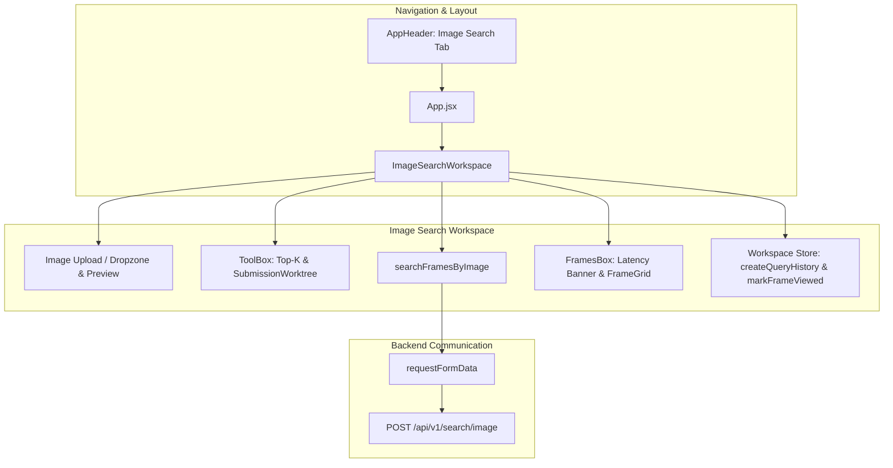

# Frontend Image Search Tab Implementation Plan

> **For agentic workers:** REQUIRED SUB-SKILL: Use superpowers:subagent-driven-development to implement this plan task-by-task. Steps use checkbox (`- [ ]`) syntax for tracking.

**Goal:** Add a dedicated "Image Search" tab on the frontend navigation bar that replaces the text query input with an image upload button/control while retaining the exact layout, options sidebar, and result presentation of the KIS/TRAKE workspace.

**Architecture:** The client interacts with the FastAPI backend endpoint `POST /api/v1/search/image` using `multipart/form-data`. A new `ImageSearchWorkspace` component mirrors `SearchWorkspace`'s structure with `adhoc-workspace` and `adhoc-results`, displaying the image upload zone, `ToolBox` sidebar (Top-K and SubmissionWorktree), `GifLoaderOverlay`, and `FramesBox` (for frame cards, latency banner, and KIS submission inspector).

**Architecture Diagram:**



**Tech Stack:** React 19, JavaScript (ES6+), Vanilla CSS tokens, Jest, React Testing Library.

## Global Constraints
- Must preserve canonical identity (`video_id`, `frame_id`, `frame_idx`, `timestamp_ms`).
- Retain exact styling and layout conventions of `SearchWorkspace` and HCMAI design system.
- All file links must be valid clickable links.
- DRY and YAGNI: reuse existing `FramesBox`, `ToolBox`, `GifLoaderOverlay`, and `ImageModal`.

---

### Task 1: API Client Support for Image Search (`client.js` and `search.js`)

**Files:**
- Modify: [frontend/src/api/client.js](file:///home/phuckhang/MyWorkspace/HCMAI_2026/frontend/src/api/client.js)
- Modify: [frontend/src/api/search.js](file:///home/phuckhang/MyWorkspace/HCMAI_2026/frontend/src/api/search.js)
- Test: [frontend/src/api/search.test.js](file:///home/phuckhang/MyWorkspace/HCMAI_2026/frontend/src/api/search.test.js)

**Interfaces:**
- Produces:
  - `requestFormData(path, formData, { signal, headers })` in `client.js`.
  - `searchFramesByImage({ imageFile, topK, signal })` in `search.js` returning `{ results, latency, warnings }`.

- [ ] **Step 1: Write failing tests in `search.test.js`**

Add tests for `searchFramesByImage`:
```javascript
test('posts multipart image search request and returns normalized results and latency', async () => {
  const payload = {
    results: [{
      frame_id: 'img-f1',
      video_id: 'L01_V001',
      frame_idx: 10,
      timestamp_ms: 1000,
      score: 0.88,
      frame_ids: ['img-f1'],
      timestamps_ms: [1000],
      metadata: { caption: 'Kitchen with red pot' },
    }],
    latency: {
      query_ms: 10.123,
      retrieval_ms: 20.456,
      alignment_ms: 0,
      materialization_ms: 5.789,
      total_ms: 36.368,
    },
  };
  jest.spyOn(global, 'fetch').mockResolvedValue(response(payload));

  const fakeFile = new File(['fake content'], 'test.png', { type: 'image/png' });
  const result = await searchFramesByImage({ imageFile: fakeFile, topK: 15 });

  expect(result.results[0].frame_id).toBe('img-f1');
  expect(result.latency.total_ms).toBe(36.37);
  expect(global.fetch).toHaveBeenCalledWith(
    expect.stringContaining('/api/v1/search/image'),
    expect.objectContaining({
      method: 'POST',
      body: expect.any(FormData),
    }),
  );
});

test('throws if no imageFile is provided to searchFramesByImage', async () => {
  await expect(searchFramesByImage({ imageFile: null, topK: 20 })).rejects.toThrow(
    'An image file is required for image search',
  );
});
```

- [ ] **Step 2: Run test to verify it fails**

Command:
```bash
cd frontend && npm test -- src/api/search.test.js --watchAll=false
```
Expected: FAIL with `searchFramesByImage is not defined`.

- [ ] **Step 3: Implement `requestFormData` and `searchFramesByImage`**

In [frontend/src/api/client.js](file:///home/phuckhang/MyWorkspace/HCMAI_2026/frontend/src/api/client.js):
```javascript
export const requestFormData = async (path, formData, {
  method = 'POST', signal, headers = {},
} = {}) => {
  const options = {
    method,
    headers: { ...headers },
    body: formData,
  };
  if (signal) options.signal = signal;

  let response;
  try {
    response = await fetch(`${API_BASE_URL}${path}`, options);
  } catch (cause) {
    if (cause?.name === 'AbortError') throw cause;
    const error = new Error(`Could not reach the backend: ${cause?.message || 'network request failed'}`);
    error.cause = cause;
    throw error;
  }

  let payload;
  try {
    payload = await response.json();
  } catch (cause) {
    const error = new Error(response.ok ? 'Backend returned invalid JSON' : `Backend returned invalid JSON for HTTP ${response.status}`);
    error.status = response.status;
    error.cause = cause;
    throw error;
  }

  if (!response.ok) {
    const error = new Error(errorMessage(payload, response.status));
    error.status = response.status;
    throw error;
  }
  return payload;
};
```

In [frontend/src/api/search.js](file:///home/phuckhang/MyWorkspace/HCMAI_2026/frontend/src/api/search.js):
```javascript
import { requestFormData, requestJson } from './client';
// ...
export const searchFramesByImage = async ({
  imageFile,
  topK = 20,
  signal,
}) => {
  if (!imageFile) {
    throw new Error('An image file is required for image search');
  }

  const formData = new FormData();
  formData.append('image', imageFile);
  formData.append('top_k', String(topK));

  const payload = await requestFormData('/api/v1/search/image', formData, { signal });

  if (
    !Array.isArray(payload?.results)
    || !hasSearchLatency(payload?.latency)
  ) {
    throw new Error('Image search server returned an invalid response contract');
  }

  return {
    ...payload,
    latency: normalizeSearchLatency(payload.latency),
  };
};
```

- [ ] **Step 4: Run test to verify it passes**

Command:
```bash
cd frontend && npm test -- src/api/search.test.js --watchAll=false
```
Expected: PASS.

---

### Task 2: UI Controls & ToolBox Adaptation

**Files:**
- Modify: [frontend/src/features/search-controls/components/ToolBox.jsx](file:///home/phuckhang/MyWorkspace/HCMAI_2026/frontend/src/features/search-controls/components/ToolBox.jsx)
- Modify: [frontend/src/styles/controls.css](file:///home/phuckhang/MyWorkspace/HCMAI_2026/frontend/src/styles/controls.css)

**Interfaces:**
- `ToolBox` prop `showRetrievalSources` (boolean, defaults to `true`). When `false`, the "Retrieval sources" fieldset (Dense/BM25) is omitted.
- Styles for `.image-query-row`, `.image-dropzone`, `.image-preview-card`, `.image-preview-thumb`, `.image-preview-info`.

- [ ] **Step 1: Update `ToolBox.jsx` to support `showRetrievalSources`**

Add `showRetrievalSources = true` to `ToolBox`:
```jsx
const ToolBox = ({
  topK,
  setTopK,
  useDense = true,
  setUseDense = NOOP,
  useBm25 = true,
  setUseBm25 = NOOP,
  includeSubmissionWorktree = true,
  showRetrievalSources = true,
}) => {
...
  {showRetrievalSources && (
    <fieldset className="toolbox-section toolbox-retrieval-section">
      <legend className="toolbox-label">Retrieval sources</legend>
      ...
    </fieldset>
  )}
```

- [ ] **Step 2: Add CSS rules for Image Upload in `controls.css`**

Add styling matching `.search-query-row` and HCMAI design language:
```css
/* ─────────────────────────────────────────────────────────── */
/* IMAGE SEARCH UPLOAD CONTROLS                                */
/* ─────────────────────────────────────────────────────────── */
.image-query-row {
  display: flex;
  align-items: center;
  gap: var(--spacing-sm);
  width: 100%;
}

.image-dropzone-wrapper {
  flex: 1;
  position: relative;
  display: flex;
  align-items: center;
}

.image-dropzone-btn {
  display: flex;
  align-items: center;
  gap: var(--spacing-sm);
  width: 100%;
  height: 42px;
  padding: 0 16px;
  background: var(--color-surface);
  border: 1px dashed var(--color-hairline);
  border-radius: var(--rounded-md);
  color: var(--color-ink-muted);
  font-size: 14px;
  cursor: pointer;
  transition: all 0.15s ease;
  text-align: left;
}

.image-dropzone-btn:hover,
.image-dropzone-btn.drag-over {
  border-color: var(--color-primary);
  color: var(--color-primary);
  background: color-mix(in srgb, var(--color-primary) 4%, var(--color-surface));
}

.image-dropzone-btn:focus-visible {
  outline: none;
  border-color: var(--color-primary);
  box-shadow: 0 0 0 3px color-mix(in srgb, var(--color-primary) 15%, transparent);
}

.image-dropzone-icon {
  font-size: 18px;
  line-height: 1;
}

.image-preview-badge {
  display: flex;
  align-items: center;
  gap: var(--spacing-sm);
  width: 100%;
  height: 42px;
  padding: 3px 12px 3px 4px;
  background: var(--color-surface);
  border: 1px solid var(--color-hairline);
  border-radius: var(--rounded-md);
}

.image-preview-thumb {
  width: 34px;
  height: 34px;
  border-radius: calc(var(--rounded-md) - 2px);
  object-fit: cover;
  border: 1px solid var(--color-hairline);
}

.image-preview-details {
  flex: 1;
  display: flex;
  flex-direction: column;
  justify-content: center;
  overflow: hidden;
}

.image-preview-name {
  font-size: 13px;
  font-weight: 600;
  color: var(--color-ink);
  white-space: nowrap;
  overflow: hidden;
  text-overflow: ellipsis;
}

.image-preview-size {
  font-size: 11px;
  color: var(--color-ink-muted);
}

.image-clear-btn {
  background: transparent;
  border: none;
  color: var(--color-ink-muted);
  font-size: 16px;
  padding: 4px 8px;
  cursor: pointer;
  border-radius: var(--rounded-sm);
  transition: color 0.15s ease;
}

.image-clear-btn:hover {
  color: var(--color-danger, #ef4444);
}
```

---

### Task 3: Build `ImageSearchWorkspace` Component

**Files:**
- Create: [frontend/src/features/search/components/ImageSearchWorkspace.jsx](file:///home/phuckhang/MyWorkspace/HCMAI_2026/frontend/src/features/search/components/ImageSearchWorkspace.jsx)
- Modify: [frontend/src/features/search/index.js](file:///home/phuckhang/MyWorkspace/HCMAI_2026/frontend/src/features/search/index.js)
- Test: [frontend/src/features/search/components/ImageSearchWorkspace.test.jsx](file:///home/phuckhang/MyWorkspace/HCMAI_2026/frontend/src/features/search/components/ImageSearchWorkspace.test.jsx)

**Interfaces:**
- Consumes:
  - `searchFramesByImage` from `../../../api/search`.
  - `createQueryHistory`, `markFrameViewed` from `../../../api/workspace`.
  - `FramesBox`, `ToolBox`, `GifLoaderOverlay`, `useSubmissionDialog`, `buildKisSnapshot`, `activityStateForFrame`.
- Produces:
  - `<ImageSearchWorkspace isActive topK setTopK onFrameClick userId onFocusUserId onHistoryRefresh />`.

- [ ] **Step 1: Write test `ImageSearchWorkspace.test.jsx`**

Test cases:
- Renders empty image dropzone with disabled Search button.
- Selecting an image enables the Search button and displays thumbnail and file name.
- Submitting triggers `searchFramesByImage` with file and `topK`.
- Results render via `FramesBox` and frame click triggers `onFrameClick`.
- Clicking "New Search" resets file and results.

- [ ] **Step 2: Run test to verify it fails**

Command:
```bash
cd frontend && npm test -- src/features/search/components/ImageSearchWorkspace.test.jsx --watchAll=false
```
Expected: FAIL with module not found.

- [ ] **Step 3: Implement `ImageSearchWorkspace.jsx`**

Implement `ImageSearchWorkspace` mirroring the exact layout of `SearchWorkspace.jsx`:
- Upload row with file input, drag & drop support, preview thumbnail, and search actions.
- Body with `adhoc-sidebar` containing `ToolBox` (with `showRetrievalSources={false}`).
- `adhoc-results` containing `GifLoaderOverlay` and `FramesBox`.
- History persistence with `query_text: `[Image] ${file.name}``.
- Export from `frontend/src/features/search/index.js`.

- [ ] **Step 4: Run test to verify it passes**

Command:
```bash
cd frontend && npm test -- src/features/search/components/ImageSearchWorkspace.test.jsx --watchAll=false
```
Expected: PASS.

---

### Task 4: Navigation Bar & App Integration

**Files:**
- Modify: [frontend/src/features/header/AppHeader.jsx](file:///home/phuckhang/MyWorkspace/HCMAI_2026/frontend/src/features/header/AppHeader.jsx)
- Modify: [frontend/src/App.jsx](file:///home/phuckhang/MyWorkspace/HCMAI_2026/frontend/src/App.jsx)
- Modify: [frontend/src/App.test.jsx](file:///home/phuckhang/MyWorkspace/HCMAI_2026/frontend/src/App.test.jsx)

**Interfaces:**
- `AppHeader`: navigation list contains `['query', 'Query'], ['image-search', 'Image Search'], ['filter', 'Filter'], ...`
- `App`: renders `<ImageSearchWorkspace>` in `<div className="workspace-panel" hidden={activePage !== 'image-search'}>`.

- [ ] **Step 1: Update `AppHeader.jsx`**

Add `['image-search', 'Image Search']` after `['query', 'Query']`.

- [ ] **Step 2: Update `App.jsx`**

Import `ImageSearchWorkspace` and add the workspace panel:
```jsx
<div className="workspace-panel" hidden={activePage !== 'image-search'}>
  <ImageSearchWorkspace
    isActive={activePage === 'image-search'}
    userId={userId}
    topK={topK}
    setTopK={setTopK}
    onFrameClick={handleQueryFrameClick}
    onFocusUserId={handleFocusUserId}
    onHistoryRefresh={() => setHistoryRefreshToken((token) => token + 1)}
  />
</div>
```

- [ ] **Step 3: Update `App.test.jsx` to verify tab switching**

Add test verifying that clicking "Image Search" switches active page and renders the image search workspace.

- [ ] **Step 4: Run `App.test.jsx`**

Command:
```bash
cd frontend && npm test -- src/App.test.jsx --watchAll=false
```
Expected: PASS.

---

### Task 5: Comprehensive Verification & Build Check

**Files:**
- Run all frontend tests and check production build.

- [ ] **Step 1: Run all frontend tests**
```bash
cd frontend && npm test -- --watchAll=false
```
Expected: All test suites pass.

- [ ] **Step 2: Run backend tests to ensure no regressions**
```bash
pytest tests/api/test_search_routes.py -v
```
Expected: All backend tests pass.

- [ ] **Step 3: Test production build**
```bash
cd frontend && npm run build
```
Expected: Build succeeds cleanly without errors.
