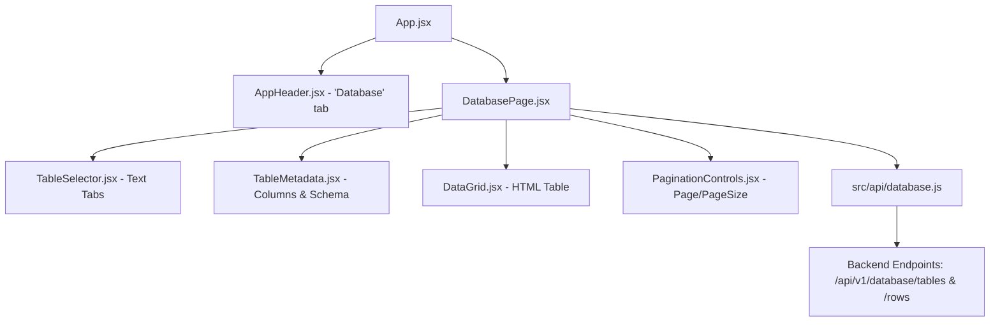

# SQLite Database Browser Page Implementation Plan

> **For agentic workers:** REQUIRED SUB-SKILL: Use superpowers:subagent-driven-development to implement this plan task-by-task. Steps use checkbox (`- [ ]`) syntax for tracking.

**Goal:** Create a clean, minimalist SQLite Database Browser page in the React frontend that queries the 2 existing backend database endpoints to display table schemas and paginated rows, adhering strictly to a white background and zero icons.

**Architecture:** A dedicated `database` feature module (`src/features/database`) is integrated into the application shell alongside `Query`, `Filter`, and `Workspace`. The module talks to a specialized HTTP client wrapper (`src/api/database.js`) using `requestJson`. State is maintained at the page level for active table, pagination, and loading/error states, rendered cleanly across focused sub-components.

**Architecture Diagram:**



**Tech Stack:** React 19, React Testing Library, Jest, Vanilla CSS (`tokens.css`).

## Global Constraints

- Zero icons: No SVGs, no icon fonts, no glyph/emoji icons in buttons or labels.
- Pure white background (`#ffffff` / `var(--color-surface)` / `var(--color-canvas)`).
- Safe rendering of arbitrary SQLite cell values (format JSON objects/arrays as strings).
- Strict modular decomposition conforming to existing repository conventions.

---

### Task 1: API Client Wrapper for SQLite Endpoints

**Files:**
- Create: `frontend/src/api/database.js`
- Test: `frontend/src/api/database.test.js`

**Interfaces:**
- Produces:
  - `fetchDatabaseTables({ signal } = {}): Promise<{ tables: DatabaseTable[] }>`
  - `fetchDatabaseRows(tableName, { page, pageSize, signal } = {}): Promise<DatabaseRowsPage>`
- Consumes:
  - `requestJson` from `frontend/src/api/client.js`

- [ ] **Step 1: Write the failing tests for API client**

Write `frontend/src/api/database.test.js`:
```javascript
import { fetchDatabaseTables, fetchDatabaseRows } from './database';

jest.mock('./client', () => {
  const actual = jest.requireActual('./client');
  return { ...actual, requestJson: jest.fn() };
});

import { requestJson } from './client';

beforeEach(() => {
  requestJson.mockReset();
});

test('fetchDatabaseTables queries /api/v1/database/tables', async () => {
  const mockPayload = {
    tables: [
      { name: 'query_history', row_count: 5, columns: [{ name: 'query_id', type: 'TEXT', nullable: false, primary_key: true }] },
    ],
  };
  requestJson.mockResolvedValueOnce(mockPayload);

  const result = await fetchDatabaseTables();
  expect(requestJson).toHaveBeenCalledWith('/api/v1/database/tables', { signal: undefined });
  expect(result).toEqual(mockPayload);
});

test('fetchDatabaseRows formats query parameters and table name', async () => {
  const mockRows = {
    table: 'query_history',
    page: 2,
    page_size: 10,
    total_rows: 15,
    total_pages: 2,
    rows: [{ query_id: 'q-1', query_text: 'sample query' }],
  };
  requestJson.mockResolvedValueOnce(mockRows);

  const result = await fetchDatabaseRows('query_history', { page: 2, pageSize: 10 });
  expect(requestJson).toHaveBeenCalledWith(
    '/api/v1/database/tables/query_history/rows?page=2&page_size=10',
    { signal: undefined },
  );
  expect(result).toEqual(mockRows);
});

test('fetchDatabaseRows validates required tableName', async () => {
  await expect(fetchDatabaseRows('')).rejects.toThrow('tableName is required');
  expect(requestJson).not.toHaveBeenCalled();
});
```

- [ ] **Step 2: Run test to verify it fails**

Run: `npm test -- --watchAll=false src/api/database.test.js`
Expected: FAIL ("Cannot find module './database'")

- [ ] **Step 3: Implement `src/api/database.js`**

Write `frontend/src/api/database.js`:
```javascript
/** Safe read-only HTTP client wrappers for the workspace SQLite database. */
import { requestJson } from './client';

/** Fetch available allowlisted SQLite tables and their column schemas. */
export const fetchDatabaseTables = async ({ signal } = {}) => {
  return requestJson('/api/v1/database/tables', { signal });
};

/** Fetch a paginated slice of raw SQLite row records from a specified table. */
export const fetchDatabaseRows = async (tableName, { page = 1, pageSize = 25, signal } = {}) => {
  if (!tableName || typeof tableName !== 'string' || !tableName.trim()) {
    throw new Error('tableName is required and must be a non-empty string');
  }

  const searchParams = new URLSearchParams({
    page: String(Math.max(1, Math.floor(page))),
    page_size: String(Math.min(100, Math.max(1, Math.floor(pageSize)))),
  });

  const path = `/api/v1/database/tables/${encodeURIComponent(tableName.trim())}/rows?${searchParams.toString()}`;
  return requestJson(path, { signal });
};
```

- [ ] **Step 4: Run test to verify it passes**

Run: `npm test -- --watchAll=false src/api/database.test.js`
Expected: PASS

- [ ] **Step 5: Commit changes**

```bash
git add frontend/src/api/database.js frontend/src/api/database.test.js
git commit -m "feat(frontend): add SQLite database API client methods and tests"
```

---

### Task 2: Sub-Components for Database Feature

**Files:**
- Create: `frontend/src/features/database/components/TableSelector.jsx`
- Create: `frontend/src/features/database/components/TableMetadata.jsx`
- Create: `frontend/src/features/database/components/DataGrid.jsx`
- Create: `frontend/src/features/database/components/PaginationControls.jsx`
- Create: `frontend/src/features/database/components/components.test.jsx`

**Interfaces:**
- Produces:
  - `TableSelector`: `({ tables, selectedTableName, onSelectTable, disabled }) => JSX`
  - `TableMetadata`: `({ table }) => JSX`
  - `DataGrid`: `({ columns, rows, isLoading }) => JSX`
  - `PaginationControls`: `({ page, pageSize, totalRows, totalPages, onChangePage, onChangePageSize, disabled }) => JSX`
- Constraints: No icons, accessible markup, safe value formatting.

- [ ] **Step 1: Write failing tests for sub-components**

Write `frontend/src/features/database/components/components.test.jsx`:
```javascript
import React from 'react';
import { render, screen, fireEvent } from '@testing-library/react';
import TableSelector from './TableSelector';
import TableMetadata from './TableMetadata';
import DataGrid from './DataGrid';
import PaginationControls from './PaginationControls';

describe('Database Sub-Components (No Icons, Plain Text UI)', () => {
  test('TableSelector renders table list and invokes onSelectTable on click', () => {
    const tables = [
      { name: 'query_history', row_count: 5 },
      { name: 'submission_files', row_count: 2 },
    ];
    const onSelect = jest.fn();

    render(<TableSelector tables={tables} selectedTableName="query_history" onSelectTable={onSelect} />);

    expect(screen.getByText('query_history (5 rows)')).toBeInTheDocument();
    const subBtn = screen.getByText('submission_files (2 rows)');
    expect(subBtn).toBeInTheDocument();

    fireEvent.click(subBtn);
    expect(onSelect).toHaveBeenCalledWith('submission_files');
  });

  test('TableMetadata displays formatted schema columns and primary keys', () => {
    const table = {
      name: 'query_history',
      row_count: 5,
      columns: [
        { name: 'query_id', type: 'TEXT', nullable: false, primary_key: true },
        { name: 'query_text', type: 'TEXT', nullable: true, primary_key: false },
      ],
    };

    render(<TableMetadata table={table} />);
    expect(screen.getByText(/query_id \(TEXT, PK\)/)).toBeInTheDocument();
    expect(screen.getByText(/query_text \(TEXT\)/)).toBeInTheDocument();
  });

  test('DataGrid renders table header, cells and stringifies object/array values', () => {
    const columns = [
      { name: 'id', type: 'INTEGER' },
      { name: 'meta', type: 'JSON' },
    ];
    const rows = [
      { id: 1, meta: { tag: 'test' } },
      { id: 2, meta: null },
    ];

    render(<DataGrid columns={columns} rows={rows} isLoading={false} />);
    expect(screen.getByText('id')).toBeInTheDocument();
    expect(screen.getByText('meta')).toBeInTheDocument();
    expect(screen.getByText('1')).toBeInTheDocument();
    expect(screen.getByText('{"tag":"test"}')).toBeInTheDocument();
    expect(screen.getByText('null')).toBeInTheDocument();
  });

  test('DataGrid renders empty message when there are no rows', () => {
    render(<DataGrid columns={[{ name: 'id' }]} rows={[]} isLoading={false} />);
    expect(screen.getByText('No rows found in this table.')).toBeInTheDocument();
  });

  test('PaginationControls triggers previous, next and page size changes', () => {
    const onChangePage = jest.fn();
    const onChangePageSize = jest.fn();

    render(
      <PaginationControls
        page={2}
        pageSize={25}
        totalRows={50}
        totalPages={2}
        onChangePage={onChangePage}
        onChangePageSize={onChangePageSize}
      />
    );

    expect(screen.getByText('Page 2 of 2 (50 total rows)')).toBeInTheDocument();

    const prevBtn = screen.getByText('Previous');
    expect(prevBtn).not.toBeDisabled();
    fireEvent.click(prevBtn);
    expect(onChangePage).toHaveBeenCalledWith(1);

    const nextBtn = screen.getByText('Next');
    expect(nextBtn).toBeDisabled();

    const select = screen.getByLabelText('Rows per page:');
    fireEvent.change(select, { target: { value: '50' } });
    expect(onChangePageSize).toHaveBeenCalledWith(50);
  });
});
```

- [ ] **Step 2: Run test to verify it fails**

Run: `npm test -- --watchAll=false src/features/database/components/components.test.jsx`
Expected: FAIL ("Cannot find module './TableSelector'")

- [ ] **Step 3: Implement sub-components**

Write `frontend/src/features/database/components/TableSelector.jsx`:
```jsx
import React from 'react';

export const TableSelector = ({ tables = [], selectedTableName, onSelectTable, disabled = false }) => {
  if (!tables.length) return null;

  return (
    <div className="db-table-selector" role="tablist" aria-label="Database tables">
      {tables.map((table) => {
        const isSelected = table.name === selectedTableName;
        return (
          <button
            key={table.name}
            type="button"
            role="tab"
            aria-selected={isSelected}
            disabled={disabled}
            className={`db-table-tab ${isSelected ? 'active' : ''}`}
            onClick={() => onSelectTable(table.name)}
          >
            {table.name} ({table.row_count} rows)
          </button>
        );
      })}
    </div>
  );
};

export default TableSelector;
```

Write `frontend/src/features/database/components/TableMetadata.jsx`:
```jsx
import React from 'react';

export const TableMetadata = ({ table }) => {
  if (!table || !table.columns?.length) return null;

  const columnDescriptions = table.columns.map((col) => {
    const attributes = [col.type || 'TEXT'];
    if (col.primary_key) attributes.push('PK');
    return `${col.name} (${attributes.join(', ')})`;
  });

  return (
    <div className="db-table-metadata">
      <span className="db-metadata-label">Columns: </span>
      <span className="db-metadata-content">{columnDescriptions.join(' | ')}</span>
    </div>
  );
};

export default TableMetadata;
```

Write `frontend/src/features/database/components/DataGrid.jsx`:
```jsx
import React from 'react';

const formatCellValue = (value) => {
  if (value === null || value === undefined) {
    return <span className="db-cell-null">null</span>;
  }
  if (typeof value === 'boolean') {
    return value ? 'true' : 'false';
  }
  if (typeof value === 'object') {
    try {
      return JSON.stringify(value);
    } catch {
      return String(value);
    }
  }
  return String(value);
};

export const DataGrid = ({ columns = [], rows = [], isLoading = false }) => {
  if (isLoading) {
    return <div className="db-loading-state">Loading table data...</div>;
  }

  const columnKeys = columns.length > 0
    ? columns.map((col) => col.name)
    : (rows.length > 0 ? Object.keys(rows[0]) : []);

  if (columnKeys.length === 0 || rows.length === 0) {
    return <div className="db-empty-state">No rows found in this table.</div>;
  }

  return (
    <div className="db-grid-container">
      <table className="db-grid-table">
        <thead>
          <tr>
            {columnKeys.map((colName) => (
              <th key={colName} scope="col">
                {colName}
              </th>
            ))}
          </tr>
        </thead>
        <tbody>
          {rows.map((row, rowIndex) => (
            <tr key={rowIndex}>
              {columnKeys.map((colName) => (
                <td key={colName}>{formatCellValue(row[colName])}</td>
              ))}
            </tr>
          ))}
        </tbody>
      </table>
    </div>
  );
};

export default DataGrid;
```

Write `frontend/src/features/database/components/PaginationControls.jsx`:
```jsx
import React from 'react';

export const PaginationControls = ({
  page = 1,
  pageSize = 25,
  totalRows = 0,
  totalPages = 1,
  onChangePage,
  onChangePageSize,
  disabled = false,
}) => {
  const safeTotalPages = Math.max(1, totalPages);
  const canGoPrevious = page > 1 && !disabled;
  const canGoNext = page < safeTotalPages && !disabled;

  return (
    <div className="db-pagination-controls">
      <div className="db-pagination-nav">
        <button
          type="button"
          className="db-btn db-btn-pagination"
          disabled={!canGoPrevious}
          onClick={() => onChangePage(page - 1)}
        >
          Previous
        </button>
        <span className="db-pagination-info">
          Page {page} of {safeTotalPages} ({totalRows} total rows)
        </span>
        <button
          type="button"
          className="db-btn db-btn-pagination"
          disabled={!canGoNext}
          onClick={() => onChangePage(page + 1)}
        >
          Next
        </button>
      </div>

      <div className="db-pagination-size">
        <label htmlFor="db-page-size-select" className="db-size-label">
          Rows per page:
        </label>
        <select
          id="db-page-size-select"
          className="db-select"
          value={pageSize}
          disabled={disabled}
          onChange={(e) => onChangePageSize(Number(e.target.value))}
        >
          {[10, 25, 50, 100].map((size) => (
            <option key={size} value={size}>
              {size}
            </option>
          ))}
        </select>
      </div>
    </div>
  );
};

export default PaginationControls;
```

- [ ] **Step 4: Run test to verify it passes**

Run: `npm test -- --watchAll=false src/features/database/components/components.test.jsx`
Expected: PASS

- [ ] **Step 5: Commit changes**

```bash
git add frontend/src/features/database/components/
git commit -m "feat(frontend): create database UI sub-components without icons"
```

---

### Task 3: Styling for White Background and Zero Icons

**Files:**
- Create: `frontend/src/styles/database.css`
- Modify: `frontend/src/styles/index.css`

**Interfaces:**
- Target CSS Classes: `.database-page`, `.db-table-selector`, `.db-table-tab`, `.db-grid-table`, `.db-pagination-controls`.

- [ ] **Step 1: Write `frontend/src/styles/database.css`**

```css
/* SQLite Database Browser: Clean, white background, zero icons */
.database-page {
  background: #ffffff;
  min-height: 100%;
  display: flex;
  flex-direction: column;
  padding: var(--spacing-lg);
  box-sizing: border-box;
  color: var(--color-ink);
  font-family: var(--font-family);
}

.db-header {
  margin-bottom: var(--spacing-md);
}

.db-title {
  margin: 0 0 var(--spacing-xs) 0;
  font-size: 1.25rem;
  font-weight: 600;
  color: var(--color-ink);
}

.db-subtitle {
  margin: 0;
  font-size: 0.875rem;
  color: var(--color-ink-muted);
}

.db-table-selector {
  display: flex;
  flex-wrap: wrap;
  gap: var(--spacing-xs);
  margin-bottom: var(--spacing-sm);
  border-bottom: 1px solid var(--color-hairline);
  padding-bottom: var(--spacing-xs);
}

.db-table-tab {
  background: #ffffff;
  border: 1px solid var(--color-hairline);
  border-radius: var(--rounded-sm);
  padding: 6px 14px;
  font-size: 0.875rem;
  font-weight: 500;
  color: var(--color-ink-secondary);
  cursor: pointer;
  transition: border-color 0.15s, background-color 0.15s;
}

.db-table-tab:hover:not(:disabled) {
  border-color: var(--color-ink-muted);
}

.db-table-tab.active {
  background: #f0f4f8;
  border-color: var(--color-primary);
  color: var(--color-primary-active);
  font-weight: 600;
}

.db-table-tab:disabled {
  opacity: 0.6;
  cursor: not-allowed;
}

.db-table-metadata {
  font-size: 0.8125rem;
  color: var(--color-ink-muted);
  background: #fafafa;
  border: 1px solid var(--color-hairline);
  border-radius: var(--rounded-sm);
  padding: 8px 12px;
  margin-bottom: var(--spacing-md);
  overflow-x: auto;
  white-space: nowrap;
}

.db-metadata-label {
  font-weight: 600;
  color: var(--color-ink);
}

.db-grid-container {
  width: 100%;
  overflow-x: auto;
  border: 1px solid var(--color-hairline);
  border-radius: var(--rounded-sm);
  background: #ffffff;
  margin-bottom: var(--spacing-md);
}

.db-grid-table {
  width: 100%;
  border-collapse: collapse;
  font-size: 0.8125rem;
  text-align: left;
}

.db-grid-table th {
  background: #f7f7f7;
  border-bottom: 1px solid var(--color-hairline);
  padding: 10px 12px;
  font-weight: 600;
  color: var(--color-ink);
  white-space: nowrap;
}

.db-grid-table td {
  padding: 8px 12px;
  border-bottom: 1px solid var(--color-hairline);
  color: var(--color-ink);
  font-family: monospace, var(--font-family);
  max-width: 320px;
  overflow: hidden;
  text-overflow: ellipsis;
  white-space: nowrap;
}

.db-grid-table tr:hover td {
  background: #fafafa;
}

.db-cell-null {
  color: var(--color-ink-faint);
  font-style: italic;
}

.db-loading-state,
.db-empty-state,
.db-error-state {
  padding: var(--spacing-xl);
  text-align: center;
  font-size: 0.875rem;
  border: 1px solid var(--color-hairline);
  border-radius: var(--rounded-sm);
  background: #ffffff;
  margin-bottom: var(--spacing-md);
}

.db-error-state {
  color: var(--color-danger);
  border-color: var(--color-danger);
  background: #fffafa;
}

.db-pagination-controls {
  display: flex;
  justify-content: space-between;
  align-items: center;
  flex-wrap: wrap;
  gap: var(--spacing-md);
  padding: var(--spacing-xs) 0;
}

.db-pagination-nav {
  display: flex;
  align-items: center;
  gap: var(--spacing-sm);
}

.db-pagination-info {
  font-size: 0.875rem;
  color: var(--color-ink-muted);
}

.db-btn {
  background: #ffffff;
  border: 1px solid var(--color-hairline);
  border-radius: var(--rounded-sm);
  padding: 6px 14px;
  font-size: 0.875rem;
  font-weight: 500;
  color: var(--color-ink);
  cursor: pointer;
}

.db-btn:hover:not(:disabled) {
  border-color: var(--color-ink-muted);
}

.db-btn:disabled {
  opacity: 0.5;
  cursor: not-allowed;
}

.db-pagination-size {
  display: flex;
  align-items: center;
  gap: var(--spacing-xs);
}

.db-size-label {
  font-size: 0.875rem;
  color: var(--color-ink-muted);
}

.db-select {
  border: 1px solid var(--color-hairline);
  border-radius: var(--rounded-sm);
  background: #ffffff;
  padding: 4px 8px;
  font-size: 0.875rem;
  color: var(--color-ink);
}
```

- [ ] **Step 2: Import `database.css` into `frontend/src/styles/index.css`**

Add `@import './database.css';` to `frontend/src/styles/index.css`.

- [ ] **Step 3: Commit changes**

```bash
git add frontend/src/styles/database.css frontend/src/styles/index.css
git commit -m "style(frontend): add styles for SQLite database browser"
```

---

### Task 4: Main DatabasePage Component & Tests

**Files:**
- Create: `frontend/src/features/database/DatabasePage.jsx`
- Create: `frontend/src/features/database/index.js`
- Test: `frontend/src/features/database/DatabasePage.test.jsx`

**Interfaces:**
- Produces:
  - `DatabasePage`: `({ isActive }) => JSX`
  - Feature export: `export { DatabasePage } from './DatabasePage'`
- Consumes:
  - Sub-components from `./components/`
  - `fetchDatabaseTables`, `fetchDatabaseRows` from `../../api/database`

- [ ] **Step 1: Write failing tests for `DatabasePage`**

Write `frontend/src/features/database/DatabasePage.test.jsx`:
```javascript
import React from 'react';
import { render, screen, waitFor, fireEvent } from '@testing-library/react';
import DatabasePage from './DatabasePage';
import * as dbApi from '../../api/database';

jest.mock('../../api/database');

describe('DatabasePage Component', () => {
  const mockTables = {
    tables: [
      {
        name: 'query_history',
        row_count: 2,
        columns: [
          { name: 'query_id', type: 'TEXT', nullable: false, primary_key: true },
          { name: 'query_text', type: 'TEXT', nullable: false, primary_key: false },
        ],
      },
      {
        name: 'submission_files',
        row_count: 1,
        columns: [
          { name: 'name', type: 'TEXT', nullable: false, primary_key: true },
        ],
      },
    ],
  };

  const mockRows = {
    table: 'query_history',
    page: 1,
    page_size: 25,
    total_rows: 2,
    total_pages: 1,
    rows: [
      { query_id: 'q-1', query_text: 'red bus' },
      { query_id: 'q-2', query_text: 'blue car' },
    ],
  };

  beforeEach(() => {
    jest.clearAllMocks();
  });

  test('fetches tables and default rows when activated', async () => {
    dbApi.fetchDatabaseTables.mockResolvedValueOnce(mockTables);
    dbApi.fetchDatabaseRows.mockResolvedValueOnce(mockRows);

    render(<DatabasePage isActive={true} />);

    expect(screen.getByText('Loading database tables...')).toBeInTheDocument();

    await waitFor(() => {
      expect(screen.getByText('query_history (2 rows)')).toBeInTheDocument();
      expect(screen.getByText('submission_files (1 rows)')).toBeInTheDocument();
    });

    await waitFor(() => {
      expect(screen.getByText('red bus')).toBeInTheDocument();
      expect(screen.getByText('blue car')).toBeInTheDocument();
    });

    expect(dbApi.fetchDatabaseTables).toHaveBeenCalledTimes(1);
    expect(dbApi.fetchDatabaseRows).toHaveBeenCalledWith('query_history', { page: 1, pageSize: 25 });
  });

  test('switches table when clicking another tab', async () => {
    dbApi.fetchDatabaseTables.mockResolvedValueOnce(mockTables);
    dbApi.fetchDatabaseRows
      .mockResolvedValueOnce(mockRows)
      .mockResolvedValueOnce({
        table: 'submission_files',
        page: 1,
        page_size: 25,
        total_rows: 1,
        total_pages: 1,
        rows: [{ name: 'results.csv' }],
      });

    render(<DatabasePage isActive={true} />);

    await waitFor(() => {
      expect(screen.getByText('submission_files (1 rows)')).toBeInTheDocument();
    });

    fireEvent.click(screen.getByText('submission_files (1 rows)'));

    await waitFor(() => {
      expect(screen.getByText('results.csv')).toBeInTheDocument();
    });

    expect(dbApi.fetchDatabaseRows).toHaveBeenLastCalledWith('submission_files', { page: 1, pageSize: 25 });
  });

  test('handles database error gracefully', async () => {
    dbApi.fetchDatabaseTables.mockRejectedValueOnce(new Error('Workspace database is not configured'));

    render(<DatabasePage isActive={true} />);

    await waitFor(() => {
      expect(screen.getByText(/Workspace database is not configured/)).toBeInTheDocument();
    });
  });
});
```

- [ ] **Step 2: Run test to verify it fails**

Run: `npm test -- --watchAll=false src/features/database/DatabasePage.test.jsx`
Expected: FAIL ("Cannot find module './DatabasePage'")

- [ ] **Step 3: Implement `DatabasePage.jsx` and `index.js`**

Write `frontend/src/features/database/DatabasePage.jsx`:
```jsx
/** SQLite Database Browser page for inspecting workspace tables and records. */
import React, { useCallback, useEffect, useState } from 'react';
import { fetchDatabaseTables, fetchDatabaseRows } from '../../api/database';
import TableSelector from './components/TableSelector';
import TableMetadata from './components/TableMetadata';
import DataGrid from './components/DataGrid';
import PaginationControls from './components/PaginationControls';

export const DatabasePage = ({ isActive = false }) => {
  const [tables, setTables] = useState([]);
  const [selectedTableName, setSelectedTableName] = useState('');
  const [rowsData, setRowsData] = useState(null);
  const [page, setPage] = useState(1);
  const [pageSize, setPageSize] = useState(25);
  const [isLoadingTables, setIsLoadingTables] = useState(false);
  const [isLoadingRows, setIsLoadingRows] = useState(false);
  const [error, setError] = useState(null);

  const loadTables = useCallback(async () => {
    setIsLoadingTables(true);
    setError(null);
    try {
      const response = await fetchDatabaseTables();
      const loadedTables = response?.tables || [];
      setTables(loadedTables);
      if (loadedTables.length > 0) {
        setSelectedTableName((current) => current || loadedTables[0].name);
      }
    } catch (err) {
      setError(err?.message || 'Failed to load SQLite tables');
    } finally {
      setIsLoadingTables(false);
    }
  }, []);

  const loadRows = useCallback(async (tableName, targetPage, targetPageSize) => {
    if (!tableName) return;
    setIsLoadingRows(true);
    setError(null);
    try {
      const response = await fetchDatabaseRows(tableName, {
        page: targetPage,
        pageSize: targetPageSize,
      });
      setRowsData(response);
    } catch (err) {
      setError(err?.message || `Failed to load rows for ${tableName}`);
    } finally {
      setIsLoadingRows(false);
    }
  }, []);

  useEffect(() => {
    if (isActive && tables.length === 0 && !isLoadingTables && !error) {
      loadTables();
    }
  }, [isActive, tables.length, isLoadingTables, error, loadTables]);

  useEffect(() => {
    if (isActive && selectedTableName) {
      loadRows(selectedTableName, page, pageSize);
    }
  }, [isActive, selectedTableName, page, pageSize, loadRows]);

  const handleSelectTable = (tableName) => {
    if (tableName === selectedTableName) return;
    setSelectedTableName(tableName);
    setPage(1);
  };

  const handleChangePage = (newPage) => {
    setPage(newPage);
  };

  const handleChangePageSize = (newPageSize) => {
    setPageSize(newPageSize);
    setPage(1);
  };

  const selectedTable = tables.find((t) => t.name === selectedTableName) || null;

  return (
    <div className="database-page">
      <header className="db-header">
        <h2 className="db-title">SQLite Database Browser</h2>
        <p className="db-subtitle">
          Inspect allowlisted workspace database tables, column schemas, and paginated records.
        </p>
      </header>

      {error && (
        <div className="db-error-state" role="alert">
          {error}
        </div>
      )}

      {isLoadingTables ? (
        <div className="db-loading-state">Loading database tables...</div>
      ) : (
        <>
          <TableSelector
            tables={tables}
            selectedTableName={selectedTableName}
            onSelectTable={handleSelectTable}
            disabled={isLoadingRows}
          />

          {selectedTable && <TableMetadata table={selectedTable} />}

          <DataGrid
            columns={selectedTable?.columns || []}
            rows={rowsData?.rows || []}
            isLoading={isLoadingRows}
          />

          {rowsData && (
            <PaginationControls
              page={rowsData.page}
              pageSize={rowsData.page_size}
              totalRows={rowsData.total_rows}
              totalPages={rowsData.total_pages}
              onChangePage={handleChangePage}
              onChangePageSize={handleChangePageSize}
              disabled={isLoadingRows}
            />
          )}
        </>
      )}
    </div>
  );
};

export default DatabasePage;
```

Write `frontend/src/features/database/index.js`:
```javascript
export { DatabasePage } from './DatabasePage';
export { default } from './DatabasePage';
```

- [ ] **Step 4: Run test to verify it passes**

Run: `npm test -- --watchAll=false src/features/database/DatabasePage.test.jsx`
Expected: PASS

- [ ] **Step 5: Commit changes**

```bash
git add frontend/src/features/database/
git commit -m "feat(frontend): implement DatabasePage container and tests"
```

---

### Task 5: Integration into Application Shell

**Files:**
- Modify: `frontend/src/features/header/AppHeader.jsx`
- Modify: `frontend/src/App.jsx`
- Modify: `frontend/src/App.test.jsx`

**Interfaces:**
- Adds `['database', 'Database']` to navigation options in `AppHeader`.
- Renders `<DatabasePage isActive={activePage === 'database'} />` inside `App.jsx`.

- [ ] **Step 1: Update AppHeader navigation items**

In `frontend/src/features/header/AppHeader.jsx`:
```diff
       <nav className="workspace-nav" aria-label="Workspace selection">
         {[
           ['query', 'Query'],
           ['filter', 'Filter'],
           ['workspace', 'Workspace'],
+          ['database', 'Database'],
         ].map(([page, label]) => (
```

- [ ] **Step 2: Update App.jsx with DatabasePage**

In `frontend/src/App.jsx`:
```diff
 import { FilterWorkspace } from './features/filter';
 import { WorkspacePage } from './features/workspace';
+import { DatabasePage } from './features/database';
 import { useHealthCheck } from './features/health';
```
And add panel:
```diff
         <div className="workspace-panel" hidden={activePage !== 'workspace'}>
           <WorkspacePage
             isActive={activePage === 'workspace'}
             userId={userId}
             historyRefreshToken={historyRefreshToken}
             onReplay={handleReplay}
             onOpenManualVideo={handleManualVideo}
           />
         </div>
+        <div className="workspace-panel" hidden={activePage !== 'database'}>
+          <DatabasePage isActive={activePage === 'database'} />
+        </div>
       </main>
```

- [ ] **Step 3: Update `src/App.test.jsx` to test Database navigation**

Add test verifying 'Database' button is present and clicking it switches view.

- [ ] **Step 4: Run tests to verify they pass**

Run: `REACT_APP_API_BASE_URL=http://127.0.0.1:8000 REACT_APP_STREAM_API_BASE_URL=https://stream.iamphuckhang.dev/api/v1 npm test -- --watchAll=false src/App.test.jsx`
Expected: PASS

- [ ] **Step 5: Commit changes**

```bash
git add frontend/src/features/header/AppHeader.jsx frontend/src/App.jsx frontend/src/App.test.jsx
git commit -m "feat(frontend): integrate Database page into App shell navigation"
```
