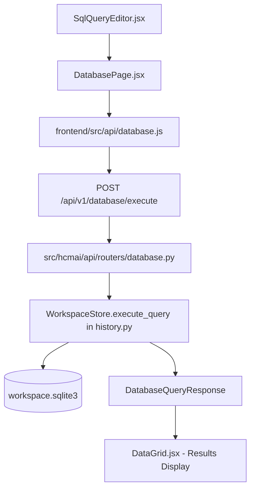

# SQLite Query Execution Implementation Plan

> **For agentic workers:** REQUIRED SUB-SKILL: Use superpowers:subagent-driven-development to implement this plan task-by-task. Steps use checkbox (`- [ ]`) syntax for tracking.

**Goal:** Provide end-to-end arbitrary SQL query execution capability against the workspace SQLite database via a new backend endpoint (`POST /api/v1/database/execute`) and a frontend SQL query editor in the Database tab, strictly maintaining a white background and zero icons.

**Architecture:** The backend exposes `POST /api/v1/database/execute` which accepts an SQL string and maximum row limit, executes it in a transaction via `WorkspaceStore._connection()`, and returns structured results (columns, rows, execution time, and rows affected). The frontend adds `SqlQueryEditor` to `DatabasePage` to submit SQL queries, render errors cleanly, and display query results in `DataGrid`.

**Architecture Diagram:**



**Tech Stack:** FastAPI, SQLite3 (WAL mode), Pydantic v2, React 19, Jest, React Testing Library, Vanilla CSS.

## Global Constraints

- Zero icons on frontend (no SVGs, no icon fonts, no glyph/emoji icons).
- Pure white background (`#ffffff`).
- Support both read queries (`SELECT`, `PRAGMA`, `EXPLAIN`) and data mutations (`INSERT`, `UPDATE`, `DELETE`).
- Return clear error messages on SQLite syntax or constraint errors with HTTP 400.

---

### Task 1: Backend Contracts and `WorkspaceStore.execute_query`

**Files:**
- Modify: `src/hcmai/api/contracts/database.py`
- Modify: `src/hcmai/api/contracts/__init__.py`
- Modify: `src/hcmai/api/history.py`
- Test: `tests/api/test_database_routes.py`

**Interfaces:**
- Produces:
  - `DatabaseQueryRequest`: `{ query: str, max_rows: int = 100 }`
  - `DatabaseQueryResponse`: `{ query: str, columns: list[str], rows: list[dict], rows_affected: int, execution_time_ms: float, is_mutation: bool }`
  - `WorkspaceStore.execute_query(query: str, *, max_rows: int = 100) -> DatabaseQueryResponse`

- [ ] **Step 1: Write unit tests for `execute_query` in `tests/api/test_database_routes.py`**

Add tests to `tests/api/test_database_routes.py`:
```python
def test_workspace_store_executes_select_query(database_app) -> None:
    """Execute SELECT query and verify columns, rows, and timing."""
    store = database_app.extra["service_container"]["workspace_store"]
    result = store.execute_query("SELECT query_id, user_id FROM query_history WHERE query_id = 'query-1'")
    assert result.columns == ["query_id", "user_id"]
    assert len(result.rows) == 1
    assert result.rows[0]["query_id"] == "query-1"
    assert result.is_mutation is False
    assert result.execution_time_ms >= 0.0


def test_workspace_store_executes_mutation_query(database_app) -> None:
    """Execute INSERT and verify rows_affected and persistence."""
    store = database_app.extra["service_container"]["workspace_store"]
    result = store.execute_query(
        "INSERT INTO submission_files (name, content, is_validated, revision) VALUES ('test.csv', 'data', 0, 1)"
    )
    assert result.is_mutation is True
    assert result.rows_affected == 1

    select_result = store.execute_query("SELECT name FROM submission_files WHERE name = 'test.csv'")
    assert len(select_result.rows) == 1


def test_workspace_store_raises_on_invalid_syntax(database_app) -> None:
    """Invalid syntax raises ValueError with SQLite error detail."""
    store = database_app.extra["service_container"]["workspace_store"]
    with pytest.raises(ValueError, match="syntax error"):
        store.execute_query("SELCT * FROM query_history")
```

- [ ] **Step 2: Run test to verify it fails**

Run: `pytest tests/api/test_database_routes.py -k "execute_query" -v`
Expected: FAIL

- [ ] **Step 3: Implement contracts and `execute_query`**

In `src/hcmai/api/contracts/database.py`:
Add `DatabaseQueryRequest` and `DatabaseQueryResponse`. Export them in `src/hcmai/api/contracts/__init__.py`.

In `src/hcmai/api/history.py`:
Add `execute_query` to `WorkspaceStore`:
```python
    def execute_query(
        self,
        query: str,
        *,
        max_rows: int = 100,
    ) -> DatabaseQueryResponse:
        """Execute an arbitrary SQL query against workspace SQLite."""

        cleaned_query = query.strip()
        if not cleaned_query:
            raise ValueError("SQL query cannot be empty")
        if max_rows < 1:
            raise ValueError("max_rows must be at least 1")

        start_time = time.perf_counter()
        try:
            with self._connection() as connection:
                cursor = connection.execute(cleaned_query)
                if cursor.description is not None:
                    columns = [col[0] for col in cursor.description]
                    fetched_rows = cursor.fetchmany(max_rows)
                    rows = [dict(row) for row in fetched_rows]
                    is_mutation = False
                    rows_affected = 0
                else:
                    columns = []
                    rows = []
                    is_mutation = True
                    rows_affected = cursor.rowcount if cursor.rowcount >= 0 else 0
        except sqlite3.Error as error:
            raise ValueError(f"SQLite execution failed: {error}") from error

        execution_time_ms = round((time.perf_counter() - start_time) * 1000, 3)

        return DatabaseQueryResponse(
            query=cleaned_query,
            columns=columns,
            rows=rows,
            rows_affected=rows_affected,
            execution_time_ms=execution_time_ms,
            is_mutation=is_mutation,
        )
```

- [ ] **Step 4: Run test to verify it passes**

Run: `pytest tests/api/test_database_routes.py -k "execute_query" -v`
Expected: PASS

---

### Task 2: Backend HTTP Router Endpoint `POST /api/v1/database/execute`

**Files:**
- Modify: `src/hcmai/api/routers/database.py`
- Test: `tests/api/test_database_routes.py`

**Interfaces:**
- Produces:
  - `POST /api/v1/database/execute` endpoint returning `DatabaseQueryResponse`.

- [ ] **Step 1: Write integration tests for HTTP endpoint**

Add tests in `tests/api/test_database_routes.py`:
```python
def test_database_execute_endpoint_select(database_app) -> None:
    """Endpoint handles SELECT queries successfully."""
    response = _post_json(
        database_app,
        "/api/v1/database/execute",
        {"query": "SELECT query_id FROM query_history", "max_rows": 10},
    )
    assert response.status_code == 200
    payload = response.json()
    assert payload["columns"] == ["query_id"]
    assert len(payload["rows"]) == 1
    assert payload["is_mutation"] is False


def test_database_execute_endpoint_syntax_error(database_app) -> None:
    """Endpoint returns HTTP 400 on SQLite syntax error."""
    response = _post_json(
        database_app,
        "/api/v1/database/execute",
        {"query": "SELCT * FROM query_history"},
    )
    assert response.status_code == 400
    assert "syntax error" in response.json()["detail"]
```

- [ ] **Step 2: Run test to verify it fails**

Run: `pytest tests/api/test_database_routes.py -k "endpoint" -v`
Expected: FAIL (404 or 405 Method Not Allowed)

- [ ] **Step 3: Implement endpoint in `src/hcmai/api/routers/database.py`**

```python
    @router.post("/execute", response_model=DatabaseQueryResponse)
    async def execute_query(request: DatabaseQueryRequest) -> DatabaseQueryResponse:
        """Execute arbitrary SQL query against the workspace SQLite database."""

        try:
            return await run_in_threadpool(
                _workspace_store(service_container).execute_query,
                request.query,
                max_rows=request.max_rows,
            )
        except ValueError as error:
            raise HTTPException(
                status_code=status.HTTP_400_BAD_REQUEST,
                detail=str(error),
            ) from error
```

- [ ] **Step 4: Run test to verify it passes**

Run: `pytest tests/api/test_database_routes.py -v`
Expected: ALL PASS

---

### Task 3: Frontend API Client `executeDatabaseQuery`

**Files:**
- Modify: `frontend/src/api/database.js`
- Modify: `frontend/src/api/database.test.js`

- [ ] **Step 1: Write failing test in `frontend/src/api/database.test.js`**

```javascript
test('executeDatabaseQuery sends POST /api/v1/database/execute', async () => {
  const mockResponse = {
    query: 'SELECT 1',
    columns: ['1'],
    rows: [{ '1': 1 }],
    rows_affected: 0,
    execution_time_ms: 1.5,
    is_mutation: false,
  };
  requestJson.mockResolvedValueOnce(mockResponse);

  const result = await executeDatabaseQuery('SELECT 1', { maxRows: 50 });
  expect(requestJson).toHaveBeenCalledWith('/api/v1/database/execute', {
    method: 'POST',
    body: { query: 'SELECT 1', max_rows: 50 },
    signal: undefined,
  });
  expect(result).toEqual(mockResponse);
});

test('executeDatabaseQuery rejects blank query', async () => {
  await expect(executeDatabaseQuery('   ')).rejects.toThrow('query is required');
  expect(requestJson).not.toHaveBeenCalled();
});
```

- [ ] **Step 2: Run test to verify it fails**

Run: `npm test -- --watchAll=false src/api/database.test.js`
Expected: FAIL

- [ ] **Step 3: Implement `executeDatabaseQuery` in `frontend/src/api/database.js`**

```javascript
/** Execute an arbitrary raw SQL query on the workspace database. */
export const executeDatabaseQuery = async (query, { maxRows = 100, signal } = {}) => {
  if (!query || typeof query !== 'string' || !query.trim()) {
    throw new Error('query is required and must be a non-empty string');
  }

  return requestJson('/api/v1/database/execute', {
    method: 'POST',
    body: {
      query: query.trim(),
      max_rows: Math.min(500, Math.max(1, Math.floor(maxRows))),
    },
    signal,
  });
};
```

- [ ] **Step 4: Run test to verify it passes**

Run: `npm test -- --watchAll=false src/api/database.test.js`
Expected: PASS

---

### Task 4: Frontend UI `SqlQueryEditor.jsx` & Styling

**Files:**
- Create: `frontend/src/features/database/components/SqlQueryEditor.jsx`
- Modify: `frontend/src/features/database/components/components.test.jsx`
- Modify: `frontend/src/styles/database.css`

- [ ] **Step 1: Write test for `SqlQueryEditor`**

```javascript
test('SqlQueryEditor triggers onExecute when clicking Execute SQL button', () => {
  const onExecute = jest.fn();
  render(<SqlQueryEditor onExecute={onExecute} isExecuting={false} />);

  const textarea = screen.getByPlaceholderText(/SELECT \* FROM/);
  fireEvent.change(textarea, { target: { value: 'SELECT * FROM query_history' } });

  const executeBtn = screen.getByText('Execute SQL');
  expect(executeBtn.disabled).toBe(false);

  fireEvent.click(executeBtn);
  expect(onExecute).toHaveBeenCalledWith('SELECT * FROM query_history');
});
```

- [ ] **Step 2: Implement `SqlQueryEditor.jsx`**

Clean `<textarea>`, `[Execute SQL]` button, `[Clear]` button, status stats, and error alert. Strictly no icons, white background.

- [ ] **Step 3: Add CSS classes to `src/styles/database.css`**

`.db-sql-container`, `.db-sql-textarea`, `.db-sql-actions`, `.db-sql-stats`.

- [ ] **Step 4: Run tests to verify they pass**

Run: `npm test -- --watchAll=false src/features/database/components/components.test.jsx`
Expected: PASS

---

### Task 5: Integration in `DatabasePage.jsx` & Tests

**Files:**
- Modify: `frontend/src/features/database/DatabasePage.jsx`
- Modify: `frontend/src/features/database/DatabasePage.test.jsx`

- [ ] **Step 1: Write test for SQL execution flow in `DatabasePage.test.jsx`**

Test that entering SQL and clicking Execute SQL renders custom rows and columns in the grid.

- [ ] **Step 2: Update `DatabasePage.jsx` to render `SqlQueryEditor` and handle query results**

- [ ] **Step 3: Run test to verify it passes**

Run: `npm test -- --watchAll=false src/features/database/DatabasePage.test.jsx`
Expected: PASS

---

### Task 6: Final Verification & Test Suite Run

- Run backend pytest: `pytest tests/api/test_database_routes.py -v`
- Run frontend jest: `npm test -- --watchAll=false src/api/database.test.js src/features/database/components/components.test.jsx src/features/database/DatabasePage.test.jsx src/App.test.jsx`
- Verify zero icons exist in code.
- Commit all changes cleanly.
