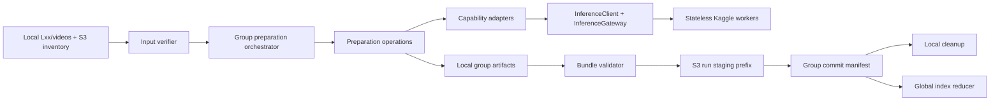
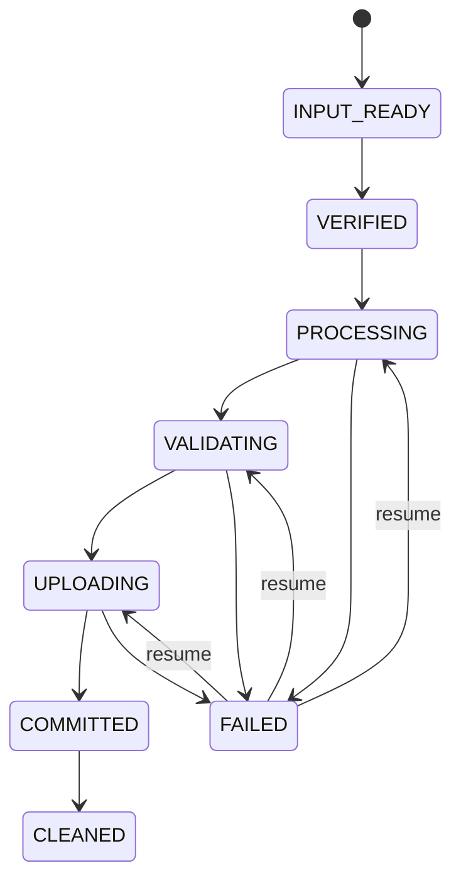
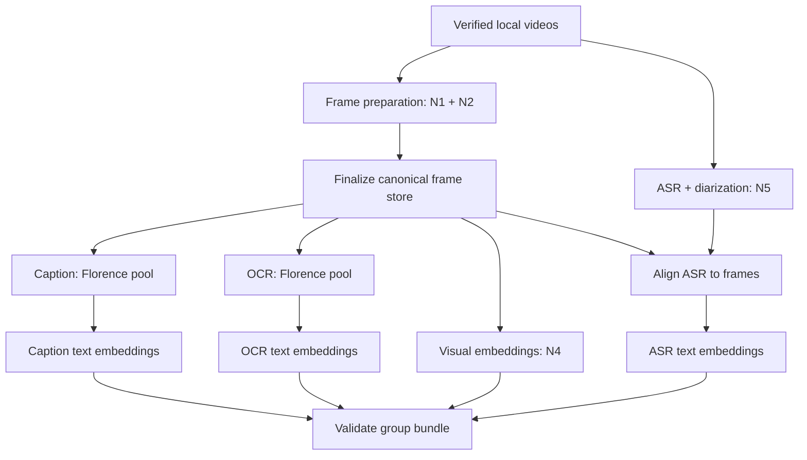

# Kaggle Distributed Corpus Preparation — Architecture Design

**Status:** Design validated through brainstorming on 2026-08-16  
**Scope:** Offline corpus preparation only  
**Source proposal:** `/home/phuckhang/.gemini/antigravity-ide/brain/cfc4f167-7eb2-4854-838d-9a2c1ce38db5/implementation_plan.md`

## 1. Understanding summary

- The system prepares the HCMAI corpus one S3 source group at a time. A group is a prefix such as `data/L21_a/videos/*.mp4`.
- Raw synchronization is outside this pipeline. The coordinator receives an already-local `Lxx/videos` directory plus its authoritative S3 inventory manifest.
- One CPU-oriented local coordinator invokes stateless GPU inference workers hosted in Kaggle notebooks through Cloudflare tunnels.
- A group is complete only after canonical frames/images, captions, OCR, ASR with diarization, and image/text embedding artifacts have all been validated and published.
- S3 is authoritative for published artifacts. Global visual/caption/OCR/ASR indexes are reduced from committed group bundles after all expected groups are available.
- Correctness, reproducibility, provenance, and safe resume take priority. The performance target is approximately 873–1,000 videos within 24 hours while required endpoints are available.
- The system is maintained by the five-person competition team through the end of the competition. It is not intended to become a multi-tenant inference platform or a large distributed worker fleet.

## 2. Current-state findings

The design must extend the active repository rather than implement the source proposal literally.

### SOURCE: reusable implementation already present

- `FramePreparationSession` already accepts injected shot detector, event detector, and DINO encoder dependencies.
- `InferenceClient` and `InferenceGateway` already provide bounded HTTP transport, retry/deadline behavior, circuit breaking, logging, and remote inference error categories.
- Remote caption and text-embedding adapters already exist.
- Caption, OCR, transcript, embedding, and corpus-build services already expose useful runtime seams and resumable artifact behavior.
- Canonical identity and artifact validation are established repository invariants.

### SOURCE: gaps or mismatches in the source proposal

- Adding a second all-purpose `HCMAIHttpClient` would duplicate the existing inference transport.
- `DefaultPreparationOperations._frame_session()` is a composition point, but detector/encoder injection belongs to `FramePreparationSession` rather than remote logic being embedded in the corpus workflow.
- Remote OCR, remote image embeddings, and remote ASR/diarization are incomplete.
- The existing corpus service owns S3 discovery/download through `staged_video()`, while the agreed input is already present locally and must be verified against an S3 inventory.
- The current visual-index operation combines embedding generation and searchable-index construction. Group-scoped publication requires these responsibilities to be separated.
- Production transcript configuration enables pyannote diarization, which was absent from the original five-notebook proposal.
- Base64 JSON payloads are unsuitable for image/audio-heavy batch traffic because of expansion and memory copying.

## 3. Goals and non-goals

### Goals

1. Preserve current pipeline algorithms, canonical outputs, model pins, and artifact semantics.
2. Replace local GPU inference with explicit remote capability adapters.
3. Treat one `Lxx` group as the failure, resume, validation, and publication boundary.
4. Make endpoint replacement safe when a Kaggle session expires.
5. Publish immutable, independently auditable group artifacts.
6. Build deterministic corpus-level indexes from committed group bundles.
7. Measure whether the full corpus can complete within 24 hours.

### Non-goals

- Online KIS/VQA/TRAKE serving, reranking, or competition-time inference.
- Distributed queues, leases, or multi-coordinator scheduling in v1.
- Silent model/backend fallback.
- Online mutation of committed group bundles or indexes.
- Redesigning frame-selection, deduplication, transcript alignment, or retrieval algorithms.
- Supporting 10,000–100,000 video scale before there is evidence it is needed.

## 4. Assumptions

- S3 is the source of truth for raw inventory and committed artifact bundles.
- The caller makes a complete local group directory available before the coordinator begins.
- Local staging has enough capacity for one group, not necessarily the full corpus.
- Six or more policy-compliant Kaggle T4 sessions may be available concurrently.
- Kaggle sessions and tunnel URLs are ephemeral; model revisions and response semantics are immutable within a run.
- Cloudflare Access service tokens can protect every remote endpoint. Credentials are supplied only through the environment.
- A missing endpoint may pause a stage; high availability is not required.
- No-speech and empty-OCR results are valid data, not failures.
- The 24-hour goal is an acceptance target requiring measurement, not a verified property of the proposed architecture.
- Payload limits, representative batch sizes, and safe per-GPU concurrency must be established by benchmark.

## 5. Decision log

| # | Decision | Alternatives considered | Rationale |
|---|---|---|---|
| 1 | Reliability and reproducibility are the primary objective. | Minimum wall-clock; minimum resources. | Artifact correctness and auditability cannot be recovered from a fast invalid run. |
| 2 | Use one coordinator. | Per-laptop shards; shared durable queue. | Avoid merge conflicts, leases, and distributed state at current scale. |
| 3 | Preserve semantics while allowing composition/config/contract refactors. | No workflow edits; deep pipeline redesign. | Enables clean remote injection without changing scientific behavior. |
| 4 | Target 873–1,000 videos in 24 hours. | 48 hours; best effort. | Gives a measurable throughput requirement without designing for unneeded scale. |
| 5 | Protect tunnels with Cloudflare Access. | Custom bearer token; anonymous tunnel. | Central secret handling and no unauthenticated exposure of inference/data endpoints. |
| 6 | Pause and resume when a required capability is unavailable. | Local fallback; silently skip. | Prevents provenance drift and incomplete publication. |
| 7 | Optimize maintenance for the five-person competition team. | Single long-term owner; permanent platform. | Prefer explicit runbooks and few moving parts. |
| 8 | Limit v1 to offline preparation. | Reuse for online inference. | Online serving has materially different latency and availability requirements. |
| 9 | Offload pyannote diarization with the N5 transcript capability. | Disable it; run it on local CPU. | Preserves configured transcript semantics and the CPU-only coordinator boundary. |
| 10 | Make `Lxx` the processing and publication unit. | Whole-corpus transaction; per-video publication. | Bounds disk/failure scope while matching the source layout and operating workflow. |
| 11 | Select the group-scoped orchestrator architecture. | Stage-first whole corpus; durable distributed queue. | Fits the required lifecycle, reuses current seams, and avoids YAGNI infrastructure. |
| 12 | Keep raw synchronization outside the orchestrator. | Coordinator downloads; automatic folder discovery. | The agreed input already exists locally; the orchestrator verifies rather than transfers it. |
| 13 | Accept local path plus S3 inventory as the input contract. | Local path only. | Enables provenance and completeness checks before GPU work. |
| 14 | Publish all per-group artifacts, then build global indexes. | Stage-wise publication; online index shards. | Produces self-contained groups and one canonical retrieval index per modality. |
| 15 | Delete local raw/payload data after verified commit; retain small manifests/checkpoints. | Keep everything; delete all state. | Frees disk while preserving audit and resume evidence. |
| 16 | Reuse the existing inference gateway and domain adapter seams. | Add a second monolithic HTTP client. | Avoids duplicated resilience and keeps business logic out of transport. |
| 17 | Use immutable S3 staging plus a final commit marker. | Upload directly into a mutable live prefix. | Object stores do not provide an atomic directory rename; a commit object provides visibility semantics. |
| 18 | Split per-group embedding generation from global index construction. | Build an index inside each group. | Allows deterministic reduction and avoids multi-shard online retrieval complexity. |
| 19 | Use binary/multipart payloads and S3 audio references rather than base64 JSON. | Base64 frames/audio. | Reduces request size and avoids tunnel limits for long audio. |

## 6. Architecture



### 6.1 Coordinator

The existing corpus-build workflow should be promoted/refactored into a source-independent group orchestrator. It receives a group run specification containing:

- `group_id`;
- absolute local videos path;
- source inventory manifest;
- corpus revision;
- pipeline and schema versions;
- exact model pins;
- endpoint capability configuration;
- output and S3 publication namespaces.

The orchestrator owns the DAG, stage transitions, checkpoints, validation, publication, and cleanup. It does not implement model preprocessing or inference.

### 6.2 Preparation operations

`PreparationOperations` remains the bridge to active domain services. Composition creates remote implementations and injects them into existing sessions/services. Domain-specific adapters remain separate so OCR, embeddings, transcripts, and preprocessing can evolve without a monolithic client.

### 6.3 Capability registry and routing

Endpoint configuration describes capability pools rather than notebook names. Readiness reports API schema, capabilities, checkpoint, revision, and batch/payload limits. The coordinator selects a healthy compatible endpoint with the fewest in-flight requests. URL rotation is allowed; semantic identity changes are not.

### 6.4 Kaggle workers

Workers are stateless with respect to corpus/group/frame identity. They load pinned models, validate bounded requests, perform inference, and echo caller-owned request/item identity with model provenance. A worker never writes canonical corpus artifacts or S3 publication manifests.

## 7. Group lifecycle and identity

The immutable `run_id` is computed from the group ID, source inventory, corpus revision, pipeline configuration, schema versions, and model pins. Endpoint URLs, retry counts, and elapsed time are excluded.



Input verification checks that local files match the S3 inventory by canonical video ID, object key, size, and version/ETag. Mutation or omission fails before inference.

Checkpoint granularity follows existing domain semantics:

- frames and transcripts: per video;
- caption/OCR: per canonical frame or deterministic batch;
- embeddings: deterministic shard/batch;
- validation/publication: per group bundle.

Each checkpoint is written atomically only after its serialized output has been read back and validated. A configuration or model-pin change creates a new run rather than reusing incompatible outputs.

## 8. Execution DAG



Frame preparation and transcript preparation may run concurrently per video. After frame finalization, caption, OCR, visual embedding, and transcript materialization follow the dependency graph.

Each capability has its own bounded queue, batch size, request deadline, maximum in-flight requests, and memory budget. Queue bounds provide backpressure. Image/audio/tensor payloads are released after each batch. Multiple Florence endpoints form one pool. N4 runs SigLIP and BGE phases conservatively unless benchmark evidence proves safe concurrent residency.

## 9. Remote contracts and payloads

Versioned capabilities:

- `GET /ready`
- `POST /v1/preprocessing/shot-scores`
- `POST /v1/preprocessing/event-window-scores`
- `POST /v1/embeddings/dino`
- `POST /v1/enrichment/captions`
- `POST /v1/enrichment/ocr`
- `POST /v1/embeddings/images`
- `POST /v1/embeddings/text`
- `POST /v1/transcripts/asr`
- `POST /v1/transcripts/diarization`

Existing response contracts should be generalized when semantics overlap. A parallel response model should not be introduced merely because input modality differs.

Every batch carries a deterministic request ID, ordered caller-owned item IDs, input checksum, and expected model revision. Responses echo identity/order plus actual model provenance and latency. Adapters reject changed identity, wrong revision, invalid shape/dimension, unnormalized output when normalization is required, and non-finite values.

Images and tensors use bounded multipart or binary bodies, not base64 JSON. GEBD sampling, overlap, accumulation, and interpolation remain in the preprocessing domain; the remote capability only scores fixed windows.

For ASR/diarization, the coordinator produces deterministic mono 16-kHz lossless audio, uploads it to a run-scoped temporary S3 object, and sends a short-lived presigned GET reference. N5 returns media-time transcript/diarization segments. Temporary audio is deleted after a valid local checkpoint.

## 10. Artifact and publication model

```text
artifacts/{corpus_revision}/groups/{group_id}/runs/{run_id}/
├── source-manifest.json
├── run-manifest.json
├── frame_store/{frames.parquet,images/...}
├── enrichment/{caption,ocr,asr}/frame_enrichment.parquet
├── transcripts/...
├── embeddings/{visual,caption,ocr,asr}/
│   └── {vectors.npy,mapping.parquet,manifest.json}
├── manifest.json
└── COMMITTED.json
```

DINO dedup vectors are transient by default. The run manifest retains the DINO checkpoint fingerprint and dedup configuration.

Publication is two-phase by convention:

1. Upload all files into the immutable run prefix.
2. Validate remote object inventory, size, and checksum.
3. Write `manifest.json` describing the complete bundle.
4. Write `COMMITTED.json` containing the manifest hash.

Only a valid commit object makes the run visible. Partial uploads are resumable and ignored by consumers.

The global reducer accepts an explicit expected group set, validates every commit and cross-group invariant, concatenates mappings/vectors in deterministic canonical order, and builds one corpus-level index per retrieval source. Its `corpus_run_id` hashes the ordered group commit hashes and reducer configuration. Global outputs use the same staging/commit convention.

## 11. Failure and recovery policy

- Retry only transient network errors, 429, and eligible 5xx responses within the request deadline.
- Open the circuit for a failed endpoint; use another endpoint only when capability and exact model provenance match.
- Pause when no compatible endpoint remains.
- Treat invalid response, identity change, or revision mismatch as a provider failure, not a retryable artifact result.
- Split deterministic batches on 413 or GPU OOM down to a configured minimum; record effective batch size.
- Fail the group on corrupt/missing source or artifact validation errors. Excluding a video requires a new authoritative source manifest.
- Preserve completed branch checkpoints when another DAG branch fails, but do not commit an incomplete bundle.
- Resume partial uploads by remote object inventory and checksum.
- Treat cleanup failure after commit as a warning/retryable maintenance action, not artifact failure.
- Treat no speech and empty OCR as successful empty evidence.
- Keep smoke runs in a separate namespace and expected group set.

## 12. Security and observability

Cloudflare Access service credentials, S3 credentials, and presigned URLs are supplied at runtime and redacted from logs. Presigned audio access is short-lived and scoped to one object. Workers validate content type, byte limits, tensor shape/dtype, batch length, and model selection before allocation.

Metrics and traces record group/run/stage/capability, endpoint instance, request ID, item and byte counts, queue wait, inference and end-to-end latency, retries, batch splits, checkpoint reuse, cache state, circuit state, and failure category. They do not record secrets, signed URLs, raw audio, or unnecessary prompt content.

## 13. Testing and acceptance

### Contract and parity

- Serialization, validation, identity/order, size limits, and mismatch tests for every remote contract.
- Golden local-versus-remote fixtures for every model capability using pinned model and environment fingerprints.
- Numeric tolerance for floating output; deterministic text/segment and media-time invariant checks.

### Orchestration and fault injection

- Hand-calculable group inventory and DAG fixtures.
- Restart at every lifecycle transition.
- Timeout before/after response, 429/5xx, endpoint rotation, invalid revision, OOM batch split, partial upload, and cleanup failure.
- Config/model changes create new runs; unchanged runs reuse valid checkpoints without duplicates.

### Artifact and reducer

- Canonical identity/order and no duplicate IDs.
- Mapping/vector row alignment and checksums.
- No visibility before commit.
- Deterministic reduction from multiple committed groups.
- Rebuild global indexes from S3 after local payload cleanup.

### Smoke and performance

Run approximately five representative videos through real Kaggle endpoints into the smoke namespace. The benchmark sample must be stratified by duration, resolution, speech ratio, and candidate-frame density. Record P50/P95 throughput and latency for decode, transfer, queue wait, each model, checkpoint, and publication.

Acceptance criteria:

1. Resume at every checkpoint produces no duplicate or changed canonical output.
2. Remote artifacts satisfy parity and invariants against the local baseline.
3. Uncommitted groups are invisible; committed groups are independently auditable and reducible.
4. End-to-end smoke uses no local GPU.
5. A benchmark projects the 24-hour target with headroom; only an actual full run may claim the SLA is achieved.

## 14. Risks requiring measured validation

- Kaggle session duration, GPU memory, and permitted concurrent sessions.
- Cloudflare and server request/body/time limits.
- TransNet temporal chunk overlap needed for exact parity.
- GEBD window transfer cost versus server-side preprocessing parity.
- Long-video audio size, temporary S3 transfer time, and diarization latency.
- Florence caption/OCR critical-path throughput and the number of replicas required.
- Whether SigLIP2 and BGE-M3 can safely remain resident together on T4.
- Local disk high-water mark for the largest `Lxx` group.
- Global vector/index build memory and duration.

These items are PROPOSED engineering choices until benchmarked in the HCMAI environment. Configuration values must be recorded with each experiment; defaults are not scientific truths.

## 15. Implementation handoff constraints

Implementation must begin with a repository-level change plan and reuse audit. It must not:

- create a second general HTTP resilience stack;
- introduce parallel candidate/artifact/embedding contracts without an immediate semantic need;
- move canonical identity ownership to Kaggle workers;
- combine group publication with mutable global index updates;
- silently rebuild missing offline artifacts;
- modify TRAKE or online task semantics;
- claim the 24-hour target without recorded measurements.

