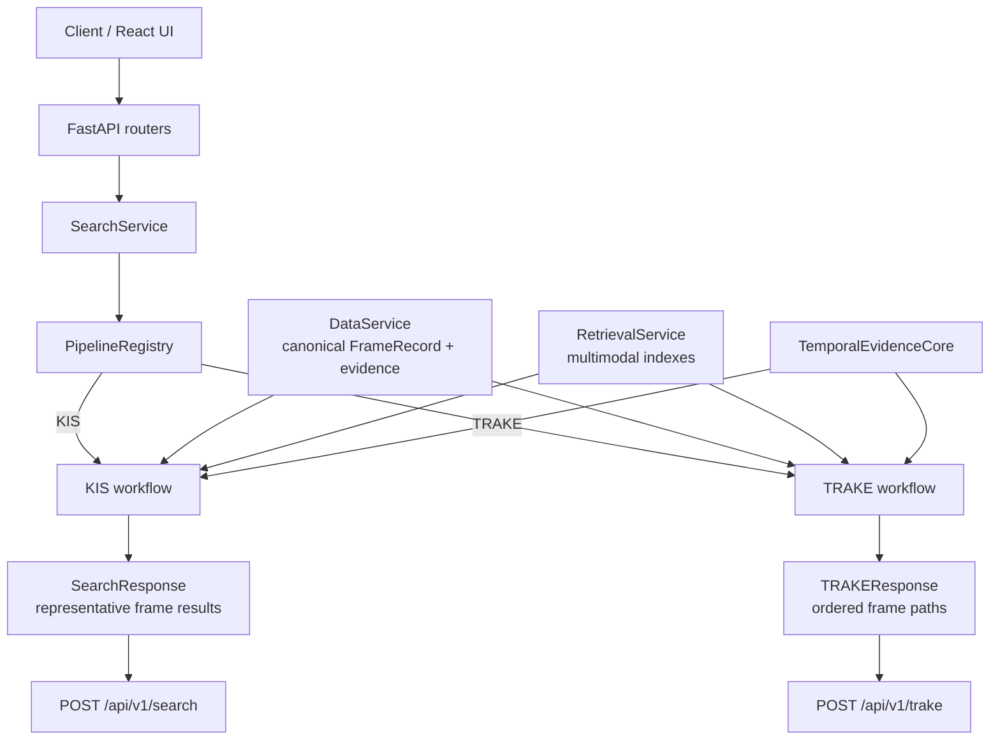
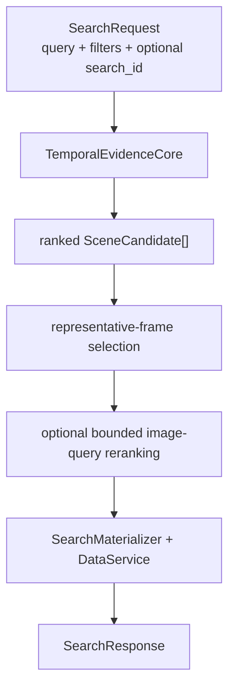
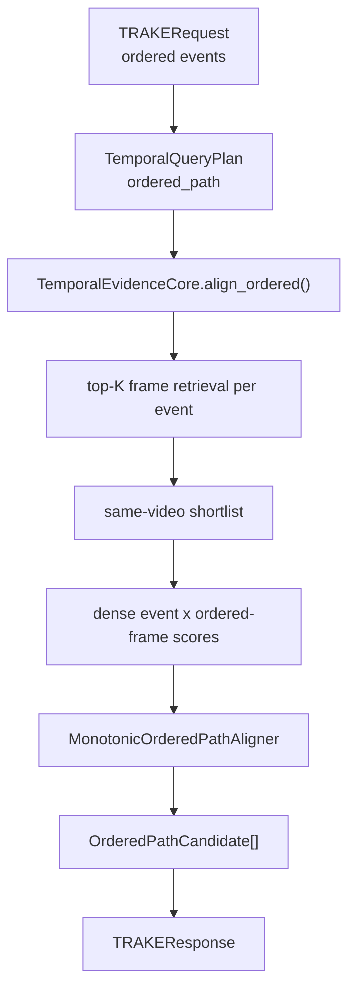

# Kiến trúc và thuật toán HCMAI

Tài liệu này mô tả runtime đang hoạt động trong package `hcmai` cho hai bài
toán của HCMAI 2026:

- KIS — Known Item Search, trả về một competition frame hợp lệ;
- TRAKE — tìm chuỗi frame theo thứ tự các sự kiện.

BTC keyframes là input visual canonical. Caption, OCR, Object và ASR là bằng
chứng chuyên biệt; `FrameContext` là view dẫn xuất và không thay thế evidence
gốc. Online serving chỉ đọc artifact/index đã build, không tự sinh enrichment
hay rebuild index.

## 1. Kiến trúc tổng thể

FastAPI chỉ làm transport. `SearchService` là application facade,
`PipelineRegistry` chọn KIS hoặc TRAKE workflow, còn các workflow dùng chung
data, retrieval, temporal alignment và bounded reranking.



```text
query
  -> KIS retrieval
  -> progressive scene localization
  -> canonical representative frame
  -> frame submission

ordered events
  -> TRAKE retrieval
  -> ordered temporal alignment
  -> canonical frame path
  -> path submission
```

Routers validate request/response schemas and map application errors to HTTP.
They do not perform retrieval, temporal alignment, model inference, or
canonical materialization themselves.

## 2. Canonical identity

Mọi layer phải giữ ít nhất:

```text
video_id
frame_id
frame_idx
timestamp_ms
```

- `frame_id` là identity nội bộ cho join, evidence và retrieval candidates.
- `frame_idx` là tọa độ BTC dùng cho submission.
- `frame_idx` không phải keyframe order, filename number, decode position hay
  array index.
- Reranker/inference provider chỉ được score input đã cho; chúng không được
  tạo hoặc thay identity.

`DataService` là nơi resolve `frame_id` thành `video_id`, `frame_idx` và
`timestamp_ms` canonical trước materialization.

## 3. Shared multimodal retrieval

Retrieval giữ provenance theo modality thay vì flatten và bỏ evidence gốc:

```text
query
  -> visual / FrameContext / ASR retrieval
  -> modality-specific ranks and scores
  -> task-aware reciprocal-rank fusion
  -> RetrievalResult candidates + trace + warnings
```

Caption, normalized OCR, normalized objects và ASR vẫn có thể được inspect
độc lập. ASR là timeline evidence, không tự động mô tả một frame.

Fusion preserves source scores/ranks and canonical identity. Missing or
unevaluated evidence remains distinct from a confirmed non-match; this is
important when the temporal core decides whether a video needs backfill.

### 3.1 RRF and task configuration

`RetrievalService` produces candidates with one-based source ranks. The fusion
configuration covers the active `kis` and `trake` task types. Tunable values
such as candidate counts, modality weights, rerank depth and temporal budgets
belong in configuration rather than business-logic constants.

## 4. Shared temporal alignment

`TemporalEvidenceCore` owns the common conversion from retrieval candidates to
canonical `FrameEvidence` and supports two explicit alignment modes:

| Mode | Consumer | Output |
| --- | --- | --- |
| `progressive_scene` | KIS | ranked `SceneCandidate[]` |
| `ordered_path` | TRAKE | ranked `OrderedPathCandidate[]` |

### 4.1 Progressive scene localization

KIS can accumulate query hints through a request-owned progressive state. The
core combines global retrieval with bounded retrieval in prior candidate
videos, canonical-deduplicates evidence, backfills older query units when a
video is rescued, then scores and prunes the active pool.

The required ordering is:

```text
temporary video union
-> backfill rescued videos
-> multi-hint score
-> prune
```

Pruning earlier can discard a target that only matched the newest hint before
older evidence is checked.

Each video keeps the three meaningful evidence states:

```text
not evaluated
no useful evidence found
evidence matched
```

They must not be collapsed into a single zero score when that changes ranking
semantics.

### 4.2 Scene assembly and scoring

The core sorts evidence by timestamp and clusters it subject to both a maximum
adjacent gap and maximum total span. A scene stores same-video canonical frame
evidence, per-unit scores, modality provenance and explainable score
components.

The score combines normalized semantic evidence, match/evaluation coverage,
temporal coherence and applicable temporal relations. If a relation cannot be
evaluated, it is excluded and the active weights are renormalized; UNKNOWN is
not treated as negative evidence.

## 5. KIS workflow

KIS uses `progressive_scene` and materializes at most one representative frame
from each ranked scene.



Representative selection prefers the strongest evidence, then the frame nearest
the scene midpoint, then lower `frame_idx` as the deterministic tie-break.
Reranking can reorder only this bounded candidate set and must preserve every
canonical identity field and provenance value.

Public route:

```text
POST /api/v1/search
```

## 6. TRAKE workflow

TRAKE takes ordered events, retrieves evidence for each event, shortlists
videos, rescoring a dense event-by-frame matrix and runs the stable monotonic
aligner. It does not use progressive KIS state.



For a same-video ordered path, the aligner selects positions:

```math
p_1 < p_2 < ... < p_n
```

and maximizes event evidence while applying the configured temporal-gap
penalty. It uses prefix maxima so each dynamic-programming layer is linear in
the number of frames. `frame_ids`, `frame_idxs` and timestamps are resolved
canonically before creating a submission.

Public route:

```text
POST /api/v1/trake
```

TRAKE is a stable task-specific path. Changes to alignment semantics, gap
penalty or submission materialization require a dedicated regression benchmark.

## 7. Offline artifacts and serving boundary

```text
BTC keyframes -> canonical FrameRecord -> Caption/OCR/Object evidence
videos -> timestamped ASR segments
specialist evidence -> FrameContext
visual/context/ASR embeddings -> versioned indexes
versioned artifacts -> read-only online services
```

Serving verifies artifact/model compatibility and reports an unavailable
capability when a required bundle is missing or inconsistent. It does not
silently reconstruct artifacts. Hosted inference is used only for model work;
local services retain frame assets, canonical metadata, retrieval indexes and
final competition outputs.

## 8. Observability, configuration and evaluation

Each request has a `request_id`; progressive KIS sessions also have a
`search_id`. `RetrievalResult` and pipeline traces report stage duration,
status, counts, cache/fallback state and safe warnings. Logs must not include
credentials, image payloads or private prompt contents.

Measure the stage that matches the failure mode:

| Concern | Primary measurements |
| --- | --- |
| KIS retrieval/localization | correct-video recall, scene/window recall, official frame metric, ranking and latency |
| TRAKE alignment | ordered-path correctness, official submission score, per-stage latency |
| Hosted inference | readiness, model/index compatibility, bounded remote-call latency |

Experiments record query-set and artifact versions, model revision,
configuration, code revision, hardware/provider, metrics, latency and failure
cases. A paper or implementation motivates a hypothesis; only a controlled
HCMAI experiment verifies an improvement.

## 9. Package map and running

```text
src/hcmai/
├── api/                         thin HTTP routers
├── common/                      shared contracts, config and observability
├── data/                        canonical frame/evidence stores
├── orchestration/               SearchService and task composition
├── pipelines/
│   ├── kis/                     KIS-specific helpers
│   └── trake/                   TRAKE settings and compatibility algorithm
├── retrieval/                   embedding, indexes, fusion and reranking
└── temporal/                    shared plans, evidence and aligners
```

Run the local backend after the required artifacts and configuration are
available:

```bash
PYTHONPATH=.:src aic/bin/python -m uvicorn hcmai.app:app \
  --host 127.0.0.1 --port 8000
```

The main public routes are `GET /health`, `POST /api/v1/search`,
`POST /api/v1/trake`, frame asset/neighbor routes, and `POST /api/v1/submit`.
