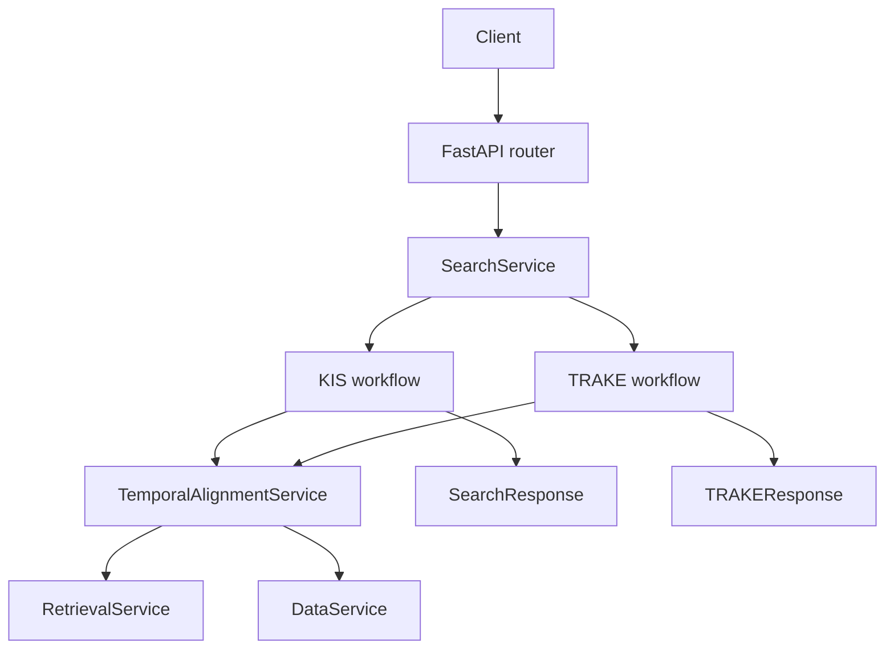

# HCMAI runtime architecture

`hcmai` is the online runtime for HCMAI 2026 multimodal video retrieval. BTC
keyframes and their `FrameRecord` metadata are canonical. Caption, OCR,
objects, and ASR remain specialist evidence; online serving reads completed
artifacts and never regenerates corpus-scale data.

## Runtime path

```text
FastAPI router
  -> SearchService / PipelineRegistry
  -> KIS or TRAKE workflow
  -> TemporalAlignmentService
  -> RetrievalService.score_event_videos()
  -> pure monotonic DP
  -> DataService canonical materialization
  -> competition-compatible response
```

KIS and TRAKE share a stateless ordered event-to-frame alignment baseline.
KIS projects one deterministic representative from each aligned path into its
existing `SearchResponse`; TRAKE returns the complete path in
`TRAKEResponse`. Task heads do not rewrite retrieval scores or identity.



## Canonical identity

Every stage preserves:

```text
video_id
frame_id
frame_idx
timestamp_ms
```

`frame_id` is the internal join identity. `frame_idx` is the BTC
competition-facing coordinate and is never inferred from keyframe order,
filename number, decode position, or an array index. Retrieval and alignment
may rank candidates but cannot invent or alter these values.

## Shared temporal baseline

`temporal/planner.py` converts a query or caller-provided events into an
`AlignmentPlan`. `RetrievalService` builds a per-video event-by-frame score
matrix, subject to requested video/time filters. `temporal/dp.py` returns
strictly increasing paths, and `TemporalAlignmentService` validates each frame
against `DataService` before constructing an `AlignmentPath`.

The baseline deliberately does not keep mutable search sessions, cluster
scenes, apply soft temporal-relation scoring, or run a default reranker. A
standalone reranking package can still be used in explicitly designed offline
experiments; it is not constructed by the default online registry.

The score definition, non-capabilities, and experiment convention are in
[`docs/research/alignment-baseline.md`](../../docs/research/alignment-baseline.md).
The current migration authority remains **PROPOSED** until a frozen HCMAI
development set and compatible scorer establish the trade-off.

## Package boundaries

```text
api/             HTTP validation and response shaping only
common/          shared schemas, configuration, logging, observability
data/            canonical frame metadata, specialist evidence, artifacts
retrieval/       embeddings, indexes, modality retrieval, fusion
temporal/        alignment planning, pure DP, canonical path service
orchestration/   service composition and thin KIS/TRAKE workflow heads
thundercompute/  inference gateway adapters
```

## Offline versus online work

```text
BTC keyframes -> FrameRecord -> caption / OCR / imported objects
videos -> timestamped ASR segments
specialist evidence -> FrameContext
embeddings -> versioned indexes
completed artifacts -> read-only online services
```

Serving reports unavailable dependencies rather than rebuilding artifacts.
ASR remains timeline evidence, so its association with a returned frame is
provenance, not proof that the frame visually depicts the speech.

## Configuration and evaluation

Alignment choices are explicit in `search.alignment`: score depth, video
shortlist size, RRF constant, time-gap penalty, score transform, and decoder
limits. These values are baselines, not scientific truths.

Record a versioned query set, artifacts/indexes, model revision, configuration,
code revision, metric or labelled proxy, P50/P95 stage latency, and failure
cases before claiming an improvement. A retrieval/localization change should
be evaluated with appropriate recall/path or official task metrics, not only a
passing unit test.

## Running and verification

Run the backend only after the required artifacts are present:

```bash
PYTHONPATH=.:src aic/bin/python -m uvicorn hcmai.app:app \
  --host 127.0.0.1 --port 8000
```

The principal public routes are `GET /health`, `POST /api/v1/search`,
`POST /api/v1/trake`, frame asset/neighbor routes, and `POST /api/v1/submit`.
Use small hand-checkable score matrices for temporal tests and full task
workflow tests for filter and identity preservation.
