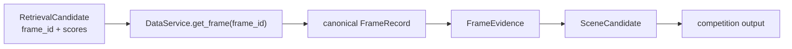
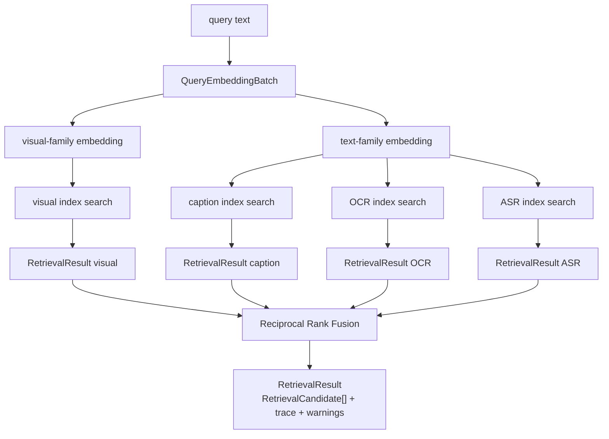
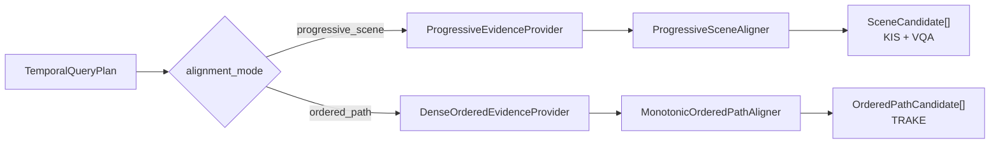
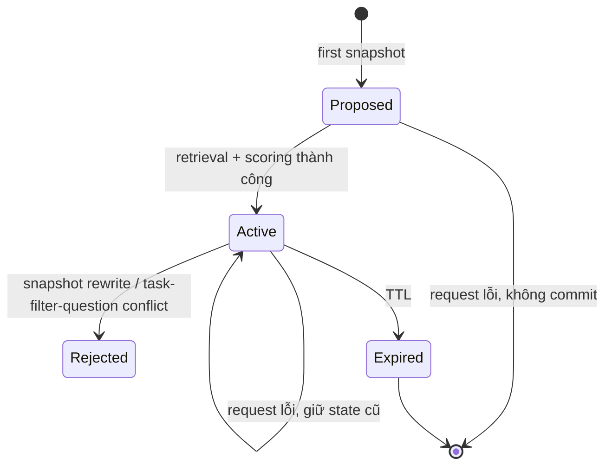
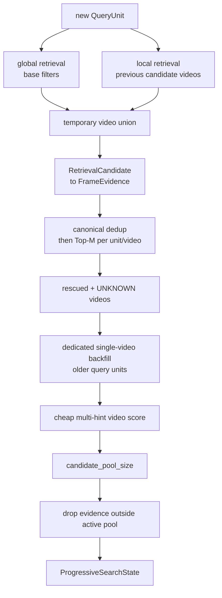
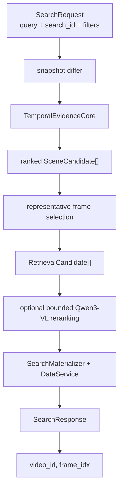
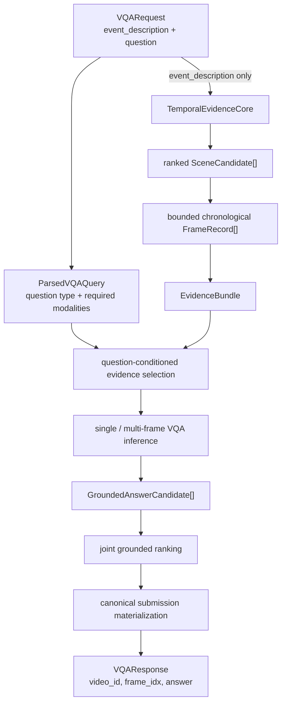
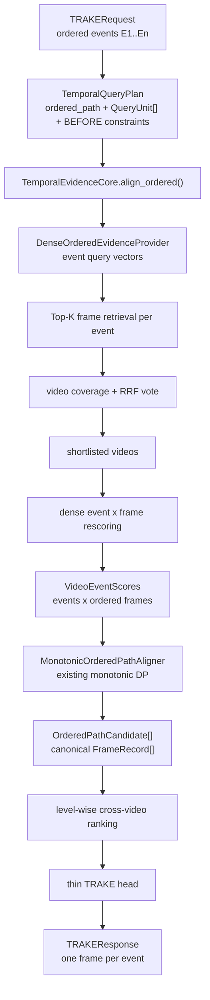
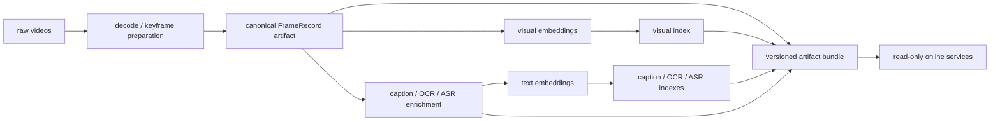
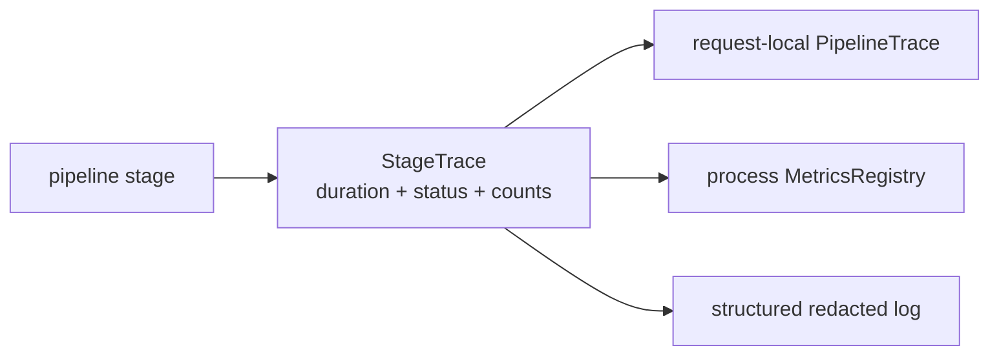

# Kiến trúc và thuật toán HCMAI

Tài liệu này mô tả workflow và thuật toán đang được triển khai trong package
`hcmai` cho ba bài toán của AIC HCMC 2026:

- KIS — Known Item Search;
- VQA — định vị scene rồi trả lời câu hỏi;
- TRAKE — tìm một chuỗi frame theo thứ tự các sự kiện.

Mục tiêu của hệ thống không chỉ là tìm một frame giống câu truy vấn nhất. Với
KIS và VQA, nhiều gợi ý có thể xuất hiện tại các thời điểm khác nhau nhưng vẫn
thuộc cùng một scene. Hệ thống vì vậy phải đi qua ba cấp biểu diễn khác nhau:

```text
retrieved frame
    -> candidate video
    -> coherent temporal scene
```

Tài liệu phân biệt hai trạng thái:

- **CURRENT:** đã có trong runtime, schema, config và test hiện tại;
- **DEVELOPING:** hướng đang được phát triển hoặc cần benchmark trước khi trở
  thành mặc định.

## 1. Kiến trúc tổng thể

FastAPI chỉ làm nhiệm vụ transport. `SearchService` là application facade,
`PipelineRegistry` chọn task pipeline, còn các pipeline sử dụng các service
chung cho dữ liệu, retrieval, reranking và inference.

```mermaid
flowchart TB
    CLIENT["Client / React UI"] --> API["FastAPI routers"]
    API --> REQ["TaskRequest"]
    REQ --> SERVICE["SearchService"]
    SERVICE --> REGISTRY["PipelineRegistry"]

    REGISTRY -->|KIS / VKIS| KIS["KISPipeline"]
    REGISTRY -->|VQA| VQA["VQAPipeline"]
    REGISTRY -->|TRAKE| TRAKE["TRAKEPipeline"]

    KIS -->|progressive_scene plan| TEMP["TemporalEvidenceCore<br/>shared temporal facade"]
    VQA -->|progressive_scene plan| TEMP
    TRAKE -->|ordered_path plan| TEMP

    DATA["DataService<br/>FrameRecord + evidence stores"] --> TEMP
    DATA --> KIS
    DATA --> VQA
    RET["RetrievalService<br/>multimodal indexes"] --> TEMP
    LLM["LLMService<br/>single / multi-frame VQA"] --> VQA

    TEMP -->|SceneCandidate[]| KIS
    TEMP -->|SceneCandidate[]| VQA
    TEMP -->|OrderedPathCandidate[]| TRAKE

    KIS --> KMAT["SearchMaterializer<br/>canonical FrameRecord → SearchResult[]"]
    VQA --> VMAT["VQA materialization<br/>grounded answers → VQASubmission[]<br/>+ retrieval fallback evidence"]
    TRAKE --> TMAT["TRAKE materialization<br/>ranked paths → TRAKESubmission[]"]

    KMAT --> KOUT["SearchResponse<br/>canonical video/frame"]
    VMAT --> VOUT["VQAResponse<br/>video/frame/answer"]
    TMAT --> TOUT["TRAKEResponse<br/>ordered frame path"]

    KOUT --> KHTTP["POST /api/v1/search<br/>response_model=SearchResponse<br/>Pydantic validation → JSON"]
    VOUT --> VHTTP["POST /api/v1/vqa<br/>response_model=VQAResponse<br/>Pydantic validation → JSON"]
    TOUT --> THTTP["POST /api/v1/trake<br/>response_model=TRAKEResponse<br/>Pydantic validation → JSON"]

    KHTTP --> FSEARCH["frontend searchFrames()<br/>validate results + resolve asset URLs"]
    VHTTP --> FVQA["frontend searchVqa()<br/>validate submissions + resolve asset URLs"]
    THTTP --> FTRAKE["frontend searchTrake()<br/>validate events + ordered submissions"]

    FSEARCH --> KUI["AdHocSearchWorkspace<br/>ranked frame results"]
    FVQA --> VUI["VqaSearchWorkspace<br/>answers + grounded evidence"]
    FTRAKE --> TUI["VqaSearchWorkspace / TRAKE mode<br/>ordered event path"]
```

Các pipeline tạo trực tiếp public response schema trước khi trả về
`SearchService`. Router không tự ghép lại competition result: nó chỉ chọn đúng
endpoint, áp dụng `response_model`, chuyển schema đã validate thành JSON và map
lỗi application sang HTTP status. Ở frontend, `searchFrames()`, `searchVqa()`
và `searchTrake()` kiểm tra shape tối thiểu của JSON; chúng không được tự tạo
video/frame/answer thay cho backend.

### Public object boundaries

| Stage                 | Input                        | Output                                                   | Ý nghĩa                                                          |
| --------------------- | ---------------------------- | -------------------------------------------------------- | ------------------------------------------------------------------ |
| HTTP validation       | JSON                         | `TaskRequest`                                          | Request đã được validate theo task                            |
| Retrieval             | query text                   | `RetrievalResult`                                      | Frame candidates, provenance, trace, warning                       |
| Evidence adaptation   | `RetrievalCandidate`       | `FrameEvidence`                                        | Gắn canonical frame và query-unit score                          |
| Temporal localization | cumulative hints             | `SceneCandidate[]`                                     | Các scene cùng video, có time range rõ ràng                   |
| KIS head              | ranked scenes                | `SearchResponse`                                       | Một representative frame cho mỗi scene                           |
| VQA reasoning         | scene + question             | `GroundedAnswerCandidate[]`                            | Answer được ground vào một frame đã cung cấp               |
| VQA output            | ranked answers               | `VQASubmission[]`                                      | Canonical video/frame/answer rows                                  |
| Temporal planning     | task hints/events            | `TemporalQueryPlan`                                    | Chọn explicit`progressive_scene` hoặc `ordered_path`         |
| TRAKE alignment       | `VideoEventScores[]`       | `OrderedPathCandidate[]`                               | Canonical path: một frame theo thứ tự cho mỗi event            |
| Response composition  | task rows + request metadata | `SearchResponse` / `VQAResponse` / `TRAKEResponse` | Ghép public schema trong task pipeline/materializer               |
| HTTP response         | validated response schema    | endpoint JSON                                            | FastAPI áp dụng đúng`response_model` và serialize           |
| Frontend adapter      | endpoint JSON                | task workspace data                                      | Kiểm tra shape, resolve asset URL, không tạo competition result |

## 2. Canonical identity

`FrameRecord` là source of truth của một frame:

```text
frame_id
video_id
frame_idx
timestamp_ms
image_path
```

Các index chỉ được phép trả `frame_id`. Sau retrieval, hệ thống resolve lại
frame qua `DataService`; metadata lặp lại trong index được dùng để kiểm tra
conflict, không được dùng để thay thế canonical metadata.



`frame_idx` không được suy ra từ timestamp, FPS, filename, array index hoặc vị
trí keyframe. Nếu competition yêu cầu một hệ tọa độ khác, conversion phải nằm
trong mapping layer có thẩm quyền.

## 3. Shared multimodal retrieval

### 3.1 Workflow

Một query có thể được search trên bốn nguồn:

- visual frame embeddings;
- generated captions;
- OCR text;
- ASR/transcripts.

Visual và text dùng hai encoder family. Caption, OCR và ASR có thể tái sử dụng
cùng text embedding batch khi encoder tương thích. Các modality search chạy
đồng thời với bounded worker pool.



Optional modality failure được giữ thành warning và failure trace. Required
modality failure làm request fail rõ ràng. Candidate từ các nguồn được merge
bằng canonical `frame_id`; source score và source rank không bị xóa.

### 3.2 Reciprocal Rank Fusion

Raw similarity của visual, caption, OCR và ASR không nhất thiết cùng scale.
Runtime hiện tại dùng rank-based fusion:

```math
RRF(f) = \sum_{m \in M_f} \frac{w_{task,m}}{k + rank_m(f)}
```

Trong đó:

- `f` là canonical frame;
- `M_f` là các modality retrieve được frame đó;
- `rank_m(f)` là rank một-based trong modality `m`;
- `w_task,m` là weight theo task trong config;
- `k` là `rrf_k`, mặc định hiện tại là `60`.

Nếu một optional modality không hoạt động, active weights có thể được
renormalize để tổng contribution không giảm chỉ vì backend thiếu tạm thời.
Tie-break sau fusion là:

```text
fusion score giảm dần
-> best source rank tăng dần
-> frame_id tăng dần
```

### 3.3 Trạng thái đang phát triển

CURRENT dùng weight theo task (`kis`, `vqa`, `trake`). DEVELOPING là
query-conditioned modality routing: OCR-heavy query, speech-heavy query và
visual query sẽ có retrieval policy khác nhau. Thay đổi này phải được benchmark
trước khi thay runtime mặc định.

## 4. Shared temporal alignment facade

`TemporalEvidenceCore` là composition facade dùng chung cho cả ba task nhưng
không ép chúng vào cùng một thuật toán:



KIS và VQA luôn dùng progressive scene route của facade này. Nếu temporal core
không được khởi tạo, task trả dependency error thay vì chuyển sang một đường
localization không có thứ tự. TRAKE dùng stateless `ordered_path` plan từ danh
sách event explicit và không dùng progressive `search_id`.

### 4.1 Progressive snapshots

Frontend có thể gửi cumulative snapshots:

```text
Q1 = H1
Q2 = H1 + H2
Q3 = H1 + H2 + H3
```

Snapshot differ chỉ tạo query unit mới từ delta:

```text
H1, ΔH2, ΔH3, ...
```

Rewrite không phải cumulative extension bị reject để tránh ghi đè state đã
commit.



Mỗi session khóa:

- `task_type` — KIS/VQA không dùng nhầm state;
- `base_filters` — search universe không đổi giữa các hint;
- VQA question fingerprint — đổi question phải tạo search mới;
- version — commit dùng compare-and-swap và per-search lock.

### 4.2 Ba trạng thái evidence

Với một cặp `(query_unit, video)`:

```text
UNKNOWN
EVALUATED_NO_MATCH
MATCHED
```

Các trạng thái có ý nghĩa khác nhau:

```text
không xuất hiện trong pooled Top-K
    != dedicated search đã kiểm tra và không match
    != có match yếu
```

Một pooled local search trên nhiều video chỉ trả các frame tốt nhất của toàn
pool. Vì vậy, video không xuất hiện vẫn là `UNKNOWN`. Chỉ dedicated backfill
search với filter đúng một video mới được phép tạo `EVALUATED_NO_MATCH`.

### 4.3 Evidence acquisition và backfill



Thứ tự bắt buộc là:

```text
temporary union
-> backfill rescued videos
-> multi-hint scoring
-> prune
```

Nếu prune trước backfill, một target mới chỉ match hint gần nhất có thể bị loại
trước khi các hint cũ được kiểm tra.

Evidence của global và local branch có thể trùng frame. Hệ thống thực hiện:

```text
merge
-> deduplicate by canonical frame_id
-> sort by score
-> Top-M
```

Nhờ đó duplicate không chiếm mất quota của một evidence khác.

### 4.4 Candidate-video scoring

Retrieval scores được normalize theo từng query unit trên active candidate
set. Với score `s` và range `[l_u, h_u]` của unit `u`:

```math
\hat{s}_{u,v} =
\begin{cases}
1, & h_u \le l_u \\
clip\left(\frac{s_{u,v}-l_u}{h_u-l_u},0,1\right), & otherwise
\end{cases}
```

Với một video:

```math
semantic_v = mean\left(\max \hat{s}_{u,v}\right)
```

chỉ trên các unit có matched evidence. Hai coverage được giữ riêng:

```math
matchCoverage_v = \frac{matched\ evaluated\ units}{evaluated\ units}
```

```math
evaluationCoverage_v = \frac{evaluated\ units}{total\ query\ units}
```

Cheap candidate score hiện tại:

```math
S_v = \frac{
w_s semantic_v +
w_m matchCoverage_v \cdot evaluationCoverage_v +
w_e evaluationCoverage_v
}{w_s+w_m+w_e}
```

Default weights trong config:

```text
semantic   = 0.45
match      = 0.25
evaluation = 0.30
```

Công thức này ngăn một video chỉ có một frame cực mạnh đứng trên video match
ổn định nhiều hints; đồng thời UNKNOWN không bị biến thành negative evidence
hoặc perfect evidence.

### 4.5 Scene assembly

Evidence trong mỗi video được canonical-deduplicate. Nếu cùng frame hỗ trợ
nhiều query unit, hệ thống merge `unit_scores`, modality provenance và source
ranks thay vì loại một occurrence.

Các frame được sort theo timestamp rồi cluster với hai ràng buộc:

```math
t_i - t_{i-1} \le sceneMaxGap
```

```math
t_i - t_{clusterStart} \le sceneMaxSpan
```

`scene_max_gap_ms` ngăn nối các evidence quá xa nhau. `scene_max_span_ms` ngăn
chaining tạo scene dài vô hạn dù mọi cặp frame liên tiếp vẫn gần nhau.

Output của bước này là:

```text
SceneCandidate
├── video_id
├── start_ms / end_ms
├── FrameEvidence[]
├── unit_scores
└── score components
```

Schema bắt buộc mọi evidence phải cùng `video_id`, nằm trong time range và
scene không được rỗng.

### 4.6 Scene scoring

Mỗi scene có bốn component khả dụng.

Semantic score:

```math
semantic = mean_u\left(\max_{f \in scene} \hat{s}_{u,f}\right)
```

Match coverage và evaluation coverage:

```math
effectiveCoverage = matchCoverage \cdot evaluationCoverage
```

Temporal coherence với scene span `d`:

```math
temporal = \frac{1}{1 + d / sceneCoherence}
```

Relation score chỉ tồn tại khi constraint có đủ evidence để evaluate. Nếu
relation là UNKNOWN, component này bị loại khỏi weighted sum và các active
weights được normalize lại:

```math
SceneScore = \frac{\sum_{c \in active} w_c S_c}{\sum_{c \in active} w_c}
```

Default scene weights:

```text
semantic = 0.45
coverage = 0.30
temporal = 0.15
relation = 0.10
```

Sau scoring, hệ thống giữ `scene_top_b_per_video`, sau đó lấy
`scene_top_p_global` trên toàn corpus.

### 4.7 Temporal relations

Reveal order không phải video order. Parser hiện chỉ tạo soft constraint cho
các pattern đủ chắc chắn:

- `sau đó`, `rồi`, `then` → previous unit BEFORE current unit;
- `đồng thời`, `cùng lúc`, `simultaneously` → OVERLAP;
- `cuối cùng`, `finally`, `at the end` → AT_END.

Các pattern mơ hồ như `sau khi`, `trước đó`, `ngay trước`, `ngay sau` chưa tạo
constraint. Không có constraint tốt hơn một constraint sai.

Với Top-M evidence, BEFORE được thỏa nếu tồn tại ít nhất một cặp:

```math
\exists\ t_a \in T_A, t_b \in T_B : t_a \le t_b
```

Scorer không chỉ so occurrence sớm nhất của hai unit.

## 5. KIS workflow

### 5.1 Temporal architecture — CURRENT default



Mỗi ranked scene tạo tối đa một representative frame. Selector ưu tiên:

```text
evidence score cao nhất
-> gần scene midpoint nhất
-> frame_idx nhỏ hơn để tie-break
```

Trước reranking, `final_score` của output candidate là scene score. Khi
reranker được cấu hình và `search.rerank_count > 0`, reranker có thể ghi đè
`final_score` để reorder bounded representative candidates; source scores/ranks
và scene metadata vẫn được giữ để giải thích provenance. Reranker không được
tạo hoặc thay đổi canonical `frame_id`. Materializer resolve canonical metadata
và chỉ trả tối đa `top_k` rows.

## 6. VQA workflow

VQA tách rõ hai trách nhiệm:

```text
event hints -> WHERE to look
question    -> WHAT to answer
```

Question không được đưa vào first-stage temporal localization.



### 6.1 Query parsing

Rule-based parser hiện phân loại question thành:

```text
general, count, color, text, speech, temporal, identity
```

Question type chọn preferred evidence modalities. Ví dụ text question ưu tiên
OCR, speech question ưu tiên ASR. Parser giữ nguyên ngôn ngữ Việt/Anh và không
tự phát minh scene facts.

### 6.2 Frame and evidence bundle

Từ mỗi ranked scene, pipeline lấy canonical evidence frames và neighbor frames
nằm đúng trong `[start_ms, end_ms]`. Frames được sort theo:

```text
timestamp_ms -> frame_idx -> frame_id
```

Nếu vượt image budget, pipeline lấy các vị trí phân bố đều trên timeline thay
vì chỉ lấy những frame đầu.

`EvidenceBundle` gồm:

```text
SceneCandidate
chronological FrameRecord[]
timestamped caption/OCR/ASR EvidenceItem[]
warnings
```

Text evidence được deduplicate theo `(source, normalized text)` và bị giới hạn
bởi `max_evidence_items` cùng character budget. Sau localization, question mới
được dùng để đưa preferred modality lên trước.

### 6.3 Multi-frame inference

Nếu provider hỗ trợ `answer_vqa_multi` và bundle có nhiều ảnh, pipeline gửi
chronological frames cùng canonical `frame_ids`. Nếu không, pipeline fallback
deterministically về representative frame gần scene midpoint.

Provider prompt tách riêng localized event description (`Scene context`), câu
hỏi (`Question`), và bounded structured evidence (`Evidence`). Mỗi text item
giữ `frame_id`, khoảng thời gian, confidence, và provenance.

Provider chỉ được chọn một `frame_id` đã được cung cấp. Trả về frame lạ làm
candidate bị loại với warning `provider_returned_unknown_frame_id`.

Với temporal question có answer confidence thấp, pipeline có thể mở rộng
neighbor window một lần trong bounded VLM call budget rồi thử lại.

### 6.4 Grounded answer ranking

Candidate không grounded, answer rỗng hoặc normalized answer rỗng bị loại.
Các component được min-max normalize trong candidate set:

```math
norm(x_i) =
\begin{cases}
1, & max(x)=min(x) \\
\frac{x_i-min(x)}{max(x)-min(x)}, & otherwise
\end{cases}
```

Grounding component:

```math
grounding = 0.5 \cdot localizationScore
          + 0.5 \cdot evidenceCoverage
```

Consistency là tần suất normalized answer trong valid candidate set:

```math
consistency(a) = \frac{count(a)}{N}
```

Joint score hiện tại dùng năm weight bằng nhau:

```math
Joint = 0.2\ video
      + 0.2\ frame
      + 0.2\ grounding
      + 0.2\ answerConfidence
      + 0.2\ consistency
```

Final materialization kiểm tra selected frame thuộc đúng scene video, resolve
canonical `frame_idx`, deduplicate `(video_id, frame_idx, normalized_answer)`
và tạo `VQASubmission`.

### 6.5 VQA package organization

```text
pipelines/vqa/
├── pipeline.py                 executable task entry point
├── domain/                     private models and dependency ports
├── query/                      parser and answer normalization
├── reasoning/                  evidence construction and VLM answering
├── output/                     ranking and submission materialization
```

## 7. TRAKE workflow

TRAKE sử dụng ordered-path operation của shared temporal facade, nhưng không
dùng progressive state. Input là danh sách event đã có thứ tự; task adapter tạo
`TemporalQueryPlan(alignment_mode=ordered_path)`. Dense provider và monotonic
aligner giữ nguyên thuật toán TRAKE ổn định; facade chỉ chuẩn hóa composition,
canonical identity và result contract.



### 7.1 Video shortlisting

Mỗi event retrieve Top-K frames. Trong mỗi event list, một video chỉ vote một
lần. Video được rank theo:

```text
event coverage giảm dần
-> RRF vote giảm dần
-> video_id tăng dần
```

```math
vote(v) = \sum_e \frac{1}{rrfK + firstRank_e(v)}
```

Sau khi giữ `max_videos`, hệ thống reconstruct/rescore toàn bộ frame thuộc các
video đó để tạo dense score matrix:

```math
S_v \in R^{N_{events} \times N_{frames}}
```

### 7.2 Monotonic dynamic programming

Mục tiêu là chọn frame positions:

```math
p_1 < p_2 < ... < p_n
```

để tối đa hóa:

```math
\sum_{e=1}^{n} S_v[e,p_e]
- \lambda_{gap}\sum_{e=2}^{n}(t_{p_e}-t_{p_{e-1}})
```

Implementation dùng prefix maximum để mỗi DP layer chạy tuyến tính theo số
frame thay vì thử mọi cặp frame:

```math
DP_e(j) = S[e,j] - \lambda t_j
        + \max_{i<j}(DP_{e-1}(i)+\lambda t_i)
```

Backpointer khôi phục `frame_ids`; shared adapter resolve từng ID qua
`DataService` và reject mọi video/frame/timestamp conflict trước khi tạo
`OrderedPathCandidate`.

`event_power < 1` có thể transform non-negative similarity trước alignment:

```math
S' = clip(S,0,\infty)^{eventPower}
```

`cluster_delta > 0` nhóm các frame có score vector gần nhau và buộc các event
liên tiếp chọn cluster khác nhau, giảm duplicate gần như đồng nhất.

### 7.3 Path diversification

Mỗi video có thể sinh nhiều paths. Final ranking lấy path tốt nhất của mọi
video trước, rồi mới lấy path level hai, level ba. Điều này ưu tiên video
diversity trước khi lặp lại cùng video.

TRAKE đang được xem là stable task-specific implementation. Thay đổi thuật
toán DP, gap penalty hoặc submission semantics cần một task riêng và regression
benchmark tương ứng.

## 8. Offline data and artifact workflow

Online serving chỉ đọc các artifact đã được build và validate. Nó không tạo
lại embeddings hoặc indexes khi startup/request.



Artifact bundle cần trace được corpus version, model checkpoint, config và
mapping version. Missing/inconsistent bundle làm capability unavailable thay
vì kích hoạt hidden reconstruction.

## 9. Observability and failure behavior

Mỗi request có unique `request_id`; progressive session có `search_id` riêng.
Các retrieval branch giữ trace theo prefix:

```text
global.*
local.*
backfill.<video>.<unit>.*
```

Các stage chính gồm encoding, modality search, fusion, temporal localization,
evidence construction, VQA inference, ranking và materialization.



Trace có duration, input/output count, backend, cache status, fallback và error
category. Prompt, answer text, image payload, token và credential không được
ghi vào production logs.

## 10. Configuration boundaries

Các budget và scientific choices nằm trong config, không hard-code trong
business logic. Những field quan trọng gồm:

```text
retrieval candidate count
RRF weights and rrf_k
global/local quota
Top-M evidence
backfill video/unit budgets
candidate pool size
scene max gap/span/coherence
scene score weights
VQA windows/frames/evidence/VLM-call budgets
TRAKE shortlist/alignment parameters
state TTL and maximum entries
```

Default value là baseline kỹ thuật, không phải scientific truth. Mọi thay đổi
weight/budget cần ghi cùng experiment config.

## 11. Current versus developing

| Area              | CURRENT                                                    | DEVELOPING / cần benchmark                        |
| ----------------- | ---------------------------------------------------------- | -------------------------------------------------- |
| Retrieval fusion  | Task-weighted RRF, modality provenance                     | Query-conditioned modality routing                 |
| Progressive state | Transactional, bounded, frozen task/filter/question        | Distributed state nếu multi-instance serving cần |
| Candidate ranking | Normalized multi-hint/evaluation coverage score            | Calibration hoặc learned video scorer             |
| Scene assembly    | Gap + total-span bounded clustering                        | Shot-aware clustering / learned boundary model     |
| Relation parser   | Conservative explicit patterns                             | Atomic event and directional relation parsing      |
| KIS output        | Scene representative frame                                 | Learned representative-frame selection             |
| VQA evidence      | Chronological bounded frames + caption/OCR/ASR             | Question-aware visual frame selector               |
| VQA inference     | Multi-frame preferred, deterministic single-frame fallback | Confidence calibration and adaptive compute policy |
| TRAKE             | Dense rescoring + exact monotonic DP                       | Chỉ thay đổi qua task/benchmark riêng          |

## 12. Package map

```text
src/hcmai/
├── app.py                         FastAPI lifecycle
├── api/routers/                   thin HTTP adapters
├── common/
│   ├── config.py                  runtime budgets and policies
│   ├── observability/             tracing, metrics, redaction
│   └── schemas/                   authoritative contracts
├── data/                          canonical frames and evidence stores
├── retrieval/
│   ├── embedding/                 query/frame encoders
│   ├── retriever/                 indexes, concurrency and RRF
│   └── reranking/                 optional bounded reranking
├── temporal/                      shared query plans, providers and aligners
│   ├── providers/                 sparse progressive + dense ordered evidence
│   └── aligners/                  scene coverage + monotonic ordered path
├── pipelines/
│   ├── kis/                       KIS-specific ranking/calibration helpers
│   ├── vqa/                       VQA query/reasoning/output modules
│   └── trake/                     stable TRAKE DP compatibility algorithm
├── orchestration/                 composition, registry and KIS/TRAKE workflows
└── llm/                           local/remote inference gateways
```

## 13. Evaluation methodology

Không thể kết luận một thuật toán tốt hơn chỉ từ unit test.

KIS cần đo:

```text
correct-video Recall@K
correct-scene/window Recall@K
official accepted-frame metric
MRR / Top-K score
P50/P95 stage latency
```

VQA nên tách lỗi theo chuỗi:

```text
correct-video recall
-> correct-scene recall
-> selected-evidence recall
-> oracle-scene answer accuracy
-> end-to-end video-frame-answer accuracy
```

TRAKE cần đo ordered-path correctness và official submission score, đồng thời
giữ ablation cho `lambda_gap`, `event_power`, `cluster_delta` và shortlist
budgets.

Experiment record cần bao gồm dataset/query-set version, config, checkpoints,
artifact version, git commit, predictions, metrics và per-stage latency.

## 14. Running the package

```bash
PYTHONPATH=src aic/bin/python -m uvicorn hcmai.app:app \
  --host 127.0.0.1 --port 8000
```

Public endpoints chính:

- `GET /health`;
- `POST /api/v1/search`;
- `POST /api/v1/vqa`;
- frame asset and neighbor routes;
- submission routes được đăng ký bởi application composition.

Online service phải được cấp canonical metadata và versioned retrieval
artifacts trước khi nhận search traffic.
