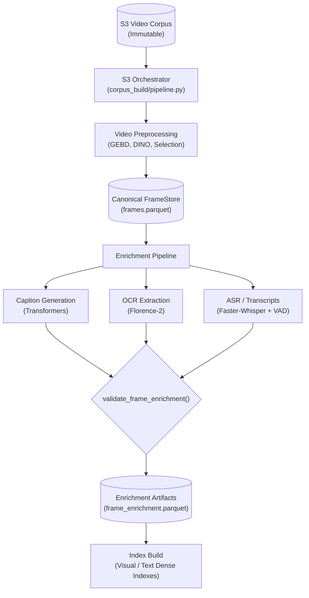
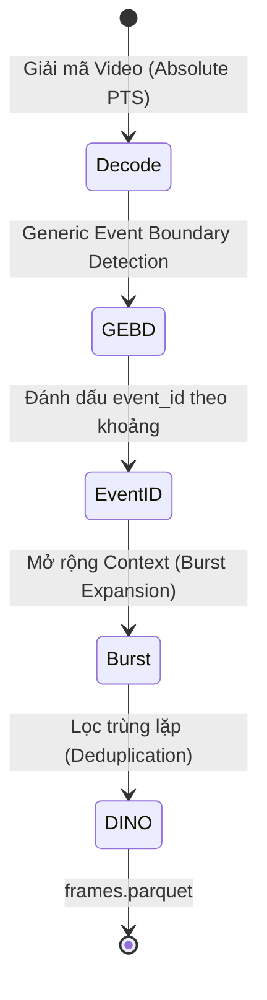
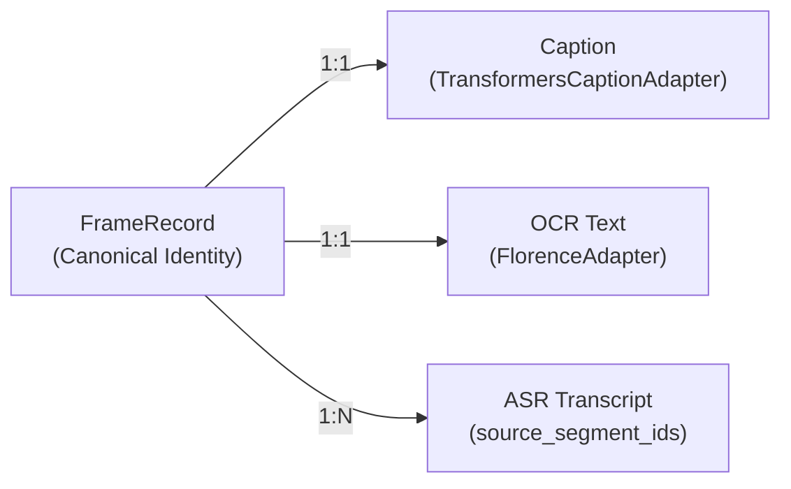

# HCMAI Data Pipeline & Corpus Build

`hcmai.data` là trái tim của hệ thống chuẩn bị dữ liệu (Corpus Build) cho toàn bộ hệ thống HCMAI. Package này chịu trách nhiệm kéo video từ S3, trích xuất khung hình (preprocessing), làm giàu đa phương thức (enrichment: OCR, ASR, Caption), và xây dựng các index phục vụ tìm kiếm.

Mục tiêu tối thượng của package là: **Đảm bảo tính toàn vẹn (Data Lineage), khả năng khôi phục (Resumability), và tạo ra ánh xạ chuẩn xác duy nhất (Canonical Mapping) cho hệ thống KIS, VQA và TRAKE.**

---

## 1. Tổng quan Kiến trúc (Architecture Workflow)

Quy trình hoạt động dựa trên thiết kế **State Machine Marker**: 
- Tại mỗi giai đoạn (stage), Orchestrator ghi nhận trạng thái thông qua các marker file (`stages/*.json`). 
- Marker lưu trữ `run_id` (fingerprint của config + inventory) và kiểm tra `file_size` của các artifact để cho phép Resume chính xác nếu tiến trình bị sập.

---

## 2. Preprocessing & Thuật toán Chọn lọc Khung hình

Quá trình giải mã và trích xuất khung hình từ video gốc tuân thủ nguyên tắc giữ nguyên cấu trúc sự kiện (Semantic Event Structure) thay vì chỉ chọn bừa các khung hình.

### Sơ đồ Tiền xử lý

### Các Cơ chế & Thuật toán Lõi:

1. **Đồng bộ Tọa độ Thời gian (Absolute PTS)**: Toàn bộ hệ thống không reset origin timestamp về 0. PTS thực tế của video được giữ nguyên (`timestamp_ms = frame.pts * base`) để đảm bảo quá trình align với âm thanh (ASR) downstream hoàn toàn khớp.
2. **GEBD & Event Structure**: Mô hình GEBD tìm ra các semantic boundaries. Khung hình được đánh số `event_id` theo dạng interval liên tục giữa 2 boundaries. Điều này đảm bảo khi hệ thống phân tích Scene (Temporal Grouping) ở downstream, nó có thể `groupby(["video_id", "event_id"])` để lấy trọn vẹn sự kiện.
3. **Thuật toán Burst Expansion $O(\log N)$**: 
   - Quá trình lấy thêm khung hình ngữ cảnh (context frames) xung quanh một đỉnh (peak) được tối ưu hóa bằng mảng `timestamps` và **Tìm kiếm Nhị phân (`bisect`)**.
   - Complexity giảm từ $O(N \times P)$ xuống $O(P \log N)$, triệt tiêu nút thắt cổ chai khi xử lý video siêu dài.
4. **DINO Deduplication & Text-Change Protection**:
   - Để loại bỏ các khung hình thừa, hệ thống so sánh cosine similarity qua DINO embeddings.
   - **Vấn đề**: DINO thường đánh giá 2 khung hình News có text/phụ đề chạy ở dưới là "giống hệt nhau" (cosine cao), dẫn đến việc mất sạch OCR text quan trọng.
   - **Giải pháp**: Tích hợp module **Bottom-Third Pixel Diffing**. Thuật toán cắt 30% nửa dưới (Lower-third) của 2 ảnh và tính chênh lệch pixel (MSE). Nếu `MSE > Threshold`, thuật toán chặn DINO dedup (Text-Change Protection). Đây là thuật toán $O(1)$ memory, siêu tốc mà không cần load LLM.

---

## 3. Enrichment (Làm giàu Đa phương thức)

Data Pipeline không flatten evidence thành text tĩnh mà giữ nguyên cấu trúc quan hệ giữa Khung hình và Nguồn dữ liệu.

### OCR & Captioning
- Sử dụng mô hình qua `Adapter Pattern` (vd: `TransformersCaptionAdapter`, `FlorenceAdapter`).
- **Resumability**: Dữ liệu đang sinh dở được lưu định kỳ. Nếu chạy lại, hàm `resume_rows` sẽ đối chiếu `frame_store_id` và `enrichment_version` để load các dòng đã xử lý, chỉ chạy tiếp các dòng `PENDING`.

### ASR / Audio Transcripts
- **VAD Offset Alignment**: Âm thanh được giải mã từ `first_audio_frame_pts` của Video. Segment từ Faster-Whisper được cộng thêm VAD offset.
- **Materialization**: Hàm `materialize_asr_enrichment` ánh xạ các half-open interval của Transcript vào khung hình. Thay vì chỉ lưu text, hệ thống gom nhóm `segment.segment_id` thành mảng `source_segment_ids` lưu vào `FrameEnrichment`. Tính năng này cho phép hệ thống VQA downstream truy ngược từ frame về mốc thời gian Audio gốc.

---

## 4. Data Lineage & Integrity (Tính Toàn Vẹn)

Đóng vai trò như một bức tường lửa chống lại việc dữ liệu "râu ông nọ cắm cằm bà kia" (Ví dụ: OCR chạy từ bộ frame cũ nhưng ráp vào bộ frame mới).

1. **`frame_store_id` (Pipeline Fingerprint)**:
   - S3 Orchestrator băm (SHA256) toàn bộ file inventory (danh sách video S3) + config pipeline để tạo ra `run_id`.
   - `run_id` này chính là `frame_store_id`. Nó được truyền xuyên suốt qua tất cả các Adapter.
2. **Schema `FrameEnrichment`**:
   - Yêu cầu bắt buộc phải có `frame_store_id`.
3. **`validate_frame_enrichment()`**:
   - Trước khi bất kỳ Artifact nào (Caption, OCR, ASR) được ghi ra file Parquet, nó phải đi qua chốt chặn này.
   - Chốt chặn xác thực 3 điều: (1) Số lượng bằng chính xác số lượng canonical frames, (2) Thứ tự khớp 100%, (3) `frame_store_id` của từng row khớp với Run ID hiện hành.

---

## 5. Các Thành Phần Code Chính

- `src/hcmai/data/pipeline.py`: Chứa `DataService` - Facade duy nhất để toàn bộ hệ thống API và Frontend truy vấn `FrameRecord` và độ phân giải ảnh (`FrameAssetResolver`). Tuyệt đối cấm can thiệp file nội bộ.
- `src/hcmai/data/corpus_build/pipeline.py`: Chứa S3 Orchestrator - Trái tim điều phối các tiến trình Offline Preparation.
- `src/hcmai/common/schemas/frame.py`: Định nghĩa `FrameRecord` và `FrameEnrichment` chứa các hợp đồng schema cực kỳ nghiêm ngặt.
