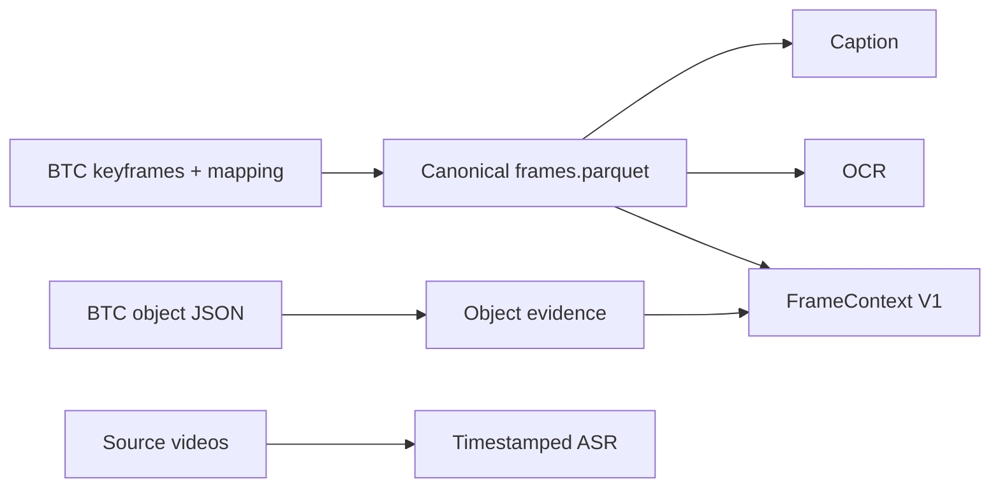
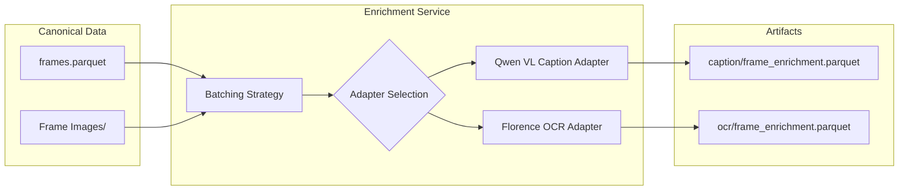
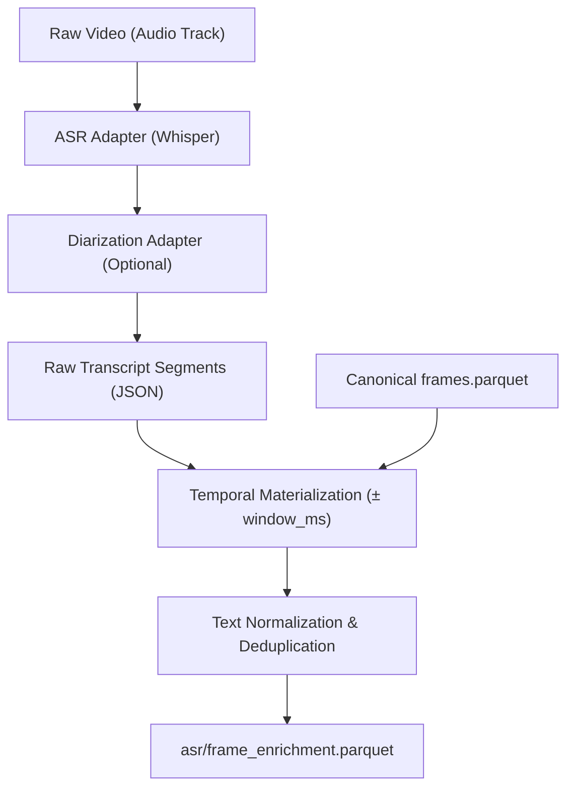

# Data Ingestion and Enrichment Workflows

This document outlines the BTC-native workflow for producing the canonical
FrameStore and its multimodal enrichments in the `hcmai` system. Custom video
frame extraction is not part of the active competition path.

## 1. Canonical FrameStore Ingestion

`import_btc_frame_store` validates BTC metadata, joins the organizer's
keyframe mapping, preserves `video_id`, `frame_id`, `frame_idx`, and
`timestamp_ms`, and atomically publishes `frames.parquet` plus its manifest.
The resulting FrameStore is the source of truth for Caption, OCR, Object, and
retrieval stages.

### Ingestion Strategy

1. **BTC metadata validation**: verify required canonical identity fields and
   the keyframe-to-submission mapping.
2. **Canonical publication**: write the validated frame table and manifest
   atomically without redetecting or selecting replacement frames.
3. **Timeline evidence**: read source videos only for timestamped ASR; ASR is
   kept separate from frame-native evidence.

### BTC-Native Workflow Diagram

---

## 2. Enrichment Workflows

Enrichments add searchable text layers (Caption, OCR, ASR) that are rigidly aligned to the canonical `frame_id` coordinates.

### 2.1 Caption & OCR Pipeline

Caption and OCR share a very similar pipeline architecture (`EnrichmentService`).

- **Captioning**: Feeds canonical images to Qwen VL via `QwenVLCaptionAdapter` to generate retrieval-oriented descriptive natural language.
- **OCR**: Uses optical character recognition (e.g., `FlorenceAdapter`) to extract dense text blocks found on the screen.

**Algorithm:**
1. Loads the canonical `frames.parquet` to locate every selected image path.
2. Iterates over frame batches and sends them to the specialized adapter.
3. Structures the response alongside `frame_id`, model name, and processing status.
4. Writes an atomic `frame_enrichment.parquet`.

### 2.2 ASR (Audio Speech Recognition) Pipeline

The ASR pipeline is inherently temporal and handles continuous audio streams, distinguishing it from independent frame-based inferences.

**Algorithm:**
1. **Audio Extraction & ASR**: The pipeline runs models like Whisper/FastWhisper (`ASRAdapter`) across the entire video audio track to extract raw transcripts.
2. **Diarization (Optional)**: Segments are augmented with speaker identities (`DiarizationAdapter`).
3. **Temporal Materialization**: 
   - ASR outputs are fundamentally independent of frame sampling rates.
   - `materialize_asr_enrichment()` aligns the half-open temporal ASR segments to the canonical frames.
   - For every canonical frame, a time window (`timestamp_ms ± window_ms`) is calculated.
   - Any ASR transcript overlapping that window is collected, deduplicated (ignoring casing and whitespace anomalies), and attached to the `frame_id`.
4. **Validation & Storage**: The output exactly mirrors the canonical frame order and is published atomically.

## Immutable Integrity Guarantee

Across all three pipelines (Preprocessing, Caption/OCR, ASR), data integrity is rigidly enforced:
- **Foreign Key Stability**: Enrichments strictly depend on `frame_id`. If an enrichment process observes an unknown `frame_id` or reorders the dataset, the write is aborted.
- **Atomic Operations**: All artifacts (Parquet tables and JSON manifests) write to a `.partial` staging path and are defensively moved/renamed at the end to prevent corruption during an interrupted run.
