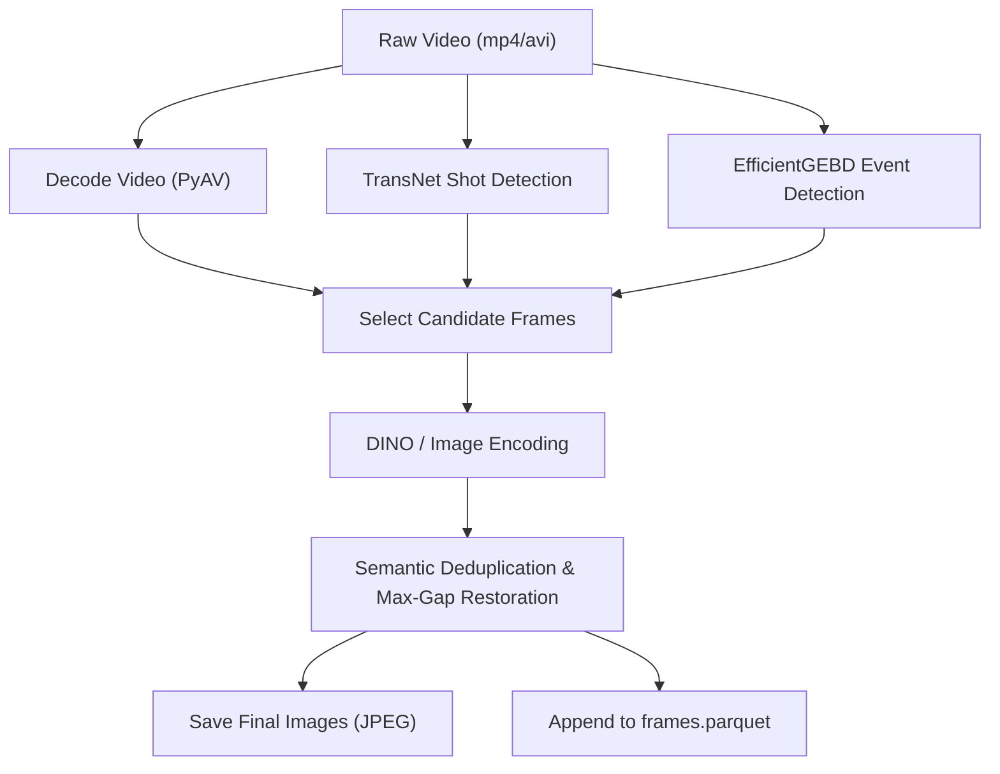
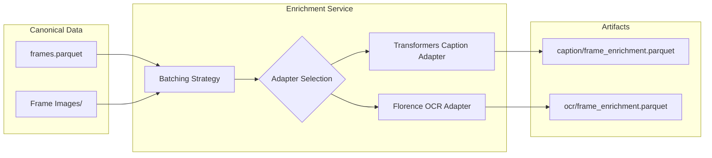
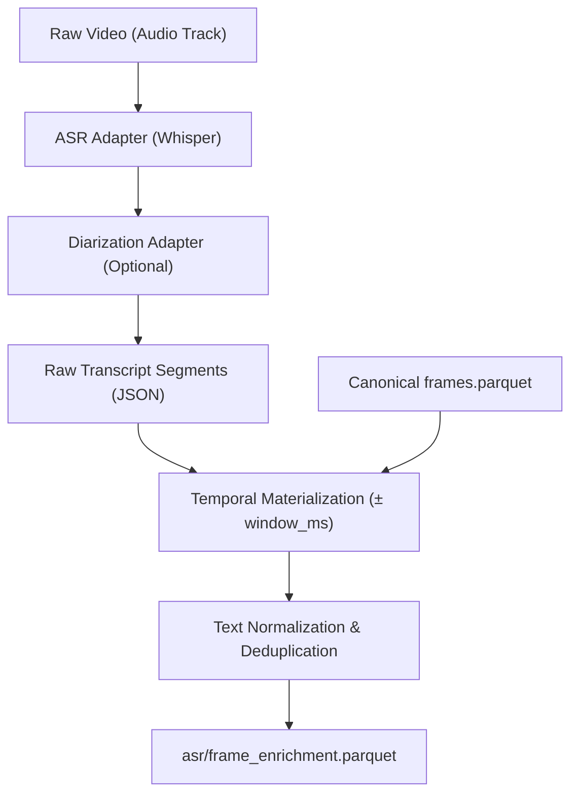

# Data Preprocessing and Enrichment Workflows

This document outlines the architecture, algorithms, and workflows for preparing raw videos into the canonical FrameStore and its multimodal enrichments (Caption, OCR, and ASR) in the `hcmai` system.

## 1. Frame Preprocessing (FrameStore)

The frame preparation pipeline transforms raw video files into a stable, canonical dataset (`frames.parquet`). This relies on several stages: shot/event detection, keyframe selection, deduplication, visual embedding, and atomic dataset publication.

### Preprocessing Algorithm & Strategy

1. **Shot and Event Detection**:
   - Uses `TransNetDetector` to slice the video into continuous visual shots.
   - Uses `EfficientGEBDDetector` (Generic Event Boundary Detection) to identify semantic events.
2. **Candidate Selection**:
   - Frames are decoded, and candidates are selected based on shot boundaries, event boundaries, and significant visual changes.
3. **Encoding & Deduplication**:
   - Candidate frames are encoded into dense vectors using an encoder (e.g., `DinoEncoder`).
   - Highly similar consecutive frames are deduplicated by thresholding the cosine distance between their vectors, keeping only representative frames to bound storage and computation costs.
   - Max gap restoration guarantees that no visual period exceeds a maximum time without representation.
4. **Canonical Publication**:
   - All preserved frame images are written to a final image directory, and metadata (with coordinates, timestamps, and model provenance) is saved. The output is merged into `frames.parquet`.

### Preprocessing Workflow Diagram

---

## 2. Enrichment Workflows

Enrichments add searchable text layers (Caption, OCR, ASR) that are rigidly aligned to the canonical `frame_id` coordinates.

### 2.1 Caption & OCR Pipeline

Caption and OCR share a very similar pipeline architecture (`EnrichmentService`).

- **Captioning**: Feeds canonical images to Vision-Language Models (VLMs) via `TransformersCaptionAdapter` to generate descriptive natural language.
- **OCR**: Uses optical character recognition (e.g., `FlorenceAdapter`) to extract dense text blocks found on the screen.

**Algorithm:**
1. Loads the canonical `frames.parquet` to locate every selected image path.
2. Iterates over frame batches and sends them to the specialized adapter.
3. Structures the response alongside `frame_id`, model name, and processing status.
4. Writes an atomic `frame_enrichment.parquet`.

### 2.2 ASR (Audio Speech Recognition) Pipeline

The ASR pipeline is inherently temporal and handles continuous audio streams, distinguishing it from independent frame-based inferences.

**Algorithm:**
1. **Audio Extraction & ASR**: The pipeline runs models like Whisper/FastWhisper (`ASRAdapter`) across the entire video audio track to extract raw transcripts.
2. **Diarization (Optional)**: Segments are augmented with speaker identities (`DiarizationAdapter`).
3. **Temporal Materialization**: 
   - ASR outputs are fundamentally independent of frame sampling rates.
   - `materialize_asr_enrichment()` aligns the half-open temporal ASR segments to the canonical frames.
   - For every canonical frame, a time window (`timestamp_ms ± window_ms`) is calculated.
   - Any ASR transcript overlapping that window is collected, deduplicated (ignoring casing and whitespace anomalies), and attached to the `frame_id`.
4. **Validation & Storage**: The output exactly mirrors the canonical frame order and is published atomically.

## Immutable Integrity Guarantee

Across all three pipelines (Preprocessing, Caption/OCR, ASR), data integrity is rigidly enforced:
- **Foreign Key Stability**: Enrichments strictly depend on `frame_id`. If an enrichment process observes an unknown `frame_id` or reorders the dataset, the write is aborted.
- **Atomic Operations**: All artifacts (Parquet tables and JSON manifests) write to a `.partial` staging path and are defensively moved/renamed at the end to prevent corruption during an interrupted run.
