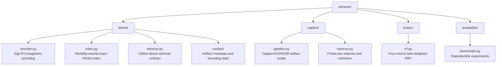
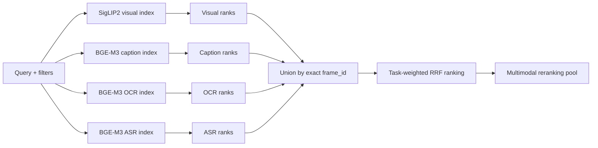

# Retriever

This package groups retrieval work by capability so each modality or retrieval
stage has a clear owner:



The root `hcmai.retriever` package re-exports the small public API. New
capability-specific code belongs in its owning folder instead of adding
another flat root-level `.py` file.

## Dependencies

The heavy libraries are imported lazily inside the methods that need them, so
importing `hcmai.common.config` or `dense.models` never pulls in a model
runtime.

```bash
aic/bin/python -m pip install -e ".[embedding]"
```

- `transformers`, `torch`, and `pillow` are used by `DenseEncoder`.
- `faiss-cpu`, `numpy`, and a Parquet engine such as `pyarrow` are used by
  `DenseIndex` and the retriever.

## Concept split: config vs stats vs metadata

These three modules are pure data classes with no heavy imports, kept apart on
purpose:

### `hcmai.common.config` — inputs / knobs

- `RECALL_CUTOFFS`: the recall cut-offs `(1, 5, 10, 100)` frozen for the
  baseline comparison.
- `EncoderConfig`: encoder inputs (model name, device, batch size, image size,
  dtype, precision). `from_dict` builds it from a config mapping, reading the
  model name from the `name` key.
- `BenchmarkConfig`: the settings recorded alongside benchmark results for
  reproducibility.

### `dense/models/stats.py` — outputs / measurements

- `EncodingStats`: counters and per-batch timings produced while encoding, with
  `throughput_samples_per_sec`, `avg_batch_time_ms`, `p95_batch_time_ms`
  properties and a human-readable `report()`.

### `dense/models/metadata.py` — provenance / artifact descriptors

- `IndexMetadata`: provenance and shape of a serialized FAISS index (dataset
  version, model, metric, normalization, embedding dim, vector count, build
  time, on-disk size, timestamp). `to_dict`/`from_dict` round-trip through JSON.

## Encoder

`dense/encoder.py` provides `DenseEncoder`, which loads a SigLIP2-style
vision-language model once, on its first non-empty encoding call, and exposes
`encode_images` and `encode_text`. Embeddings are L2-normalized so inner product
equals cosine similarity. For convenience it re-exports `EncoderConfig` and
`EncodingStats`.

```python
from hcmai.common.config import EncoderConfig
from hcmai.retriever.dense import DenseEncoder

encoder = DenseEncoder(EncoderConfig(device="cuda"))
vectors = encoder.encode_text(["một người đang đi bộ"])
```

## Index

`dense/index.py` provides `DenseIndex`, an exact FAISS `IndexFlatIP`. `build`
validates that embeddings and mapping describe the same corpus (matching count,
`embedding_index` a permutation of `0..N-1`, no duplicate `frame_id`). `save`
writes `dense.index`, `frame_mapping.parquet`, and `metadata.json`; `load`
rejects mismatched artifacts. Only `flat_ip` is supported — the exact baseline
must be measured before any IVF/PQ approximation.

```python
from hcmai.retriever.dense import DenseIndex

index = DenseIndex.build(
    embeddings, mapping, dataset_version="hcmai2026", model_name="siglip2"
)
index.save("artifacts/indexes")
```

## Online retriever

`dense/retriever.py` provides `DenseRetriever`, which pairs an encoder with an
index and exposes the `search(query, top_k, filters)` contract used by
`hcmai.orchestration.SearchEngine`. It rejects an encoder/index model or dimension
mismatch, returns score-sorted, deduplicated `RetrievalCandidate` objects, and
records query-encoding and index-search latency separately. Video/time filters
trigger a full-index scan so a full `top_k` survives filtering; a `min_score`
filter is applied as a threshold.

`caption/pipeline.py` and `scripts/build_caption_index.py` build separate
caption, OCR, and frame-aligned ASR indexes with the shared BGE-M3 text encoder.
Every usable text row is joined back to the canonical `FrameStore`. Text vector
filenames are selected by `index.text_embedding_filenames` in
`configs/baseline.yaml`, not hard-coded by the retriever module.

All four indexes are required by the selected competition retrieval path and
must have the same dataset version. A missing, incompatible, or stale text
index leaves search unavailable; it does not silently fall back to visual-only
retrieval. The initial weights are equal and explicitly untuned.

## Four-modal candidate fusion

The same natural-language query and filters are sent to four independent
retrievers. Each branch searches only its own embedding space:



- **Visual** searches SigLIP2 frame embeddings using the SigLIP2 text-query
  encoder.
- **Caption** searches generated frame captions embedded with BGE-M3.
- **OCR** searches visible text embedded with BGE-M3.
- **ASR** searches transcript text already aligned to canonical frames and
  embedded with BGE-M3. It is not a raw-audio embedding branch.

Every branch emits shared `RetrievalCandidate` objects. A source stores its raw
similarity under `source_scores[source]` and its one-based position under
`source_ranks[source]`. These raw scores remain inspectable, but fusion never
adds or compares SigLIP2 similarity directly with BGE-M3 similarity.

### Candidate union

`RRFFusionRetriever` requests `top_k` candidates from every branch and unions
them by the exact canonical `frame_id`.

- A frame returned by only one modality stays in the candidate pool.
- If several modalities return the same frame, their source scores and ranks
  are merged into one candidate.
- A source may contribute at most once to a frame; duplicate source evidence is
  rejected.
- Fusion does not rewrite `frame_id`, `video_id`, `frame_idx`, timestamp, or
  canonical frame metadata.

For example, if one frame is visual rank 2, caption rank 5, and absent from OCR
and ASR, the merged candidate contains:

```python
source_ranks = {
    RetrievalSource.VISUAL: 2,
    RetrievalSource.CAPTION: 5,
}
```

Absence from a source contributes neither a score nor a penalty.

### Task-weighted reciprocal-rank score

For task `t`, candidate frame `d`, configured RRF constant `k`, and sources
that retrieved the frame:

$$
\operatorname{WRRF}_{t}(d)
=
\sum_{s \in S(d)}
\frac{w_{t,s}}{k + r_s(d)}
$$

The task comes from `SearchRequest.query_type`; it is not a user-selectable
search profile. `FusionConfig.task_weights` requires positive visual, caption,
OCR, and ASR weights for every configured task. The current baseline uses:

```yaml
task_weights:
  kis:   {visual: 1.0, caption: 1.0, ocr: 1.0, asr: 1.0}
  kisc:  {visual: 1.0, caption: 1.0, ocr: 1.0, asr: 1.0}
  vkis:  {visual: 1.0, caption: 1.0, ocr: 1.0, asr: 1.0}
  vqa:   {visual: 1.0, caption: 1.0, ocr: 1.0, asr: 1.0}
  trake: {visual: 1.0, caption: 1.0, ocr: 1.0, asr: 1.0}
```

These equal weights are neutral placeholders, not optimized ratios. Multiplying
all four weights for one task by the same constant does not change its ranking.
Future tuning should therefore search relative weights on labeled development
queries and select them using the official Mean Top-k R-Score.

After computing the fusion score, candidates are ordered by:

1. descending weighted-RRF score;
2. best individual source rank;
3. stable lexical `frame_id`.

The fused top candidates are passed to the configured multimodal reranker. The
reranker may reorder them using the query and frame evidence, but it must not
create or rewrite candidate/frame identity.

## Benchmark

`evaluation/benchmark.py` provides `RetrievalBenchmark`, which runs a retriever
over labelled `EvaluationQuery` records and writes four frozen baseline
artifacts to the output directory: `config.yaml`, `metrics.json`,
`per_query.csv`, and `failures.csv`. Metrics include recall at each cut-off,
P50/P95/mean latency, throughput, index build time and size, and GPU peak
memory.

The `build_*.py` entry points that drive this package live in
[`../scripts`](../scripts).
