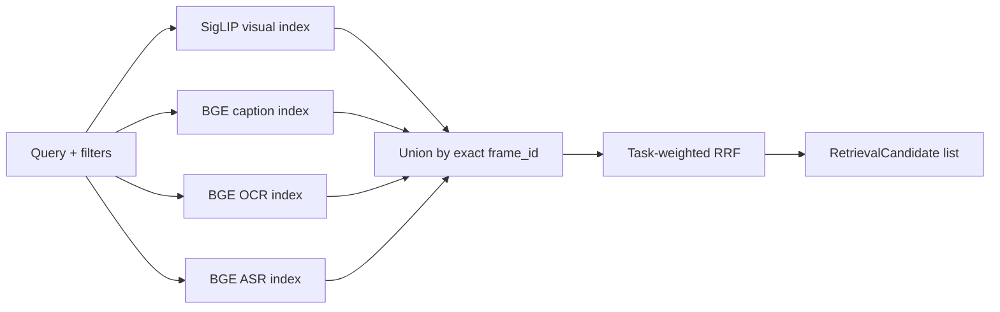

# Retriever

`hcmai.retriever` owns visual, caption, OCR, and frame-aligned ASR search,
plus task-weighted reciprocal-rank fusion. Other components call the public
`RetrievalService`; index and modality implementations remain internal.

```text
retriever/
├── pipeline.py                 # RetrievalService public facade
├── models/
│   ├── contracts.py            # Retriever protocol
│   └── metadata.py             # FAISS artifact provenance
├── dense/
│   ├── index.py                # Exact FAISS index
│   └── retriever.py            # Visual dense search
├── text/
│   ├── artifacts.py            # Caption/OCR/ASR artifact builder
│   └── retriever.py            # Frame-aligned text search
├── fusion/rrf.py               # Four-source task-weighted RRF
└── evaluation/benchmark.py     # Internal dense-baseline benchmark
```

Embedding models and their adapters belong to `hcmai.embedding`, not this
package. Shared inputs and outputs use `SearchFilters`, `TaskType`, and
`RetrievalCandidate` from `hcmai.common.schemas`.

## Public service

```python
from hcmai.retriever.pipeline import RetrievalService

candidates = retrieval_service.search(
    query="một người đang đi bộ",
    top_k=100,
    query_type=task_type,
)
```

`RetrievalService` exposes the online `search` boundary and the offline
`load_index`, `build_index`, and `build_text_artifacts` operations. Production
code outside this component must not instantiate dense/text retrievers, FAISS
indexes, or fusion implementations directly. The application composition root
constructs the service once and reuses its encoders and indexes.

`from_index` creates a single-index service for the frozen dense baseline.
`from_indexes` wires the selected competition path: one visual index plus
caption, OCR, and ASR indexes followed by RRF fusion. All configured indexes
must have compatible model, dimension, and dataset provenance; an invalid or
missing required artifact leaves online search unavailable rather than
silently changing the selected path.

## Index artifacts

The exact baseline uses FAISS `IndexFlatIP` with L2-normalized vectors. Index
building validates that embeddings and mappings describe the same corpus:

- row counts match;
- `embedding_index` is a permutation of `0..N-1`;
- `frame_id` values are unique;
- serialized index and mapping metadata remain compatible when loaded.

The offline visual index contains `dense.index`, `frame_mapping.parquet`, and
`metadata.json`. Caption, OCR, and ASR artifacts use filenames selected by
`index.text_embedding_filenames` in `configs/baseline.yaml`; the component does
not hard-code alternate names.

## Four-modal retrieval and fusion



The visual branch embeds the query in the visual frame space. Caption, OCR,
and ASR search separate BGE text spaces; ASR is frame-aligned transcript text,
not a raw-audio branch. Every branch returns canonical candidates with its raw
similarity in `source_scores` and one-based rank in `source_ranks`.

Candidates are unioned by exact `frame_id`. A missing source contributes no
score and no penalty. Fusion never compares raw SigLIP and BGE similarities or
rewrites canonical identity. For task `t`, frame `d`, RRF constant `k`, and
the sources that returned that frame:

$$
\operatorname{WRRF}_{t}(d)
=
\sum_{s \in S(d)}
\frac{w_{t,s}}{k + r_s(d)}
$$

Results are ordered by descending fused score, best individual source rank,
then stable lexical `frame_id`. The current equal task weights are explicit
untuned baselines. Future weights must be selected on labeled development data
using official Mean Top-k R-Score and latency, not Recall@1/5 alone.

## Benchmark status

`evaluation/benchmark.py` deliberately remains an internal
`RetrievalBenchmark` for single-index dense-baseline measurements. It records
baseline recall, latency, throughput, build time/size, and GPU memory; it does
not evaluate the full retrieval-fusion-reranking-materialization path or prove
the official competition score.

Do not expose it as `EvaluationService`. That service is deferred until an
end-to-end evaluator has a second demonstrated use and confirmed 2026 scoring
semantics. Official competition experiments must eventually run through
`SearchService` and record predictions, failures, task row scores, Mean Top-k
R-Score at `{1,5,20,50,100}`, and P50/P95 latency under `runs/`.

## Verification

```bash
PYTHONPATH=src aic/bin/pytest \
  tests/test_dense_retriever.py \
  tests/test_faiss_index.py \
  tests/test_caption_retriever.py \
  tests/test_caption_index_pipeline.py \
  tests/test_fusion_retriever.py
pyright src/hcmai/retriever
```

The offline build entry points live under [`scripts/`](../../../scripts/).
